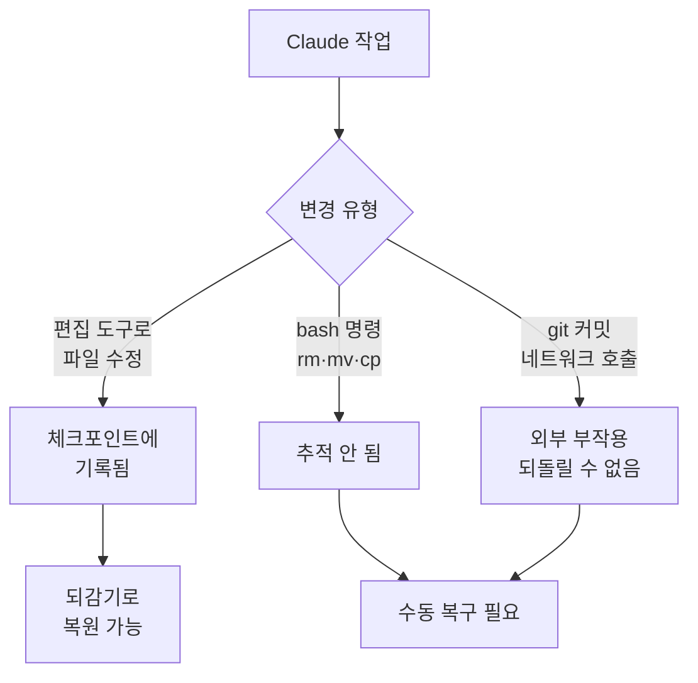

코드를 고치다 "아, 이 방향이 아니었는데" 싶을 때, Claude Code는 방금 전의 안전한 상태로 한 번에 되돌려 줍니다. 게임의 세이브 포인트처럼, 프롬프트 하나를 보낼 때마다 그 시점의 코드 상태를 슬쩍 찍어 두기 때문입니다. 이 문서는 그 안전망인 체크포인팅(checkpointing)과 되감기(rewind)를 다룹니다.


이 문서는 MoAI-ADK가 올라타 있는 플랫폼인 **Claude Code 자체**를 다루는 배경 자료입니다. MoAI-ADK 자체 기능은 사이드바 위쪽 섹션에서 다룹니다.



**한 줄 요약**: 작업이 꼬여도 `Esc`를 두 번 누르면 코드와 대화를 함께 이전 상태로 되감을 수 있는, 세션 단위의 "되돌리기" 안전망입니다.



보스 방 앞에서 세이브를 찍어 두면, 실수로 전멸해도 그 지점으로 돌아갈 수 있죠. Claude Code도 사용자가 프롬프트를 보낼 때마다 그 시점의 파일 상태를 세이브 포인트로 남겨 둡니다. 그래서 실험이 엉뚱한 곳으로 흘러가도 당황하지 말고 되감기 한 번이면 직전 세이브로 깔끔하게 돌아옵니다.


## 체크포인트, 왜 필요한가

규모가 큰 코드베이스를 건드리는 작업은 늘 망설임이 따릅니다. "이렇게 바꿨다가 망하면 어쩌지." 체크포인팅은 그 망설임을 거둬 주는 장치입니다. Claude가 파일을 편집하기 직전의 상태를 자동으로 찍어 두어서, 언제든 직전 지점으로 돌아갈 수 있다는 믿음 아래 과감하게 시도할 수 있습니다.

자동 추적(automatic tracking)은 이렇게 동작합니다.

| 항목 | 동작 |
| --- | --- |
| 생성 시점 | 사용자가 프롬프트를 보낼 때마다 새 체크포인트 생성 |
| 추적 대상 | Claude의 파일 편집 도구가 만든 변경 |
| 세션 간 유지 | 세션을 넘어 보존되어, 다시 이어 한 대화에서도 접근 가능 |
| 정리 주기 | 세션과 함께 30일 후 자동 정리 (설정으로 변경 가능) |

체크포인트는 **세션 단위의 빠른 복구**를 위한 장치일 뿐, Git 같은 버전 관리 시스템을 대신하지 않습니다. 체크포인트는 "로컬 되돌리기", Git은 "영구 기록"으로 생각하면 역할 구분이 명확해집니다.

## 되감기로 이전 상태로 돌아가기

되감기는 `/rewind` 명령으로 엽니다. v2.1.191 이상에서는 `/checkpoint`, `/undo`라는 별칭도 같은 동작을 합니다. 키보드로는 프롬프트 입력창이 비어 있을 때 `Esc`를 두 번 누르면 됩니다.

```text
/rewind
# v2.1.191 이상에서 별칭
/checkpoint
/undo
# 또는 입력창이 비어 있을 때
Esc  Esc
```

입력창에 텍스트가 남아 있으면 `Esc` 두 번은 메뉴를 여는 대신 입력 내용을 지웁니다. 다만 지워진 텍스트는 입력 기록에 남으므로, 되감기를 마친 뒤 `Up` 키로 다시 불러올 수 있습니다.

되감기 메뉴는 세션 동안 보낸 프롬프트 목록을 보여 줍니다. 되돌릴 지점을 고른 뒤, 아래 동작 중 하나를 선택합니다.

| 동작 | 효과 |
| --- | --- |
| 코드와 대화 모두 복원 | 선택 지점으로 코드와 대화 기록을 함께 되돌림 |
| 대화만 복원 | 현재 코드는 유지하고 대화만 그 메시지로 되돌림 |
| 코드만 복원 | 대화는 유지하고 파일 변경만 되돌림 |
| Summarize from here | 선택 메시지부터 이후를 요약으로 압축 (컨텍스트 윈도우 확보) |
| Summarize up to here | 선택 메시지 이전을 요약으로 압축 (이후 메시지는 그대로 유지) |
| Never mind | 변경 없이 메시지 목록으로 복귀 |

대화를 복원하거나 `Summarize from here`를 선택하면, 선택한 메시지의 원래 프롬프트가 입력창에 복원되어 그대로 다시 보내거나 고쳐 보낼 수 있습니다.

### 복원과 요약의 차이

복원(restore) 계열은 상태를 **되돌립니다**. 코드 변경이든 대화 기록이든, 아니면 둘 다를 취소합니다. 반면 요약(summarize) 계열은 디스크의 파일은 그대로 둔 채 대화의 일부만 AI가 만든 요약으로 **압축합니다**.

- **Summarize from here**: 선택 메시지 이전은 온전히 남고, 선택 메시지와 그 이후가 요약으로 대체됩니다. 곁다리 논의를 버리되 초반 맥락은 상세히 남기고 싶을 때 씁니다.
- **Summarize up to here**: 선택 메시지 이전이 요약으로 대체되고, 선택 메시지와 이후는 그대로 유지됩니다. 초반 셋업 논의는 압축하되 최근 작업은 상세히 남기고 싶을 때 씁니다.

두 경우 모두 원본 메시지는 세션 트랜스크립트에 보존되므로, 필요하면 Claude가 세부 내용을 다시 참조할 수 있습니다. `/compact`와 비슷하지만, 전체가 아니라 선택 메시지 기준으로 어느 쪽을 압축할지 고를 수 있다는 점이 다릅니다.

## 무엇이 복원되고, 무엇은 복원되지 않나

되감기가 추적하는 것은 **세션 안에서 Claude의 파일 편집 도구가 만든 변경**뿐입니다. 그 경계 바깥의 변경은 복원되지 않습니다.

| 구분 | 추적 여부 | 설명 |
| --- | --- | --- |
| Claude의 직접 파일 편집 | ✓ 추적됨 | 편집 도구로 만든 변경은 되감기 대상 |
| bash 명령의 파일 변경 | ✗ 추적 안 됨 | `rm`, `mv`, `cp` 등으로 바뀐 파일은 되돌릴 수 없음 |
| 세션 외부의 수동 편집 | ✗ 추적 안 됨 | 다른 에디터나 동시 실행 세션의 변경은 미포착 |
| git 커밋·푸시 | ✗ 추적 안 됨 | 이미 만든 커밋·푸시는 되감기로 취소되지 않음 |
| 네트워크 호출·외부 부작용 | ✗ 추적 안 됨 | API 요청, 메일 발송, 배포 등 외부에 일어난 일은 되돌릴 수 없음 |


```mermaid
flowchart TD
    A[Claude 작업] --> B{변경 유형}
    B -->|편집 도구로<br>파일 수정| C[체크포인트에<br>기록됨]
    B -->|bash 명령<br>rm·mv·cp| D[추적 안 됨]
    B -->|git 커밋<br>네트워크 호출| E[외부 부작용<br>되돌릴 수 없음]
    C --> F[되감기로<br>복원 가능]
    D --> G[수동 복구 필요]
    E --> G
```

되감기의 핵심은 **로컬 파일 상태의 되돌리기**입니다. 외부 시스템에 이미 반영된 부작용(side effect)은 체크포인트의 책임 밖이므로 따로 챙겨야 합니다.

## 안전한 실험에 체크포인트 활용하기

체크포인트는 다음 상황에서 특히 빛을 발합니다.

- **대안 탐색**: 시작 지점을 잃지 않고 서로 다른 구현 방식을 자유롭게 시도합니다.
- **실수 복구**: 버그를 만들거나 기능을 깨뜨린 변경을 빠르게 되돌립니다.
- **기능 반복**: 동작하던 상태로 되돌릴 수 있다는 전제 아래 변형을 실험합니다.
- **컨텍스트 공간 확보**: 장황한 디버깅 세션을 중간 지점부터 요약해, 초기 지시는 온전히 둔 채 컨텍스트 윈도우(context window)를 비웁니다.

결과가 불확실한 실험적 리팩터링을 앞두었다면, 먼저 프롬프트를 하나 보내 체크포인트를 만들어 두고 마음 편히 진행한 뒤, 마음에 들지 않으면 `Esc Esc`로 코드와 대화를 함께 되돌리는 흐름이 효율적입니다.

MoAI-ADK 관점에서 체크포인팅은 에이전틱 루프를 과감하게 돌릴 수 있게 하는 조건입니다. 루프가 "행동 → 검증 → 교정"을 자율 반복하려면 실패한 시도를 값싸게 되돌릴 수 있어야 하고, 체크포인트가 그 되돌리기 비용을 거의 0으로 만듭니다. SPEC 단위 작업 중 코드가 크게 흔들렸을 때 빠르게 직전 상태로 복귀하는 세션 내 안전망으로 활용하되, 영구 이력은 항상 Git 커밋으로 남기는 것이 원칙입니다.

## 한계와 주의점

- **bash 명령 변경 미추적**: 편집 도구가 아닌 셸 명령으로 바뀐 파일은 되돌릴 수 없습니다. 파괴적 셸 명령은 신중하게 다뤄야 합니다.
- **외부·동시 변경 미추적**: 다른 세션이나 외부 에디터의 변경은, 마침 같은 파일을 건드린 경우가 아니면 포착되지 않습니다.
- **버전 관리 대체 불가**: 체크포인트는 세션 단위 복구용입니다. 영구 기록과 협업은 반드시 Git 같은 버전 관리 시스템으로 이어 가야 합니다.
- **보존 기간**: 체크포인트는 세션과 함께 30일 후 자동 정리됩니다 (설정으로 조정 가능).
- **요약과 포크(fork)의 차이**: 요약은 같은 세션 안에서 컨텍스트를 압축합니다. 원본 세션을 그대로 두고 다른 접근을 시도하려면 `claude --continue --fork-session`으로 세션을 분기하는 편이 적합합니다.

## 관련 문서

- [컨텍스트 윈도우](/ko/claude-code/context-memory/context-window)
- [세션 관리](/ko/claude-code/context-memory/sessions)
- [대화형 모드](/ko/claude-code/foundations/interactive-mode)

## 참고 자료

- [Checkpointing — Claude Code Docs](https://code.claude.com/docs/en/checkpointing)


파괴적인 리팩터링을 시작하기 전에 짧은 프롬프트 한 번으로 체크포인트를 의도적으로 만들어 두면, 실험이 실패해도 `Esc Esc` 한 번으로 깔끔히 직전 상태로 돌아올 수 있습니다.

