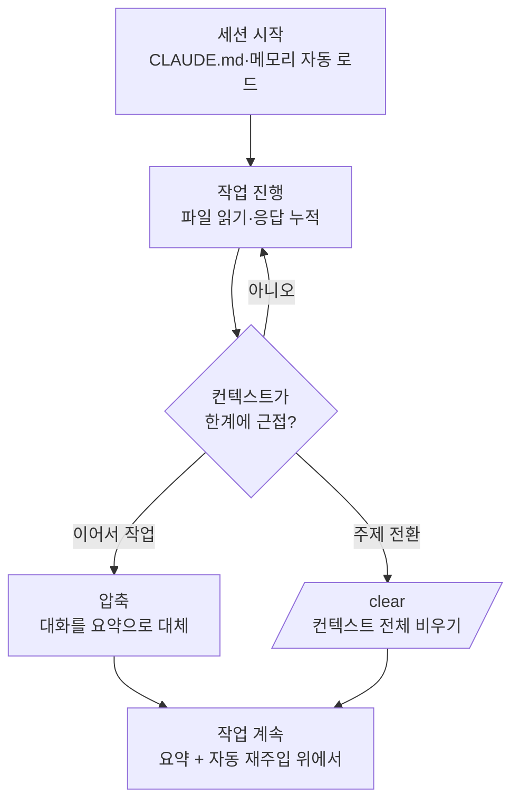

Claude Code가 한 세션 동안 기억하는 모든 것이 담기는 공간인 컨텍스트 윈도우 (context window)와, 그것을 효율적으로 관리하는 방법을 정리합니다.


**한 줄 요약**: 컨텍스트 윈도우는 Claude의 **작업 책상**이며, 책상이 가득 차기 전에 자동 압축(compaction)과 `/clear`로 공간을 비워야 긴 작업이 끝까지 매끄럽게 흐릅니다.


## 컨텍스트 윈도우와 토큰

컨텍스트 윈도우는 Claude가 한 세션에서 동시에 "볼 수 있는" 정보의 총량입니다. 여기에는 사용자가 입력한 프롬프트뿐 아니라, 터미널에 표시되지 않는 내용까지 모두 포함됩니다.

| 컨텍스트에 들어가는 것 | 터미널에 보이는가 | 비고 |
|------------------------|-------------------|------|
| 시스템 프롬프트 | 보이지 않음 | 동작 규칙. 항상 가장 먼저 로드 |
| CLAUDE.md (전역 + 프로젝트) | 보이지 않음 | 프로젝트 규칙과 빌드 명령 |
| 자동 메모리 (`MEMORY.md`) | 보이지 않음 | 이전 세션에서 남긴 메모 |
| 스킬 설명 (1줄) + MCP 도구 이름 | 보이지 않음 | 실제 본문은 사용할 때만 로드 |
| 사용자 프롬프트 | 보임 | 실제로 입력한 요청 |
| Claude가 읽은 파일 | 한 줄 요약만 | 파일 본문은 Claude만 봄 |
| Claude의 분석·수정·응답 | 보임 | 터미널에 그대로 출력 |

토큰 (token)은 이 정보를 세는 단위입니다. 대략 영어 단어 하나가 1~2 토큰, 한국어는 글자당 더 많은 토큰을 차지합니다. 한 가지 직관에 어긋나는 사실은, **세션을 시작하기도 전에 이미 상당한 양이 채워진다**는 점입니다. CLAUDE.md, 메모리, 스킬 목록, MCP 도구 이름이 첫 프롬프트보다 먼저 로드되기 때문입니다.

### 파일 읽기가 컨텍스트를 가장 많이 먹습니다

Claude가 작업하면서 읽는 파일이 컨텍스트 사용량을 지배합니다. 그래서 프롬프트를 구체적으로 적어("`auth.ts`의 버그를 고쳐줘") Claude가 읽는 파일 수를 줄이는 것이 토큰 절약의 핵심입니다. 리서치처럼 파일을 많이 뒤져야 하는 작업은 서브에이전트 (subagent)에게 위임하면, 큰 파일 읽기가 별도 컨텍스트 윈도우에서 처리되고 결과 요약만 본 세션으로 돌아옵니다.

## 모델별 크기

컨텍스트 윈도우의 크기는 모델마다 다릅니다. 정확한 수치는 사용하는 모델에 따라 달라지므로, 아래는 일반론으로 이해하면 됩니다.

| 크기 (일반론) | 의미 |
|---------------|------|
| 약 200K 토큰 | 다수 모델의 표준 윈도우. 일반적인 코드 작업에 충분 |
| 약 1M 토큰 | 일부 모델이 제공하는 확장 윈도우. 대규모 코드베이스 (large codebase)에 유리 |

크기가 클수록 한 번에 더 많은 파일과 대화를 담을 수 있지만, 윈도우가 무한하지는 않습니다. 어느 모델을 쓰든 결국 한계에 가까워지면 관리가 필요합니다. 핵심 원칙은 **윈도우 크기를 늘리는 것보다, 들어가는 내용을 적게 유지하는 것**이 더 안정적이라는 점입니다.

## 자동 압축과 /clear

세션이 길어지면 컨텍스트가 한계에 다가갑니다. Claude Code는 이를 두 가지 방식으로 다룹니다.

### 압축 (compaction)

압축은 누적된 대화 기록을 **구조화된 요약 하나로 대체**해 공간을 확보합니다. `/compact`를 직접 실행할 수도 있고, 컨텍스트가 한계에 가까워지면 자동으로 일어나기도 합니다. 요약은 다음을 보존합니다.

- 사용자의 요청과 의도
- 핵심 기술 개념
- 살펴보거나 수정한 파일과 중요한 코드 조각
- 발생한 오류와 해결 방법
- 남은 작업과 현재 진행 상황

대신 전체 도구 출력과 중간 추론 과정은 사라집니다. Claude는 작업 내용을 참조할 수 있지만, 이전에 읽은 코드 원문을 그대로 갖고 있지는 않게 됩니다.

압축 이후 각 정보가 어떻게 되는지는 로드 방식에 따라 다릅니다.

| 메커니즘 | 압축 후 상태 |
|----------|--------------|
| 시스템 프롬프트, 출력 스타일 | 그대로 유지 (메시지 기록의 일부가 아님) |
| 프로젝트 루트 CLAUDE.md, 범위 없는 규칙 | 디스크에서 다시 주입 |
| 자동 메모리 | 디스크에서 다시 주입 |
| `paths:` 프론트매터가 붙은 규칙 | 해당 파일을 다시 읽을 때까지 사라짐 |
| 하위 디렉터리의 중첩 CLAUDE.md | 해당 디렉터리 파일을 다시 읽을 때까지 사라짐 |
| 호출한 스킬 본문 | 다시 주입 (스킬당 5,000 토큰, 전체 25,000 토큰 상한, 오래된 것부터 제거) |
| hook | 해당 없음 (hook은 코드로 실행되며 컨텍스트에 남지 않음) |

압축에서 살아남길 바라는 규칙이라면 `paths:` 프론트매터를 빼거나 프로젝트 루트 CLAUDE.md로 옮기세요. 스킬은 잘릴 때 앞부분을 남기므로, 중요한 지시는 `SKILL.md` 위쪽에 두는 것이 안전합니다.

### /clear — 완전 초기화

`/clear`는 압축과 다릅니다. 요약조차 남기지 않고 대화 컨텍스트를 통째로 비워 **새 세션처럼** 시작합니다. 직전 작업과 무관한 새 작업으로 넘어갈 때 가장 깔끔합니다. 요약(압축)은 "이어서 더 작업할 때", 초기화(`/clear`)는 "주제를 바꿀 때" 쓴다고 기억하면 됩니다.

## 사용량 모니터링

지금 컨텍스트가 얼마나 찼는지 모르면 관리할 수 없습니다. Claude Code는 실측 도구를 제공합니다.

| 명령 / 위치 | 보여주는 것 |
|-------------|-------------|
| `/context` | 카테고리별 실시간 컨텍스트 사용 내역과 최적화 제안 |
| `/cost` | 현재 세션의 토큰 사용량과 비용 |
| `/memory` | 시작 시 로드된 CLAUDE.md와 자동 메모리 파일 목록 |
| 상태표시줄 (status line) | 세션 진행 중 사용량을 항상 표시 |

긴 작업에 들어가기 전이나 도중에 `/context`를 한 번 실행해 어떤 항목이 컨텍스트를 차지하는지 확인하는 습관이 큰 차이를 만듭니다.

## 긴 작업에서의 관리 전략

대규모 작업일수록 컨텍스트가 1차 제약입니다. 다음 전략을 조합하면 한 작업을 여러 압축 경계를 넘어 안정적으로 이어갈 수 있습니다.

- **요약 후 계속**: 한 단계를 마치면 압축으로 정리하고, 이어지는 단계는 요약 위에서 진행합니다.
- **서브에이전트로 분리**: 파일을 많이 읽어야 하는 탐색·리서치는 서브에이전트에게 맡겨 본 세션 컨텍스트를 보호합니다.
- **메모리에 체크포인트 남기기**: 중요한 결정과 진행 상황은 메모리에 기록해 압축이나 `/clear`를 넘어 살아남게 합니다. 이는 체크포인팅 (checkpointing)과 함께 긴 세션의 연속성을 지탱합니다.
- **CLAUDE.md 다이어트**: 프로젝트 CLAUDE.md는 200줄 이하로 유지하고, 참조용 내용은 스킬이나 경로 범위 규칙으로 옮겨 필요할 때만 로드되게 합니다.
- **프롬프트를 구체적으로**: 읽을 파일을 좁혀 불필요한 파일 읽기를 줄입니다.

이 가운데 메모리와 체크포인트는 MoAI-ADK의 SPEC 워크플로 및 세션 핸드오프와 직접 맞물리므로, 자세한 운영 방식은 아래 관련 문서에서 다룹니다. 여기서는 "컨텍스트가 차기 전에 미리 비우고, 중요한 상태는 디스크에 남긴다"는 모범 사례 (best practices)만 기억하면 충분합니다.

## 관련 문서

- [메모리와 자동 메모리](/claude-code/context-memory/memory)
- [체크포인팅](/claude-code/context-memory/checkpointing)

## 참고 자료

- [Claude Code Docs — Context window](https://code.claude.com/docs/en/context-window)


새로운 작업을 시작하기 직전에 `/clear`를 한 번 실행하세요. 이전 작업의 파일 읽기와 대화가 쌓인 채로 새 작업에 들어가면, 관련 없는 토큰이 책상을 차지해 응답 품질과 비용이 모두 나빠집니다.

