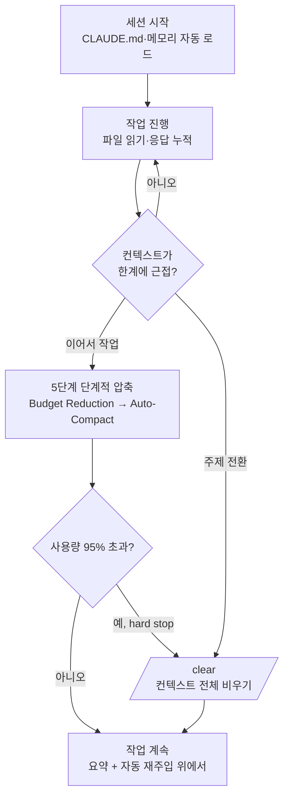

# 컨텍스트 윈도우

컨텍스트 윈도우 (context window)는 Claude Code가 한 세션 동안 기억하는 모든 것을 담는 작업 책상입니다. 책상은 모델마다 크기가 다르고, 가득 차기 전에 단계적 압축과 `/clear`로 자리를 비워줘야 긴 작업을 품질과 비용 모두에서 끝까지 무리 없이 마칠 수 있습니다.


이 문서는 MoAI-ADK가 올라타 있는 플랫폼인 **Claude Code 자체**를 다루는 배경 자료입니다. MoAI-ADK를 쓰는 방법은 [토큰 예산 관리와 안전한 중단](/ko/advanced/token-budget)에서 다룹니다.



**한 줄 요약**: 컨텍스트 윈도우는 Claude의 **작업 책상**이자 토큰 비용이 발생하는 장부입니다. 모델이 정한 한계에 가까워지면 5단계 단계적 압축 (graduated compaction)이 순차적으로 작동하고, 95%에 닿으면 다음 행동은 반드시 `/clear`입니다.



컨텍스트 윈도우를 **책상 크기**로 상상해 보세요. 작업할 서류(파일·대화)를 책상 위에 펼쳐 두고 일하는데, 책상은 무한하지 않습니다. 책상이 가득 차면 오래된 서류를 **요약해 서랍에 넣는 것**이 압축 (compaction)이고, 책상을 통째로 치우고 새로 시작하는 것이 `/clear`입니다. 책상이 넓어도 잡동사니로 채우면 정작 지금 볼 서류가 밀리므로, 크기를 늘리기보다 **올려 두는 양을 줄이는 것**이 핵심입니다.


## 컨텍스트 윈도우와 토큰

컨텍스트 윈도우는 Claude가 한 세션에서 동시에 "볼 수 있는" 정보의 총량입니다. 여기에는 사용자가 입력한 프롬프트뿐 아니라, 터미널에 표시되지 않는 내용까지 모두 포함됩니다.

| 컨텍스트에 들어가는 것 | 터미널에 보이는가 | 비고 |
|------------------------|-------------------|------|
| 시스템 프롬프트 | 보이지 않음 | 동작 규칙. 항상 가장 먼저 로드 |
| 자동 메모리 (`MEMORY.md`) | 보이지 않음 | 이전 세션에서 남긴 메모. 앞 200줄 또는 25KB까지만 로드 |
| 환경 정보 | 보이지 않음 | 운영 체제, 셸, 워크스페이스 경로 등 |
| MCP 도구 이름 (지연 로드) | 보이지 않음 | MCP 도구 정의는 필요할 때만 로드되어 컨텍스트 절약 |
| CLAUDE.md (전역 + 프로젝트) | 보이지 않음 | 프로젝트 규칙과 빌드 명령 |
| 스킬 설명 (1줄) | 보이지 않음 | 실제 본문은 사용할 때만 로드 |
| 사용자 프롬프트 | 보임 | 실제로 입력한 요청 |
| Claude가 읽은 파일 | 한 줄 요약만 | 파일 본문은 Claude만 봄 |
| Claude의 분석·수정·응답 | 보임 | 터미널에 그대로 출력 |

토큰 (token)은 이 정보를 세는 단위입니다. 대략 영어 단어 하나가 1~2 토큰, 한국어는 글자당 더 많은 토큰을 차지합니다. 다소 의외인 점은, **세션을 시작하기도 전에 이미 상당한 양이 채워진다**는 것입니다. CLAUDE.md, 메모리, 스킬 목록, MCP 도구 이름이 첫 프롬프트보다 먼저 로드되기 때문입니다.

### 파일 읽기가 컨텍스트를 가장 많이 먹습니다

Claude가 작업하면서 읽는 파일이 컨텍스트 사용량을 지배합니다. 그래서 프롬프트를 구체적으로 적어 ("`auth.ts`의 버그를 고쳐줘") Claude가 읽는 파일 수를 줄이는 것이 토큰 절약의 핵심입니다. 리서치처럼 파일을 많이 뒤져야 하는 작업은 서브에이전트 (subagent)에게 맡기세요. 큰 파일 읽기는 별도 컨텍스트 윈도우에서 끝나고, 본 세션으로는 결과 요약만 돌아옵니다.

## 모델별 크기

컨텍스트 윈도우 크기는 모델에 따라 다릅니다. Claude Code에서 실제로 동작하는 기준 (2026년 8월)은 아래 표와 같습니다.

| 모델 | 컨텍스트 윈도우 | 특징 |
|------|-----------------|------|
| **Claude Fable 5** | 256K 토큰 | Mythos 등급의 최상위 모델. Claude Code에서는 256K 윈도우로 동작 |
| **Claude Opus 5 / Opus 4.8** | 1M 토큰 | 네이티브 1M 윈도우. 가장 넓은 작업 책상, 대규모 코드베이스·긴 호라이즌 작업에 유리 |
| **Claude Sonnet 5** | 200K 토큰 | 속도와 지능의 균형. 일반적인 코드 작업에 충분 |
| **Claude Haiku 4.5** | 200K 토큰 | 가장 빠르고 경제적인 모델. 가벼운 작업 전용 |

크기가 클수록 한 번에 더 많은 파일과 대화를 담을 수 있지만, 윈도우가 무한하지는 않습니다. 어느 모델을 쓰든 결국 한계에 가까워지면 관리가 필요합니다. 핵심 원칙은 **윈도우 크기를 늘리는 것보다, 들어가는 내용을 적게 유지하는 것**이 더 안정적이라는 점입니다.

## 단계적 압축과 /clear

세션이 길어지면 컨텍스트가 한계에 다가갑니다. Claude Code는 모델 호출 직전마다 **5단계 단계적 압축** (graduated compaction, Claude Code 2.1.196)을 순차적으로 적용해 창을 가볍게 유지합니다. 창이 차는 정도에 따라 점진적으로 강한 단계로 넘어갑니다.

| 단계 | 이름 | 하는 일 |
|------|------|---------|
| 1 | Budget Reduction (예산 축소) | 여분의 추론·생산 예산을 줄여 입력 부담을 낮춤 |
| 2 | Snip (잘라내기) | 더 이상 필요 없는 중간 과정을 잘라냄 |
| 3 | Microcompact (마이크로 압축) | 국소 구간을 작게 요약 |
| 4 | Context Collapse (컨텍스트 붕괴) | 넓은 구간을 구조화된 요약으로 접음 |
| 5 | Auto-Compact (자동 압축) | 누적된 대화 기록 전체를 요약 하나로 대체 |

마지막 단계가 흔히 말하는 **압축** (compaction)입니다. `/compact`를 직접 실행할 수도 있고, 컨텍스트가 한계에 가까워지면 자동으로 일어나기도 합니다. 요약은 다음을 보존합니다.

- 사용자의 요청과 의도
- 핵심 기술 개념
- 살펴보거나 수정한 파일과 중요한 코드 조각
- 발생한 오류와 해결 방법
- 남은 작업과 현재 진행 상황

대신 전체 도구 출력과 중간 추론 과정은 사라집니다. Claude는 작업 내용을 참조할 수 있지만, 이전에 읽은 코드 원문을 더 이상 그대로 갖고 있지 않습니다.

압축 이후 각 정보가 어떻게 되는지는 로드 방식에 따라 다릅니다.

| 메커니즘 | 압축 후 상태 |
|----------|--------------|
| 시스템 프롬프트, 출력 스타일 | 그대로 유지 (메시지 기록의 일부가 아님) |
| 프로젝트 루트 CLAUDE.md, 범위 없는 규칙 | 디스크에서 다시 주입 |
| 자동 메모리 | 디스크에서 다시 주입 |
| `paths:` 프론트매터가 붙은 규칙 | 해당 파일을 다시 읽을 때까지 사라짐 |
| 하위 디렉터리의 중첩 CLAUDE.md | 해당 디렉터리 파일을 다시 읽을 때까지 사라짐 |
| 호출한 스킬 본문 | 다시 주입 (스킬당 5,000 토큰, 전체 25,000 토큰 상한, 오래된 것부터 제거) |
| hook | 해당 없음 (hook은 코드로 실행되며 컨텍스트에 남지 않음) |

압축을 거쳐도 살려두고 싶은 규칙이라면 `paths:` 프론트매터를 빼거나 프로젝트 루트 CLAUDE.md로 옮기세요. 스킬은 잘릴 때 앞부분을 남기므로, 중요한 지시는 `SKILL.md` 위쪽에 두는 것이 안전합니다.

### 자동 압축 시점 제어

자동 압축의 시점을 조정해야 한다면, 환경 변수 `CLAUDE_AUTOCOMPACT_PCT_OVERRIDE`로 임계값 (기본값: 전체 컨텍스트 대비 약 75~80%)을 바꿀 수 있습니다. 예를 들어 여유 있게 압축하고 싶다면 더 낮은 값을 지정하세요.

```bash
export CLAUDE_AUTOCOMPACT_PCT_OVERRIDE=70  # 70%에서 압축 시작
```


**95% 경고선** (hard stop): 사용량이 **95%**를 넘으면 모델 크기와 무관하게 다음 행동은 반드시 `/clear`입니다. 그 상태에서는 새로운 큰 작업을 시작하면 안 됩니다. 단계적 압축도 더 이상 버틸 여유가 없기 때문입니다. Claude Code 2.1.196부터는 스트리밍 멈춤 (stall)을 잡는 **유휴 감시개** (idle watchdog)가 기본 켜짐으로 동작해, 5분간 이벤트가 없으면 자동으로 중단하고 다시 시도합니다. 이는 멈춤의 *결과*를 부드럽게 할 뿐, 멈춤 자체의 위험을 없애지는 않으므로 95%에 닿기 전에 미리 비워두는 것이 여전히 맞습니다.


### /clear — 완전 초기화

`/clear`는 압축과 다릅니다. 요약조차 남기지 않고 대화 컨텍스트를 통째로 비워 **새 세션처럼** 시작합니다. 직전 작업과 무관한 새 작업으로 넘어갈 때 가장 깔끔합니다. 요약(압축)은 "이어서 더 작업할 때", 초기화(`/clear`)는 "주제를 바꿀 때" 쓴다고 기억하면 됩니다.


```mermaid
flowchart TD
    A[세션 시작<br>CLAUDE.md·메모리 자동 로드] --> B[작업 진행<br>파일 읽기·응답 누적]
    B --> C{컨텍스트가<br>한계에 근접?}
    C -->|아니오| B
    C -->|이어서 작업| D[5단계 단계적 압축<br>Budget Reduction → Auto-Compact]
    C -->|주제 전환| E[/clear<br>컨텍스트 전체 비우기/]
    D --> F{사용량 95% 초과?}
    F -->|아니오| G[작업 계속<br>요약 + 자동 재주입 위에서]
    F -->|예, hard stop| E
    E --> G
```

## 사용량 모니터링

지금 컨텍스트가 얼마나 찼는지 모르면 관리할 수 없습니다. Claude Code는 실측 도구를 제공합니다.

| 명령 / 위치 | 보여주는 것 |
|-------------|-------------|
| `/context` | 카테고리별 실시간 컨텍스트 사용 내역과 최적화 제안. 어느 항목이 창을 차지하는지 한눈에 |
| `/cost` | 현재 세션의 토큰 사용량과 비용 |
| `/memory` | 시작 시 로드된 CLAUDE.md와 자동 메모리 파일 목록 |
| 상태표시줄 (status line) | 세션 진행 중 사용량을 항상 표시 |

긴 작업에 들어가기 전이나 도중에 `/context`를 한 번 실행해 어떤 항목이 컨텍스트를 차지하는지 확인하는 습관이 관리에 큰 도움이 됩니다. 특히 어떤 카테고리가 예상보다 크다면 `/context`의 최적화 제안이 다이어트의 출발점이 됩니다.

## 긴 작업을 관리하는 전략

대규모 작업일수록 컨텍스트가 가장 먼저 부딪히는 한계입니다. 다음 전략을 조합하면 한 작업을 여러 압축 경계를 넘어 안정적으로 이어갈 수 있습니다.

- **요약 후 계속**: 한 단계를 마치면 압축으로 정리하고, 이어지는 단계는 요약 위에서 진행합니다.
- **서브에이전트로 분리**: 파일을 많이 읽어야 하는 탐색·리서치는 서브에이전트에게 맡겨 본 세션 컨텍스트를 보호합니다.
- **메모리에 체크포인트 남기기**: 중요한 결정과 진행 상황은 메모리에 기록해 압축이나 `/clear`를 넘어 살아남게 합니다. 체크포인팅 (checkpointing)과 짝을 이뤄 긴 세션의 연속성을 받쳐 줍니다.
- **CLAUDE.md 다이어트**: 프로젝트 CLAUDE.md는 200줄 이하로 유지하고, 참조용 내용은 스킬이나 경로 범위 규칙으로 옮겨 필요할 때만 로드되게 합니다.
- **95%에 닿기 전에 비우기**: 사용량이 70~80%를 넘으면 미리 `/compact`로 자리를 만들거나 `/clear`로 단절합니다. 95%는 hard stop이지 관리 시점이 아닙니다.
- **프롬프트를 구체적으로**: 읽을 파일을 좁혀 불필요한 파일 읽기를 줄입니다.

이 가운데 메모리와 체크포인트는 MoAI-ADK의 SPEC 워크플로, 세션 핸드오프와 곧바로 맞물립니다. MoAI-ADK는 이 페이지의 원리를 **컨텍스트 다이어트** (context diet)라는 운영 규율로 넓혀 놓았습니다. 항시 로드되는 지침을 최소로 줄이고, 모델별 임계값 (1M 컨텍스트 모델은 사용량 50%, 256K·200K 모델은 90%)에 닿으면 진행 상태를 디스크에 저장한 뒤 붙여넣기 한 번으로 다음 세션을 잇는 세션 핸드오프를 제공합니다. statusline에 컨텍스트 사용률 (CW%)을 늘 띄워 임계값이 가까워졌음을 미리 알려 주기도 합니다. 여기서는 "컨텍스트가 차기 전에 미리 비우고, 중요한 상태는 디스크에 남긴다"는 모범 사례 (best practices)만 기억해도 충분합니다.

## 관련 문서

- [메모리와 자동 메모리](/ko/claude-code/context-memory/memory)
- [체크포인팅](/ko/claude-code/context-memory/checkpointing)

## 참고 자료

- [Claude Code Docs — Context window](https://code.claude.com/docs/en/context-window)


새로운 작업을 시작하기 직전에 `/clear`를 한 번 실행하세요. 이전 작업의 파일 읽기와 대화가 쌓인 채로 새 작업에 들어가면, 관련 없는 토큰이 책상을 차지해 응답 품질은 떨어지고 비용은 늘어납니다.

