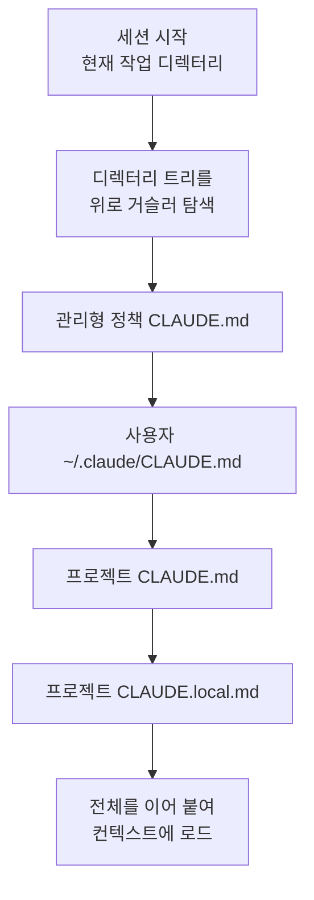
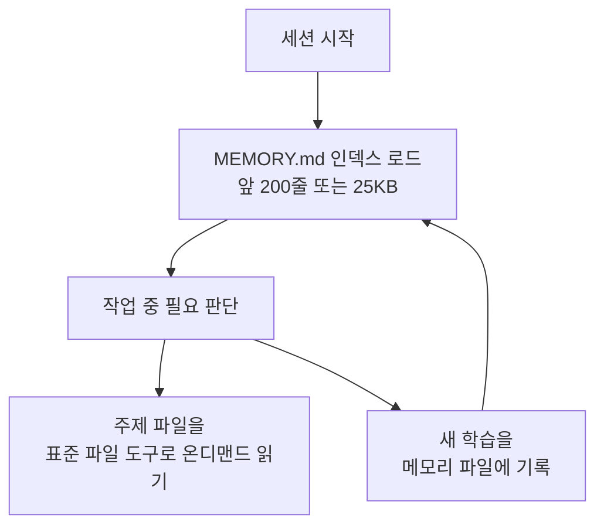

Claude Code가 매 세션마다 새로운 컨텍스트 윈도우 (context window)로 시작하면서도 프로젝트 지식을 잃지 않도록 도와주는 두 가지 메모리 메커니즘을 살펴봅니다.


**한 줄 요약**: CLAUDE.md는 사람이 적어두는 영구 지침이고, 자동 메모리는 Claude가 작업하며 스스로 적어 모으는 학습 노트로, 둘 다 매 세션 시작에 컨텍스트로 로드됩니다.


## 두 가지 메모리 메커니즘

Claude Code의 모든 세션은 빈 컨텍스트 윈도우로 시작합니다. 세션을 넘어 지식을 전달하는 방법은 두 가지입니다. 둘은 서로를 보완하며, 매 대화 시작에 함께 로드됩니다.

| 구분 | CLAUDE.md 파일 | 자동 메모리 (auto memory) |
| :--- | :--- | :--- |
| **작성 주체** | 사람 (직접 작성) | Claude (스스로 작성) |
| **담는 내용** | 지침과 규칙 | 학습과 패턴 |
| **범위** | 프로젝트 / 사용자 / 조직 | 저장소 단위, 워크트리 공유 |
| **로드 시점** | 매 세션 (전체) | 매 세션 (앞 200줄 또는 25KB) |
| **쓰임새** | 코딩 표준, 워크플로우, 아키텍처 | 빌드 명령, 디버깅 통찰, 발견한 선호 |

두 메모리 모두 **강제 설정이 아니라 컨텍스트** (context, not enforced configuration)입니다. 즉 Claude는 이를 읽고 따르려 하지만, 무조건 준수를 보장하지는 않습니다. 특정 동작을 반드시 차단하려면 메모리가 아니라 `PreToolUse` hook을 사용해야 합니다.

## CLAUDE.md 기반 메모리

CLAUDE.md는 프로젝트, 개인 워크플로우, 조직 전체를 위한 영구 지침을 담는 마크다운 파일입니다. 사람이 평문으로 작성하면 Claude가 매 세션 시작에 읽습니다.

### 언제 CLAUDE.md에 추가하나

매번 다시 설명하게 되는 사실을 적어두는 곳입니다. 다음과 같은 신호가 나타나면 추가합니다.

- Claude가 같은 실수를 두 번째로 반복할 때
- 코드 리뷰가 Claude가 알았어야 할 코드베이스 사항을 잡아낼 때
- 지난 세션에 입력했던 정정을 또 입력하고 있을 때
- 새 팀원에게 똑같이 설명해줘야 할 컨텍스트일 때

빌드 명령, 컨벤션, 프로젝트 레이아웃, "항상 X 하라" 같은 규칙처럼 매 세션 유지해야 할 사실에 집중합니다. 여러 단계의 절차이거나 코드베이스 일부에만 해당하면 스킬 또는 경로 한정 규칙으로 옮기는 편이 낫습니다.

### 메모리 계층

CLAUDE.md는 여러 위치에 둘 수 있으며 위치마다 범위가 다릅니다. 아래 표는 로드 순서 (넓은 범위에서 좁은 범위)대로 나열한 것으로, 더 구체적인 지침이 나중에 컨텍스트에 들어갑니다.

| 범위 | 위치 | 용도 | 공유 대상 |
| :--- | :--- | :--- | :--- |
| **관리형 정책** (managed policy) | macOS: `/Library/Application Support/ClaudeCode/CLAUDE.md`<br>Linux/WSL: `/etc/claude-code/CLAUDE.md`<br>Windows: `C:\Program Files\ClaudeCode\CLAUDE.md` | 조직 전체 지침 (IT/DevOps 관리) | 조직 내 전체 사용자 |
| **사용자 지침** (user) | `~/.claude/CLAUDE.md` | 모든 프로젝트 공통 개인 선호 | 본인 (전체 프로젝트) |
| **프로젝트 지침** (project) | `./CLAUDE.md` 또는 `./.claude/CLAUDE.md` | 팀 공유 프로젝트 지침 | 소스 컨트롤로 팀원 공유 |
| **로컬 지침** (local) | `./CLAUDE.local.md` | 개인용 프로젝트별 선호 (`.gitignore` 대상) | 본인 (현재 프로젝트) |

관리형 정책 파일은 개인 설정으로 제외할 수 없어 조직 지침이 항상 적용됩니다. 별도 파일 대신 `managed-settings.json`의 `claudeMd` 키로 관리형 CLAUDE.md 내용을 직접 넣을 수도 있습니다.

### CLAUDE.md 로드 순서

Claude Code는 현재 작업 디렉터리에서 위로 디렉터리 트리를 거슬러 올라가며 각 디렉터리의 `CLAUDE.md`와 `CLAUDE.local.md`를 찾습니다. 발견한 파일은 서로 덮어쓰지 않고 모두 이어 붙여 (concatenate) 컨텍스트에 넣습니다. 파일시스템 루트에서 작업 디렉터리 쪽으로 내려가는 순서이므로, 실행 위치에 가까운 지침이 가장 나중에 읽힙니다.



작업 디렉터리 위쪽 계층의 파일은 시작 시 전부 로드되지만, 하위 디렉터리의 파일은 Claude가 그 디렉터리의 파일을 읽을 때 비로소 포함됩니다. 모노레포에서 다른 팀의 파일이 잡힐 때는 `claudeMdExcludes` 설정으로 특정 파일을 건너뛸 수 있습니다.

### import 구문으로 다른 파일 포함

CLAUDE.md는 `@path/to/import` 구문으로 다른 파일을 가져올 수 있습니다. import한 파일은 이를 참조한 CLAUDE.md와 함께 시작 시 펼쳐져 컨텍스트에 로드됩니다.

```text
See @README for project overview and @package.json for available npm commands.

# Additional Instructions
- git workflow @docs/git-instructions.md
```

- 상대 경로와 절대 경로를 모두 쓸 수 있으며, 상대 경로는 작업 디렉터리가 아니라 **import를 포함한 파일** 기준으로 해석됩니다.
- import한 파일이 다시 다른 파일을 import할 수 있고, 최대 깊이는 **4 hop**입니다.
- 처음 외부 import를 만나면 승인 대화상자가 뜹니다. 거부하면 import는 비활성 상태로 남습니다.

여러 워크트리 (worktree)에 걸쳐 개인 지침을 공유하려면 홈 디렉터리의 파일을 import하는 방식이 유용합니다.

```text
# Individual Preferences
- @~/.claude/my-project-instructions.md
```

### 효과적인 지침 작성

CLAUDE.md는 매 세션 컨텍스트 윈도우에 로드되어 대화와 함께 토큰을 소비합니다. 작성 방식이 준수율에 직접 영향을 줍니다.

| 원칙 | 권장 | 지양 |
| :--- | :--- | :--- |
| **크기** | 파일당 200줄 이하 목표 | 길어질수록 컨텍스트 소비 증가, 준수율 하락 |
| **구조** | 헤더와 불릿으로 그룹화 | 빽빽한 문단 |
| **구체성** | "2칸 들여쓰기 사용" | "코드를 깔끔하게" |
| **일관성** | 모순되는 규칙 주기적 정리 | 충돌 시 Claude가 임의 선택 |

`.claude/rules/` 디렉터리를 쓰면 지침을 주제별 파일로 나눌 수 있고, frontmatter의 `paths` 필드로 특정 파일 경로에 한정해 매칭되는 파일을 다룰 때만 로드되게 할 수 있습니다.

## 자동 메모리

자동 메모리는 사람이 아무것도 적지 않아도 Claude가 세션을 넘어 지식을 쌓게 합니다. 작업하면서 빌드 명령, 디버깅 통찰, 아키텍처 노트, 코드 스타일 선호, 워크플로우 습관 등을 스스로 기록합니다. 매 세션 무언가를 저장하지는 않고, 앞으로의 대화에 유용할지 판단해 기록할 가치가 있는 것만 남깁니다.

자동 메모리는 Claude Code v2.1.59 이상이 필요합니다. `claude --version`으로 버전을 확인할 수 있습니다.

### 무엇을 어디에 저장하나

프로젝트마다 고유한 메모리 디렉터리를 가집니다.

```text
~/.claude/projects/<project>/memory/
├── MEMORY.md          # 간결한 인덱스, 매 세션 로드
├── debugging.md       # 디버깅 패턴 상세 노트
├── api-conventions.md # API 설계 결정
└── ...                # Claude가 만드는 그 밖의 주제 파일
```

`<project>` 경로는 git 저장소에서 유도되므로, **같은 저장소의 모든 워크트리와 하위 디렉터리가 하나의 메모리 디렉터리를 공유**합니다 (git 저장소 밖에서는 프로젝트 루트 사용). 자동 메모리는 **머신 로컬** (machine-local)이라 다른 머신이나 클라우드 환경과는 공유되지 않습니다.

`autoMemoryDirectory` 설정으로 저장 위치를 바꿀 수 있습니다. 값은 절대 경로이거나 `~/`로 시작해야 합니다.

```json
{
  "autoMemoryDirectory": "~/my-custom-memory-dir"
}
```

### 회상 방식

`MEMORY.md`는 메모리 디렉터리의 인덱스 역할을 합니다. **앞 200줄 또는 25KB 중 먼저 닿는 지점까지만** 매 대화 시작에 로드되고, 그 이상은 시작 시점에 로드되지 않습니다. 그래서 Claude는 상세 노트를 별도 주제 파일로 옮겨 `MEMORY.md`를 간결하게 유지합니다.



`debugging.md`, `patterns.md` 같은 주제 파일은 시작 시 로드되지 않고, 정보가 필요할 때 Claude가 표준 파일 도구로 직접 읽습니다. Claude Code 화면에 "Writing memory" 또는 "Recalled memory"가 보이면 메모리 디렉터리를 실제로 갱신하거나 읽는 중입니다.

이 200줄/25KB 한도는 `MEMORY.md`에만 적용됩니다. CLAUDE.md 파일은 길이와 무관하게 전체가 로드됩니다 (다만 짧을수록 준수율이 좋습니다).

### 켜고 끄기, 그리고 감사

자동 메모리는 기본 켜짐입니다. `/memory`를 열어 토글하거나 `autoMemoryEnabled` 설정으로 끌 수 있고, 환경 변수 `CLAUDE_CODE_DISABLE_AUTO_MEMORY=1`로도 비활성화됩니다.

```json
{
  "autoMemoryEnabled": false
}
```

`/memory` 명령은 현재 세션에 로드된 모든 CLAUDE.md, `CLAUDE.local.md`, 규칙 파일을 나열하고, 자동 메모리 토글과 메모리 폴더 열기 링크를 제공합니다. 자동 메모리 파일은 모두 평문 마크다운이라 언제든 직접 편집하거나 삭제할 수 있습니다. "always use pnpm, not npm"처럼 기억해달라고 요청하면 자동 메모리에 저장되고, "add this to CLAUDE.md"라고 하면 CLAUDE.md에 추가됩니다.

## 메모리 작성 모범 사례

좋은 메모리는 짧고 검증 가능합니다. 다음 원칙을 따르면 준수율과 가독성이 함께 올라갑니다.

- **간결하게**: `MEMORY.md`는 인덱스로 유지하고 상세는 주제 파일로 분리합니다. CLAUDE.md는 파일당 200줄 이하를 목표로 합니다.
- **한 파일에 한 사실**: 한 주제는 한 파일에 모읍니다. `testing.md`, `api-design.md`처럼 서술적인 파일명을 씁니다.
- **구체적으로**: 모호한 표현 대신 검증 가능한 문장을 씁니다. ("커밋 전 `npm test` 실행" 처럼)
- **모순 정리**: 서로 충돌하는 지침은 주기적으로 제거합니다. 충돌이 남으면 Claude가 어느 쪽을 따를지 임의로 결정합니다.
- **강제가 필요하면 hook으로**: 매 커밋 전처럼 특정 시점에 반드시 실행해야 하는 일은 메모리가 아니라 hook으로 작성합니다.

## MoAI-ADK 메모리 시스템과의 관계

MoAI-ADK는 위의 Claude Code 메모리 기반 위에서 동작합니다. 프로젝트 루트의 CLAUDE.md를 오케스트레이터 실행 지침으로 사용하고, 자동 메모리의 `MEMORY.md` 인덱스와 주제 파일을 SPEC 작업의 세션 핸드오프 및 교훈 (lessons) 누적에 활용합니다. MoAI 고유의 메모리 운영 규칙과 인덱스 관리 방식은 별도 문서에서 자세히 다룹니다.

## 관련 문서

- [CLAUDE.md 가이드](/advanced/claude-md-guide)

## 참고 자료

- [How Claude remembers your project (Claude Code Docs)](https://code.claude.com/docs/en/memory)
- [Auto memory (Claude Code Docs)](https://code.claude.com/docs/en/memory#auto-memory)


지금 자동 메모리에 무엇이 쌓였는지 궁금하면 세션에서 `/memory`를 실행해 폴더를 열어보세요. 모두 평문 마크다운이라 그 자리에서 읽고 다듬고 지울 수 있습니다.

