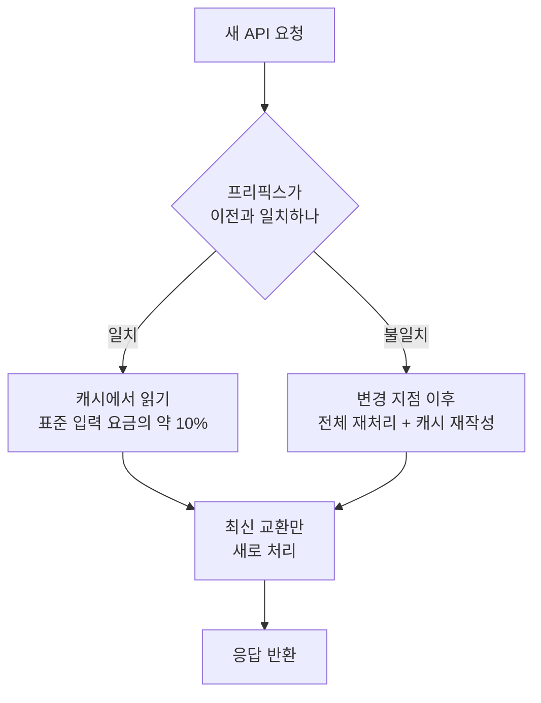

Claude Code는 매 턴마다 전체 대화를 다시 처리하는 대신, 이미 처리한 부분을 재사용하는 프롬프트 캐싱 (prompt caching) 을 자동으로 관리합니다.


**한 줄 요약**: 매번 변하지 않는 앞부분(프리픽스)을 캐시에서 그대로 읽어와, 같은 작업을 두 번 처리하지 않고 비용과 응답 시간을 크게 줄여줍니다.


## 프롬프트 캐싱이 필요한 이유

모델은 요청과 요청 사이에 아무것도 기억하지 못합니다. 그래서 Claude Code는 메시지를 보낼 때마다 새 API 요청을 만들고, **전체 컨텍스트** (시스템 프롬프트, 프로젝트 컨텍스트, 모든 이전 메시지와 도구 결과, 새 메시지) 를 다시 전송합니다.

핵심은 새 내용이 항상 **맨 끝에 덧붙는다** 는 점입니다. 따라서 각 요청의 대부분은 직전 요청과 동일합니다. 프롬프트 캐싱은 바로 이 "변하지 않은 부분"을 다시 처리하지 않게 해주는 메커니즘입니다.

## 캐시는 어떻게 동작하나

API는 각 요청의 **시작 부분** 을 최근에 처리한 내용과 비교합니다. 이 시작 부분을 **프리픽스** (prefix) 라고 부릅니다. 일반적인 턴에서는 직전 요청 전체가 프리픽스가 되고, 가장 최근에 주고받은 한 번의 교환만 새 내용입니다.

매칭은 **정확 일치** 방식이라, 프리픽스 어딘가가 바뀌면 그 뒤는 전부 다시 계산됩니다. 파일 단위나 구간 단위 캐싱은 없습니다.



### 캐시를 위한 3계층 구조

프리픽스 매칭 효율을 높이기 위해, Claude Code는 **거의 안 바뀌는 내용을 앞에** 배치합니다.

| 계층 | 포함 내용 | 무효화되는 시점 |
|------|-----------|-----------------|
| 시스템 프롬프트 | 핵심 지침, 도구 정의, 출력 스타일 | MCP 서버 연결/해제, Claude Code 업그레이드 |
| 프로젝트 컨텍스트 | `CLAUDE.md`, 자동 메모리, 범위 없는 규칙 | 세션 시작, `/clear` 또는 `/compact` 이후 |
| 대화 | 사용자 메시지, Claude 응답, 도구 결과 | 매 턴 |

대화 계층만 바뀌면 시스템 프롬프트와 프로젝트 컨텍스트는 캐시된 채로 남습니다. 반대로 시스템 프롬프트가 바뀌면 그 뒤 모든 내용이 다른 프리픽스 뒤에 놓이므로 **전체가 무효화** 됩니다.

프롬프트 텍스트에 포함되지 않지만 캐시 키의 일부인 두 가지가 더 있습니다.

- **모델**: 모델마다 캐시가 분리됩니다. `/model` 로 모델을 바꾸면 내용이 같아도 전체를 다시 계산합니다.
- **노력 수준** (effort level): 같은 모델이라도 노력 수준마다 캐시가 따로입니다. `/effort` 로 세션 중간에 바꾸면 전체가 재계산되며, Claude Code가 적용 전에 확인을 요청합니다.

## 무엇이 캐시되나

캐시되는 대상은 결국 **자주 바뀌지 않는, 요청 앞쪽의 큰 덩어리** 입니다.

- **시스템 프롬프트**: 핵심 지침과 출력 스타일
- **도구 정의**: 내장 도구와 MCP 도구의 정의 전체
- **프로젝트 컨텍스트**: `CLAUDE.md`, 자동 메모리, 규칙
- **누적된 대화 기록**: 이전 메시지, Claude 응답, 도구 결과, 큰 컨텍스트(읽어들인 대규모 코드베이스 파일 등)

이 덩어리들은 한 턴에 한 번 처리되어 캐시에 기록되고, 이후 턴에서는 표준 입력 요금의 약 10%만 내고 그대로 읽어옵니다.

## 비용과 지연 절감 효과 (개념적으로)

캐시 성능은 API가 매 응답에 보고하는 두 개의 토큰 수치로 드러납니다.

| 필드 | 의미 |
|------|------|
| `cache_creation_input_tokens` | 이번 턴에 캐시에 **기록** 된 토큰, 캐시 쓰기 요금으로 청구 |
| `cache_read_input_tokens` | 이번 턴에 캐시에서 **읽어온** 토큰, 표준 입력 요금의 약 10%로 청구 |

- **비용**: 읽기(read) 토큰은 표준 입력 요금의 약 10% 수준입니다. 캐시 읽기 비율이 높을수록 같은 작업을 더 싸게 처리합니다.
- **지연**: 변하지 않은 프리픽스를 다시 처리하지 않으므로 응답이 빨라집니다. 반대로 캐시가 무효화된 턴은 한 번 느려지고 비싸집니다.

**읽기 대비 쓰기(read-to-creation) 비율이 높을수록** 캐싱이 잘 작동하는 것입니다. 쓰기가 턴마다 계속 높게 나온다면 프리픽스의 무언가가 매번 바뀌고 있다는 신호입니다.

## 캐시를 무효화하는 행동

다음 행동들은 다음 요청이 캐시의 일부 또는 전체를 놓치게 만듭니다. 한 번 느리고 비싼 턴이 발생한 뒤, 새 프리픽스가 다시 캐시됩니다.

| 행동 | 영향 |
|------|------|
| 모델 전환 (`/model`, `opusplan` 토글) | 전체 재계산 (모델마다 캐시 분리) |
| 노력 수준 변경 (`/effort`) | 전체 재계산, 적용 전 확인 요청 |
| MCP 서버 연결/해제 | 시스템 프롬프트 계층 무효화 |
| 전체 도구 거부 (`Bash`, `WebFetch` 같은 맨 이름 deny 규칙) | 시스템 프롬프트 계층 무효화 |
| 대화 압축 (`/compact`) | 대화 계층 무효화 (의도된 동작) |
| Claude Code 업그레이드 | 시스템 프롬프트/도구 정의 변경 → 전체 재구축 |

> `Bash(rm *)` 같은 **범위 지정** deny 규칙과 모든 allow/ask 규칙은 Claude가 보는 도구 집합을 바꾸지 않으므로 프리픽스가 그대로 유지됩니다.

## 캐시를 유지하는 행동

반대로, 다음 행동들은 대화 끝에 덧붙기만 하거나 요청 자체를 건드리지 않아 캐시가 살아 있습니다.

- 저장소의 파일 편집 (Claude가 다시 읽으면 대화 끝에 덧붙음)
- 세션 중간의 `CLAUDE.md` 편집 (캐시는 유지되지만, 편집 내용은 다음 `/clear`·`/compact`·재시작 전까지 **적용되지 않음**)
- 출력 스타일 변경 (마찬가지로 다음 `/clear`·재시작 때 적용)
- 권한 모드 변경 (`opusplan` 플랜 모드 제외)
- 스킬·커맨드 호출 (지침이 사용자 메시지로 삽입됨)
- `/recap` 실행, `/rewind` 되감기

## Claude Code에서의 자동 활용

프롬프트 캐싱은 **기본으로 켜져 있으며** Claude Code가 알아서 관리합니다. 별도로 켜는 설정은 필요 없습니다. 캐시 적중률을 높이는 모범 사례 (best practices) 는 단순합니다.

- 모델·노력 수준·MCP 서버는 **세션 시작 시점에** 정하고, 작업 중간에 바꾸지 않습니다.
- `/compact` 는 작업과 작업 사이의 자연스러운 구간에서 실행합니다.
- 버릴 경로로 들어갔다면 `/compact` 대신 `/rewind` 로 이미 캐시된 이전 턴으로 되돌립니다.

캐시는 사실상 **한 머신·한 디렉터리 단위** 로 범위가 잡힙니다. 시스템 프롬프트가 작업 디렉터리, 플랫폼, 셸, OS 버전, 자동 메모리 경로를 담기 때문입니다. 같은 저장소의 워크트리도 디렉터리가 다르므로 서로의 캐시를 공유하지 않습니다.

### 캐시 수명 (TTL)

캐시된 프리픽스는 일정 시간 동안 활동이 없으면 만료됩니다. 캐시에 적중하는 요청마다 타이머가 초기화되어, 계속 작업하는 동안에는 캐시가 따뜻하게 유지됩니다.

| 인증 방식 | 기본 TTL | 조정 환경 변수 |
|-----------|----------|----------------|
| Claude 구독 | 1시간 (자동, 추가 비용 없음) | 한도 초과 시 자동 5분 |
| API 키·서드파티 | 5분 | `ENABLE_PROMPT_CACHING_1H=1` 로 1시간 전환 |
| (공통 강제) | — | `FORCE_PROMPT_CACHING_5M=1` 로 5분 강제 |

## 모니터링 방법

캐시가 잘 동작하는지 보려면 위의 두 토큰 수치(`cache_read_input_tokens`, `cache_creation_input_tokens`)를 관찰합니다.

- **statusline 스크립트**: `current_usage` 객체를 읽는 상태줄 스크립트로 매 턴 실시간 확인이 가능합니다.
- **OpenTelemetry 익스포터**: 조직 전체 가시성이 필요할 때, 사용자·세션별 캐시 읽기/쓰기 토큰을 보고합니다.

캐시 쓰기 토큰이 턴마다 높게 유지된다면, "캐시를 무효화하는 행동" 표에서 원인을 찾아보세요.

### 캐싱 비활성화

캐싱은 특정 모델·제공자의 동작을 디버깅할 때 정도만 꺼두면 됩니다. 평소에는 켜둔 채로 사용합니다.

```bash
# 모든 모델에 대해 비활성화
export DISABLE_PROMPT_CACHING=1

# 특정 모델만 비활성화
export DISABLE_PROMPT_CACHING_OPUS=1
```

## MoAI-ADK에서 더 깊이

MoAI-ADK는 SPEC 기반 워크플로우 안에서 안정적인 프리픽스(시스템 프롬프트, `CLAUDE.md`, 규칙)를 유지해 캐시 적중률을 높이도록 설계되어 있습니다. 실제로 캐싱이 비용 측면에서 언제 이득인지에 대한 **손익분기 분석** 은 아래 문서에서 다룹니다.

## 관련 문서

- [프롬프트 캐싱 — 손익분기 분석](/cost-optimization/prompt-caching)

## 참고 자료

- [How Claude Code uses prompt caching](https://code.claude.com/docs/en/prompt-caching)


실전 팁: 세션을 시작할 때 모델·노력 수준·MCP 서버를 먼저 확정하고, 작업이 끝날 때까지 바꾸지 마세요. 중간 변경이 적을수록 캐시 적중률이 올라가고 응답이 빨라집니다.

