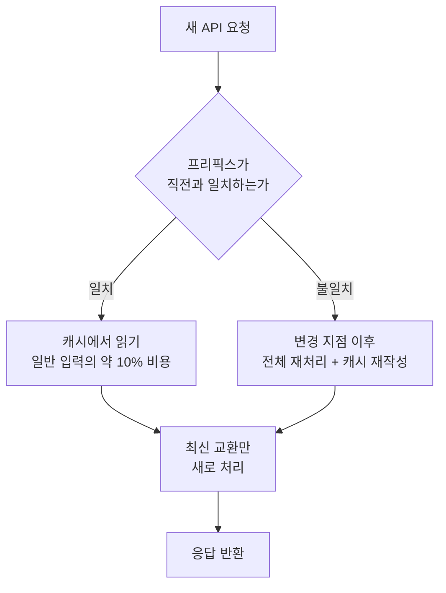

# 프롬프트 캐싱

Claude Code는 매 턴마다 전체 대화를 처음부터 다시 보내지 않습니다. 대신 직전에 이미 처리한 앞부분은 캐시에서 그대로 가져다 쓰고, 새로 추가된 끝부분만 새로 처리합니다. 이 메커니즘이 **프롬프트 캐싱** (prompt caching)이며, Claude Code가 알아서 켭니다.


이 문서는 MoAI-ADK가 올라타 있는 플랫폼인 **Claude Code 자체**를 다루는 배경 자료입니다. MoAI-ADK 관점에서 프롬프트 캐싱을 다루는 문서는 [프롬프트 캐싱 — 손익분기 분석](/ko/cost-optimization/prompt-caching)입니다.



**한 줄 요약**: 요청마다 변하지 않는 앞부분(프리픽스)을 캐시에서 읽어와, 같은 내용을 두 번 처리하지 않게 해줍니다. 캐시 읽기는 일반 입력의 약 10% 비용이고, 캐시가 무효화되면 그 지점부터 다시 계산합니다.



프롬프트 캐싱은 책에 꽂아 둔 **책갈피**와 같습니다. Claude Code는 매 요청마다 시스템 프롬프트·프로젝트 규칙·지금까지의 대화를 처음부터 다시 담아 보내는데, 앞부분이 직전과 똑같으면 처음부터 다시 읽지 않고 책갈피가 꽂힌 지점까지 건너뜁니다. 앞부분이 오래 그대로일수록 캐시 효과가 크고, 앞부분이 바뀌면 그 지점부터는 다시 읽어야 합니다.


## 프롬프트 캐싱이 왜 필요한가

모델은 요청과 요청 사이에 아무것도 기억하지 못합니다. 그래서 Claude Code는 메시지를 보낼 때마다 새 API 요청을 만들고, **전체 컨텍스트** — 시스템 프롬프트, 프로젝트 규칙, 도구 정의, 지금까지의 메시지와 도구 결과 전부, 그리고 새 메시지 — 를 다시 담아 보냅니다.

중요한 점은 새 내용이 늘 **맨 끝에 덧붙는다**는 것입니다. 각 요청의 대부분은 직전 요청과 똑같고, 진짜 새로운 것은 가장 마지막에 주고받은 한 번의 교환뿐입니다. 프롬프트 캐싱은 바로 이 "변하지 않은 앞부분"을 매번 다시 계산하지 않게 해줍니다.

## 캐시는 어떻게 동작하나

API는 들어온 요청의 **시작 부분**이 최근에 처리한 내용과 같은지 맞춰 봅니다. 이 시작 부분을 **프리픽스** (prefix)라 부릅니다. 보통 턴에서는 직전 요청 전체가 프리픽스가 되고, 가장 최근의 교환 한 번만 새 내용입니다.

매칭은 **정확히 일치** (exact match)해야 성공합니다. 프리픽스 어딘가가 하나라도 바뀌면 그 뒤는 전부 다시 계산됩니다. 파일 단위나 구간 단위로 부분적으로 캐시되는 일은 없습니다.


```mermaid
flowchart TD
    A[새 API 요청] --> B{프리픽스가<br/>직전과 일치하는가}
    B -->|일치| C[캐시에서 읽기<br/>일반 입력의 약 10% 비용]
    B -->|불일치| D[변경 지점 이후<br/>전체 재처리 + 캐시 재작성]
    C --> E[최신 교환만<br/>새로 처리]
    D --> E
    E --> F[응답 반환]
```

### 요청은 세 덩어리로 조립된다

하나의 요청은 항상 정해진 순서로 조립됩니다. 이 순서가 곧 프리픽스의 구조이고, 캐시가 얼마나 오래 살아남는지를 결정합니다.

| 순서 | 계층 | 무엇이 들어가나 | 언제 바뀌나 |
|------|------|-----------------|-------------|
| 1 | 도구 정의 (tools) | 내장 도구 + MCP 도구의 스키마 전체 | MCP 서버 연결·해제, Claude Code 업그레이드 |
| 2 | 시스템 프롬프트 (system) | 핵심 지침, 권한 규칙, 출력 스타일, `CLAUDE.md`, 자동 메모리 | 권한 규칙 변경, 세션 시작 파일 편집, `/clear` |
| 3 | 메시지 (messages) | 사용자 입력 + Claude 응답 + 도구 결과 | 매 턴 (맨 끝에 덧붙음) |

거의 안 바뀌는 내용이 앞에 오도록 배치되어 있습니다. 메시지 계층만 바뀌면 도구 정의와 시스템 프롬프트는 캐시된 채로 남습니다. 반대로 시스템 프롬프트나 도구 정의가 바뀌면 그 뒤의 모든 내용이 다른 프리픽스 뒤에 놓이므로 **전체가 무효화**됩니다.

요청 텍스트에 직접 드러나지 않지만 캐시 키의 일부인 두 가지가 더 있습니다.

- **모델**: 모델마다 캐시가 따로 쌓입니다. 같은 내용이라도 `/model`로 모델을 바꾸면 전체를 다시 계산합니다. 모델별로 컨텍스트 윈도우 크기도 다르다는 점은 [컨텍스트 윈도우](/ko/claude-code/context-memory/context-window) 문서를 참고하세요.
- **노력 수준** (effort level): 같은 모델이라도 노력 수준마다 캐시가 분리됩니다. 세션 도중 `/effort`로 바꾸면 전체를 다시 계산하며, Claude Code는 적용 전 확인을 요청합니다.

## 캐시의 수명: 5분 (idle-based)

캐시에 적중하는 요청이 계속 들어오는 동안에는 따뜻하게 유지되지만, **5분 동안 한 번도 요청이 없으면** 만료됩니다. 이 수명은 **유휴 기반** (idle-based)입니다 — 마지막 요청으로부터 5분이 흐르면 캐시가 사라지고, 다음 요청은 프리픽스를 처음부터 다시 써야 합니다.

사람이 개입해야 하는 긴 대기(질문에 답하는 시간, 리뷰를 기다리는 시간)가 이 5분을 넘기면 캐시가 식습니다. 컨텍스트가 클수록 이 만료 비용도 커집니다 — 다시 채워야 할 프리픽스가 크기 때문입니다. 그래서 정말 필요한 게이트가 아니면 맥락이 큰 상태에서 오래 멈추지 않는 것이 좋습니다.

| 인증 방식 | 기본 TTL | 조정 |
|-----------|----------|------|
| Claude 구독 | 1시간 (자동, 추가 비용 없음) | 한도 초과 시 자동으로 5분 |
| API 키·서드파티 | 5분 | `ENABLE_PROMPT_CACHING_1H=1`로 1시간 전환 가능 |
| (공통 강제) | — | `FORCE_PROMPT_CACHING_5M=1`로 5분 강제 |

5분이 기본이고 구독 환경에서 1시간으로 자동 연장된다고 이해하면 됩니다.

Claude Code 2.1.243에는 `promptCacheTtl`·`subagentPromptCacheTtl` 설정(환경변수 `CLAUDE_CODE_PROMPT_CACHE_TTL` / `CLAUDE_CODE_SUBAGENT_PROMPT_CACHE_TTL`)도 추가됐습니다. API 키·클라우드 제공자 세션이 메인 대화에 한해 1시간 캐시를 유지할 수 있고 서브에이전트는 5분에 남습니다. z.ai 같은 서드파티 게이트웨이에서 반영되는지는 측정되지 않았습니다.

## 비용: 읽기는 싸고, 쓰기는 살짝 비싸다

캐시가 잘 돌고 있는지는 API가 매 응답에 보고하는 두 토큰 수치로 알 수 있습니다.

| 필드 | 의미 | 비용 |
|------|------|------|
| `cache_read_input_tokens` | 이번 턴에 캐시에서 **읽어온** 토큰 | 일반 입력 요금의 **약 0.1배** (≈10%) |
| `cache_creation_input_tokens` | 이번 턴에 캐시에 **새로 기록한** 토큰 | 일반 입력 요금의 **1.25배** (5분 TTL 기준) |

- **읽기**는 일반 입력의 약 10% 가격이므로, 캐시에서 읽어오는 비율이 높을수록 같은 작업을 훨씬 싸게 처리합니다.
- **쓰기**는 일반 입력보다 25% 더 비쌉니다. 캐시가 무효화된 턴은 이 쓰기 비용을 한 번 물고 다시 프리픽스를 쌓습니다. 1시간 TTL은 쓰기 프리미엄이 더 높지만, 구독에서는 자동·무료로 적용됩니다.

**읽기 대비 쓰기 비율**이 캐시 건강도의 핵심 신호입니다. 읽기가 쓰기보다 압도적으로 많으면 캐싱이 잘 작동하고 있는 것입니다. 반대로 쓰기 토큰이 턴마다 계속 높게 나온다면, 프리픽스 어딘가가 매번 바뀌고 있다는 뜻입니다 — 뒤의 "캐시를 깨뜨리는 것" 표에서 원인을 찾아보세요.

지연 측면에서도 이득입니다. 변하지 않은 프리픽스를 다시 처리하지 않으므로 응답이 빨라집니다. 캐시가 무효화된 턴만 한 번 느려지고 비싸집니다.

## 캐시를 깨뜨리는 것

아래 행동을 하면 그다음 요청이 캐시의 일부 또는 전체를 놓칩니다. 느리고 비싼 턴을 한 번 치르고 나면 새 프리픽스가 다시 캐시됩니다.

| 행동 | 영향 |
|------|------|
| 모델 전환 (`/model`) | 전체 재계산 (모델마다 캐시 분리) |
| 노력 수준 변경 (`/effort`) | 전체 재계산, 적용 전 확인 요청 |
| MCP 서버 연결·해제 | 도구 정의 계층 무효화 → 전체 |
| 전체 도구 거부 (`Bash`, `WebFetch` 같은 맨 이름 deny 규칙) | 도구 정의 계층 무효화 → 전체 |
| 대화 압축 (`/compact`, 자동 압축) | 메시지 계층 재작성 (의도된 동작) |
| Claude Code 업그레이드 | 시스템 프롬프트·도구 정의 변경 → 전체 재구축 |

> `Bash(rm *)` 같은 **범위 지정** deny 규칙과 모든 allow·ask 규칙은 Claude가 보는 도구 집합을 바꾸지 않으므로 프리픽스가 그대로 유지됩니다.

### 세션 시작에 로드되는 파일을 고치면 전체가 무효화된다

`CLAUDE.md`, `.claude/rules/` 아래의 규칙, 출력 스타일, 항시 로드되는 스킬은 세션이 시작될 때 시스템 프롬프트 계층에 들어갑니다. **이 파일들을 세션 도중에 고치면 시스템 프롬프트 계층이 바뀌어, 그 뒤에 있는 메시지 전부와 함께 캐시가 무효화됩니다.**

이게 왜 아픈가 하면, 컨텍스트가 이미 커진 상태에서 프리픽스 전체를 다시 써야 하기 때문입니다. 5분 TTL 캐시의 쓰기 비용(일반 입력의 1.25배)을 그대로 한 번 물고, 게다가 그 시점에 캐시가 식을 만큼 시간이 흘렀다면 처음부터 다시 쌓아야 합니다.

그래서 이런 수정은 **작업이 끝날 때, 또는 `/clear` 직전에 몰아서** 하는 것이 비용 면에서 유리합니다. 다음 세션이 시작될 때 새 내용이 깔끔하게 반영된 채 캐시가 다시 구축됩니다.

## 캐시를 살려 두는 것

반대로, 다음 행동들은 대화 끝에 덧붙기만 하거나 요청 자체를 건드리지 않아 캐시가 살아 있습니다.

- 저장소의 파일 편집 (Claude가 다시 읽으면 결과가 대화 끝에 덧붙음)
- 권한 모드 변경 (일반적인 전환)
- 스킬·커맨드 호출 (지침이 사용자 메시지로 삽입됨)
- `/recap` 실행, `/rewind` 되감기

## 캐시 인식 실행: 캐시를 의식하며 일하기

프롬프트 캐싱은 자동으로 켜지지만, **캐시를 의식하며** 일하면 비용과 지연을 훨씬 더 아낄 수 있습니다. 핵심 원칙은 하나입니다 — 변하지 않는 앞부분이 오래 유지될수록 이득이 커지니, 그 앞부분을 흔들리지 않게 지키는 것입니다.

1. **세션 시작에 확정하고, 도중에 바꾸지 않기**: 모델, 노력 수준, MCP 서버는 세션을 시작할 때 정하고 작업이 끝날 때까지 그대로 둡니다. 이 셋은 전체 재계산을 부르는 가장 흔한 원인입니다.
2. **항시 로드 파일은 작업 끝에 고치기**: `CLAUDE.md`, 규칙, 출력 스타일, 항시 로드 스킬을 세션 도중에 고치면 시스템 프롬프트 계층이 바뀌어 전체가 무효화됩니다. 이런 수정은 한 작업이 끝난 뒤나 `/clear` 직전에 몰아서 하세요.
3. **맥락이 클 때 오래 멈추지 않기**: 5분을 넘기는 대기는 캐시를 식힙니다. 컨텍스트가 클수록 다시 채우는 비용도 크므로, 정말 필요한 게이트가 아니면 큰 맥락에서 긴 대기는 피합니다.
4. **`/compact`는 자연스러운 길목에서**: 작업과 작업 사이의 의미 있는 경계에서 실행합니다. 잘못된 길로 들어섰다면, 전체를 다시 요약하는 `/compact`보다 **캐시된 이전 턴까지 되감아 주는 `/rewind`**가 더 쌉니다.
5. **`/clear`는 진짜 필요할 때만**: `/clear`는 따뜻한 캐시를 통째로 버립니다. 남은 뒷정리가 짧다면 캐시를 유지한 채 끝내는 것이, 묵은 맥락을 짊어지고 큰 작업을 시작하는 것보다 쌉니다.

## Claude Code가 알아서 켠다

프롬프트 캐싱은 **기본으로 켜져 있으며** Claude Code가 알아서 관리합니다. 따로 켜는 설정은 필요 없습니다. 사용자가 할 일은 위의 캐시 인식 실행 원칙을 지켜 적중률을 높이는 것뿐입니다.

캐시 범위는 사실상 **한 머신·한 디렉터리 단위**로 잡힙니다. 시스템 프롬프트가 작업 디렉터리, 플랫폼, 셸, OS 버전, 자동 메모리 경로를 담기 때문입니다. 같은 저장소의 워크트리도 디렉터리가 다르면 서로의 캐시를 공유하지 않습니다.

## 모니터링 방법

캐시가 잘 동작하는지 보려면 두 토큰 수치(`cache_read_input_tokens`, `cache_creation_input_tokens`)를 관찰합니다.

- **statusline 스크립트**: 매 턴 실시간으로 캐시 읽기·쓰기 토큰을 보여주는 상태줄 스크립트를 쓸 수 있습니다.
- **OpenTelemetry 익스포터**: 조직 전체 가시성이 필요할 때, 사용자·세션별 캐시 토큰을 보고합니다.

캐시 쓰기 토큰이 턴마다 높게 유지된다면, "캐시를 깨뜨리는 것" 표에서 원인을 찾아보세요.

### 캐싱 비활성화

특정 모델이나 제공자의 동작을 디버깅할 때 정도만 꺼두면 됩니다. 평소에는 켜둔 채로 사용합니다.

```bash
# 모든 모델에 대해 비활성화
export DISABLE_PROMPT_CACHING=1

# 특정 모델만 비활성화
export DISABLE_PROMPT_CACHING_OPUS=1
```

## 토크노믹스에서 가장 측정하기 쉬운 부분

프롬프트 캐싱은 MoAI-ADK **토크노믹스**를 구성하는 요소 가운데 가장 측정하기 쉽습니다. MoAI-ADK는 두 방향에서 캐시를 활용합니다.

- **적중률을 높이는 설계**: SPEC 기반 워크플로우 안에서 프리픽스(시스템 프롬프트, `CLAUDE.md`, 규칙)를 흔들리지 않게 유지하고, 항시 로드 컨텍스트를 덜어 내 캐시가 살아남는 앞부분을 최대한 크고 안정적으로 만듭니다.
- **적중률을 보이는 계측**: statusline에 캐시 적중률(cache hit) 신호를 띄워, 컨텍스트 다이어트의 효과를 세션 도중에 바로 확인하게 합니다. GLM 백엔드(z.ai)에서는 암시적 프롬프트 캐싱이 자동으로 걸립니다.

캐싱이 비용 면에서 언제부터 이득인지를 따지는 **손익분기 분석**은 아래 문서에서 다룹니다.

## 관련 문서

- [컨텍스트 윈도우](/ko/claude-code/context-memory/context-window) — 컨텍스트 윈도우 크기와 모델별 차이, 자동 압축
- [프롬프트 캐싱 — 손익분기 분석](/ko/cost-optimization/prompt-caching) — 캐싱이 비용 이득이 되는 시점

## 참고 자료

- [How Claude Code uses prompt caching](https://code.claude.com/docs/en/prompt-caching)


실전 팁: 세션을 시작할 때 모델·노력 수준·MCP 서버를 먼저 확정하고, 작업이 끝날 때까지 바꾸지 마세요. `CLAUDE.md`와 규칙 파일은 한 작업이 끝난 뒤에 고치고, 중간 변경이 적을수록 캐시 적중률이 올라가 응답도 빨라집니다.

