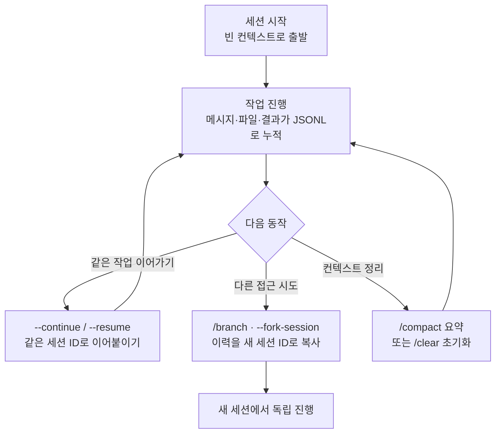

# 세션 관리

Claude Code에서 하나의 대화가 곧 하나의 세션(session)입니다. 세션은 터미널을 닫아도 사라지지 않고 로컬에 저장되어, 다음에 다시 열어 이어갈 수 있습니다. 이 페이지는 세션을 시작하고·이어가고·갈라내고·정리하는 방법을 짚어 줍니다.


이 문서는 MoAI-ADK가 올라타 있는 플랫폼인 **Claude Code 자체**를 다루는 배경 자료입니다. MoAI-ADK를 쓰는 방법은 [/moai](/ko/utility-commands/moai)에서 다룹니다.



**한 줄 요약**: 세션은 닫아도 살아 있는 하나의 대화 단위입니다. 이어서 작업하려면 이전 세션을 다시 불러오고(`--resume` / `--continue`), 다른 접근을 시도하려면 갈라내고(`/branch` · `--fork-session`), 주제가 바뀌면 `/clear`로 깨끗이 비웁니다.



세션을 **브라우저 탭**으로 상상해 보세요. 각 탭은 서로 독립적이고, 닫았던 탭을 다시 열 수 있고(resume), 한 탭을 복제해 다른 길로 가볼 수도 있습니다(fork). 완전히 새 주제를 시작하고 싶을 때는 새 탭을 여는 것(/clear)이 가장 깔끔합니다. 세션도 똑같습니다.


## 세션이란

세션은 Claude Code와 나눈 하나의 연속된 대화입니다. 처음 시작할 때마다 **빈 컨텍스트 윈도우**에서 출발해, 주고받은 메시지와 읽은 파일, 실행 결과가 [컨텍스트 윈도우](/ko/claude-code/context-memory/context-window)에 하나씩 쌓입니다.

여기서 짚고 갈 핵심은 두 가지입니다.

- **독립성**: 각 세션은 저마다 고유한 컨텍스트를 가집니다. 한 세션에서 본 파일과 대화가 다른 세션으로 새어 들어가지 않습니다. 그래서 다른 주제의 작업을 섞지 않고, 맥락을 깨끗하게 유지할 수 있습니다.
- **지속성**: 세션을 닫아도 기록은 로컬에 보존됩니다. 터미널을 껐다 켜도, 며칠이 지나도 이전 대화를 다시 열어 그 지점부터 이어갈 수 있습니다.

## 세션은 어디에 저장되는가

세션이 닫아도 살아 있는 비결은 로컬 저장에 있습니다. Claude Code는 작업하는 동안 대화를 `~/.claude/projects/` 아래 **JSONL 파일**로 저장합니다. JSONL(JSON Lines)은 한 줄에 하나의 이벤트(메시지, 도구 호출, 결과)를 JSON 객체로 기록하는 형식입니다.

```
~/.claude/projects/
└── <프로젝트 경로 해시>/
    ├── *.jsonl                    # 이 프로젝트의 세션 전사
    └── memory/                    # 이 프로젝트의 자동 메모리
        ├── MEMORY.md
        └── feedback_*.md
```

저장소(작업 디렉터리)마다 하위 디렉터리가 하나씩 생깁니다. 그 안에 세션별 JSONL 파일이 쌓이고, [자동 메모리](/ko/claude-code/context-memory/memory)도 같은 트리 아래에 보관됩니다. 이 기록이 있기 때문에 세션을 **이어서** 열고(resume) · **되감고**(rewind) · **갈라내는**(fork) 일이 모두 가능해집니다.


**저장은 로컬 전용**입니다. 세션 전사는 사용자의 기기에만 있고, 어딘가의 서버로 올라가지 않습니다. Claude API 호출 자체는 클라우드로 가지만, 대화 기록과 메모리는 사용자 디스크에 머뭅니다.


## 세션 다시 열기: 이어서 작업하기

터미널을 닫거나 새로 켜도 이전 대화를 다시 열 수 있습니다. 두 가지 진입점이 있습니다.

| 명령 | 동작 | 언제 쓰나 |
|------|------|-----------|
| `claude --continue` | 가장 최근 세션을 바로 이어서 시작 | 방금 하던 일을 당장 이어갈 때 |
| `claude --resume` | 과거 세션 목록에서 골라 이어서 시작 | 며칠 전의 특정 작업을 찾아 열 때 |

둘 다 **같은 세션 ID**에 이어 붙입니다. 즉, 원래 대화의 맥락이 그대로 살아 있어 방금 전에 읽었던 파일과 결정을 다시 설명할 필요가 없습니다. `--continue`는 선택할 필요 없이 최근 것을 즉시 열고, `--resume`은 목록을 띄워 직접 고르게 해 줍니다.

이어서 열면 세션 범위(session-scoped) 상태도 함께 돌아옵니다. 예컨대 `/moai goal`로 무장한 목표나 예약 작업은 아직 만료되지 않았다면 그대로 복원됩니다. 다만 턴 수나 타이머 같은 실행 통계는 재개 시점에 초기화됩니다.

## 세션에 이름 붙이기: /rename

`--resume` 목록이 길어지면 "어느 세션이 무슨 작업이었지?" 헷갈리기 쉽습니다. 이때 `/rename`이 도움이 됩니다. 세션에 알아보기 쉬운 **내구명**(durable name)을 붙이면, 나중에 목록에서 이름으로 찾기 훨씬 수월해집니다.

```
/rename auth-migration
```

예컨대 "auth-migration", "refactor-parser"처럼 작업 주제를 이름으로 적어 두면, 여러 세션을 오갈 때 길을 잃지 않습니다. 관례적으로 **하나의 작업 흐름마다 세션 하나**를 대응시키고 이름을 붙이면, 세션 곧 작업 브랜치처럼 관리할 수 있습니다.

## 세션 분기하기: /branch와 --fork-session

이어붙이기가 "같은 세션 ID에 계속 쓰기"라면, 분기는 "이력을 복사해 **새 세션 ID**로 떼어내기"입니다. 원본 세션은 그대로 둔 채 다른 접근을 시도하고 싶을 때 씁니다.

| 방법 | 시점 | 동작 |
|------|------|------|
| `/branch` | 세션 안에서 | 현재 이력을 새 세션으로 복사해 분기 |
| `claude --continue --fork-session` | 터미널에서 | 최근 세션을 복사본으로 열어 분기 |

예를 들어 한 방향으로 코드를 진행하다 "이 길 말고 처음부터 다른 방식을 써볼까?" 싶을 때, 분기하면 원본을 잃지 않고 새 시도를 해볼 수 있습니다. 분기한 세션은 그 뒤로 원본과 완전히 독립적으로 자라납니다.


되감기(`/rewind`)와 분기(`/branch`)는 다릅니다. `/rewind`는 **같은 세션 안에서** 과거 지점으로 되돌리는 것이고, `/branch`는 **새 세션으로** 갈라내는 것입니다. 되감기의 자세한 동작은 [체크포인팅](/ko/claude-code/context-memory/checkpointing)에서 다룹니다.


## 컨텍스트 정리: /compact와 /clear

세션이 길어지면 컨텍스트가 한계에 다가갑니다. 이때 두 가지 정리 도구가 있습니다. 방향이 정반대이므로 목적에 맞게 골라 씁니다.

| 명령 | 동작 | 언제 쓰나 |
|------|------|-----------|
| `/compact` | 같은 세션을 유지한 채 지금까지의 내용을 **요약**으로 대체해 자리 확보 | 대화는 이어가고 싶은데 맥락이 아쉬울 때 |
| `/clear` (별칭 `/reset`, `/new`) | 컨텍스트를 **통째로 비우고** 새 대화처럼 시작 | 완전히 새 주제로 넘어갈 때 |

`/compact`는 요약된 맥락 위에서 흐름을 이어갑니다. 사용자의 의도, 핵심 결정, 살펴본 파일, 남은 작업은 요약에 남지만, 도구 출력의 원문과 중간 추론은 사라집니다. 요약이 자동으로 일어나기도 하는데, 컨텍스트가 한계에 가까워지면 Claude Code가 스스로 압축에 들어갑니다(CC 2.1.196+부터는 5분간 응답이 없으면 스트리밍이 자동 중단·재시도되는 idle watchdog이 기본 켜져 있어, 한계 근처에서 세션이 멈춰버리는 일도 완화됩니다).

`/clear`는 요약조차 남기지 않습니다. 컨텍스트뿐 아니라 프롬프트 캐시까지 함께 날아가는 무거운 재시작이지만, 무관한 이전 작업의 잔재를 완전히 털어낼 수 있어 응답 품질과 비용 양쪽에 유리합니다.

한 줄로 정리하면 **"대화는 이어가고 싶다 → `/compact`", "아예 새 출발이다 → `/clear`"** 입니다.



## 세션과 체크포인트

세션과 [체크포인팅](/ko/claude-code/context-memory/checkpointing)은 다른 층위를 다룹니다. 함께 쓰면 더 강력하지만, 헷갈리기 쉬워 구분해 두는 것이 좋습니다.

| 개념 | 다루는 것 | 되돌리는 대상 |
|------|-----------|---------------|
| 세션 | 대화 전체의 시작·이어가기·분기·정리 | 어느 대화를 열 것인가 |
| 체크포인트 | 세션 안에서 편집 직전 상태의 스냅샷 | 코드 + 대화를 직전 지점으로 |

세션이 "어느 대화를 열까"라면, 체크포인트는 "이 대화 안에서 방금 전으로 되감을까"입니다. 세션 안에서 작업이 꼬였을 때 `/rewind`로 이전 체크포인트까지 되돌리는 흐름은 체크포인팅 문서에서 자세히 다룹니다.

## 세션은 독립적이다

앞서 짚은 독립성을 실천 차원에서 다시 봅니다. 각 세션은 저마다의 컨텍스트 윈도우에서 시작하므로, **세션끼리 기억을 공유하지 않습니다**. 한 세션에서 디버깅하며 깨달은 사실이 다른 세션으로 자동으로 넘어가지 않는다는 뜻입니다.

그래서 세션을 넘어 살려야 할 지식은 컨텍스트가 아닌 **파일**에 담아야 합니다. [CLAUDE.md](/ko/claude-code/context-memory/memory)와 자동 메모리가 정확히 이 역할을 합니다. 매 세션 시작에 디스크에서 다시 로드되므로, 어느 세션을 열든 프로젝트 지식이 살아 있습니다. 반면 그날의 대화 맥락은 세션 안에만 있으니, 세션을 닫기 전에 중요한 상태를 메모리로 옮겨 두는 것이 안전합니다.

## MoAI-ADK의 세션 핸드오프

세션이 아무리 이어져도 [컨텍스트 윈도우](/ko/claude-code/context-memory/context-window)에는 한계가 있어 언젠가 `/clear`로 비워야 할 순간이 옵니다. 모델마다 윈도우 크기가 달라 시점은 다르지만 — 200K 컨텍스트 모델은 비교적 일찍, 1M 컨텍스트 모델은 그보다 늦게 — 결국 한계는 찾아옵니다. 이때 진행 상황을 잃지 않으려면 세션 경계를 넘어 상태를 넘겨주는 장치가 필요합니다.

MoAI-ADK는 이를 **세션 핸드오프** (session handoff)로 제공합니다. 컨텍스트 사용량이 모델별 임계값(1M 모델은 사용량 약 50%, 200K 모델은 약 90%)에 다가가면 오케스트레이터가 진행 상태를 디스크에 저장하고, 다음 세션에 그대로 붙여 넣기만 하면 되는 재개 메시지(paste-ready resume message)를 만들어 줍니다. `/clear` 뒤에는 이 메시지 하나로 새 세션이 직전 작업을 고스란히 이어받습니다.

세션 핸드오프의 6블록 구조, 임계값 정책, 자동 메모리 연동 등 상세는 [토큰 예산 관리](/ko/advanced/token-budget)에서 다룹니다. 여기서는 "세션은 언제든 비워질 수 있으니, 중요한 상태는 세션 경계를 넘어 파일로 넘겨준다"는 원칙만 기억하면 충분합니다.

## 관련 문서

- [컨텍스트 윈도우](/ko/claude-code/context-memory/context-window)
- [메모리와 자동 메모리](/ko/claude-code/context-memory/memory)
- [체크포인팅](/ko/claude-code/context-memory/checkpointing)
- [토큰 예산 관리](/ko/advanced/token-budget)

## 참고 자료

- [Claude Code Docs — Sessions](https://code.claude.com/docs/en/sessions)


긴 작업을 마치고 자리를 뜰 때는 세션을 그냥 닫아도 됩니다. 나중에 `claude --resume`으로 목록에서 골라 이어 가면 됩니다. 여러 세션을 오간다면 시작할 때마다 `/rename`으로 이름을 붙여 두는 편이 다시 찾기 훨씬 수월합니다.

