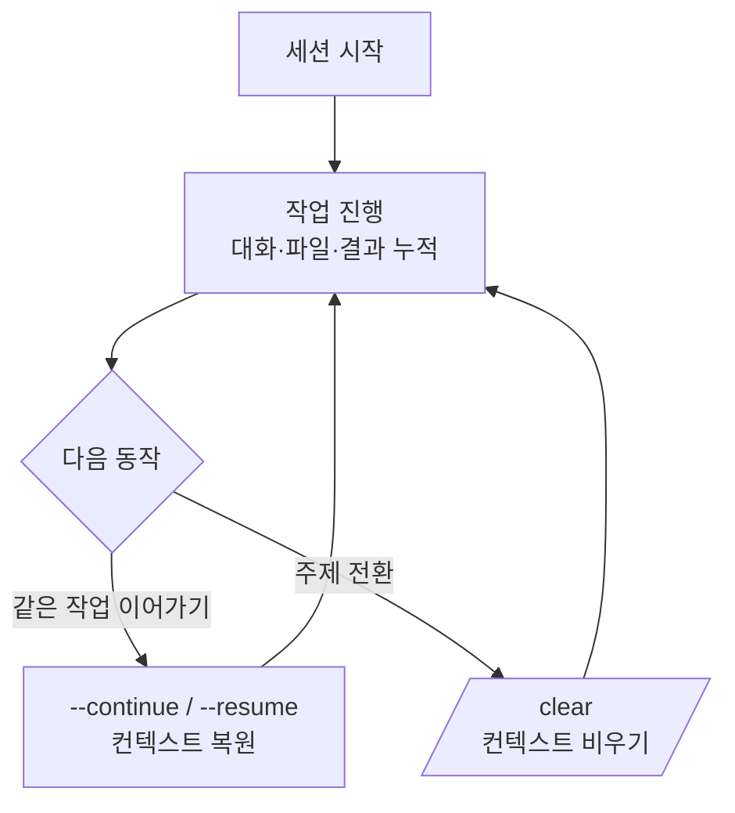

# 세션 관리

Claude Code에서 하나의 대화가 곧 하나의 세션입니다. 이 페이지는 세션을 시작·이어가기·정리하는 방법과, 세션이 체크포인트·핸드오프와 어떻게 맞물리는지를 정리합니다.


**한 줄 요약**: 세션은 하나의 **대화 단위**입니다. 이어서 작업할 때는 이전 세션을 다시 불러오고(`--resume` / `--continue`), 주제가 바뀌면 `/clear` 로 깨끗이 비웁니다. 세션의 흐름을 이해하면 긴 작업을 여러 날에 걸쳐 잃어버리지 않고 이어갈 수 있습니다.


## 세션이란

세션은 Claude Code와 나눈 하나의 연속된 대화입니다. 그 안에는 주고받은 메시지, 읽은 파일 요약, 실행 결과가 [컨텍스트 윈도우](/ko/claude-code/context-memory/context-window)에 누적됩니다. 세션을 닫아도 기록은 보존되므로, 나중에 다시 열어 이어갈 수 있습니다.

## 이어가기와 정리

세션을 다루는 핵심 동작은 다음과 같습니다.

| 명령 / 플래그 | 동작 |
|---------------|------|
| `claude --continue` | 가장 최근 세션을 이어서 시작 |
| `claude --resume` | 이전 세션 목록에서 골라 이어서 시작 |
| `/rename` | 현재 세션에 알아보기 쉬운 이름 부여 |
| `/clear` | 대화 컨텍스트를 통째로 비워 새 세션처럼 시작 |

`--continue` 와 `--resume` 은 이전 대화의 컨텍스트를 되살려 작업을 잇는 용도이고, `/clear` 는 반대로 지금까지의 컨텍스트를 버리고 깨끗하게 다시 시작하는 용도입니다. 이어서 할 일이면 resume·continue, 무관한 새 일로 넘어갈 때는 `/clear` 라고 기억하면 됩니다.

## 세션과 체크포인트

세션과 [체크포인팅](/ko/claude-code/context-memory/checkpointing)은 다른 층위를 다룹니다.

| 개념 | 다루는 것 | 되돌리는 대상 |
|------|-----------|---------------|
| 세션 | 대화 전체의 시작·이어가기·정리 | 대화 컨텍스트 |
| 체크포인트 | 세션 안에서 편집 직전 상태의 스냅샷 | 코드 + 대화를 이전 지점으로 |

세션이 "어느 대화를 열고 이어갈까"라면, 체크포인트는 "이 대화 안에서 방금 전으로 되감을까"입니다. 세션 안에서 작업이 꼬였을 때 `/rewind` 로 이전 체크포인트로 되돌리는 흐름은 체크포인팅 문서에서 자세히 다룹니다.

## MoAI-ADK의 세션 핸드오프

세션이 아무리 이어져도, [컨텍스트 윈도우](/ko/claude-code/context-memory/context-window)에는 한계가 있어 `/clear` 로 비워야 하는 순간이 옵니다. 이때 진행 상황을 잃지 않으려면 세션 경계를 넘어 상태를 넘겨주는 장치가 필요합니다.

MoAI-ADK는 이를 **세션 핸드오프** (session handoff)로 제공합니다. 컨텍스트 사용량이 모델별 임계값에 다가가면 오케스트레이터가 진행 상태를 디스크에 저장하고, 다음 세션에 그대로 붙여 넣어 이어갈 수 있는 재개 메시지 (paste-ready resume message)를 만들어 줍니다. `/clear` 이후 이 메시지 하나로 새 세션이 직전 작업을 자급자족하게 이어받습니다.

세션 핸드오프의 6블록 구조, 임계값 정책, 자동 메모리 연동 등 상세는 [토큰 예산 관리](/ko/advanced/token-budget)에서 다룹니다. 여기서는 "세션은 언제든 비워질 수 있으니, 중요한 상태는 세션 경계를 넘어 파일로 넘겨준다"는 원칙만 기억하면 충분합니다.

## 관련 문서

- [컨텍스트 윈도우](/ko/claude-code/context-memory/context-window)
- [체크포인팅](/ko/claude-code/context-memory/checkpointing)
- [토큰 예산 관리](/ko/advanced/token-budget)

## 참고 자료

- [Claude Code Docs — Sessions](https://code.claude.com/docs/en/sessions)


긴 작업을 마치고 자리를 뜰 때는 세션을 그냥 닫아도 됩니다. 나중에 `claude --resume` 으로 목록에서 골라 이어가면 되고, 여러 세션을 오간다면 `/rename` 으로 이름을 붙여 두면 다시 찾기가 훨씬 쉽습니다.

