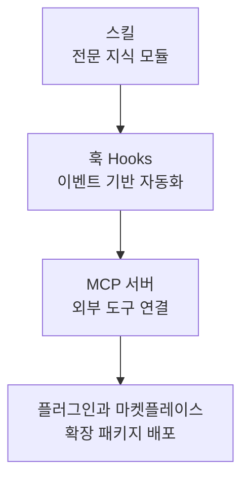

이 그룹은 Claude Code의 기본 기능을 넘어 동작을 확장하는 네 가지 방법을 다룹니다. 스킬로 전문 지식을 모듈화하고, 훅으로 이벤트에 자동화를 걸고, MCP로 외부 도구를 연결하며, 플러그인으로 이 모든 것을 하나의 패키지로 배포하는 흐름을 개념 중심으로 설명합니다. Claude Code를 자신의 워크플로에 맞춰 길들이고 싶은 한국 개발자를 위한 그룹입니다.


**한 줄 요약**: 스킬·훅·MCP·플러그인이라는 네 가지 확장점을 이해하면, Claude Code를 프로젝트 고유의 도구로 만들 수 있습니다.


## 학습 흐름

가장 가벼운 확장점인 스킬부터 시작해, 자동화를 거는 훅, 외부 세계와 잇는 MCP, 마지막으로 이들을 묶어 배포하는 플러그인 순서로 읽는 것을 권장합니다. 스킬·훅·MCP는 MoAI-ADK 심화 문서로 깊이 연결되니 개념을 잡은 뒤 더 파고들면 됩니다.

## 목차

| 문서 | 설명 |
|------|------|
| [스킬](/claude-code/extensibility/skills) | 전문 지식 모듈과 점진적 공개 |
| [훅 (Hooks)](/claude-code/extensibility/hooks) | 이벤트 기반 자동화 |
| [MCP 서버](/claude-code/extensibility/mcp) | 외부 도구 연결 프로토콜 |
| [플러그인과 마켓플레이스](/claude-code/extensibility/plugins) | 확장 패키지와 코드 인텔리전스 |

네 가지 확장점을 익혔다면, 다음 그룹에서 이를 실제 개발 워크플로에 통합하는 방법을 살펴보세요.
