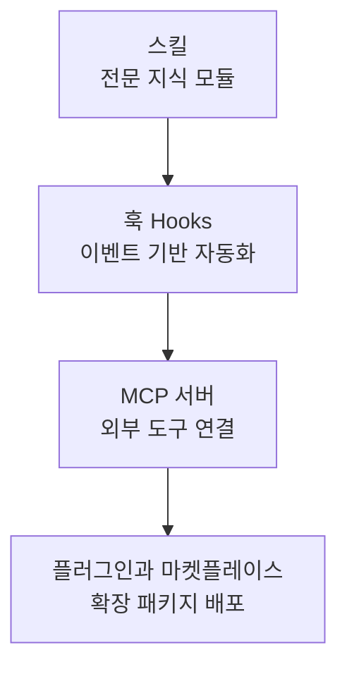

친구에게 이 그룹을 한 줄로 설명하자면, Claude Code라는 동료가 내 프로젝트의 규칙을 알고, 내 실수를 미리 막아 주고, 필요한 도구에 손을 뻗게 만드는 방법을 모아 둔 곳입니다. 네 가지 확장점 — 스킬·훅·MCP·플러그인 — 을 하나씩 개념으로 짚고, 그것들이 모여 **에이전틱 하네스** (Agentic Harness) 가 되는 흐름을 따라갑니다.


이 문서는 MoAI-ADK가 올라타 있는 플랫폼인 **Claude Code 자체**를 다루는 배경 자료입니다. MoAI-ADK 자체 기능은 사이드바 위쪽 섹션에서 다룹니다.


네 가지는 각자 다른 일을 맡습니다. **스킬** (skill) 은 전문 지식을 한 단위로 묶어 에이전트가 필요할 때 꺼내 읽게 하고, **훅** (hook) 은 정해진 순간에 정해진 동작을 자동으로 실행하며, **MCP** (Model Context Protocol) 로 외부 도구와 데이터를 연결하고, **플러그인** (plugin) 으로 이 셋을 한 상자에 담아 남에게 건넵니다.

이 네 가지가 모여 하네스가 됩니다. 코드를 직접 손으로 쓰는 대신 에이전트가 잘 일할 환경을 미리 설계해 두는 일을 하네스 엔지니어링이라 부르는데, 그 설계에서 스킬은 에이전트의 머릿속 지식을 싣고, 훅은 흠이 나면 안 되는 결정적 규율을 지키고, MCP는 외부 세계와의 손길을 잇고, 플러그인은 그 조합을 다른 사람에게 건넬 수 있는 배포 단위가 됩니다. MoAI-ADK가 `moai init` 한 번으로 템플릿을 깔아 주는 것도, `/moai project`가 프로젝트 전용 하네스를 만들어 주는 것도 결국 이 재료들을 어떻게 조립했느냐의 결과입니다.


네 가지를 한 장의 그림으로 그려 두면 헷갈리지 않습니다. **훅**은 사람이 다가오면 알아서 열리는 **자동문 센서** — 특정 이벤트가 일어나면 정해진 동작을 저절로 실행합니다. **스킬**은 평소엔 표지만 보이다가 그 일이 닥치면 펼쳐 읽는 **매뉴얼** 입니다. **MCP**는 외부 도구를 꽂는 **표준 콘센트**, **플러그인**은 이 셋을 한 상자에 담아 배포하는 **패키지** 입니다.


감을 잡기 위해, 가장 코드에 가까운 훅을 한 번만 살펴볼까요. 아래는 Claude Code가 파일을 고칠 때마다 작은 스크립트를 돌리도록 `settings.json` 에 건 설정입니다.

```json
{
  "hooks": {
    "PreToolUse": [
      {
        "matcher": "Write|Edit",
        "hooks": [{ "type": "command", "command": "./scripts/format-on-save.sh" }]
      }
    ]
  }
}
```

이 몇 줄이 있으면 에이전트가 파일을 고칠 때마다 포맷 스크립트가 알아서 돕니다. 매번 "포맷해 줘"라고 당부하지 않아도 되는 거죠. 이게 바로 훅이 하는 일 — 반복해서 말해야 할 당부를 이벤트 한 번에 자동으로 옮겨 놓는 것입니다. 나머지 세 가지도 비슷한 결로, 각자 다른 부분을 자동화하고 넓혀 줍니다.


**한 줄 요약**: 스킬·훅·MCP·플러그인이라는 네 확장점을 이해하면 Claude Code를 프로젝트 고유의 하네스로 바꿀 수 있습니다.



확장점마다 최근 Claude Code가 더해진 부분이 있습니다. **훅**은 이제 에이전트의 수명 주기까지 아우릅니다 — 서브에이전트가 시작·끝날 때(Claude Code 2.1.186+) 불리는 `SubagentStart`/`SubagentStop` 훅이 그것입니다. **MCP**는 `/mcp` 명령(2.1.186+)으로 서버 연결과 OAuth 인증을 세션 안에서 관리합니다. **플러그인**이 가져오는 서브에이전트는 `permissionMode`를 무시하는 자체 보안 모델을 따르니, 권한을 설계할 때 이 점을 염두에 두세요.


## 학습 흐름


```mermaid
flowchart TD
    A[스킬<br/>전문 지식 모듈] --> B[훅 Hooks<br/>이벤트 기반 자동화]
    B --> C[MCP 서버<br/>외부 도구 연결]
    C --> D[플러그인과 마켓플레이스<br/>확장 패키지 배포]
```

가장 가벼운 확장점인 스킬부터 시작해, 자동화를 거는 훅, 외부 세계와 잇는 MCP, 마지막으로 이들을 묶어 배포하는 플러그인 순서로 읽는 것을 권장합니다. 스킬·훅·MCP는 MoAI-ADK 심화 문서로도 깊이 이어지니, 여기서 개념을 잡은 뒤 더 파고들면 됩니다.

## 목차

| 문서 | 설명 |
|------|------|
| [스킬](/ko/claude-code/extensibility/skills) | 전문 지식 모듈과 점진적 공개 (progressive disclosure) |
| [훅 (Hooks)](/ko/claude-code/extensibility/hooks) | 이벤트 기반 자동화와 에이전트 수명 주기 훅 |
| [MCP 서버](/ko/claude-code/extensibility/mcp) | 외부 도구 연결 프로토콜과 `/mcp` 명령 |
| [플러그인과 마켓플레이스](/ko/claude-code/extensibility/plugins) | 확장 패키지 배포와 플러그인 보안 모델 |

네 가지 재료를 익혔다면, 다음 그룹인 [에이전트와 자동화](/ko/claude-code/agentic)에서 이 재료들로 지은 하네스 위에 에이전틱 루프를 어떻게 돌리는지 살펴보세요.
