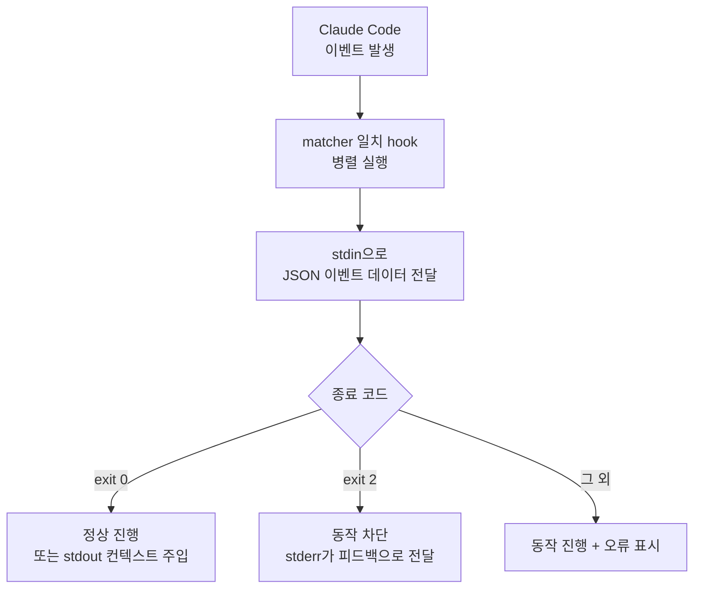

훅(hook)은 Claude Code의 라이프사이클 특정 지점에서 자동으로 실행되는 셸 명령으로, 모델의 판단에 의존하지 않고 "항상 일어나야 하는 동작"을 결정적으로 보장합니다.


**한 줄 요약**: hook은 Claude Code가 파일을 편집하거나 작업을 끝낼 때마다 자동으로 발동하는 "if-this-then-that" 스크립트로, 포매팅·린트·보안 차단을 사람 손 없이 강제합니다.



이 페이지는 개념 소개에 집중합니다. MoAI-ADK가 hook을 실제로 어떻게 등록하고 운영하는지(셸 래퍼 패턴, 이벤트별 동작, 품질 게이트 연동)는 깊이 있는 MoAI-ADK 가이드에서 다룹니다. 손에 잡히는 실전 내용은 [Hooks 가이드](/advanced/hooks-guide)와 [Hooks 이벤트 레퍼런스](/advanced/hooks-reference)를 참고하세요.


## 훅이란

훅은 Claude Code가 도구를 호출하거나, 응답을 끝내거나, 세션을 시작하는 등의 **이벤트** (event)가 발생할 때 실행되는 사용자 정의 셸 명령입니다. 모델이 "린트를 돌려야겠다"고 판단하기를 기다리는 대신, hook은 해당 이벤트가 발생할 때마다 **반드시** 실행됩니다. 이 결정적 실행이 hook의 핵심 가치입니다.

훅은 `settings.json`의 `hooks` 블록에 등록합니다. 각 항목은 어떤 이벤트에 반응할지, 어떤 도구에만 좁힐지(`matcher`), 무엇을 실행할지(`command`)를 정의합니다.

```json
{
  "hooks": {
    "PostToolUse": [
      {
        "matcher": "Edit|Write",
        "hooks": [
          { "type": "command", "command": "jq -r '.tool_input.file_path' | xargs npx prettier --write" }
        ]
      }
    ]
  }
}
```

위 예시는 `Edit` 또는 `Write` 도구로 파일이 수정될 때마다 `prettier`를 자동 실행해 포매팅을 일관되게 유지합니다.

## 주요 이벤트

훅이 반응할 수 있는 이벤트는 30개 이상이며, 다음은 가장 자주 쓰이는 것들입니다.

| 이벤트 | 발동 시점 |
| :--- | :--- |
| `SessionStart` | 세션이 시작되거나 재개될 때 (컨텍스트 주입에 활용) |
| `Setup` | `/init` 또는 `--init` 플래그로 Claude Code를 시작할 때 |
| `UserPromptSubmit` | 사용자가 프롬프트를 제출한 직후, Claude가 처리하기 전 |
| `UserPromptExpansion` | 사용자 입력 명령이 프롬프트로 확장될 때 |
| `PreToolUse` | 도구 호출이 실행되기 직전 (차단 가능) |
| `PermissionRequest` | 권한 대화상자가 나타났을 때 |
| `PostToolUse` | 도구 호출이 성공한 직후 (포매팅·린트에 활용) |
| `PostToolUseFailure` | 도구 호출이 실패했을 때 |
| `SubagentStart` | 서브에이전트가 시작될 때 |
| `SubagentStop` | 서브에이전트가 작업을 마칠 때 |
| `TaskCreated` | 작업이 생성될 때 |
| `TaskCompleted` | 작업이 완료로 표시될 때 |
| `Stop` | Claude가 응답을 끝낼 때 |
| `PreCompact` | 컨텍스트 윈도우 압축 직전 |
| `PostCompact` | 컨텍스트 압축이 완료된 후 |
| `SessionEnd` | 세션이 종료될 때 |

전체 이벤트 목록과 이벤트별 입력 스키마는 공식 [Hooks 레퍼런스](https://code.claude.com/docs/en/hooks)에 정리되어 있습니다.

## 훅이 동작하는 방식

훅은 표준 입력(stdin)·표준 출력(stdout)·표준 오류(stderr)·종료 코드(exit code)로 Claude Code와 통신합니다. 이벤트가 발생하면 Claude Code가 이벤트 정보를 JSON으로 stdin에 전달하고, 스크립트는 그 데이터를 읽어 처리한 뒤 종료 코드로 다음 동작을 지시합니다.



종료 코드 규약은 다음과 같습니다.

| 종료 코드 | 의미 |
| :--- | :--- |
| `0` | 이의 없음. 동작이 정상 진행됩니다. `SessionStart`·`UserPromptSubmit` 등에서는 stdout 내용이 Claude 컨텍스트에 주입됩니다 |
| `2` | 동작 차단. stderr에 쓴 이유가 Claude에게 피드백으로 전달됩니다 |
| 그 외 | 동작은 진행되지만 트랜스크립트에 hook 오류가 표시됩니다 |

더 세밀한 제어가 필요하면 종료 코드 대신 stdout에 구조화된 JSON을 출력해 `permissionDecision`(`allow`/`deny`/`ask`) 같은 결정을 내릴 수 있습니다.

## 어디에 쓰나

훅은 다음처럼 "반드시 일어나야 하는" 작업을 자동화할 때 빛을 발합니다.

- **자동 포매팅** (auto-format): `PostToolUse` + `Edit|Write` matcher로 편집 직후 `prettier`·`gofmt` 실행
- **자동 린트** (lint): 편집 후 린터를 돌려 스타일·정적 분석 위반을 즉시 잡기
- **보안 차단** (security block): `PreToolUse`로 `.env`·`.git/` 같은 보호 파일 편집이나 `rm -rf`·`drop table` 같은 위험 명령을 종료 코드 `2`로 차단
- **알림** (notification): `Notification` 이벤트로 Claude가 입력을 기다릴 때 데스크톱 알림 전송
- **컨텍스트 주입** (context injection): `SessionStart` 또는 압축 후 프로젝트 규칙·최근 작업을 다시 주입

훅 등록 위치(`~/.claude/settings.json` 전역, `.claude/settings.json` 프로젝트, 플러그인·스킬 프런트매터)에 따라 적용 범위가 달라집니다. 결정적 규칙이 아니라 판단이 필요한 경우에는 모델로 평가하는 프롬프트 기반(`type: "prompt"`) 또는 에이전트 기반(`type: "agent"`) hook을 쓸 수도 있습니다.

## MoAI-ADK와 훅

MoAI-ADK는 셸 스크립트 래퍼가 `moai hook <event>` 바이너리를 호출하는 패턴으로 hook을 운영하며, 상태 전이 소유권·sync 단계 품질 게이트·에이전트 팀 작업 완료 검증 등을 hook으로 강제합니다. 이 부분의 실전 등록 방법과 이벤트별 세부 동작은 아래 깊이 있는 가이드에서 다룹니다.

## 관련 문서

- [Hooks 가이드](/advanced/hooks-guide)
- [Hooks 이벤트 레퍼런스](/advanced/hooks-reference)

## 참고 자료

- [Automate workflows with hooks (공식 문서)](https://code.claude.com/docs/en/hooks-guide)
- [Hooks reference (공식 문서)](https://code.claude.com/docs/en/hooks)


hook이 등록됐는데 실행되지 않는다면 Claude Code에서 `/hooks`를 입력해 해당 이벤트 아래에 hook이 보이는지, matcher가 도구 이름과 정확히(대소문자 구분) 일치하는지부터 확인하세요. 스크립트에는 `chmod +x`로 실행 권한을 주는 것도 잊지 마세요.

