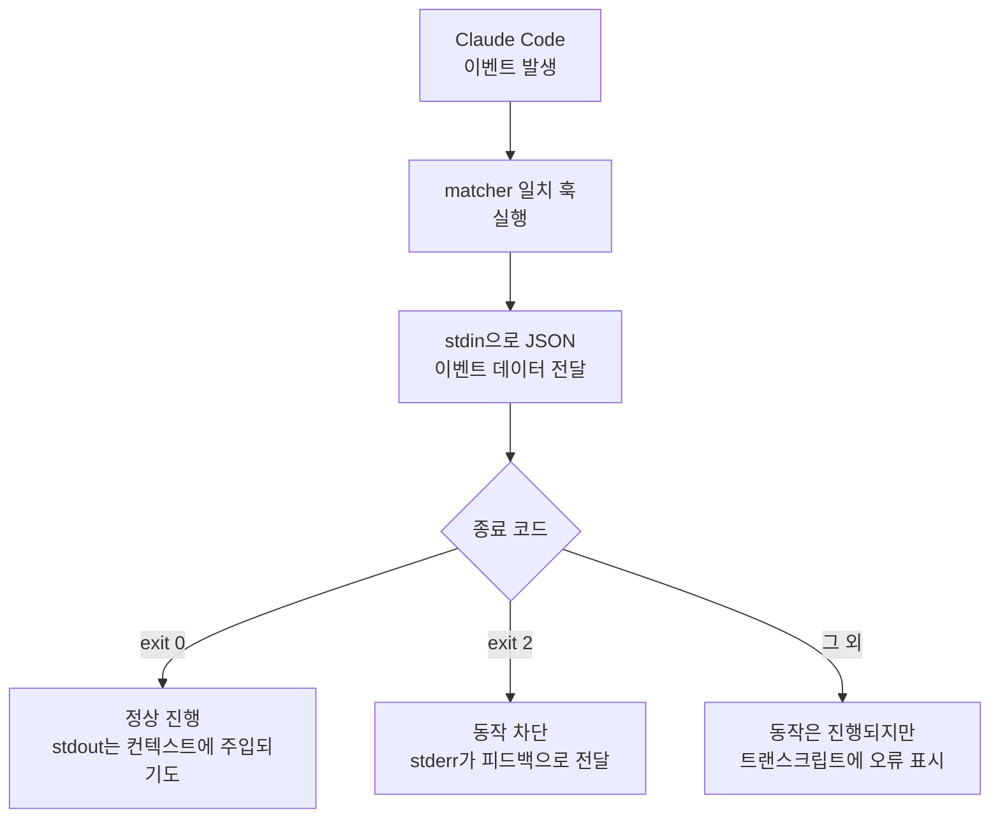
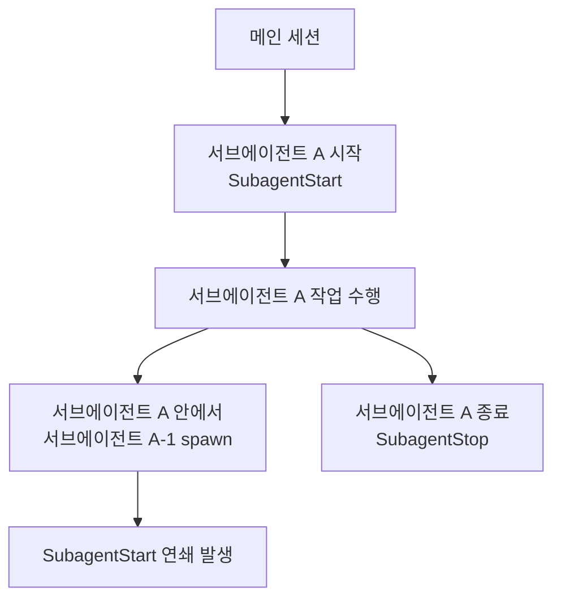

# 훅 (Hooks)

훅(hook)은 Claude Code가 파일을 고치거나 작업을 끝낼 때마다 알아서 발동하는 작은 셸 스크립트입니다. "편집하면 포매팅을 돌려라", "위험한 명령은 막아라" 같은 규칙을 모델이 기억해 주길 바라는 대신, 런타임이 확실히 집행하게 만드는 장치입니다.


이 문서는 MoAI-ADK가 올라타 있는 플랫폼인 **Claude Code 자체**를 다루는 배경 자료입니다. MoAI-ADK가 훅을 어떻게 등록하고 운영하는지는 [훅 가이드](/ko/advanced/hooks-guide)에서 다루고, 이벤트별 입력 스키마는 [훅 이벤트 레퍼런스](/ko/advanced/hooks-reference)에 정리되어 있습니다.



**한 줄 요약**: 훅은 Claude Code의 특정 순간에 무조건 실행되는 "if-this-then-that" 스크립트로, 포매팅·린트·보안 차단을 사람 손을 거치지 않고 강제합니다.



훅은 사람이 다가오면 알아서 열리는 **자동문 센서**와 같습니다. "누군가 가까이 오면 문을 열어라"는 규칙을 누군가가 매번 확인하는 게 아니라, 센서가 조건을 감지하면 기계적으로 작동합니다. Claude Code에서도 "파일이 바뀌면 포매팅을 돌려라"는 규칙을 모델의 판단에 맡기지 않고, 정해진 이벤트가 일어나면 훅이 알아서 실행합니다.


## 훅이 왜 필요한가

AI 에이전트는 자율적으로 돌아갈수록 강력하지만, 동시에 "반드시 지켜야 하는 규칙"이 흐지부지해질 위험도 커집니다. 코드를 고칠 때마다 린터를 돌려야 한다거나, `.env` 파일은 절대 손대면 안 된다거나, 커밋 전에 테스트를 통과해야 한다는 규칙을 모델이 매번 스스로 떠올려 주기를 기대할 수는 없습니다. 모델이 잊거나 "이번엔 괜찮겠지" 넘어가는 순간, 규칙은 무너집니다.

훅은 이 문제를 "기억이 아니라 기계"로 풉니다. 규칙을 모델의 머릿속 지침이 아니라 **런타임이 집행하는 코드**로 옮겨 놓으면, 에이전트가 아무리 오래 자율적으로 돌아도 해당 이벤트가 발생하는 한 훅은 어김없이 실행됩니다. 모델의 판단을 거치지 않고 결정적으로 작동한다는 점이 훅의 핵심 가치입니다. 이 결정적 실행(deterministic enforcement) 덕분에 자율 루프 속에서도 품질 게이트와 안전망이 살아 있습니다.

## 주요 이벤트 한눈에

훅이 반응하는 **이벤트** (event)는 Claude Code의 라이프사이클 곳곳에 자리 잡고 있습니다. 자주 쓰이는 핵심 이벤트는 다음과 같습니다.

| 이벤트 | 발동 시점 | 주로 쓰는 곳 |
| :--- | :--- | :--- |
| `SessionStart` | 세션이 시작되거나 재개될 때 | 프로젝트 규칙·최근 작업 컨텍스트 주입 |
| `UserPromptSubmit` | 사용자가 프롬프트를 제출한 직후, Claude가 처리하기 전 | 프롬프트 보정·추가 컨텍스트 주입 |
| `PreToolUse` | 도구 호출이 실행되기 직전 | 위험 명령·보호 파일 차단 (matcher로 도구 좁힘) |
| `PostToolUse` | 도구 호출이 끝난 직후 | 자동 포매팅·린트·후처리 |
| `PostToolBatch` | 한 번에 몰아서 실행한 도구 묶음이 끝난 뒤 | 배치 단위 후처리·요약 |
| `Stop` | Claude가 응답을 끝내는 턴 종료 시점 | 작업 완료 조건 평가·알림 |
| `SubagentStart` | 서브에이전트가 시작될 때 | 하위 작업 진입 로깅·준비 |
| `SubagentStop` | 서브에이전트가 작업을 마칠 때 | 하위 작업 결과 검증·정리 |
| `PreCompact` | 컨텍스트 윈도우 압축 직전 | 압축 전 중요 상태 보존 |
| `ConfigChange` | 설정(`settings.json` 등)이 바뀌었을 때 | 설정 변경 감지·알림 |

이보다 더 다양한 이벤트가 존재하며, 이벤트별로 stdin으로 들어오는 JSON 스키마가 다릅니다. 전체 목록과 필드 정의는 공식 [Hooks 레퍼런스](https://code.claude.com/docs/en/hooks)를 참고하세요. 

## 훅 등록하기: settings.json

훅은 `settings.json`의 `hooks` 블록에 등록합니다. 구조는 "어떤 이벤트에" → "어떤 도구에 한정할지(`matcher`)" → "무엇을 실행할지(`hooks` 배열)"의 세 단계로 됩니다.

```json
{
  "hooks": {
    "PostToolUse": [
      {
        "matcher": "Edit|Write",
        "hooks": [
          {
            "type": "command",
            "command": "jq -r '.tool_input.file_path' | xargs npx prettier --write"
          }
        ]
      }
    ]
  }
}
```

읽는 순서를 짚어 보겠습니다.

1. **이벤트 키** (`PostToolUse`): 어떤 이벤트에 반응할지 정합니다. 값은 배열입니다.
2. **매처 블록** (`matcher: "Edit|Write"`): 이 이벤트 안에서도 어떤 도구에만 반응할지 좁힙니다. 정규표현식으로, `Edit`이나 `Write` 도구일 때만 발동하라는 뜻입니다. `matcher`를 생략하면 해당 이벤트의 모든 발동에 걸립니다.
3. **훅 배열** (`hooks: [ ... ]`): 실제로 실행할 명령을 담습니다. 각 항목은 `type: "command"`와 실행할 `command`로 이루어집니다. 같은 매처 아래 여러 명령을 넣으면 조건이 맞을 때 병렬로 실행됩니다.

`matcher`가 필요한 이벤트(`PreToolUse`, `PostToolUse`, `PostToolBatch`처럼 도구와 엮인 이벤트)에서는 도구 이름을 정확히(대소문자 구분) 적어야 합니다. 도구 이름과 무관한 이벤트(`Stop`, `SessionStart` 등)에서는 `matcher`를 두지 않습니다.


같은 `hooks` 블록이라도 위치에 따라 적용 범위가 달라집니다. `~/.claude/settings.json`에 두면 모든 프로젝트에, 프로젝트의 `.claude/settings.json`에 두면 해당 프로젝트에만 걸립니다. 플러그인과 스킬의 프론트매터에도 훅을 선언할 수 있어, 배포 단위로 묶어서 가져갈 수도 있습니다.


## 실전 예시: 편집하면 자동으로 포매팅

앞의 예시를 풀어서 보면, `Edit`이나 `Write` 도구로 파일이 수정될 때마다 `prettier`가 자동 실행되어 포매팅을 일관되게 유지합니다. Claude가 포매팅을 "잊지 않겠다"고 약속하는 대신, 파일이 바뀌는 순간 런타임이 확실히 돌려주는 구조입니다.

조금 더 본격적인 셸 핸들러를 직접 만들어 보겠습니다. 다음 스크립트는 `PreToolUse`로 넘어온 Bash 명령을 읽어, `rm -rf` 같은 위험 명령을 차단합니다.

```bash
#!/usr/bin/env bash
# hooks/pre-tool-guard.sh
# stdin으로 들어온 이벤트 JSON에서 도구 입력을 꺼내 위험 명령을 감지한다.

input=$(cat)
tool_input=$(echo "$input" | jq -r '.tool_input.command // empty')

if echo "$tool_input" | grep -qE 'rm[[:space:]]+-rf[[:space:]]*/'; then
  echo "차단: 루트 디렉터리 재귀 삭제 명령은 허용되지 않습니다." >&2
  exit 2   # exit 2 = 동작 차단
fi

exit 0     # exit 0 = 이의 없음, 정상 진행
```

이 스크립트는 `jq`로 이벤트 JSON의 `tool_input.command` 필드를 읽어 `rm -rf /` 패턴을 잡아내고, 잡히면 stderr에 이유를 쓰고 종료 코드 `2`로 빠져나갑니다. `settings.json`에는 이렇게 연결합니다.

```json
{
  "hooks": {
    "PreToolUse": [
      {
        "matcher": "Bash",
        "hooks": [
          { "type": "command", "command": "$CLAUDE_PROJECT_DIR/.claude/hooks/pre-tool-guard.sh" }
        ]
      }
    ]
  }
}
```

스크립트 파일에는 잊지 말고 실행 권한을 줍니다.

```bash
chmod +x .claude/hooks/pre-tool-guard.sh
```

 이제 Claude가 `rm -rf /`가 포함된 명령을 실행하려 들면, 훅이 실행되기 직전에 차단하고 그 이유를 Claude에게 피드백으로 돌려줍니다.

## 훅과 대화하는 방식: stdin, stdout, 종료 코드

훅은 Claude Code와 **표준 스트림**으로 대화합니다. 이벤트가 발생하면 Claude Code가 이벤트 정보를 JSON으로 표준 입력(stdin)에 흘려보내고, 훅은 그 데이터를 읽어 처리한 뒤 **종료 코드** (exit code)로 다음 동작을 지시합니다.


```mermaid
flowchart TD
    A[Claude Code<br/>이벤트 발생] --> B[matcher 일치 훅<br/>실행]
    B --> C[stdin으로 JSON<br/>이벤트 데이터 전달]
    C --> D{종료 코드}
    D -->|exit 0| E[정상 진행<br/>stdout는 컨텍스트에 주입되기도]
    D -->|exit 2| F[동작 차단<br/>stderr가 피드백으로 전달]
    D -->|그 외| G[동작은 진행되지만<br/>트랜스크립트에 오류 표시]
```

종료 코드 규약은 단순하지만 강력합니다.

| 종료 코드 | 의미 |
| :--- | :--- |
| `0` | 이의 없음. 동작이 정상 진행됩니다. `SessionStart`·`UserPromptSubmit` 같은 이벤트에서는 stdout에 쓴 내용이 Claude의 컨텍스트로 주입됩니다. |
| `2` | 동작 차단. stderr에 쓴 이유가 Claude에게 피드백으로 전달되어, Claude가 왜 막혔는지 알고 다른 길을 찾습니다. |
| 그 외 | 동작은 진행되지만 트랜스크립트에 훅 오류가 표시됩니다. 치명적이지 않은 경고 용도로 씁니다. |

이 규약의 좋은 점은 훅 스크립트가 그저 "보통의 셸 스크립트"라는 것입니다. `jq`로 JSON을 파싱하고, `grep`으로 조건을 검사하고, `exit 0`/`exit 2`로 판결을 내리는 일반적인 셸 프로그래밍으로 전체 훅이 완성됩니다.

## JSON decision 블록으로 더 정밀하게

종료 코드만으로 부족할 때는 stdout에 **구조화된 JSON**을 출력해 더 정밀한 결정을 내릴 수 있습니다. 이 방식을 쓰면 "허용한다/거부한다/사용자에게 묻는다" 같은 세 가지 결정을 직접 지시할 수 있습니다.

```json
{
  "hookSpecificOutput": {
    "hookEventName": "PreToolUse",
    "permissionDecision": "deny",
    "permissionDecisionReason": ".env 파일은 보호 대상이라 편집할 수 없습니다."
  }
}
```

`permissionDecision`에 들어갈 수 있는 값은 세 가지입니다.

| 값 | 의미 |
| :--- | :--- |
| `allow` | 권한 프롬프트 없이 도구 실행을 허용합니다. |
| `deny` | 실행을 거부하고, 이유를 Claude에게 알립니다. |
| `ask` | 사용자에게 권한을 묻는 대화상자를 띄웁니다. |

단순히 "막는다"를 넘어 "이건 안전하니 승인 절차를 생략한다"(`allow`)까지 제어할 수 있어, 반복되는 안전한 명령의 프롬프트를 줄이는 데도 쓰입니다. 참고로 stdout JSON은 훅이 종료 코드 `0`으로 끝날 때 의미 있게 해석되므로, JSON으로 결정을 내릴 때는 스크립트가 `exit 0`으로 마무리되게 하세요.

## 타임아웃: 5초 안에 끝내야 한다

훅은 빠르게 끝나야 합니다. 기본 **타임아웃** (timeout)은 5초로, 이 시간 안에 종료되지 않으면 훅은 실패로 간주됩니다. 포매팅이나 간단한 검사처럼 가벼운 작업이라면 충분하지만, 무거운 작업을 돌려야 한다면 시간을 늘려야 합니다.

`timeout` 필드로 최대 60초까지 연장할 수 있습니다. 단위는 밀리초입니다.

```json
{
  "hooks": {
    "PostToolUse": [
      {
        "matcher": "Edit|Write",
        "hooks": [
          {
            "type": "command",
            "command": "make lint-full",
            "timeout": 60000
          }
        ]
      }
    ]
  }
}
```


타임아웃을 길게 잡더라도, 훅이 매 편집마다 수십 초씩 걸리면 Claude의 작업 흐름이 끊겨 생산성이 뚝 떨어집니다. 무거운 검사는 `PostToolBatch`로 묶어서 돌리거나, `Stop` 시점으로 미루는 편이 낫습니다. 


## 서브에이전트 훅: SubagentStart / SubagentStop

Claude Code가 서브에이전트를 띄우거나 거둘 때 `SubagentStart`와 `SubagentStop` 이벤트가 발생합니다. 이 훅들은 하위 작업의 진입과 종료를 관찰하고, 결과를 검증하거나 정리하는 데 쓰입니다.

최근 Claude Code의 변화가 이 훅들과 어떻게 맞닿아 있는지 정리합니다.

- **서브에이전트 이름 표시** (v2.1.186 이후): `SubagentStart`·`SubagentStop` 훅이 받는 이벤트 데이터에 어느 서브에이전트가 시작·종료되는지 이름이 포함됩니다. 여러 서브에이전트가 섞여 돌아가는 환경에서 "이 작업은 누가 맡았는지" 추적하기 훨씬 쉬워졌습니다.
- **백그라운드 실행 기본값** (v2.1.198 이후): 서브에이전트는 기본적으로 백그라운드에서 돕니다. 하지만 권한 프롬프트는 여전히 메인 세션에 표시되고, `SubagentStart`·`SubagentStop` 훅도 백그라운드 실행 여부와 상관없이 정상적으로 발동합니다.
- **중첩 spawn 기본 허용** (v2.1.219 이후): 서브에이전트는 기본적으로 깊이 3까지 중첩해서 다른 서브에이전트를 spawn할 수 있습니다. 즉 `SubagentStart`가 서브에이전트 안에서 또 서브에이전트가 뜰 때도 연쇄적으로 발생합니다. 이 중첩을 끄려면 환경변수 `CLAUDE_CODE_MAX_SUBAGENT_SPAWN_DEPTH=1`을 설정합니다.


```mermaid
flowchart TD
    A[메인 세션] --> B[서브에이전트 A 시작<br/>SubagentStart]
    B --> C[서브에이전트 A 작업 수행]
    C --> D[서브에이전트 A 안에서<br/>서브에이전트 A-1 spawn]
    D --> E[SubagentStart 연쇄 발생]
    C --> F[서브에이전트 A 종료<br/>SubagentStop]
```


평가자와 권한 통제는 에이전트의 판단 바깥에 두어야 한다는 하네스 설계 원칙에서, 서브에이전트 훅은 "에이전트가 스스로를 검사하게 두지 말고 루프 바깥에서 검사하라"는 요구의 자연스러운 구현체입니다. 작업이 끝난 서브에이전트의 결과를 `SubagentStop`에서 검증하면, 모델의 자기 보고를 맹신하지 않고도 하위 작업의 품질을 장담할 수 있습니다.


## 어디에 쓰나

훅은 "반드시 일어나야 하는" 작업을 자동화할 때 빛을 발합니다. 대표적인 활용처는 다음과 같습니다.

- **자동 포매팅** (auto-format): `PostToolUse` + `Edit|Write` matcher로 편집 직후 `prettier`·`gofmt`를 돌려 스타일을 일관되게 유지합니다.
- **자동 린트** (lint): 편집 후 린터를 돌려 스타일·정적 분석 위반을 즉시 잡아냅니다.
- **보안 차단** (security block): `PreToolUse`로 `.env`·`.git/` 같은 보호 파일 편집이나 `rm -rf`·`drop table` 같은 위험 명령을 종료 코드 `2`로 차단합니다.
- **컨텍스트 주입** (context injection): `SessionStart`로 프로젝트 규칙과 최근 작업을 새 세션에 다시 주입하거나, `PreCompact` 직전에 중요 상태를 보존합니다.
- **작업 완료 검증** (completion verify): `Stop`에서 턴 종료 조건을 평가해 작업이 정말 끝났는지 기계적으로 확인합니다.
- **하위 작업 관찰** (subagent observe): `SubagentStart`·`SubagentStop`으로 서브에이전트의 진입·종료를 로깅하고 결과를 검증합니다.

판단이 명확하고 기계적으로 검사할 수 있는 일이라면 훅이 적격입니다. 반면 "이 코드가 좋은지 나쁜지"처럼 판단이 필요한 일이라면, 모델이 평가하는 프롬프트 기반(`type: "prompt"`)이나 에이전트 기반(`type: "agent"`) 훅을 고려할 수 있습니다.

## MoAI-ADK와 훅

MoAI-ADK는 셸 스크립트 래퍼가 `moai hook <event>` 바이너리를 호출하는 패턴으로 훅을 운영하며, 상태 전이 소유권·sync 단계 품질 게이트·에이전트 팀 작업 완료 검증 등을 훅으로 강제합니다.

하네스 엔지니어링 관점에서 훅은 "평가자와 권한 컨트롤은 에이전트의 판단 밖에 두라"는 원칙의 구현체입니다. 모델이 규칙을 기억해 주길 바라는 대신 런타임이 규칙을 집행하므로, 자율 루프가 아무리 오래 돌아도 품질 게이트는 결정적으로 작동합니다. MoAI-ADK의 `/goal` 자율 실행과 자가 진화 하네스가 안전할 수 있는 이유도, Stop 훅 기반 조건 평가와 사용자 승인 게이트가 루프 바깥에서 훅으로 강제되기 때문입니다. 실전 등록 방법과 이벤트별 세부 동작은 아래 깊이 있는 가이드에서 다룹니다.

## 관련 문서

- [훅 가이드](/ko/advanced/hooks-guide)
- [훅 이벤트 레퍼런스](/ko/advanced/hooks-reference)

## 참고 자료

- [Automate workflows with hooks (공식 문서)](https://code.claude.com/docs/en/hooks-guide)
- [Hooks reference (공식 문서)](https://code.claude.com/docs/en/hooks)


훅이 등록됐는데 실행되지 않는다면, Claude Code에서 `/hooks`를 입력해 해당 이벤트 아래에 훅이 보이는지부터 확인하세요. 그 다음으로 살필 것은 `matcher`가 도구 이름과 정확히(대소문자 구분) 일치하는지, 그리고 스크립트에 `chmod +x`로 실행 권한이 있는지입니다. 흔한 원인 세 가지가 대부분 이 안에 있습니다. 

