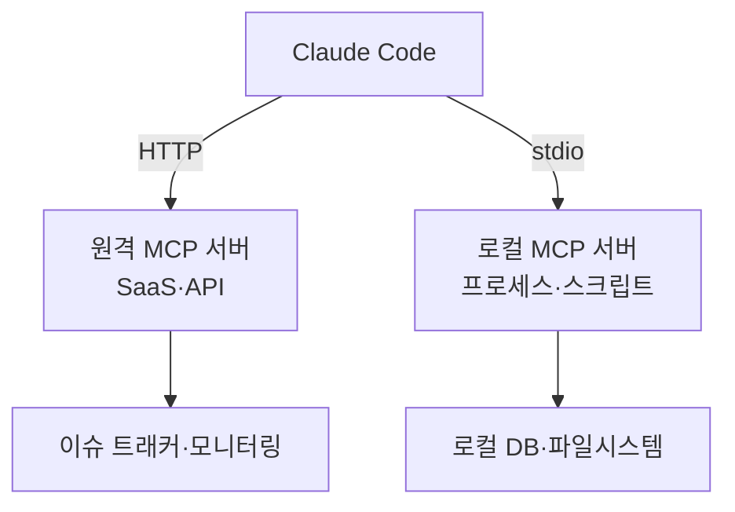

Claude Code는 MCP를 통해 이슈 트래커, 데이터베이스, 모니터링 대시보드 같은 외부 시스템을 표준화된 방식으로 연결해 직접 읽고 조작할 수 있습니다.


**한 줄 요약**: MCP는 다른 도구의 데이터를 복사해 붙여넣던 작업을 없애고, Claude Code가 외부 시스템을 직접 다루게 해 주는 "AI-도구 연결의 표준 콘센트"입니다.



이 페이지는 개념 개요입니다. 실제 서버 등록, 인증, MoAI-ADK 워크플로우에서의 활용 방법은 [MCP 서버 활용 가이드](/advanced/mcp-servers)에서 실습 중심으로 자세히 다룹니다.


## MCP란 무엇인가

MCP (Model Context Protocol)는 AI와 외부 도구를 잇는 **오픈소스 표준 프로토콜** 입니다. 모델 제조사나 도구 종류에 상관없이 동일한 규약으로 연결되므로, 한 번 만든 MCP 서버는 여러 AI 클라이언트에서 재사용할 수 있습니다.

MCP 서버는 Claude Code에 도구·데이터·API 접근 권한을 부여합니다. 연결해 두면 Claude가 다음과 같은 일을 직접 처리합니다.

| 시나리오 | MCP 없이 | MCP 연결 후 |
| --- | --- | --- |
| 이슈 기반 기능 구현 | 이슈 내용을 복사해 붙여넣기 | 이슈 트래커에서 직접 읽고 PR 생성 |
| 모니터링 분석 | 대시보드 스크린샷 첨부 | Sentry 등에서 직접 오류 조회 |
| DB 질의 | 쿼리 결과를 수동 전달 | PostgreSQL 스키마·데이터 직접 조회 |

> 외부 콘텐츠를 가져오는 서버는 프롬프트 인젝션 위험이 있으므로, 연결 전에 신뢰할 수 있는 서버인지 반드시 확인합니다.

## 서버 유형 (전송 방식)

MCP 서버는 Claude Code와 통신하는 **전송 방식** 에 따라 나뉩니다. HTTP가 권장되며, 레거시 SSE는 사용이 중단되었습니다.

| 전송 방식 | 위치 | 적합한 용도 | 비고 |
| --- | --- | --- | --- |
| HTTP | 원격 | 클라우드 SaaS 연동 | 권장 (OAuth 2.0 지원) |
| stdio | 로컬 프로세스 | 시스템 접근·커스텀 스크립트 | 자동 재연결 없음 |
| SSE | 원격 | 레거시 원격 연결 | 사용 중단, HTTP로 대체 |
| WebSocket | 원격 | 서버가 이벤트를 밀어 넣는 경우 | HTTP 또는 stdio 우선 추천 |



### 설치 개요

서버 추가는 `claude mcp add` 계열 명령으로 수행합니다. 모든 옵션은 서버 이름 **앞** 에 두고, stdio의 경우 `--`로 실행 명령을 구분합니다.

```bash
# 원격 HTTP 서버 추가 (권장)
claude mcp add --transport http notion https://mcp.notion.com/mcp

# 로컬 stdio 서버 추가 (-- 뒤가 실행 명령)
claude mcp add --transport stdio --env API_KEY=YOUR_KEY airtable \
  -- npx -y airtable-mcp-server

# 등록 현황 확인
claude mcp list
```

`--scope` 플래그로 설정 저장 범위를 지정합니다. `local` (기본, 나만·현재 프로젝트), `project` (`.mcp.json`으로 팀 공유), `user` (모든 프로젝트)의 세 단계가 있으며, 같은 이름이 여러 곳에 있으면 local > project > user 순으로 우선합니다.

## 서버가 노출하는 것: 도구·리소스·프롬프트

MCP 서버는 세 가지 종류의 기능을 Claude Code에 제공합니다.

| 노출 대상 | 역할 | Claude Code에서 사용하는 법 |
| --- | --- | --- |
| 도구 (tools) | Claude가 호출하는 동작·함수 | 작업 중 자동 호출 |
| 리소스 (resources) | 참조 가능한 데이터·문서 | `@서버:protocol://경로` 멘션 |
| 프롬프트 (prompts) | 미리 정의된 명령 | `/mcp__서버명__프롬프트명` |

예를 들어 리소스는 파일처럼 `@` 멘션으로 끌어올 수 있습니다.

```text
@github:issue://123 을 분석하고 수정안을 제안해줘
```

세션 안에서 `/mcp` 명령을 실행하면 연결된 서버 목록과 각 서버의 도구 개수, OAuth 인증 상태를 확인할 수 있습니다. 인증이 필요한 원격 서버는 `/mcp`에서 브라우저 OAuth 흐름으로 로그인합니다.

> 도구 검색 (Tool Search)이 기본 활성화되어 있어 MCP 도구 정의는 필요할 때까지 컨텍스트 윈도우에 올라가지 않습니다. 서버를 많이 연결해도 컨텍스트 부담이 적습니다.

## MoAI-ADK에서의 활용

MoAI-ADK는 `mcp__context7` 같은 문서 조회 MCP를 워크플로우에 통합해 사용합니다. 서버 등록 절차, 인증 패턴, 스코프 선택, 그리고 MoAI 에이전트가 MCP 도구를 어떻게 호출하는지 등 실전 내용은 별도 심화 가이드에 정리되어 있습니다. 이 페이지에서 개념을 잡았다면 다음 단계로 그 가이드를 참고하시기 바랍니다.

## 관련 문서

- [MCP 서버 활용 가이드](/advanced/mcp-servers)

## 참고 자료

- [Connect Claude Code to tools via MCP](https://code.claude.com/docs/en/mcp)


처음에는 신뢰할 수 있는 서버 1~2개만 `local` 스코프로 추가해 동작을 확인하고, 팀과 공유할 가치가 검증되면 `--scope project`로 옮겨 `.mcp.json`을 버전 관리에 포함하는 것을 권장합니다.

