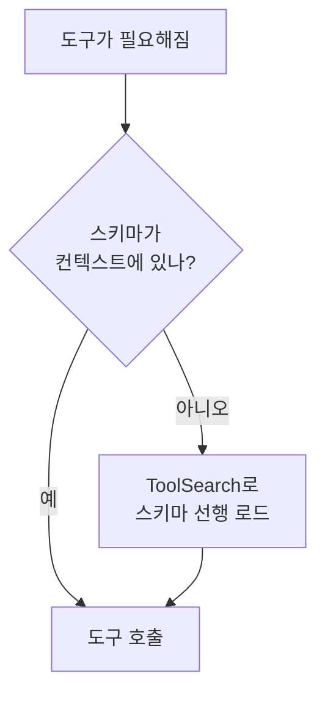

# MCP 통합

MCP (Model Context Protocol)는 외부 도구와 데이터 소스를 Claude에 꽂아 쓰기 위한 표준 커넥터입니다. 이 페이지는 그 개념과 등록 방법을 개요 수준에서 정리합니다.


**한 줄 요약**: MCP는 AI를 위한 **USB 포트**입니다. 데이터베이스, 이슈 트래커, 브라우저처럼 저마다 다른 외부 도구를 하나의 표준 규격으로 Claude에 연결하면 도구마다 별도의 통합 코드를 짜지 않고도 같은 방식으로 꽂아 쓸 수 있습니다.


## MCP란

MCP는 AI 애플리케이션이 외부 시스템에 연결하는 방식을 표준화한 오픈 프로토콜입니다. 기기마다 다른 케이블 대신 USB-C 하나로 여러 주변기기를 연결하듯 MCP는 서로 다른 외부 도구를 **하나의 규격**으로 Claude에 연결합니다.

연결된 MCP 서버는 Claude에게 세 가지를 제공할 수 있습니다.

| 제공물 | 설명 |
|--------|------|
| 도구 (Tools) | Claude가 호출할 수 있는 동작 (예: 쿼리 실행, 이슈 생성) |
| 리소스 (Resources) | Claude가 읽을 수 있는 데이터 (예: 파일, 레코드) |
| 프롬프트 (Prompts) | 재사용 가능한 프롬프트 템플릿 |

이 표준 덕분에 도구를 새로 붙일 때마다 통합 로직을 다시 작성하지 않아도 됩니다.  한 번 표준을 따르면 그 표준을 지원하는 모든 도구가 같은 문을 통해 들어옵니다.

## 서버 등록

MCP 서버는 두 가지 방법으로 등록합니다.

- **CLI**: `claude mcp add <이름> <실행 명령>` 로 서버를 추가합니다.
- **설정 파일**: 프로젝트 루트의 `.mcp.json` 에 서버 정의를 직접 작성합니다.

```json
{
  "mcpServers": {
    "example": {
      "command": "npx",
      "args": ["-y", "@example/mcp-server"]
    }
  }
}
```

등록한 서버 상태는 세션 안에서 `/mcp` 명령으로 확인하고 인증할 수 있습니다.

### 스코프

같은 서버라도 어디에 등록하느냐에 따라 적용 범위가 달라집니다.

| 스코프 | 적용 범위 |
|--------|-----------|
| `user` | 내 모든 프로젝트 |
| `project` | 현재 프로젝트 (팀과 공유, 버전 관리에 포함) |
| `local` | 현재 프로젝트의 내 로컬 세션 (공유되지 않음) |

팀과 나눌 서버는 `project` 스코프로, 개인 자격 증명이 필요한 서버는 `local` 스코프로 두는 것이 일반적입니다.

### 전송 타입

MCP 서버는 Claude와 통신하는 방식(transport)에 따라 나뉩니다.

| 타입 | 동작 개요 |
|------|-----------|
| stdio | 로컬 프로세스를 실행하고 표준 입출력으로 통신 |
| HTTP | 원격 엔드포인트에 네트워크로 연결 |

로컬 도구는 대개 stdio, 원격 SaaS 도구는 HTTP를 씁니다.

## 지연 로드와 Tool Search

MCP 서버를 여러 개 연결하면 도구 정의가 그만큼 늘어납니다. 도구 정의를 전부 컨텍스트에 상시 로드하면 첫 프롬프트를 보내기도 전에 [컨텍스트 윈도우](/ko/claude-code/context-memory/context-window)가 채워집니다.

그래서 Claude Code는 도구 정의를 **기본적으로 지연 로드** (deferred load)합니다. 도구의 전체 스키마는 실제로 그 도구가 필요할 때만 불러오고 평소에는 짧은 메타데이터만 컨텍스트에 둡니다. 이 지연 도구를 실제로 호출하려면 먼저 스키마를 활성 컨텍스트로 불러오는 선행 단계가 필요합니다.

MoAI-ADK는 이 메커니즘을 HARD 규율로 끌어올립니다. 지연 도구(예: `AskUserQuestion`)를 호출하기 전에는 반드시 `ToolSearch` 로 스키마를 먼저 로드해야 하며 이 선행 절차를 건너뛰면 도구 호출이 검증 오류로 거부됩니다. 자세한 규칙은 `.claude/rules/moai/core/askuser-protocol.md` 의 ToolSearch Preload 절차에 나와 있습니다.


```mermaid
flowchart TD
    A[도구가 필요해짐] --> B{스키마가<br/>컨텍스트에 있나?}
    B -->|아니오| C[ToolSearch로<br/>스키마 선행 로드]
    B -->|예| D[도구 호출]
    C --> D
```

## 캐싱과의 상호작용

MCP 서버를 연결하거나 해제하면 컨텍스트 앞부분(프리픽스)에 놓이는 도구 정의 집합이 바뀝니다. 프리픽스가 달라지면 [프롬프트 캐싱](/ko/claude-code/context-memory/prompt-caching)의 재사용이 그 지점부터 무효화되므로 서버 구성은 세션 초반에 정해 두는 편이 캐시 효율에 유리합니다.

## MoAI-ADK의 MCP 운용

MoAI-ADK는 MCP 서버를 **기본으로 프로비저닝하지 않습니다**. 대신 외부 자료가 필요할 때는 내장 `WebSearch` / `WebFetch` 로 공식 문서와 모범 사례를 조회하는 폴백 전략을 씁니다 (`.claude/rules/moai/core/agent-common-protocol.md` § MCP Fallback Strategy). 아키텍처·분석 품질이 MCP 가용성에 의존하지 않게 하려는 설계입니다.

한 가지 예외는 백엔드 라우팅입니다. `moai glm` 또는 `moai cg` 의 GLM 패널에서 실행할 때는 웹 검색과 웹 조회가 내장 도구 대신 z.ai MCP 도구로 라우팅됩니다 (`.claude/rules/moai/core/glm-web-tooling.md`). 어떤 백엔드에서든 검색·조회 능력 자체는 유지되며 경로만 달라집니다.

## 관련 문서

- [스킬](/ko/claude-code/extensibility/skills)
- [훅 (Hooks)](/ko/claude-code/extensibility/hooks)
- [컨텍스트 윈도우](/ko/claude-code/context-memory/context-window)

## 참고 자료

- [Claude Code Docs — MCP](https://code.claude.com/docs/en/mcp)


새 MCP 서버는 세션을 시작할 때 함께 정해 두세요. 세션 도중에 서버를 붙이거나 떼면 도구 정의 프리픽스가 바뀌어 그 지점부터 프롬프트 캐시가 무효화되고 이후 턴마다 프리픽스를 다시 처리하게 됩니다.

