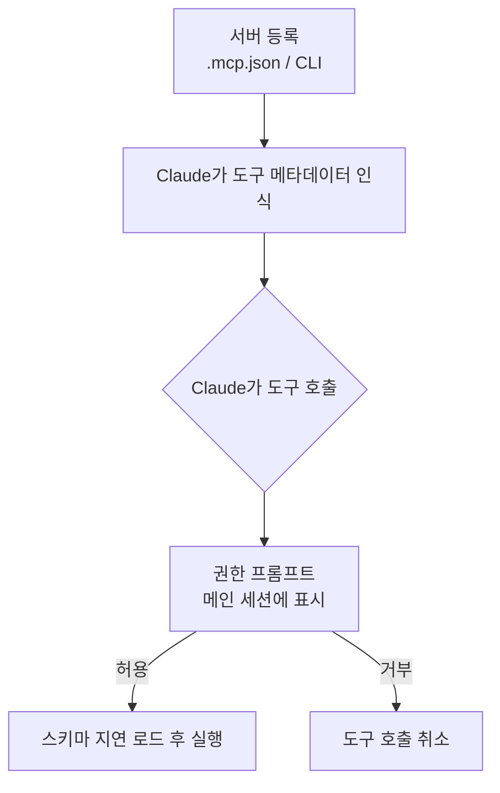
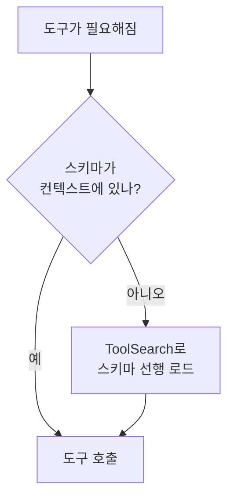

# MCP 통합

MCP(Model Context Protocol)는 외부 도구와 데이터 소스를 Claude에 꽂아 쓰는 표준 규격입니다. 데이터베이스, 이슈 트래커, 브라우저처럼 저마다 연결법이 다른 도구를 하나의 포맷으로 묶어, 도구를 바꿀 때마다 통합 코드를 새로 짜는 수고를 덜어줍니다.


이 문서는 MoAI-ADK가 올라타 있는 플랫폼인 **Claude Code 자체**를 다루는 배경 자료입니다. MoAI-ADK 자체 기능은 사이드바 위쪽 섹션에서 다룹니다.



**한 줄 요약**: MCP는 AI를 위한 **USB 포트**입니다. 데이터베이스, 이슈 트래커, 브라우저처럼 저마다 다른 외부 도구를 하나의 표준 규격으로 Claude에 연결하면 도구마다 별도의 통합 코드를 짜지 않고도 같은 방식으로 꽂아 쓸 수 있습니다.


## MCP란

MCP는 AI 애플리케이션이 외부 시스템에 연결하는 방식을 표준화한 오픈 프로토콜입니다. 기기마다 다른 케이블 대신 USB-C 하나로 여러 주변기기를 연결하듯, MCP는 서로 다른 외부 도구를 **하나의 규격**으로 Claude에 연결합니다.

연결된 MCP 서버는 Claude에게 세 가지를 제공할 수 있습니다. 이 세 가지를 MCP의 **프리미티브** (primitive, 기본 구성 요소)라고 부릅니다.

| 프리미티브 | 하는 일 | 예시 |
|--------|------|------|
| 도구 (Tools) | Claude가 **호출**해 어떤 동작을 일으킨다 | 쿼리 실행, 이슈 생성, 파일 검색 |
| 리소스 (Resources) | Claude가 **읽을 수 있는** 데이터를 제공한다 | 로그 파일, 데이터베이스 레코드, API 응답 |
| 프롬프트 (Prompts) | 자주 쓰는 **프롬프트 템플릿**을 재사용한다 | "코드 리뷰", "버그 재현" 같은 정형 지시 |

도구는 "무언가 하고" 리소스는 "무언가를 보여주고" 프롬프트는 "어떻게 물어볼지"를 담당합니다. 이 표준을 한 번 따르면 그 규격을 지원하는 모든 도구가 같은 문을 통해 들어옵니다.  새 도구를 붙일 때마다 통합 로직을 다시 짜지 않아도 되는 이유입니다.

## 서버 등록

MCP 서버는 크게 두 가지 방법으로 등록합니다.

- **CLI**: `claude mcp add <이름> <실행 명령>`으로 서버를 추가합니다. 한 번 실행하면 설정 파일에 해당 항목이 기록됩니다.
- **설정 파일**: 프로젝트 루트의 `.mcp.json`에 서버 정의를 직접 씁니다. 팀과 함께 쓸 서버는 이 파일을 버전 관리에 넘겨 공유합니다.

아래 예시는 로컬 도구(stdio)와 원격 도구(HTTP)를 함께 둔 `.mcp.json`입니다. 전송 타입에 따라 적는 항목이 다릅니다.

```json
{
  "mcpServers": {
    "local-db": {
      "command": "npx",
      "args": ["-y", "@example/db-mcp-server"]
    },
    "remote-api": {
      "type": "http",
      "url": "https://mcp.example.com/sse"
    }
  }
}
```

### 스코프

같은 서버라도 **어디에** 등록하느냐에 따라 적용 범위가 달라집니다. 이 범위를 스코프(scope)라고 합니다.

| 스코프 | 적용 범위 |
|--------|-----------|
| `user` | 내 모든 프로젝트 |
| `project` | 현재 프로젝트 (팀과 공유, 버전 관리에 포함) |
| `local` | 현재 프로젝트의 내 로컬 세션 (공유되지 않음) |

팀과 나눌 서버는 `project` 스코프로 `.mcp.json`에 두고, 개인 자격 증명이 들어가는 서버는 `local` 스코프로 두는 것이 일반적입니다. `user` 스코프는 내 어디서든 쓰는 공통 도구를 올려 두는 자리입니다.

### 전송 타입

MCP 서버는 Claude와 통신하는 방식, 즉 **전송** (transport)에 따라 세 종류로 나뉩니다.

| 타입 | 동작 개요 | 언제 쓰나 |
|------|-----------|-----------|
| stdio | 로컬 프로세스를 실행하고 표준 입출력으로 통신 | 로컬에 설치된 도구 |
| SSE | 원격 엔드포인트에 연결해 서버가 이벤트를 밀어 넣는다 | 원격 SaaS 도구 (HTTP 기반) |
| HTTP | 원격 엔드포인트와 단일 엔드포인트로 스트리밍 통신 | 최신 원격 도구 (streamable HTTP) |

로컬 도구는 대개 stdio로, 원격 도구는 SSE나 HTTP로 연결합니다. SSE는 오랫동안 쓰이던 원격 방식이고, 최근에는 단일 엔드포인트로 동작하는 streamable HTTP가 표준으로 자리 잡고 있습니다. 어느 쪽이든 Claude 입장에서는 같은 프리미티브(도구·리소스·프롬프트)로 보이므로, 쓰는 쪽에서 전송 타입을 크게 의식하지 않아도 됩니다.

## /mcp 명령과 인증

등록한 서버의 연결 상태는 세션 안에서 `/mcp` 명령으로 확인합니다. 이 명령 하나로 어떤 서버가 연결됐는지, 도구를 얼마나 찾았는지, 인증이 필요한지를 한눈에 볼 수 있습니다.

원격 서버(HTTP·SSE) 가운데 로그인이 필요한 것은 **OAuth**로 인증합니다. `/mcp` 명령은 v2.1.186부터 OAuth 인증 관리까지 맡아서, 브라우저를 띄워 로그인 절차를 밟고 토큰을 받아 연결을 완성합니다. 토큰이 만료되면 같은 명령으로 다시 인증하면 됩니다.


**버전 참고**: `/mcp`의 OAuth 인증 관리는 Claude Code v2.1.186부터 제공됩니다. 그 이전 버전에서는 서버 상태 확인만 지원되므로, 원격 서버 인증이 필요하다면 버전을 올려 주세요.


## 권한과 승인

MCP 도구는 Claude의 일반 도구와 같은 **권한 게이트**를 통과합니다. Claude가 처음으로 어떤 MCP 도구를 부르려 하면, 다른 도구처럼 승인 프롬프트가 메인 세션에 뜹니다. 허용하면 이후 같은 도구는 다시 묻지 않고 쓸 수 있습니다.

매번 묻는 게 번거로우면 미리 허용 목록에 올려 둘 수 있습니다. `settings.json`의 `permissions.allow`에 도구 패턴을 적으면 됩니다.

```json
{
  "permissions": {
    "allow": [
      "mcp__local-db__query",
      "mcp__remote-api__*"
    ]
  }
}
```

`mcp__<서버이름>__<도구이름>` 형태가 MCP 도구의 식별자입니다. `*`를 쓰면 한 서버의 도구 전체를 한꺼번에 허용합니다. 신뢰하는 도구만 골라 허용하고, 민감한 동작(예: 결제, 삭제)을 하는 도구는 매번 묻도록 두는 것이 안전합니다.

MCP 서버는 밖의 세계와 닿아 있으므로, 어떤 서버를 연결하고 어떤 도구를 허용할지는 곧 Claude에게 어떤 권한을 주는지와 같습니다. 처음 보는 서버는 최소한의 도구만 허용하면서 늘려 가는 걸 권합니다.


```mermaid
flowchart TD
    A[서버 등록<br/>.mcp.json / CLI] --> B[Claude가 도구 메타데이터 인식]
    B --> C{Claude가 도구 호출}
    C --> D[권한 프롬프트<br/>메인 세션에 표시]
    D -->|허용| E[스키마 지연 로드 후 실행]
    D -->|거부| F[도구 호출 취소]
```

## 지연 로드와 Tool Search

MCP 서버를 여러 개 연결하면 도구 정의가 그만큼 늘어납니다. 도구 정의를 전부 컨텍스트에 상시 로드하면 첫 프롬프트를 보내기도 전에 [컨텍스트 윈도우](/ko/claude-code/context-memory/context-window)가 채워집니다.

그래서 Claude Code는 MCP 도구 정의를 **기본적으로 지연 로드** (deferred load)합니다. 도구의 전체 스키마는 실제로 그 도구가 필요할 때만 불러오고, 평소에는 짧은 메타데이터만 컨텍스트에 둡니다. 덕분에 서버를 열 개쯤 연결해도 평소 컨텍스트 비용은 거의 늘지 않습니다. 다만 이 지연 도구를 실제로 호출하려면, 먼저 스키마를 활성 컨텍스트로 불러오는 선행 단계가 필요합니다.


```mermaid
flowchart TD
    A[도구가 필요해짐] --> B{스키마가<br/>컨텍스트에 있나?}
    B -->|아니오| C[ToolSearch로<br/>스키마 선행 로드]
    B -->|예| D[도구 호출]
    C --> D
```

MoAI-ADK는 이 메커니즘을 HARD 규율로 끌어올립니다. 지연 도구(예: `AskUserQuestion`)를 호출하기 전에는 반드시 `ToolSearch`로 스키마부터 불러와야 합니다. 이 절차를 건너뛰면 도구 호출이 검증 오류로 거부됩니다. 자세한 규칙은 `.claude/rules/moai/core/askuser-protocol.md`의 ToolSearch Preload 절차에 나와 있습니다.

## 캐싱과의 상호작용

MCP 서버를 연결하거나 해제하면 컨텍스트 앞부분(프리픽스)에 놓이는 도구 정의 집합이 바뀝니다. 프리픽스가 달라지면 [프롬프트 캐싱](/ko/claude-code/context-memory/prompt-caching)의 재사용이 그 지점부터 무효화되므로, 서버 구성은 세션 초반에 정해 두는 편이 캐시 효율에 유리합니다.

## MoAI-ADK의 MCP 운용

MoAI-ADK는 MCP 서버를 **기본으로 프로비저닝하지 않습니다**. 대신 외부 자료가 필요하면 내장 `WebSearch` / `WebFetch`로 공식 문서와 모범 사례를 찾아보는 폴백 전략을 씁니다(`.claude/rules/moai/core/agent-common-protocol.md` § MCP Fallback Strategy). 아키텍처와 분석 품질이 MCP 가용성에 매이지 않게 하려는 설계입니다.

한 가지 예외는 백엔드 라우팅입니다. `moai glm`이나 `moai cg`의 GLM 패널에서 실행하면 웹 검색과 웹 조회가 내장 도구 대신 z.ai MCP 도구로 넘어갑니다(`.claude/rules/moai/core/glm-web-tooling.md`). 어느 백엔드든 검색·조회 능력 자체는 그대로이고 경로만 바뀝니다.

## 관련 문서

- [스킬](/ko/claude-code/extensibility/skills)
- [훅 (Hooks)](/ko/claude-code/extensibility/hooks)
- [컨텍스트 윈도우](/ko/claude-code/context-memory/context-window)
- [프롬프트 캐싱](/ko/claude-code/context-memory/prompt-caching)

## 참고 자료

- [Claude Code Docs — MCP](https://code.claude.com/docs/en/mcp)


새 MCP 서버는 세션을 시작할 때 함께 정해 두세요. 세션 도중에 서버를 붙이거나 떼면 도구 정의 프리픽스가 바뀌어 그 지점부터 프롬프트 캐시가 무효화되고, 이후 턴마다 프리픽스를 다시 처리하게 됩니다. 처음 보는 서버는 최소 도구만 허용하며 점차 늘려 가는 걸 권합니다.

