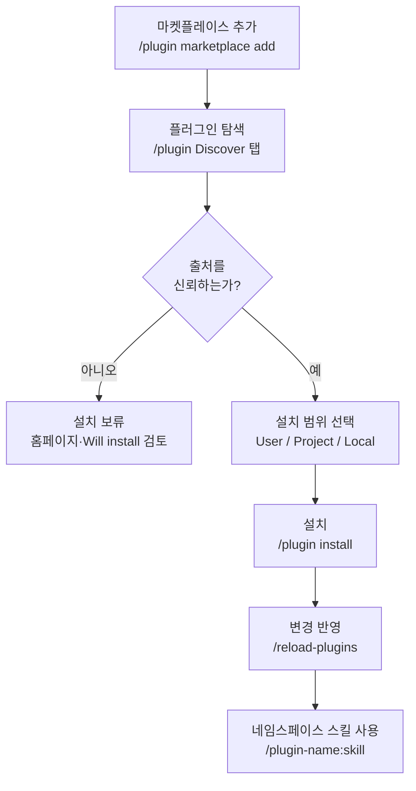

Claude Code 플러그인은 흩어져 있던 확장 기능을 하나의 패키지로 묶어 팀과 커뮤니티에 배포하는 단위이며, 마켓플레이스는 그 패키지를 발견하고 설치하는 카탈로그입니다.


**한 줄 요약**: 플러그인은 명령·에이전트·스킬·hook·MCP를 한 폴더에 담아 버전 관리하며 배포하는 "확장 묶음"이고, 마켓플레이스는 그 묶음을 골라 담는 앱 스토어입니다.


## 플러그인이란

플러그인 (plugin) 은 Claude Code의 여러 확장 요소를 하나의 디렉터리에 묶어 **공유·재사용·버전 관리** 할 수 있게 만든 패키지입니다. `.claude/` 디렉터리에 직접 두는 단독 설정과 달리, 플러그인은 매니페스트 파일로 정체성을 가지며 마켓플레이스를 통해 다른 프로젝트와 팀에 배포됩니다.

단독 설정과 플러그인의 차이는 명확합니다.

| 구분 | 단독 설정 (`.claude/`) | 플러그인 |
|------|------------------------|----------|
| 스킬 이름 | `/hello` | `/plugin-name:hello` (네임스페이스 적용) |
| 적합한 상황 | 개인 워크플로, 프로젝트 한정 실험 | 팀·커뮤니티 공유, 버전 릴리스, 여러 프로젝트 재사용 |
| 배포 | 수동 복사 | `/plugin install` 로 설치 |
| 충돌 방지 | 없음 | 플러그인 이름으로 네임스페이스 자동 분리 |

플러그인의 핵심은 `.claude-plugin/plugin.json` **매니페스트** 입니다. 이 파일이 플러그인의 이름·설명·버전을 정의하며, `name` 필드는 곧 스킬의 네임스페이스 접두사가 됩니다. 매니페스트는 선택 사항으로, 없어도 플러그인은 동작하지만 버전 관리와 마켓플레이스 배포는 매니페스트가 있을 때 훨씬 수월합니다.

```json
{
  "name": "my-first-plugin",
  "description": "A greeting plugin to learn the basics",
  "version": "1.0.0",
  "author": { "name": "Your Name" }
}
```

`version` 은 선택값입니다. 명시하면 이 값을 올릴 때만 사용자에게 업데이트가 전달되고, 생략한 채 git으로 배포하면 커밋 SHA가 버전 역할을 하여 매 커밋이 새 버전으로 취급됩니다.

> 개발 중에는 `claude --plugin-dir ./my-plugin` 으로 설치 없이 로컬 플러그인을 바로 로드해 테스트하고, 변경 후에는 `/reload-plugins` 로 재시작 없이 반영합니다.

## 플러그인이 담을 수 있는 것

플러그인 루트(`.claude-plugin/plugin.json`이 아닌 플러그인 디렉터리 자체)에 요소별 디렉터리를 둡니다. **중요한 주의:** `.claude-plugin/` 안에는 `plugin.json` **만** 들어가고, 스킬·명령·에이전트·hook 등 모든 구성 요소는 플러그인 루트에 위치합니다.

| 요소 | 위치 | 담는 내용 |
|------|------|-----------|
| 스킬 (skill) | `skills/<name>/SKILL.md` | 모델이 맥락에 따라 자동 호출하는 능력 |
| 명령 (command) | `commands/*.md` | 슬래시 명령 (신규 플러그인은 `skills/` 권장) |
| 에이전트 (agent) | `agents/` | 커스텀 서브에이전트 정의 |
| hook | `hooks/hooks.json` | 이벤트 핸들러 (PostToolUse 등) |
| MCP 서버 | `.mcp.json` | 외부 도구·서비스 연결 설정 |
| LSP 서버 | `.lsp.json` | 코드 인텔리전스 (언어 서버) 설정 |
| 모니터 (monitor) | `monitors/monitors.json` | 로그·파일을 배경에서 감시하는 백그라운드 워처 |
| 실행 파일 | `bin/` | 플러그인 활성화 동안 Bash 도구 `PATH` 에 추가되는 실행 파일 |
| 기본 설정 | `settings.json` | 활성화 시 적용되는 기본 settings.json (현재 `agent`·`subagentStatusLine` 키만 지원) |

이처럼 플러그인 하나가 스킬·hook·MCP를 동시에 담을 수 있어, "이 작업에 필요한 모든 확장"을 한 번의 설치로 전달합니다. 예를 들어 `commit-commands` 플러그인은 commit·push·PR 생성 스킬을 묶어 제공하고, `pr-review-toolkit` 은 PR 리뷰 전용 에이전트들을 함께 배포합니다.

## 마켓플레이스: 발견·설치·관리

마켓플레이스 (marketplace) 는 누군가 만든 플러그인 목록을 담은 카탈로그입니다. 사용은 두 단계입니다. 먼저 카탈로그를 **추가** 해 둘러볼 수 있게 한 뒤, 원하는 플러그인을 **개별 설치** 합니다. 앱 스토어를 등록하는 것과 개별 앱을 내려받는 것을 분리해 생각하면 됩니다.

### 마켓플레이스 추가

`/plugin marketplace add` 로 다양한 출처를 등록할 수 있습니다.

```bash
# GitHub 저장소 (owner/repo 형식)
/plugin marketplace add anthropics/claude-plugins-official

# 다른 Git 호스트 (.git 접미사 필수)
/plugin marketplace add https://gitlab.com/company/plugins.git

# 특정 브랜치·태그 고정
/plugin marketplace add https://gitlab.com/company/plugins.git#v1.0.0

# 로컬 경로 / 원격 marketplace.json
/plugin marketplace add ./my-marketplace
/plugin marketplace add https://example.com/marketplace.json
```

공식 Anthropic 마켓플레이스 (`claude-plugins-official`) 는 Claude Code 시작 시 자동으로 사용 가능합니다. 커뮤니티 마켓플레이스는 수동으로 추가합니다.

```bash
# 공식 마켓플레이스에서 설치
/plugin install hello@claude-plugins-official

# 커뮤니티 마켓플레이스 추가 후 설치
/plugin marketplace add anthropics/claude-plugins-community
/plugin install <plugin-name>@claude-plugins-community
```

### 설치와 관리

`/plugin` 을 실행하면 **Discover / Installed / Marketplaces / Errors** 4개 탭이 있는 플러그인 관리자가 열립니다. Discover 탭의 상세 패널에서는 설치 전에 컨텍스트 비용 (Context cost) 추정치, 최종 업데이트 날짜, 그리고 설치될 명령·에이전트·스킬·hook·MCP·LSP 목록을 미리 확인할 수 있습니다.

설치 범위 (scope) 는 세 가지입니다.

| 범위 | 적용 대상 | 기록 위치 |
|------|-----------|-----------|
| User | 내 모든 프로젝트 | 사용자 설정 |
| Project | 이 저장소의 모든 협업자 | `.claude/settings.json` |
| Local | 이 저장소의 나만 | 협업자와 공유 안 함 |

설치·활성·비활성·제거는 CLI로도 가능합니다.

```bash
/plugin install plugin-name@marketplace-name   # 설치 (기본 user 범위)
/plugin disable plugin-name@marketplace-name    # 비활성 (제거 안 함)
/plugin enable  plugin-name@marketplace-name    # 재활성
/plugin uninstall plugin-name@marketplace-name  # 완전 제거
/reload-plugins                                 # 재시작 없이 변경 반영
```

팀 단위로는 `.claude/settings.json` 의 `extraKnownMarketplaces` 키에 마켓플레이스를 선언해 두면, 협업자가 저장소 폴더를 신뢰할 때 Claude Code가 해당 마켓플레이스와 플러그인 설치를 안내합니다.

## 코드 인텔리전스 플러그인

코드 인텔리전스 (code intelligence) 플러그인은 LSP (Language Server Protocol) 를 통해 Claude Code 내장 코드 인텔리전스 도구를 활성화합니다. VS Code의 코드 탐색을 떠받치는 바로 그 기술입니다. 언어별 플러그인을 설치하고 해당 **언어 서버 바이너리** 가 시스템에 있어야 동작합니다.

| 언어 | 플러그인 | 필요한 바이너리 |
|------|----------|-----------------|
| Go | `gopls-lsp` | `gopls` |
| Python | `pyright-lsp` | `pyright-langserver` |
| TypeScript | `typescript-lsp` | `typescript-language-server` |
| Rust | `rust-analyzer-lsp` | `rust-analyzer` |
| Java | `jdtls-lsp` | `jdtls` |

플러그인이 활성화되면 Claude는 두 가지 능력을 얻습니다.

- **자동 진단 (diagnostics)**: Claude가 파일을 편집할 때마다 언어 서버가 변경을 분석해 타입 오류·누락된 import·구문 오류를 자동으로 보고합니다. 컴파일러나 린터를 따로 돌리지 않아도 같은 턴에서 오류를 알아채고 바로 고칩니다. "diagnostics found" 표시가 뜰 때 `Ctrl+O` 를 누르면 인라인으로 확인할 수 있습니다.
- **코드 탐색 (navigation)**: 정의로 이동, 참조 찾기, 호버 타입 정보, 심볼 목록, 구현 찾기, 호출 계층 추적이 가능합니다. grep 기반 검색보다 훨씬 정확한 탐색을 제공합니다.

> `Executable not found in $PATH` 오류가 `/plugin` Errors 탭에 보이면 위 표의 언어 서버 바이너리를 설치하면 됩니다. `rust-analyzer`·`pyright` 등은 대규모 코드베이스 (large codebase) 에서 메모리를 많이 쓸 수 있으니, 부담되면 해당 플러그인을 비활성화하고 Claude 내장 검색에 의존해도 됩니다.

## 신뢰와 보안

플러그인과 마켓플레이스는 **매우 높은 신뢰가 필요한 구성 요소** 입니다. 사용자 권한으로 임의 코드를 실행할 수 있기 때문입니다. 신뢰하는 출처에서만 설치하세요.

- Anthropic은 플러그인에 포함된 MCP 서버·파일·소프트웨어를 통제하지 않으며, 의도대로 동작하는지 검증하지 않습니다. 서드파티 플러그인은 설치 전에 홈페이지와 Discover 탭의 "Will install" 목록을 직접 검토하세요.
- 커뮤니티 마켓플레이스 플러그인은 Anthropic의 자동 검증·안전 스크리닝을 통과한 뒤 특정 커밋 SHA에 고정되어 배포됩니다. 그래도 최종 신뢰 판단은 설치자의 몫입니다.
- 조직은 관리 설정 (managed settings) 으로 사용자가 추가할 수 있는 마켓플레이스를 제한할 수 있습니다.

## 플러그인 설치·활성화 흐름



## 관련 문서

- [스킬](/claude-code/extensibility/skills)
- [훅 (Hooks)](/claude-code/extensibility/hooks)
- [MCP 서버](/claude-code/extensibility/mcp)

## 참고 자료

- [Create plugins (code.claude.com)](https://code.claude.com/docs/en/plugins)
- [Discover and install plugins (code.claude.com)](https://code.claude.com/docs/en/discover-plugins)
- [What Claude gains from code intelligence plugins](https://code.claude.com/docs/en/discover-plugins#what-claude-gains-from-code-intelligence-plugins)


설치하려는 플러그인이 보이지 않으면 마켓플레이스가 오래된 것일 수 있습니다. `/plugin marketplace update <marketplace-name>` 으로 목록을 새로고침한 뒤 다시 설치를 시도하세요.

