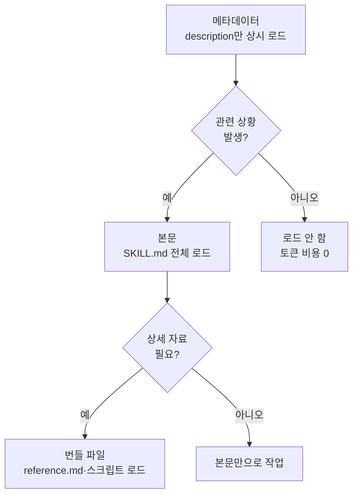

# 스킬

Claude Code의 스킬(skill)은 반복되는 절차나 전문 지식을 `SKILL.md` 파일 하나로 묶어 Claude의 도구함에 추가하는 확장 메커니즘입니다.


**한 줄 요약**: 채팅에 매번 붙여넣던 체크리스트나 절차를 `SKILL.md` 한 장으로 만들면, Claude가 필요할 때만 그 내용을 꺼내 쓰는 "주머니 속 전문가"가 됩니다.



이 문서는 Claude Code 스킬의 개념 개요입니다. MoAI-ADK에서 스킬을 직접 작성하고 빌더 에이전트로 자동 생성하는 실전 절차는 [스킬 가이드](/advanced/skill-guide)와 [빌더 에이전트 가이드](/advanced/builder-agents)에서 자세히 다룹니다.


## 스킬이란

스킬은 Claude가 따라야 할 지침을 담은 `SKILL.md` 파일입니다. 파일 하나를 만들어 두면 Claude가 관련 상황에서 자동으로 불러 쓰거나, 사용자가 `/스킬이름` 형태로 직접 호출할 수 있습니다.

다음과 같은 상황이 스킬을 만들 신호입니다.

- 같은 지침이나 체크리스트를 채팅에 반복해서 붙여넣고 있을 때
- CLAUDE.md의 한 섹션이 "사실 정보"가 아니라 "여러 단계 절차"로 커졌을 때

CLAUDE.md 내용은 항상 컨텍스트에 상주하지만, 스킬 본문은 실제로 사용될 때만 로드됩니다. 따라서 길고 상세한 참조 자료를 두어도 필요하기 전까지는 토큰 비용이 거의 들지 않습니다.

### 스킬과 사용자 정의 명령

스킬 이전에는 `.claude/commands/` 디렉터리에 사용자 정의 명령을 두곤 했습니다. 현재는 **스킬이 명령 기능을 포함**하므로, `.claude/commands/deploy.md`와 `.claude/skills/deploy/SKILL.md`가 모두 있으면 스킬이 우선합니다. 기존 명령 파일도 그대로 동작하지만, 새 확장은 스킬로 작성하는 것이 권장됩니다.

### 스킬의 구조

각 스킬은 `SKILL.md`를 진입점으로 하는 디렉터리입니다. 본문은 YAML 프론트매터와 마크다운 지침으로 구성되며, 보조 파일을 함께 둘 수 있습니다.

```text
my-skill/
├── SKILL.md       # 필수: 지침 + 프론트매터
├── reference.md   # 선택: 상세 참조 (필요할 때 로드)
├── examples.md    # 선택: 예시 출력
└── scripts/
    └── helper.py  # 선택: Claude가 실행하는 스크립트
```

프론트매터는 대부분 선택 항목이지만, Claude가 언제 이 스킬을 써야 할지 판단하는 `description`은 사실상 필수입니다.

```yaml
---
name: api-conventions
description: 이 코드베이스의 API 설계 패턴. 엔드포인트를 작성하거나 리뷰할 때 사용.
allowed-tools: Read Grep
---

API 엔드포인트를 작성할 때:
- RESTful 명명 규칙을 따른다
- 일관된 오류 형식을 반환한다
- 요청 검증을 포함한다
```

주요 프론트매터 필드는 다음과 같습니다.

| 필드 | 역할 |
| :--- | :--- |
| `description` | 무엇을 하고 언제 쓰는지. Claude의 자동 로드 판단 기준 |
| `name` | 스킬 목록에 표시되는 이름 (기본값: 디렉터리 이름) |
| `disable-model-invocation` | `true`면 사용자만 호출 가능, Claude 자동 로드 차단 |
| `user-invocable` | `false`면 `/` 메뉴에서 숨김, Claude만 사용 |
| `allowed-tools` | 스킬 활성화 시 승인 없이 쓸 수 있는 도구 |
| `context` | `fork` 설정 시 별도 서브에이전트 컨텍스트에서 실행 |
| `paths` | 특정 파일 패턴을 다룰 때만 자동 로드 |
| `shell` | 선택: shell 명령 실행 시 사용할 쉘 지정 |

## Progressive Disclosure

스킬의 핵심 설계는 필요한 만큼만 단계적으로 드러내는 **점진적 공개** (Progressive Disclosure) 입니다. 컨텍스트 윈도우를 아끼면서도 깊은 지식을 보관하는 방식입니다.



| 단계 | 로드 시점 | 내용 |
| :--- | :--- | :--- |
| 메타데이터 | 항상 | `description`과 이름만 컨텍스트에 상주 |
| 본문 | 호출될 때 | `SKILL.md` 전체 지침이 컨텍스트에 진입 |
| 번들 | 필요할 때 | 참조 문서·예시·스크립트를 그때그때 참조 |

일반 세션에서는 모든 스킬의 `description`만 상시 로드되어 Claude가 "무엇이 있는지"를 알고, 실제 본문은 호출되는 순간에만 들어옵니다. 보조 파일은 `SKILL.md`에서 링크로 안내해 두면 Claude가 필요할 때만 읽습니다.

## 언제 자동 로드되나

Claude는 사용자의 요청이 스킬의 `description`(그리고 선택적 `when_to_use`)과 맞아떨어질 때 해당 스킬을 자동으로 불러옵니다. 즉, 트리거는 별도 설정이 아니라 **설명문의 키워드 매칭**입니다.

- 사용자가 자연스럽게 말할 법한 키워드를 `description`에 담을수록 잘 트리거됩니다.
- 의도와 무관하게 너무 자주 트리거되면 설명을 더 구체적으로 좁히거나 `disable-model-invocation: true`로 수동 호출만 허용합니다.
- 직접 호출하고 싶을 때는 `/스킬이름` 형태로 명시적으로 부르면 됩니다.

스킬이 저장된 위치가 사용 범위를 결정합니다.

| 위치 | 경로 | 적용 범위 |
| :--- | :--- | :--- |
| 개인 | `~/.claude/skills/<name>/SKILL.md` | 내 모든 프로젝트 |
| 프로젝트 | `.claude/skills/<name>/SKILL.md` | 이 프로젝트만 |
| 플러그인 | `<plugin>/skills/<name>/SKILL.md` | 플러그인이 켜진 곳 |

이름이 겹치면 엔터프라이즈 > 개인 > 프로젝트 순으로 우선합니다. 플러그인 스킬은 `플러그인이름:스킬이름` 형태의 네임스페이스를 써서 충돌하지 않습니다.

## 작은 예시

다음은 커밋되지 않은 변경을 요약하는 스킬입니다. `` !`git diff HEAD` `` 구문은 Claude가 보기 전에 명령을 미리 실행해 결과를 본문에 끼워 넣는 동적 컨텍스트 주입입니다.

```yaml
---
description: 커밋되지 않은 변경을 요약하고 위험 요소를 표시한다. 무엇이 바뀌었는지 물을 때 사용.
---

## 현재 변경 사항

!`git diff HEAD`

## 지침

위 변경을 두세 개의 불릿으로 요약한 뒤, 누락된 오류 처리나 하드코딩 같은 위험을 나열한다.
```

이 스킬은 사용자가 "내가 뭘 바꿨지?"라고 물으면 자동으로, 또는 `/summarize-changes`로 직접 호출됩니다.

## MoAI-ADK에서의 스킬

MoAI-ADK는 이 스킬 메커니즘 위에서 동작합니다. `moai-foundation-core`, `moai-workflow-spec` 같은 범용 스킬이 SPEC 워크플로와 품질 게이트 지식을 담고 있으며, 프로젝트 도메인에 맞춘 스킬은 빌더 에이전트가 자동 생성합니다. 작성 규칙·네임스페이스·점진적 공개 토큰 예산 같은 실전 세부는 아래 MoAI-ADK 심화 문서를 참고하시기 바랍니다.

## 관련 문서

- [스킬 가이드](/advanced/skill-guide)
- [빌더 에이전트 가이드](/advanced/builder-agents)

## 참고 자료

- [Claude Code 공식 문서 — Extend Claude with skills](https://code.claude.com/docs/en/skills)


스킬이 기대대로 트리거되지 않으면 `/doctor`로 설명문 예산이 넘쳤는지 확인하고, `description`에 사용자가 실제로 입력할 법한 키워드가 들어 있는지 점검해 보세요.

