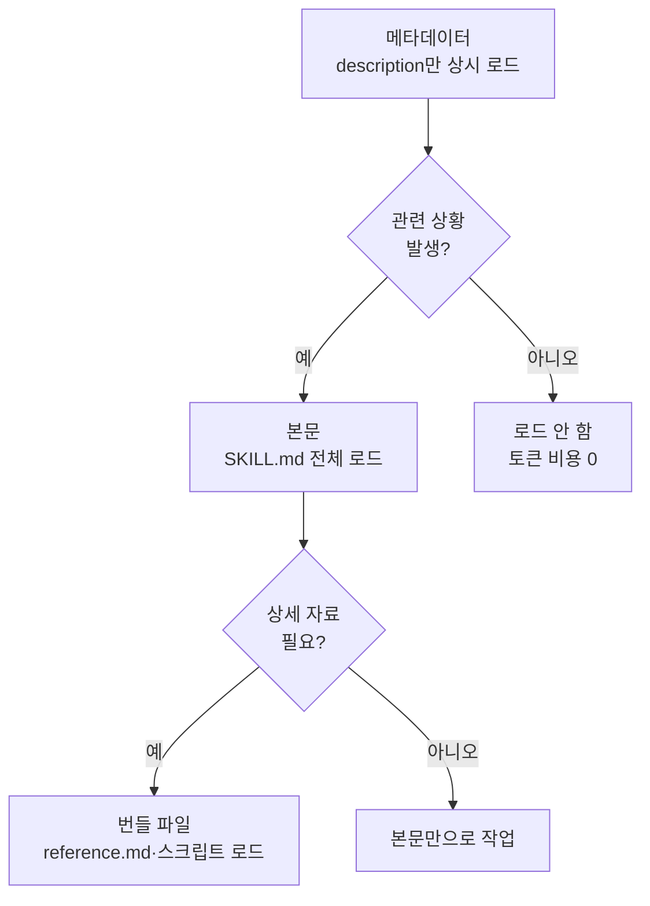

# 스킬

채팅창에 같은 지시를 매번 복사해 붙여넣고 있다면, 스킬(skill)로 한 번에 정리해 둘 때입니다. 스킬은 "이런 일이 생기면 이렇게 해"라는 절차와 노하우를 `SKILL.md` 파일 하나로 묶어 Claude의 도구함에 넣는 확장 방식이라, 평소엔 표지만 보이다가 필요한 순간에만 펼쳐 읽습니다.


이 문서는 MoAI-ADK가 올라타 있는 플랫폼인 **Claude Code 자체**를 다루는 배경 자료입니다. MoAI-ADK를 쓰는 방법은 [스킬 가이드](/ko/advanced/skill-guide)에서 다루고, 빌더 에이전트로 스킬을 자동 생성하는 절차는 [빌더 에이전트 가이드](/ko/advanced/builder-agents)에서 이어집니다.



**한 줄 요약**: 스킬은 꺼낼 때까지 닫아 두는 **주머니 속 매뉴얼**입니다. 채팅에 매번 붙여넣던 체크리스트나 절차를 `SKILL.md` 한 장으로 옮겨 두면 Claude가 관련 상황에서만 본문을 꺼내 쓰고, 꺼내기 전까지는 표지(설명 한 줄)만 짚고 지나갑니다.


## 스킬이란

스킬은 Claude가 따라야 할 지침을 담은 `SKILL.md` 파일입니다. 파일 하나를 만들어 두면 Claude가 관련 상황에서 알아서 불러 쓰거나, 사용자가 `/스킬이름`으로 직접 부를 수 있습니다.

스킬을 새로 만들면 좋은 신호는 대략 두 가지입니다.

- 같은 지침이나 체크리스트를 채팅에 반복해서 붙여넣고 있을 때
- `CLAUDE.md`의 한 섹션이 "사실 정보"에서 "여러 단계 절차"로 자라났을 때

`CLAUDE.md`는 항상 컨텍스트에 상주하지만 스킬 본문은 실제로 쓸 때만 들어옵니다. 그래서 길고 상세한 참조 자료를 스킬에 두어도 꺼내 쓰기 전까지 토큰 비용이 거의 들지 않습니다.

### 스킬과 사용자 정의 명령

스킬이 자리 잡기 전에는 `.claude/commands/` 디렉터리에 사용자 정의 명령을 두곤 했습니다. 지금은 **스킬이 명령 기능을 흡수**했기 때문에 `.claude/commands/deploy.md`와 `.claude/skills/deploy/SKILL.md`가 같이 있으면 스킬이 이깁니다. 예전 명령 파일도 여전히 동작하지만, 새로 짜는 확장은 스킬로 작성하는 것을 권합니다.

### 스킬의 구조

각 스킬은 `SKILL.md`를 진입점으로 삼는 디렉터리입니다. 본문은 YAML 프론트매터(frontmatter)와 마크다운 지침으로 이루어지고, 옆에 보조 파일을 함께 둘 수 있습니다.

```text
my-skill/
├── SKILL.md       # 필수: 지침 + 프론트매터
├── reference.md   # 선택: 상세 참조 (필요할 때 로드)
├── examples.md    # 선택: 예시 출력
└── scripts/
    └── helper.py  # 선택: Claude가 실행하는 스크립트
```

프론트매터 필드 대부분은 선택이지만, Claude가 "이 스킬을 언제 써야 하나"를 판단하는 `description`은 사실상 필수입니다.

```yaml
---
name: api-conventions
description: 이 코드베이스의 API 설계 패턴. 엔드포인트를 작성하거나 리뷰할 때 사용.
allowed-tools: Read Grep
---

API 엔드포인트를 작성할 때:
- RESTful 명명 규칙을 따른다
- 일관된 오류 형식을 반환한다
- 요청 검증을 포함한다
```

주요 프론트매터 필드는 다음과 같습니다.

| 필드 | 역할 |
| :--- | :--- |
| `description` | 무엇을 하고 언제 쓰는지. Claude의 자동 로드 판단 기준 |
| `name` | 스킬 목록에 표시되는 이름 (기본값: 디렉터리 이름) |
| `disable-model-invocation` | `true`면 사용자만 호출 가능, Claude 자동 로드를 차단 |
| `user-invocable` | `false`면 `/` 메뉴에서 숨김, Claude만 사용 |
| `allowed-tools` | 스킬이 켜져 있는 동안 승인 없이 쓸 수 있는 도구 |
| `context` | `fork`로 설정하면 별도 서브에이전트(subagent) 컨텍스트에서 실행 |
| `paths` | 특정 파일 패턴을 다룰 때만 자동 로드 |
| `shell` | 선택: 셸 명령을 실행할 때 쓸 셸 |

### 설치된 스킬 둘러보기: `/skills`

세션 안에서 `/skills`를 입력하면 지금 쓸 수 있는 스킬 목록이 뜹니다. 여기서 개인·프로젝트·플러그인 스킬을 한눈에 보고, 각 스킬을 켜거나 끄고, 설명을 확인할 수 있습니다. "내 환경에 스킬이 제대로 들어와 있나"를 가장 빠르게 확인하는 길입니다.

### `allowed-tools`로 도구 권한 좁히기

`allowed-tools`는 "이 스킬이 활성화된 동안에는 이 도구들은 매번 물어보지 않고 쓴다"는 허용 목록입니다. 예를 들어 읽기 전용 조사 스킬이라면 `allowed-tools: Read Grep`으로 묶어두면, 스킬이 켜져 있는 동안 읽기와 검색 권한 프롬프트가 사라집니다. 반대로 말하면 스킬이 꺼지면 이 허용도 함께 풀리기 때문에, 스킬은 곧 **일시적인 권한 범위**이기도 합니다. 권한을 넓게 풀고 싶지 않다면 꼭 필요한 도구만 적어 두세요.

## 점진적 공개 (Progressive Disclosure)

스킬 설계의 핵심은 **점진적 공개** (Progressive Disclosure)입니다. 필요한 만큼만 단계적으로 내용을 드러내 컨텍스트 윈도우를 아끼면서도 깊은 지식을 함께 보관하는 방식입니다.


```mermaid
flowchart TD
    A[메타데이터<br/>description만 상시 로드] --> B{관련 상황<br/>발생?}
    B -->|예| C[본문<br/>SKILL.md 전체 로드]
    C --> D{상세 자료<br/>필요?}
    D -->|예| E[번들 파일<br/>reference.md·스크립트 로드]
    D -->|아니오| F[본문만으로 작업]
    B -->|아니오| G[로드 안 함<br/>토큰 비용 0]
```

| 단계 | 로드 시점 | 토큰 규모 | 내용 |
| :--- | :--- | :--- | :--- |
| 메타데이터 | 항상 | ~100 토큰 | `description`과 이름만 컨텍스트에 상주 |
| 본문 | 호출될 때 | ~5K 토큰 | `SKILL.md` 전체 지침이 컨텍스트에 진입 |
| 번들 | 필요할 때 | 온디맨드 | 참조 문서·예시·스크립트를 그때그때 참조 |

평범한 세션에서는 모든 스킬의 `description`만 상시 로드되어 Claude가 "무엇이 있는지"를 알고, 본문은 호출되는 순간에만 들어옵니다. 보조 파일은 `SKILL.md` 안에서 링크로 안내해 두면 Claude가 필요할 때만 읽습니다. 그래서 스킬 열 개를 달고 다녀도 쓰지 않는 아홉 개는 표지만 짚고 지나가니 컨텍스트가 무겁지 않습니다.

## 언제 자동으로 불러올까

Claude는 사용자의 요청이 스킬의 `description`(그리고 선택 항목인 `when_to_use`)과 맞아떨어질 때 해당 스킬을 자동으로 불러옵니다. 즉 트리거는 별도 설정이 아니라 **설명문 키워드 매칭**입니다.

- 사용자가 자연스럽게 칠 법한 키워드를 `description`에 담을수록 잘 트리거됩니다.
- 의도와 상관없이 너무 자주 트리거되면 설명을 더 구체적으로 좁히거나, `disable-model-invocation: true`로 수동 호출만 허용합니다.
- 직접 부르고 싶을 때는 `/스킬이름`으로 명시적으로 호출하면 됩니다.

스킬이 저장된 위치가 적용 범위를 결정합니다.

| 위치 | 경로 | 적용 범위 |
| :--- | :--- | :--- |
| 개인 | `~/.claude/skills/<name>/SKILL.md` | 내 모든 프로젝트 |
| 프로젝트 | `.claude/skills/<name>/SKILL.md` | 이 프로젝트만 |
| 플러그인 | `<plugin>/skills/<name>/SKILL.md` | 플러그인이 켜진 곳 |

이름이 겹치면 엔터프라이즈 > 개인 > 프로젝트 순으로 우선합니다. 플러그인 스킬은 `플러그인이름:스킬이름` 형태의 네임스페이스를 써서 충돌을 피합니다.

## 작은 예시

다음은 커밋되지 않은 변경을 요약하는 스킬입니다. `` !`git diff HEAD` `` 구문은 동적 컨텍스트 주입으로, Claude가 본문을 보기 전에 명령을 미리 실행해 결과를 본문에 끼워 넣습니다.

```yaml
---
description: 커밋되지 않은 변경을 요약하고 위험 요소를 표시한다. 무엇이 바뀌었는지 물을 때 사용.
---

## 현재 변경 사항

!`git diff HEAD`

## 지침

위 변경을 두세 개의 불릿으로 요약한 뒤, 누락된 오류 처리나 하드코딩 같은 위험을 나열한다.
```

이 스킬은 사용자가 "내가 뭘 바꿨지?"라고 물으면 자동으로, 또는 `/summarize-changes`로 직접 호출됩니다.

## MoAI-ADK는 스킬을 어떻게 쓰나

MoAI-ADK는 이 스킬 메커니즘 위에서 동작합니다. `moai-foundation-core`, `moai-workflow-spec` 같은 범용 스킬이 SPEC 워크플로와 품질 게이트 지식을 담고 있으며, 프로젝트 도메인에 맞춘 스킬은 빌더 에이전트가 자동으로 만듭니다.

MoAI-ADK 관점에서 스킬은 두 가지 핵심에 동시에 걸칩니다. **토크노믹스** 쪽에서 보면 점진적 공개가 곧 토큰 예산 설계입니다. 설명 한 줄(~100 토큰)만 늘 짊어지고 본문(~5K 토큰)은 실제로 쓸 때만 지불하니, 같은 지식을 `CLAUDE.md`에 상주시키는 것보다 훨씬 쌉니다. **하네스 자가 진화** 쪽에서 스킬은 하네스가 고쳐 쓰는 대상입니다. 루프가 쌓아 둔 관찰을 근거로 하네스가 스킬 지침을 손보는 것이 MoAI-ADK 자가 진화의 핵심 경로입니다. 작성 규칙, 네임스페이스, 점진적 공개의 토큰 예산 같은 실전 세부는 아래 심화 문서를 참고하세요.

## 관련 문서

- [스킬 가이드](/ko/advanced/skill-guide)
- [빌더 에이전트 가이드](/ko/advanced/builder-agents)

## 참고 자료

- [Claude Code 공식 문서 — Extend Claude with skills](https://code.claude.com/docs/en/skills)


스킬이 기대대로 트리거되지 않으면 `/doctor`로 설명문 예산이 넘쳤는지 확인하고, `description`에 사용자가 실제로 입력할 법한 키워드가 들어 있는지 점검해 보세요.

