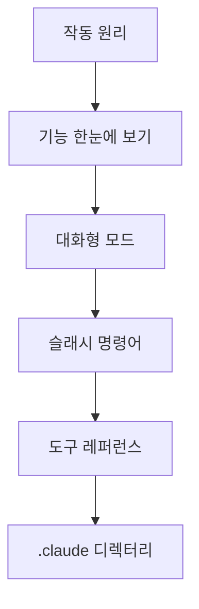

이 그룹은 Claude Code를 본격적으로 사용하기 전에 알아야 할 기본기를 다룹니다. 에이전틱 루프가 어떻게 동작하는지, 어떤 기능이 있는지, 대화형 모드에서 어떻게 입력하고, 슬래시 명령과 도구를 어떻게 활용하며, 설정이 어디에 저장되는지를 차례로 익힙니다. 여기서 배우는 모든 것 — 루프, 도구, 권한, 설정 디렉터리 — 이 곧 MoAI-ADK가 그 위에 하네스를 짓는 재료입니다.


**학습 목표 (한 줄 요약)**: Claude Code의 작동 방식과 핵심 사용 인터페이스를 이해하여, 이후 워크플로우 문서와 MoAI-ADK 하네스 설계를 막힘없이 따라갈 수 있는 토대를 갖춥니다.


## 학습 흐름

```mermaid
flowchart TD
    A[작동 원리] --> B[기능 한눈에 보기]
    B --> C[대화형 모드]
    C --> D[슬래시 명령어]
    D --> E[도구 레퍼런스]
    E --> F[.claude 디렉터리]
```

먼저 작동 원리로 전체 그림을 잡은 뒤, 기능 지도를 훑어 어떤 도구가 있는지 파악합니다. 이어서 대화형 모드와 슬래시 명령으로 실제 입력 방법을 익히고, 도구 레퍼런스와 설정 디렉터리로 동작과 환경을 마무리하면 기본기가 완성됩니다.

## 목차

| 문서 | 설명 |
|------|------|
| [작동 원리](/ko/claude-code/foundations/how-claude-code-works) | 에이전틱 루프와 핵심 구성 요소 |
| [기능 한눈에 보기](/ko/claude-code/foundations/features-overview) | 전체 기능 카탈로그와 학습 경로 |
| [대화형 모드](/ko/claude-code/foundations/interactive-mode) | REPL·단축키·권한 모드 |
| [슬래시 명령어](/ko/claude-code/foundations/commands) | 내장·커스텀 명령과 /moai 관계 |
| [도구 레퍼런스](/ko/claude-code/foundations/tools-reference) | 내장 도구와 권한 |
| [.claude 디렉터리](/ko/claude-code/foundations/claude-directory) | 설정 디렉터리 구조와 스코프 |

기본기를 갖추었다면, 다음 그룹인 [컨텍스트와 메모리](/ko/claude-code/context-memory)에서 토큰 비용을 다루는 법 — MoAI-ADK 토크노믹스의 출발점 — 으로 나아갑니다.
