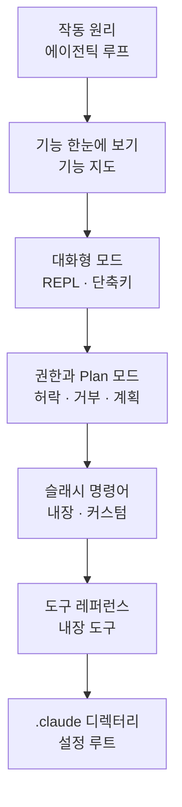

친구에게 Claude Code를 한 줄로 설명하자면 터미널에서 돌아가는 코딩 에이전트(coding agent)입니다. 이 그룹은 그 에이전트가 어떻게 돌아가는지, 어떻게 입력하는지, 어떤 도구를 쓰는지, 설정은 어디에 모이는지 — 본격적으로 쓰기 전에 짚고 넘어가야 할 기본기를 차례로 익힙니다.

여기서 다루는 에이전틱 루프(agentic loop), 도구, 권한 모델, 설정 디렉터리는 그 자체로 쓸모가 있을 뿐 아니라 MoAI-ADK가 그 위에 하네스를 짓는 재료이기도 합니다. MoAI-ADK 문서가 "에이전트가 잘 일할 환경을 설계한다"고 말할 때, 그 환경의 부품이 바로 이 그룹의 내용입니다. 기초를 건너뛰면 이후 워크플로우 문서가 다루는 자동화와 토큰 관리가 왜 그렇게 설계되었는지 맥락이 잘 보이지 않습니다.


이 문서는 MoAI-ADK가 올라타 있는 플랫폼인 **Claude Code 자체**를 다루는 배경 자료입니다. MoAI-ADK 자체 기능은 사이드바 위쪽 섹션에서 다룹니다.



**한 줄 요약**: Claude Code의 작동 방식과 핵심 사용 인터페이스를 이해해 이후 워크플로우 문서와 MoAI-ADK 하네스 설계를 막힘없이 따라갑니다.


## 학습 흐름

```mermaid
flowchart TD
    A[작동 원리<br>에이전틱 루프] --> B[기능 한눈에 보기<br>기능 지도]
    B --> C[대화형 모드<br>REPL · 단축키]
    C --> D[권한과 Plan 모드<br>허락 · 거부 · 계획]
    D --> E[슬래시 명령어<br>내장 · 커스텀]
    E --> F[도구 레퍼런스<br>내장 도구]
    F --> G[.claude 디렉터리<br>설정 루트]
```

먼저 [작동 원리](/ko/claude-code/foundations/how-claude-code-works)로 에이전트가 어떻게 돌아가는지 전체 그림을 잡고, [기능 한눈에 보기](/ko/claude-code/foundations/features-overview)로 어떤 능력이 있는지 지도를 훑습니다. 이어서 [대화형 모드](/ko/claude-code/foundations/interactive-mode)와 [권한과 Plan 모드](/ko/claude-code/foundations/permissions)로 직접 입력하고 실행을 통제하는 법을 익히고, [슬래시 명령어](/ko/claude-code/foundations/commands)와 [도구 레퍼런스](/ko/claude-code/foundations/tools-reference)로 쓸 수 있는 명령과 도구를 정리합니다. 마지막으로 [.claude 디렉터리](/ko/claude-code/foundations/claude-directory)에서 이 모든 설정이 모이는 곳을 살피면 기본기가 한 바퀴 완성됩니다.

## 목차

| 문서 | 설명 |
|------|------|
| [작동 원리](/ko/claude-code/foundations/how-claude-code-works) | 에이전틱 루프와 핵심 구성, 권한 모델 |
| [기능 한눈에 보기](/ko/claude-code/foundations/features-overview) | 전체 기능 카탈로그와 확장 레이어 지도 |
| [대화형 모드](/ko/claude-code/foundations/interactive-mode) | REPL 입력 방식 · 단축키 · 권한 모드 |
| [권한과 Plan 모드](/ko/claude-code/foundations/permissions) | allow/ask/deny 규칙과 네 가지 권한 모드, Plan 모드 |
| [슬래시 명령어](/ko/claude-code/foundations/commands) | 내장 · 커스텀 · 플러그인 명령과 스코프 |
| [도구 레퍼런스](/ko/claude-code/foundations/tools-reference) | 내장 도구의 용도 · 읽기/쓰기 구분 · 권한 설정 |
| [.claude 디렉터리](/ko/claude-code/foundations/claude-directory) | 설정 루트의 구조와 스코프(CLAUDE.md · settings.json · 스킬 · hook) |

기본기를 갖추었다면 다음 그룹인 [컨텍스트와 메모리](/ko/claude-code/context-memory)로 넘어가 토큰 비용을 다루는 법을 익힙니다. 컨텍스트 윈도우(context window)를 어떻게 아끼고, 읽어 들인 맥락을 어떻게 보존하는지가 MoAI-ADK 토크노믹스(tokenomics)의 출발점이 됩니다.
