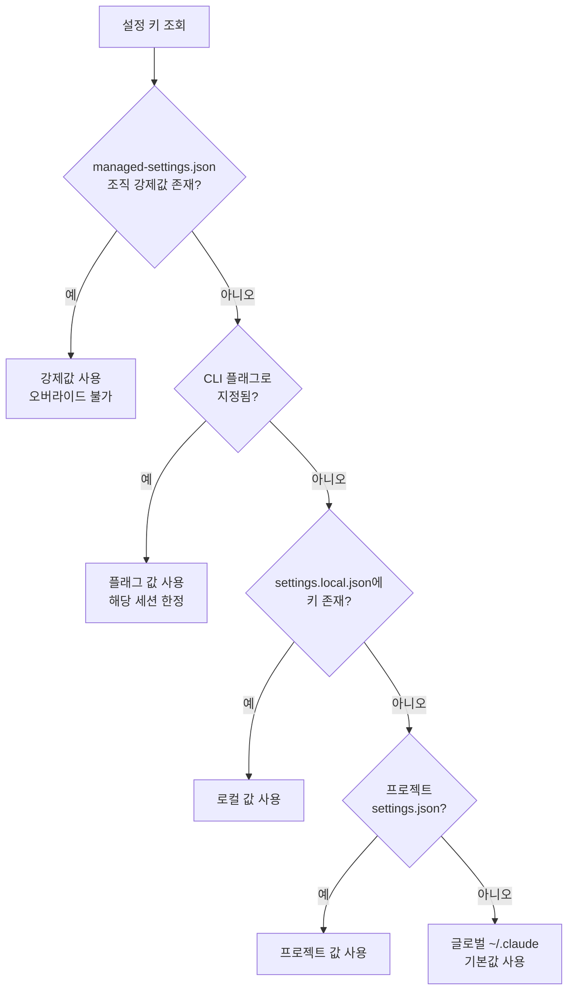

`.claude` 디렉터리는 Claude Code가 프로젝트마다 지시문, 설정, 확장 기능을 읽어 들이는 단일 설정 루트입니다.


**한 줄 요약**: `.claude`는 Claude Code가 매 세션 시작 때 들여다보는 프로젝트 전용 "조작판"이며, 대부분은 git에 커밋해 팀과 공유하고 개인용 파일만 따로 격리합니다.


대부분의 사용자는 `CLAUDE.md`와 `settings.json` 두 파일만 편집하면 충분합니다. 나머지 스킬, rules, 서브에이전트는 필요할 때 하나씩 추가하면 됩니다.

## .claude 디렉터리의 역할

Claude Code는 두 곳에서 설정을 읽습니다. 하나는 작업 중인 프로젝트의 `.claude/` 디렉터리이고, 다른 하나는 홈 디렉터리의 `~/.claude/`입니다. 프로젝트 안의 파일은 git에 커밋해 팀과 공유하고, `~/.claude/`의 파일은 모든 프로젝트에 적용되는 개인 설정으로 남습니다.

- **프로젝트 컨텍스트 전달**: `CLAUDE.md`처럼 Claude가 "읽고 따르는" 지침
- **동작 강제**: `settings.json`의 권한(permissions)과 hook처럼 Claude의 준수 여부와 무관하게 "집행되는" 설정
- **확장 기능 보관**: 스킬, 서브에이전트, 다이내믹 워크플로우 등 재사용 가능한 자산

여기서 핵심 구분은 **지침 (guidance)** 과 **설정 (configuration)** 입니다. `CLAUDE.md`나 rules는 Claude가 참고하는 안내문이라 항상 지켜진다는 보장이 없지만, hook과 permissions는 런타임이 직접 집행하므로 결정적입니다. 확실한 동작이 필요하면 지침이 아니라 hook 또는 permissions로 구현해야 합니다.

## 디렉터리 구조

프로젝트 `.claude/` 아래에 들어가는 주요 항목입니다. `CLAUDE.md`, `.mcp.json`, `.worktreeinclude`는 예외적으로 프로젝트 루트에 위치합니다.

| 항목 | 위치 | 커밋 | 역할 |
| --- | --- | --- | --- |
| `CLAUDE.md` | 프로젝트 루트 또는 `.claude/` | ✓ | 매 세션 컨텍스트로 로드되는 프로젝트 지침 |
| `settings.json` | `.claude/` | ✓ | 권한, hook, 환경 변수, 기본 모델 등 집행되는 설정 |
| `settings.local.json` | `.claude/` | - | 개인용 설정 오버라이드 (자동 gitignore) |
| `rules/` | `.claude/` | ✓ | 주제별로 쪼갠 지침, 파일 경로로 조건부 로드 가능 |
| `skills/` | `.claude/` | ✓ | `/name`으로 부르거나 Claude가 자동 호출하는 스킬 |
| `commands/` | `.claude/` | ✓ | 단일 파일 프롬프트 (스킬과 동일 메커니즘) |
| `agents/` | `.claude/` | ✓ | 독립 컨텍스트 윈도우를 가진 서브에이전트 정의 |
| `workflows/` | `.claude/` | ✓ | 여러 서브에이전트를 조율하는 다이내믹 워크플로우 스크립트 |
| `hooks/` | `.claude/` | ✓ | hook이 실행하는 스크립트 (settings.json에서 등록) |
| `agent-memory/` | `.claude/` | ✓ | 서브에이전트 전용 영속 메모리 |
| `.mcp.json` | 프로젝트 루트 | ✓ | 팀 공유 MCP 서버 구성 |

> 공식 문서의 인터랙티브 탐색기에는 `hooks/` 디렉터리가 별도 노드로 나오지 않습니다. hook은 `settings.json`의 `hooks` 키에서 등록하며, 실행할 스크립트 파일을 `.claude/` 아래에 두고 그 경로를 가리키는 구성 방식입니다.

### 지침 파일 (Claude가 읽는 것)

- **`CLAUDE.md`**: 프로젝트의 규칙, 자주 쓰는 명령, 아키텍처 맥락을 담습니다. 매 세션 전체가 컨텍스트로 로드되므로 200줄 이하를 권장하며, 길어지면 rules로 분리합니다.
- **`rules/*.md`**: `paths:` 프론트매터가 없으면 세션 시작 시 로드되고, `paths:` 글롭이 있으면 해당 파일이 컨텍스트에 들어올 때만 로드됩니다. `CLAUDE.md`가 200줄에 가까워지면 주제별 rule로 쪼개는 것이 모범 사례입니다.

### 집행 설정 (Claude Code가 강제하는 것)

- **`settings.json`**: `permissions` (도구·명령 허용/차단), `hooks` (이벤트 시점 스크립트 실행), `statusLine`, `model`, `env`, `outputStyle` 키를 담습니다.
- **`settings.local.json`**: 동일한 스키마이지만 개인용이며 커밋하지 않습니다. 팀 기본값과 다른 권한이 필요할 때 사용합니다.

### 확장 자산

- **`skills/<name>/SKILL.md`**: 폴더 단위 스킬로, 참고 문서·템플릿·스크립트를 함께 번들할 수 있습니다.
- **`commands/*.md`**: 단일 파일 프롬프트입니다. 공식적으로 스킬과 동일한 메커니즘이며, 신규 워크플로우는 스킬로 작성하는 것이 권장됩니다.
- **`agents/*.md`**: 자체 시스템 프롬프트와 도구 접근 권한을 가진 서브에이전트입니다. 새 컨텍스트 윈도우에서 실행되어 메인 대화를 깨끗하게 유지합니다.
- **`workflows/*.js`**: 다수의 서브에이전트를 스폰·조율하는 다이내믹 워크플로우 스크립트입니다.

## 설정 스코프와 우선순위

같은 설정이 여러 위치에 존재할 수 있고, 더 구체적인 스코프가 우선합니다. 스코프는 엔터프라이즈, 사용자, 프로젝트 세 단계로 나뉩니다.

| 스코프 | 위치 | 적용 범위 | 비고 |
| --- | --- | --- | --- |
| 엔터프라이즈 | `managed-settings.json` (OS별 시스템 경로) | 조직 전체 | 사용자가 오버라이드 불가, 최우선 |
| 사용자(글로벌) | `~/.claude/` | 모든 프로젝트 | 개인 기본값, 커밋 안 함 |
| 프로젝트 | `.claude/` | 현재 프로젝트 | 팀 공유, 커밋 대상 |
| 프로젝트 로컬 | `.claude/settings.local.json` | 현재 프로젝트, 개인 | 사용자 편집 파일 중 최우선 |

`settings.json`의 우선순위는 다음과 같이 적용됩니다.

- **조직 managed-settings.json**이 모든 것을 압도합니다.
- **CLI 플래그** (`--permission-mode`, `--settings` 등)는 해당 세션의 `settings.json`을 오버라이드합니다.
- **`settings.local.json`**은 사용자 편집 파일 중 가장 우선하며, 프로젝트 `settings.json`을 덮어씁니다.
- 프로젝트 `settings.json`은 글로벌 `~/.claude/settings.json`을 덮어씁니다.

병합 방식에는 중요한 차이가 있습니다.

- **배열형 설정** (`permissions.allow` 등)은 모든 스코프의 값이 **합쳐집니다 (combine)**.
- **스칼라형 설정** (`model` 등)은 가장 구체적인 스코프의 **단일 값을 사용합니다**.
- `CLAUDE.md`는 키 단위 병합이 아니라 글로벌과 프로젝트 파일이 **둘 다 컨텍스트에 로드**되며, 지침이 충돌하면 프로젝트 쪽이 우선합니다.

> Windows에서 `~/.claude`는 `%USERPROFILE%\.claude`로 해석됩니다. `CLAUDE_CONFIG_DIR` 환경 변수를 설정하면 모든 `~/.claude` 경로가 그 디렉터리 아래로 옮겨집니다.

## 버전 관리 대상 vs 제외

`.claude/` 안의 파일은 팀 공유 여부에 따라 커밋 대상이 갈립니다. 팀이 함께 쓰는 자산은 커밋하고, 개인용·머신별 값은 git에서 제외합니다.

| 파일 | 커밋 | 이유 |
| --- | --- | --- |
| `CLAUDE.md`, `rules/`, `settings.json` | ✓ | 팀이 공유하는 컨텍스트와 정책 |
| `skills/`, `commands/`, `agents/`, `workflows/` | ✓ | 팀이 공유하는 확장 자산 |
| `.mcp.json` | ✓ | 팀 공유 MCP 서버 구성 |
| `settings.local.json` | - | 개인 오버라이드 (자동 gitignore) |
| `~/.claude/` 전체 | - | 모든 프로젝트에 적용되는 개인 설정, 절대 커밋 안 함 |
| `CLAUDE.local.md` | - | 프로젝트별 개인 지침, 수동 생성 후 `.gitignore` 추가 |

Claude Code는 `settings.local.json`을 처음 만들 때 `~/.config/git/ignore`에 자동으로 추가합니다. 커스텀 `core.excludesFile`을 쓰거나 팀과 무시 규칙을 공유하려면 프로젝트 `.gitignore`에도 직접 패턴을 넣어야 합니다.

이 점은 MoAI-ADK에서도 동일하게 중요합니다. MoAI-ADK는 `settings.local.json`을 런타임이 관리하는 파일로 취급해 템플릿에 절대 포함하지 않으며, 머신별 토큰·경로·세션 상태를 여기에 격리합니다. 자세한 키별 동작은 별도 가이드를 참고하세요.

## 그 외 위치에 사는 관련 파일

탐색기에 나오지 않지만 `.claude` 생태계와 밀접한 파일도 있습니다.

| 파일 | 위치 | 역할 |
| --- | --- | --- |
| `managed-settings.json` | OS별 시스템 경로 | 조직이 강제하는 엔터프라이즈 설정 |
| `CLAUDE.local.md` | 프로젝트 루트 | `CLAUDE.md`와 함께 로드되는 개인 지침 |
| 설치된 플러그인 | `~/.claude/plugins` | `claude plugin` 명령으로 관리되는 플러그인 데이터 |

`~/.claude`에는 Claude Code가 작업 중 기록하는 데이터(대화 전사, 프롬프트 기록, 파일 스냅샷, 캐시, 로그)도 함께 저장됩니다. 이 데이터는 기본적으로 30일(`cleanupPeriodDays`) 후 자동 정리됩니다.

## 관련 문서

- [settings.json 가이드](/advanced/settings-json)
- [CLAUDE.md 가이드](/advanced/claude-md-guide)
- [Statusline 시스템](/advanced/statusline)

## 참고 자료

- [Explore the .claude directory (Claude Code 공식 문서)](https://code.claude.com/docs/en/claude-directory)


새 프로젝트라면 `CLAUDE.md`와 `settings.json` 두 파일만 먼저 채우고, 팀 권한·hook은 프로젝트 `settings.json`에, 본인만 쓰는 권한은 `settings.local.json`에 두면 git 충돌 없이 깔끔하게 시작할 수 있습니다.

