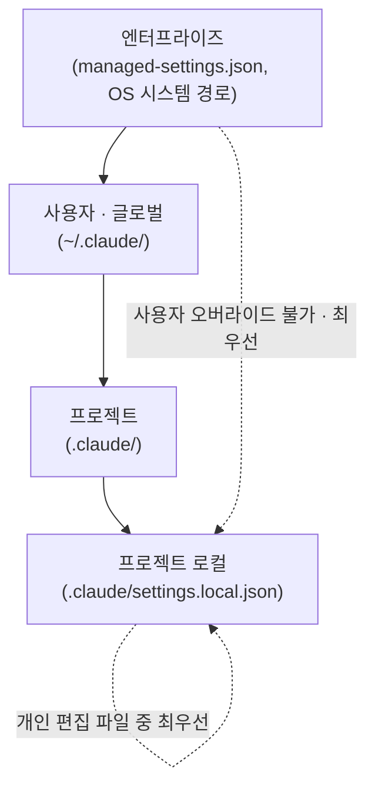

# .claude 디렉터리

`.claude` 디렉터리는 Claude Code에게 "이 프로젝트에서는 이렇게 일해 줘"라고 알려 주는 설정 모음집입니다. 프로젝트 규칙, 권한, 확장 기능을 여기에 두면, Claude Code는 매 세션을 시작할 때 이 디렉터리를 가장 먼저 들여다보고 그 안의 내용을 작업의 출발점으로 삼습니다.


**한 줄 요약**: `.claude`는 Claude Code가 세션마다 들여다보는 프로젝트 전용 "조종판"입니다. 대부분은 git에 커밋해 팀과 공유하고, 기기에만 두어야 할 개인용 파일만 따로 격리합니다.


처음 시작하는 사람이라면 디렉터리 안의 수많은 폴더에 압도당할 필요가 없습니다. 실제로 자주 손대는 파일은 `CLAUDE.md`와 `settings.json` 두 개뿐이고, 나머지 스킬·규칙·서브에이전트는 "또 같은 일을 반복하네" 싶을 때 하나씩 추가하면 됩니다. 이 페이지는 그 두 파일부터 시작해 디렉터리 전체가 어떻게 엮여 돌아가는지를 차근차근 펼쳐 보입니다.

## 왜 설정 디렉터리가 필요한가

에이전틱 코딩에서 가장 큰 비용은 "맥락을 다시 설명하는 일"입니다. 새 세션을 열 때마다 매번 "이 프로젝트는 Go야, 테스트는 이렇게 돌려, 커밋 메시지는 이 규칙이야"를 다시 일러주어야 한다면 그 자체로 토큰 낭비이자 피로입니다. `.claude`는 이 맥락을 한 곳에 고정해 두어, 세션이 바뀌어도 Claude Code가 프로젝트를 잊지 않게 만듭니다.

Claude Code는 설정을 크게 두 곳에서 읽습니다.

- **프로젝트 `.claude/`** — 현재 작업 중인 저장소 안의 디렉터리. 팀과 공유하려는 규칙과 정책을 담고, git에 커밋합니다.
- **글로벌 `~/.claude/`** — 홈 디렉터리 아래. 모든 프로젝트에 두루 적용되는 개인 기본값을 담고, 커밋하지 않습니다.

같은 항목이 두 곳에 있으면 더 구체적인 쪽이 이깁니다. 예를 들어 글로벌에 기본 모델을, 프로젝트에 다른 모델을 적어 두면 프로젝트 값이 우선합니다. 이 우선순위 규칙은 뒤의 [설정 스코프](#설정-스코프-어디까지-적용되는가) 절에서 자세히 다룹니다.

## 지침과 집행: 가장 중요한 한 가지 구분

`.claude` 안의 파일은 두 부류로 나뉩니다. 이 구분을 잡고 들어가면 디렉터리 전체가 한결 명확해집니다.

- **지침** (guidance) — Claude가 "참고해서 따르는" 안내문입니다. `CLAUDE.md`와 `rules/`가 여기 속합니다. Claude가 읽고 존중하지만, 강제력은 없어서 강한 유혹 앞에서는 어길 수도 있습니다.
- **집행** (enforcement) — Claude Code 런타임이 직접 "집행하는" 규칙입니다. `settings.json`의 권한(permissions)과 훅(hook)이 여기 속합니다. Claude의 판단과 무관하게 기계적으로 작동하므로 결정적입니다.

왜 이 구분이 중요할까요. "절대 `main`에 직접 푸시하지 마"라는 규칙을 `CLAUDE.md`에 적어 두면 Claude는 대개 지키지만, 100% 보장은 아닙니다. 반면 같은 규칙을 권한이나 훅으로 구현하면, Claude가 설령 무시하려 해도 런타임이 명령을 막아버립니다. 확실해야 하는 동작은 지침이 아니라 집행으로 만들어야 한다는 것이 곧 하네스 엔지니어링의 첫 설계 결정입니다. MoAI-ADK도 `moai init` 한 번으로 이 디렉터리에 오케스트레이터 지침, 품질 게이트 훅, 에이전트·스킬 자산을 배포해 프로젝트 전용 하네스를 구성합니다.

## 프로젝트 .claude/ 디렉터리 구조

아래 표는 프로젝트 `.claude/` 안에 들어가는 항목을 정리한 것입니다. '커밋' 열은 git에 커밋해 팀과 공유하는지를 나타냅니다.

| 항목 | 위치 | 커밋 | 역할 | 분류 |
| --- | --- | --- | --- | --- |
| `CLAUDE.md` | 프로젝트 루트 또는 `.claude/` |  | 매 세션 컨텍스트로 로드되는 프로젝트 지침 | 지침 |
| `settings.json` | `.claude/` |  | 권한·훅·환경변수·기본 모델 등 집행되는 설정 | 집행 |
| `settings.local.json` | `.claude/` |  | 개인용 설정 오버라이드 (자동 gitignore) | 집행 |
| `rules/` | `.claude/` |  | 주제별로 쪼갠 지침, 파일 경로로 조건부 로드 가능 | 지침 |
| `skills/` | `.claude/` |  | `/<이름>`으로 부르거나 Claude가 자동 호출하는 스킬 | 확장 |
| `commands/` | `.claude/` |  | 단일 파일 프롬프트 (스킬과 동일 메커니즘) | 확장 |
| `agents/` | `.claude/` |  | 독립 컨텍스트를 가진 서브에이전트 정의 | 확장 |
| `workflows/` | `.claude/` |  | 여러 서브에이전트를 조율하는 다이내믹 워크플로우 스크립트 | 확장 |
| `hooks/` | `.claude/` |  | 훅이 실행하는 스크립트 (settings.json에서 등록) | 집행 |
| `agent-memory/` | `.claude/` |  | 서브에이전트 전용 영속 메모리 | 데이터 |
| `.mcp.json` | 프로젝트 루트 |  | 팀 공유 MCP 서버 구성 | 집행 |
| `.worktreeinclude` | 프로젝트 루트 |  | 워크트리 생성 시 복사할 gitignore 패턴 | 데이터 |

### 지침 파일 — Claude가 읽는 것

**`CLAUDE.md`**: 프로젝트의 규칙, 자주 쓰는 명령, 아키텍처 맥락을 담습니다. 매 세션 전체가 컨텍스트로 로드되므로 200줄 이하를 권장하며, 길어지면 `rules/`로 분리합니다.

**`rules/*.md`**: 주제별로 쪼갠 지침 파일입니다. 프론트매터에 `paths:` 글롭이 없으면 세션 시작 시 로드되고, `paths:`가 있으면 해당 경로의 파일이 컨텍스트에 들어올 때만 로드됩니다. `CLAUDE.md`가 200줄에 가까워지면 주제별 룰(rule)로 쪼개는 것이 모범 사례입니다. 이 조건부 로딩은 곧 토크노믹스 — 항상 필요한 지침만 올라오고, 나머지는 필요할 때 올라옵니다.

### 집행 설정 — Claude Code가 강제하는 것

**`settings.json`**: 런타임이 직접 집행하는 설정을 담습니다. 주요 키는 다음과 같습니다.

- `permissions` — 도구와 명령의 허용·차단 목록
- `hooks` — 라이프사이클 이벤트(예: `PostToolUse`, `SessionStart`)에 맞춰 실행할 스크립트
- `model` — 세션 기본 모델
- `env` — 세션에 주입할 환경변수
- `statusLine` — 상태 표시줄 구성
- `outputStyle` — 출력 스타일

`hooks/` 아래의 스크립트는 단독으로 작동하지 않습니다. 반드시 `settings.json`의 `hooks` 키에 이벤트별로 등록해야 비로소 집행됩니다. 스크립트만 만들어 두고 등록을 잊으면, 아무 일도 일어나지 않습니다.

**`settings.local.json`**: `settings.json`과 같은 스키마지만 개인용이며 커밋하지 않습니다. 팀 기본값과 다른 권한이 필요할 때 씁니다. Claude Code는 이 파일을 처음 만들 때 `.gitignore`에 자동으로 추가합니다.


**권한 모드는 부모가 자식에게 우선합니다.** 서브에이전트는 자신을 스폰한 세션의 권한 모드를 상속합니다. 부모가 `acceptEdits`나 `bypassPermissions` 모드라면 자식도 그 모드를 물려받고, 자식 쪽에서 더 좁게 제한하려 해도 부모가 이깁니다. 따라서 서브에이전트를 읽기 전용으로 격리하려면 권한 모드가 아니라 **도구 제한**(`tools:` 목록에서 쓰기 도구를 빼는 방식)으로 구현해야 합니다.


### 확장 자산 — 능력을 늘리는 것

**`skills/<name>/SKILL.md`**: 폴더 단위 스킬입니다. 참고 문서·템플릿·스크립트를 함께 번들할 수 있어, 단일 파일보다 훨씬 풍성한 워크플로우를 담습니다.

**`commands/*.md`**: 단일 파일 프롬프트입니다. 공식적으로 스킬과 같은 메커니즘으로 동작하며, 새 워크플로우를 짠다면 스킬로 작성하기를 권합니다.

**`agents/*.md`**: 자체 시스템 프롬프트와 도구 접근 권한을 갖춘 서브에이전트 정의입니다. 각자 새 컨텍스트 윈도우에서 실행되어 메인 대화를 깨끗하게 유지합니다.


**서브에이전트 중첩** (CC 2.1.219+). Claude Code v2.1.219부터 서브에이전트가 기본적으로 깊이 3까지 중첩 spawn할 수 있습니다. 즉 서브에이전트가 다시 서브에이전트를 부를 수 있다는 뜻입니다. 이 동작이 싫다면 환경변수 `CLAUDE_CODE_MAX_SUBAGENT_SPAWN_DEPTH=1`로 한 단계까지만 허용할 수 있습니다. (v2.1.217~218에는 잠시 기본 비활성화 시기가 있었으나 219에서 다시 켜졌습니다.)


**`workflows/*.js`**: 다수의 서브에이전트를 스폰하고 조율하는 다이내믹 워크플로우 스크립트입니다. 단일 세션에서 처리하기엔 큰 규모의 병렬 작업을 한 번에 펼칠 때 씁니다.

## 글로벌 ~/.claude/ 디렉터리 구조

프로젝트 `.claude/`가 "이 저장소에서는"이라면, 글로벌 `~/.claude/`는 "내가 작업하는 모든 곳에서"입니다. 팀원과 공유할 필요 없이 나만의 기본값을 두는 자리입니다.

| 항목 | 위치 | 역할 |
| --- | --- | --- |
| `CLAUDE.md` | `~/.claude/` | 모든 프로젝트에 적용되는 개인 지침 |
| `settings.json` | `~/.claude/` | 모든 프로젝트의 기본 설정 (프로젝트 설정으로 덮어씀) |
| `keybindings.json` | `~/.claude/` | 커스텀 키보드 단축키 |
| `skills/` | `~/.claude/` | 모든 프로젝트에서 쓸 수 있는 개인 스킬 |
| `commands/` | `~/.claude/` | 모든 프로젝트에서 쓸 수 있는 개인 명령 |
| `agents/` | `~/.claude/` | 모든 프로젝트에서 쓸 수 있는 개인 서브에이전트 |
| `workflows/` | `~/.claude/` | 모든 프로젝트에서 쓸 수 있는 개인 워크플로우 |
| `output-styles/` | `~/.claude/` | 개인 출력 스타일 |
| `projects/` | `~/.claude/` | 프로젝트별 세션 기록·대화 전사·자동 메모리 |

`projects/` 아래에는 저장소마다 세션 기록이 JSONL 파일로 쌓입니다. 덕분에 세션을 되감거나(rewind) 이어가거나(resume) 분기할(fork) 수 있고, 자동 메모리도 여기에 저장됩니다.

## 설정 스코프: 어디까지 적용되는가

같은 설정이 여러 위치에 존재할 수 있고, 더 구체적인 스코프가 우선합니다. 스코프는 엔터프라이즈, 사용자, 프로젝트, 프로젝트 로컬 네 단계로 나뉩니다.

```mermaid
flowchart TD
    A["엔터프라이즈<br/>(managed-settings.json, OS 시스템 경로)"] --> B["사용자 · 글로벌<br/>(~/.claude/)"]
    B --> C["프로젝트<br/>(.claude/)"]
    C --> D["프로젝트 로컬<br/>(.claude/settings.local.json)"]
    A -.->|"사용자 오버라이드 불가 · 최우선"| D
    D -.->|"개인 편집 파일 중 최우선"| D
```

| 스코프 | 위치 | 적용 범위 | 우선순위 |
| --- | --- | --- | --- |
| 엔터프라이즈 | `managed-settings.json` (OS별 시스템 경로) | 조직 전체 | 최우선 (사용자 오버라이드 불가) |
| 사용자(글로벌) | `~/.claude/` | 모든 프로젝트 | 개인 기본값 |
| 프로젝트 | `.claude/` | 현재 프로젝트 | 팀 공유 |
| 프로젝트 로컬 | `.claude/settings.local.json` | 현재 프로젝트, 개인 | 사용자 편집 파일 중 최우선 |

우선순위의 작동 방식은 설정 종류에 따라 다릅니다. 이 차이를 모르면 "왜 내 설정이 안 먹지?"라는 혼란에 빠지기 쉽습니다.

- **배열 설정** (`permissions.allow` 등) — 모든 스코프의 값이 **합쳐집니다**. 엔터프라이즈가 허용한 명령, 사용자가 허용한 명령, 프로젝트가 허용한 명령이 모두 누적되어 한꺼번에 적용됩니다.
- **스칼라 설정** (`model` 등) — 가장 구체적인 스코프의 **단일 값 하나만** 사용됩니다. 글로벌에 Sonnet, 프로젝트에 Opus를 적어 두면 프로젝트의 Opus가 이깁니다.

## 무엇을 커밋하고 무엇을 뺄까

버전 관리의 기본 원칙은 단순합니다. **팀이 공유해야 할 것은 커밋하고, 개인에게만 해당하는 것은 뺍니다.**

| 파일 | 커밋 | 이유 |
| --- | --- | --- |
| `CLAUDE.md`, `rules/`, `settings.json` |  | 팀이 공유하는 컨텍스트와 정책 |
| `skills/`, `commands/`, `agents/`, `workflows/` |  | 팀이 공유하는 확장 자산 |
| `hooks/` (스크립트) |  | 팀이 공유하는 자동화 (settings.json 등록 포함) |
| `.mcp.json` |  | 팀 공유 MCP 서버 구성 |
| `settings.local.json` |  | 개인 오버라이드 (자동 gitignore) |
| `CLAUDE.local.md` |  | 프로젝트별 개인 지침 (수동 생성 후 `.gitignore` 추가) |
| `~/.claude/` 전체 |  | 모든 프로젝트에 적용되는 개인 설정 |

`settings.local.json`은 Claude Code가 처음 만들 때 `.gitignore`에 자동으로 추가하므로 따로 손 쓸 필요가 없습니다. 반면 `CLAUDE.local.md`는 공식적으로 지원되는 파일명이지만 자동 무시 대상이 아니어서, 쓰려면 직접 `.gitignore`에 한 줄 추가해야 실수로 개인 메모가 팀 저장소에 올라가는 일을 막을 수 있습니다.

## MoAI-ADK와 어떻게 이어지는가

MoAI-ADK는 바로 이 `.claude` 디렉터리를 자기 작업판으로 삼습니다. `moai init`을 실행하면 오케스트레이터 헌법(`CLAUDE.md`), 품질 게이트 훅(`settings.json`의 `hooks`), 11종 관리 에이전트 정의(`agents/`), 워크플로우 스킬(`skills/`)이 이 디렉터리에 자리잡습니다. 즉 이 페이지에서 본 지침과 집행의 이분법, 스코프 우선순위, 커밋 원칙이 곧 MoAI-ADK 하네스가 서 있는 토대입니다.

토크노믹스 관점에서도 이 디렉터리는 결정적입니다. `CLAUDE.md`와 항상 로드되는 `rules/`는 매 세션마다 컨텍스트를 차지하므로, 한 줄 한 줄이 곧 토큰 비용입니다. 그래서 공식 문서는 `CLAUDE.md`를 200줄 이하로 유지하고, 조건부 로딩(`paths:`)으로 필요할 때만 올라오게 만들라고 권합니다. 이 점은 [CLAUDE.md 가이드](/ko/advanced/claude-md-guide)에서 더 깊이 다룹니다.

## 관련 문서

- [settings.json 가이드](/ko/advanced/settings-json)
- [CLAUDE.md 가이드](/ko/advanced/claude-md-guide)
- [Statusline 시스템](/ko/advanced/statusline)
- [작동 원리](/ko/claude-code/foundations/how-claude-code-works)

## 참고 자료

- [Explore the .claude directory (Claude Code 공식 문서)](https://code.claude.com/docs/en/claude-directory)


새 프로젝트라면 처음부터 폴더를 다 채우려 하지 마세요. `CLAUDE.md`와 `settings.json` 두 파일만 먼저 채우고, 팀 권한·훅은 프로젝트 `settings.json`에, 본인만 쓰는 권한은 `settings.local.json`에 두면 git 충돌 없이 깔끔하게 시작할 수 있습니다. 그러고 나서 "또 이걸 반복하네" 싶은 순간마다 규칙 → 스킬 → 훅 순으로 하나씩 붙여 나가면 됩니다.

