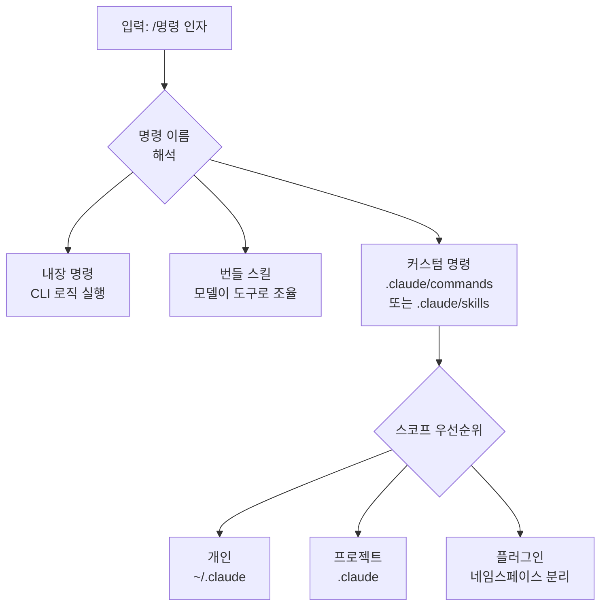

슬래시 명령어 (slash command)는 세션 안에서 `/`로 시작하는 한 줄로 Claude Code를 직접 조작하는 가장 빠른 방법입니다.


**한 줄 요약**: `/`로 시작하는 입력 한 줄이 모델 전환부터 컨텍스트 정리, 그리고 직접 만든 워크플로우 실행까지 세션을 손끝에서 제어합니다.


## 슬래시 명령이란 무엇인가

슬래시 명령은 세션 내부에서 Claude Code를 제어합니다. 모델을 바꾸거나, 권한을 관리하거나, 컨텍스트를 비우거나, 워크플로우를 실행하는 일을 한 줄로 처리합니다. 입력창에 `/`만 입력하면 사용 가능한 모든 명령이 나열되고, `/` 뒤에 글자를 이어 입력하면 필터링됩니다.

핵심 규칙은 단 하나입니다. **명령은 메시지의 맨 앞에서만** 인식됩니다. 명령 이름 뒤에 따라오는 텍스트는 그 명령에 인자 (argument)로 전달됩니다.

명령은 크게 세 부류로 나뉩니다.

| 부류 | 정의 위치 | 동작 방식 |
| :--- | :--- | :--- |
| 내장 명령 | CLI에 코드로 내장 | 고정된 로직을 직접 실행 |
| 번들 스킬 (bundled skill) | Claude Code에 동봉된 스킬 | 모델에게 지시를 건네고 모델이 도구로 작업을 조율 |
| 커스텀 명령 | `.claude/commands/` 또는 `.claude/skills/` | 사용자가 마크다운으로 직접 정의 |

## 내장 슬래시 명령 예시

자주 쓰는 내장 명령과 번들 스킬을 정리하면 다음과 같습니다. 전체 목록은 입력창에서 `/`로 확인하거나 공식 명령 레퍼런스를 참고합니다.

| 명령 | 용도 |
| :--- | :--- |
| `/help` | 도움말과 사용 가능한 명령 목록 표시 |
| `/clear` | 컨텍스트를 비우고 새 대화 시작 (이전 대화는 `/resume`에 보존) |
| `/compact` | 같은 대화를 유지한 채 지금까지의 내용을 요약해 컨텍스트 확보 |
| `/context` | 현재 컨텍스트 윈도우 사용량을 색상 그리드로 시각화 |
| `/cost` | 세션 비용과 플랜 사용량 표시 (`/usage`, `/stats`의 별칭) |
| `/model` | AI 모델 전환 및 기본 모델 저장 |
| `/effort` | 모델의 추론 깊이 (effort 레벨) 설정 |
| `/config` | 테마, 모델, 출력 스타일 등 설정 화면 열기 (`/settings`의 별칭) |
| `/agents` | 서브에이전트 구성 관리 |
| `/skills` | 사용 가능한 스킬 목록 표시 |
| `/mcp` | MCP 서버 연결 및 인증 관리 |
| `/hooks` | 도구 이벤트별 hook 구성 확인 |
| `/permissions` | 도구 권한의 allow/ask/deny 규칙 관리 (`/allowed-tools`의 별칭) |
| `/init` | 프로젝트에 시작용 `CLAUDE.md` 생성 |
| `/memory` | `CLAUDE.md` 메모리 파일 편집 |
| `/plan` | 큰 변경 전에 플랜 모드 진입 |
| `/rewind` | 코드와 대화를 이전 체크포인트로 되돌리기 (체크포인팅) |
| `/resume` | ID나 이름으로 대화 재개 (`/continue`의 별칭) |
| `/doctor` | 설치와 설정 진단 |

`/cost`와 `/stats`가 `/usage`의 별칭인 것처럼, 같은 기능을 여러 이름으로 부를 수 있는 경우가 많습니다. 또한 일부 명령은 플랫폼, 플랜, 환경에 따라 노출 여부가 달라집니다.

## 커스텀 슬래시 명령

직접 쓰는 명령은 마크다운 파일로 정의합니다. `.claude/commands/deploy.md` 파일은 `/deploy` 명령을 만들고, 동일한 작업을 `.claude/skills/deploy/SKILL.md` 스킬로도 만들 수 있습니다. 두 방식은 같은 명령을 만들고 동일하게 동작합니다. 기존 `.claude/commands/` 파일은 그대로 동작하며, 같은 이름의 스킬과 명령이 충돌하면 스킬이 우선합니다.

> 커스텀 명령은 스킬로 통합되었습니다. 새 명령을 만든다면 보조 파일을 함께 둘 수 있는 스킬 형식이 권장되지만, 단순한 한 파일짜리 명령은 `.claude/commands/`도 충분합니다.

### frontmatter 필드

마크다운 파일 상단의 YAML frontmatter로 동작을 조정합니다. 모든 필드는 선택이며, 모델이 자동 호출 시점을 판단하도록 `description`만큼은 권장됩니다.

| 필드 | 설명 |
| :--- | :--- |
| `description` | 명령이 하는 일과 사용 시점. 모델이 자동 호출 여부를 판단하는 데 사용 |
| `allowed-tools` | 명령 활성화 동안 승인 없이 쓸 수 있는 도구. 공백/쉼표 구분 문자열 또는 YAML 리스트 |
| `argument-hint` | 자동완성 시 표시할 인자 힌트. 예: `[issue-number]` |
| `disable-model-invocation` | `true`면 모델 자동 호출을 막고 사용자만 `/name`으로 실행 |
| `model` | 명령 실행 동안 사용할 모델 (현재 턴 한정) |

```yaml
---
description: GitHub 이슈를 우리 코딩 표준에 따라 수정합니다
argument-hint: [issue-number]
disable-model-invocation: true
allowed-tools: Bash(git add *) Bash(git commit *)
---

GitHub 이슈 $ARGUMENTS 를 우리 코딩 표준에 따라 수정하세요.

1. 이슈 설명을 읽습니다
2. 수정을 구현합니다
3. 테스트를 작성합니다
4. 커밋을 생성합니다
```

`disable-model-invocation: true`는 배포나 커밋처럼 부작용이 있어 타이밍을 직접 제어하고 싶은 워크플로우에 유용합니다. 코드가 준비돼 보인다는 이유로 모델이 마음대로 배포하지 않도록 막아 줍니다.

### $ARGUMENTS 치환

명령 이름 뒤에 입력한 텍스트는 `$ARGUMENTS` 자리에 치환됩니다. 위 예시에서 `/fix-issue 123`을 실행하면 `$ARGUMENTS`가 `123`으로 바뀝니다. 명령 본문에 `$ARGUMENTS`가 없으면 입력한 내용이 본문 끝에 `ARGUMENTS: <입력값>` 형태로 덧붙여집니다.

위치별 인자도 쓸 수 있습니다.

| 표기 | 의미 |
| :--- | :--- |
| `$ARGUMENTS` | 입력한 전체 인자 문자열 |
| `$ARGUMENTS[N]` | 0부터 시작하는 N번째 인자 |
| `$N` | `$ARGUMENTS[N]`의 축약형 (`$0`이 첫 번째) |

예를 들어 본문에 `$0 컴포넌트를 $1 에서 $2 로 마이그레이션`이라고 쓰고 `/migrate-component SearchBar React Vue`를 실행하면, `$0`은 `SearchBar`, `$1`은 `React`, `$2`는 `Vue`로 치환됩니다. 공백이 포함된 값은 따옴표로 묶어 하나의 인자로 전달합니다.

### 동적 컨텍스트 주입

본문에서 `` !`<명령>` `` 구문은 명령 내용이 모델에게 전달되기 **전에** 셸 명령을 실행하고, 그 출력으로 자리를 채웁니다. 모델은 명령이 아니라 실제 데이터를 받습니다.

```markdown
## 현재 변경 사항

!`git diff HEAD`

## 지시

위 변경 사항을 두세 개 항목으로 요약하고 위험 요소를 나열하세요.
```

이 인라인 형식은 `!`가 줄 맨 앞이나 공백 바로 뒤에 올 때만 인식됩니다. 여러 줄 명령은 `` ```! `` 펜스 블록을 사용합니다. 또한 `@파일경로` 형태로 파일 내용을 본문에 참조해 넣을 수 있습니다.

## 스코프: 프로젝트 vs 개인

명령과 스킬을 어디에 두느냐가 사용 범위를 결정합니다.

| 스코프 | 경로 | 적용 범위 |
| :--- | :--- | :--- |
| 개인 | `~/.claude/commands/` 또는 `~/.claude/skills/` | 내 모든 프로젝트 |
| 프로젝트 | `.claude/commands/` 또는 `.claude/skills/` | 해당 프로젝트만 |
| 플러그인 | `<plugin>/skills/` | 플러그인이 활성화된 곳 |

같은 이름이 여러 레벨에 있으면 개인이 프로젝트를 덮어씁니다 (조직 단위 enterprise 설정이 있으면 그것이 최우선). 프로젝트 스코프 명령의 `allowed-tools`는 해당 폴더의 워크스페이스 신뢰 (workspace trust) 대화를 수락한 뒤에 적용됩니다. 신뢰할 수 없는 저장소의 명령은 스스로에게 넓은 도구 권한을 부여할 수 있으니 사용 전 검토합니다.

하위 디렉터리를 두면 자연스럽게 네임스페이스가 생깁니다. 또한 프로젝트 스킬은 시작 디렉터리부터 저장소 루트까지 상위 경로의 `.claude/skills/`를 모두 탐색하므로, 하위 폴더에서 Claude Code를 시작해도 루트의 명령을 그대로 인식합니다.



## 플러그인이 제공하는 명령

플러그인 (plugin)은 자체 `skills/` 디렉터리에 명령을 담아 배포할 수 있습니다. 플러그인 스킬은 `플러그인이름:스킬이름` 네임스페이스를 사용하므로 다른 레벨의 명령과 이름이 충돌하지 않습니다. 예를 들어 `my-plugin/skills/review/SKILL.md`는 `/my-plugin:review`로 호출됩니다. 플러그인 자체는 `/plugin` 명령으로 관리합니다.

## MoAI-ADK의 /moai 명령과의 관계

MoAI-ADK가 제공하는 `/moai`와 그 하위 명령 (`/moai plan`, `/moai run`, `/moai sync` 등)은 바로 이 슬래시 명령 메커니즘 위에 스킬로 구현되어 있습니다. 즉 MoAI-ADK는 Claude Code의 커스텀 명령 표준을 그대로 사용해, SPEC 기반 워크플로우를 한 줄 명령으로 노출합니다.

| 구분 | Claude Code 슬래시 명령 | MoAI-ADK `/moai` 명령 |
| :--- | :--- | :--- |
| 정체 | 세션 제어 메커니즘 | 그 메커니즘으로 구현된 스킬 묶음 |
| 정의 위치 | `.claude/commands` 또는 `.claude/skills` | MoAI-ADK가 배포하는 스킬 |
| 역할 | 모델 전환, 컨텍스트 관리 등 | 에이전트 오케스트레이션 워크플로우 |

`/moai` 명령 자체의 동작과 하위 명령은 별도 문서에서 다룹니다.

## 관련 문서

- [/moai 명령어](/utility-commands/moai)
- [워크플로우 명령어](/workflow-commands)
- [대화형 모드](/claude-code/foundations/interactive-mode)

## 참고 자료

- [Claude Code Commands (공식 문서)](https://code.claude.com/docs/en/commands)
- [Extend Claude with skills (공식 문서)](https://code.claude.com/docs/en/skills)


부작용이 있는 명령 (배포, 커밋, 외부 전송 등)에는 `disable-model-invocation: true`를 넣어 모델이 임의로 실행하지 못하게 하고, 실행 타이밍을 직접 손에 쥐세요.

