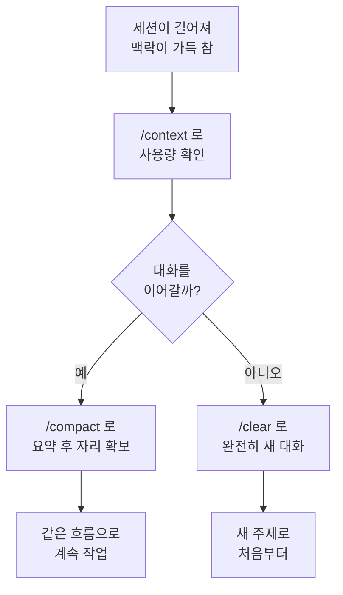
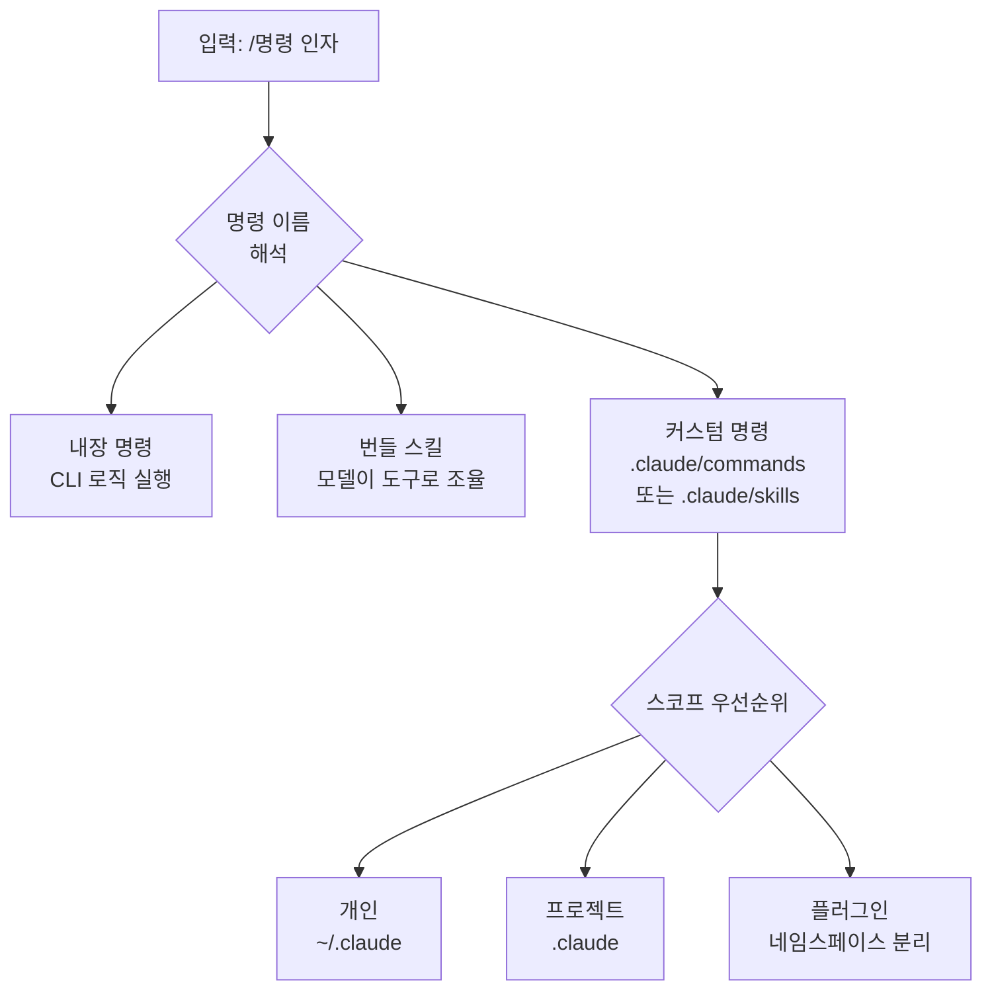

# 슬래시 명령어

세션 창에 `/` 하나를 치면 모델을 바꾸고, 컨텍스트를 비우고, 직접 만든 워크플로우를 실행하는 명령 메뉴가 한꺼번에 펼쳐집니다. 슬래시 명령어(slash command)는 그렇게 `/`로 시작하는 한 줄로 Claude Code를 직접 조종하는 가장 빠른 수단입니다.


**한 줄 요약**: `/`로 시작하는 입력 한 줄이 모델 전환부터 컨텍스트 정리, 직접 만든 워크플로우 실행까지 세션을 손쉽게 제어합니다.


## 왜 한 줄 명령이 필요한가

에이전트는 한 번 요청을 받으면 혼자서 파일을 뒤지고 코드를 고치고 명령을 실행합니다. 그래서 "이번 턴은 다른 모델로 바꿔 줘", "지금까지 대화는 요약해 줘", "내가 만든 배포 워크플로우를 실행해 줘"처럼 **모델이 하는 일이 아니라 세션 자체를 조종**하는 일이 자주 생깁니다. 이런 조종을 매번 자연어로 길게 설명하는 대신 한 단어로 부를 수 있게 만든 것이 슬래시 명령입니다.

입력창에 `/`만 치면 사용 가능한 모든 명령이 나열되고, `/` 뒤에 글자를 이어 입력하면 실시간으로 후보가 좁아집니다. 핵심 규칙은 단 하나입니다 — **명령은 메시지 맨 앞에서만** 인식되고, 명령 이름 뒤에 따라오는 텍스트는 그 명령의 인자(argument)로 넘어갑니다.

명령은 크게 세 부류로 나뉩니다.

| 부류 | 정의 위치 | 동작 방식 |
| :--- | :--- | :--- |
| 내장 명령 | CLI에 코드로 내장 | 고정된 로직을 직접 실행 |
| 번들 스킬 (bundled skill) | Claude Code에 동봉된 스킬 | 모델에게 지시를 건네고 모델이 도구로 작업을 조율 |
| 커스텀 명령 | `.claude/commands/` 또는 `.claude/skills/` | 사용자가 마크다운으로 직접 정의 |

## 자주 쓰는 명령 한눈에

자주 쓰는 명령을 종류별로 정리합니다. 전체 목록은 입력창에서 `/`를 입력하면 확인할 수 있고, 공식 명령 레퍼런스는 [code.claude.com/docs/en/commands](https://code.claude.com/docs/en/commands)를 참고하세요. 아래 핵심 명령의 쓰임새는 바로 다음 절에서 더 깊이 다룹니다.

### 내장 명령 (Built-in)

| 명령 | 용도 | 버전 |
| :--- | :--- | :--- |
| `/goal <condition>` | 완료 조건을 세우고 여러 턴에 걸쳐 자율 진행 | v2.1.139+ |
| `/workflows` | 다이내믹 워크플로우 실행 목록 관리 UI | v2.1.139+ |
| `/rewind` (별칭: `/checkpoint`, `/undo`) | 코드와 대화를 이전 체크포인트로 되돌리기 | v2.1.191+ |
| `/context [all]` | 현재 컨텍스트 윈도우 사용량 분석 | 기본 |
| `/memory` | `CLAUDE.md` + 자동 메모리 로드 목록/토글 | v2.1.59+ |
| `/compact` | 같은 대화를 유지한 채 지금까지의 내용을 요약해 컨텍스트 확보 | 기본 |
| `/clear` (별칭: `/reset`, `/new`) | 컨텍스트를 비우고 새 대화 시작 | 기본 |
| `/agents` | 서브에이전트 관리 (v2.1.198에서 생성 마법사 제거 — Claude에게 요청하거나 `.claude/agents/`를 직접 편집) | v2.1.139+ |
| `/mcp` | MCP 서버 연결 및 OAuth 인증 관리 | v2.1.186+ |
| `/plugin` | 플러그인 관리 | 기본 |
| `/effort [low\|medium\|high\|xhigh\|max\|ultracode\|auto]` | 모델의 추론 강도 또는 오케스트레이션 설정 | 기본 |
| `/model` | AI 모델 선택 | 기본 |
| `/background` (별칭: `/bg`) | 백그라운드 실행 | v2.1.139+ |
| `/fork <directive>` | 대화를 상속한 포크 서브에이전트 | v2.1.161+ |
| `/recap` | 세션 요약 | 기본 |
| `/btw` | 사이드 질문 | v2.1.187+ |
| `/cd` | 세션 작업 디렉터리 변경, 프롬프트 캐시 보존 | v2.1.169+ |
| `/schedule` (별칭: `/routines`) | 예약 작업 | v2.1.72+ |
| `/branch`, `/tasks`, `/plan`, `/doctor`, `/skills`, `/reload-skills`, `/reload-plugins` | 기타 관리 명령 | 기본 |

### 스킬 명령 `[Skill]`

| 명령 | 용도 |
| :--- | :--- |
| `/loop` (별칭: `/proactive`) | 반복 루프 실행 (interval 기반) |
| `/batch` | 배치 실행 |
| `/simplify` | 코드 단순화 (v2.1.154+) |
| `/code-review` | 코드 리뷰 |
| `/dataviz` | 데이터로 시각화 생성 (v2.1.198+) |

### 워크플로우 명령 `[Workflow]`

| 명령 | 용도 |
| :--- | :--- |
| `/deep-research` | 웹 검색을 병렬 수행하고 결과를 교차 검증하는 리서치 (WebSearch 필요) |

### 명령 가용성 참고

- 같은 기능을 여러 이름으로 부를 수 있는 경우가 많습니다 (별칭).
- 일부 명령은 플랫폼, 플랜, 환경에 따라 노출 여부가 달라집니다.
- `ultracode`는 현재 워크플로우 트리거 키워드(pre-v2.1.160에는 `workflow`였음)이면서 동시에 `/effort` 레벨입니다.

## 핵심 명령을 깊이 파보기

위 표는 빠른 참고용입니다. 이 절에서는 처음 쓸 때 가장 헷갈리기 쉬운 다섯 가지 명령을 개념부터 짚어 봅니다.

### /model — 어떤 모델로 일할까

`/model`은 이 세션에서 쓸 AI 모델을 고릅니다. Claude Code에서 현재 선택할 수 있는 라인업은 다음과 같습니다.

| 모델 | 특징 |
| :--- | :--- |
| Fable 5 (`claude-fable-5`) | 현재 최상위(Mythos-tier). 가장 깊은 추론 |
| Opus 5 | 차상위. 복잡한 코딩과 설계 |
| Sonnet 5 | 균형형. 일상 작업 |
| Haiku 4.5 | 가볍고 빠른 경량 작업 |

모델마다 추론 깊이·속도·비용이 다릅니다. 무거운 설계 작업은 Fable이나 Opus에, 빠르고 반복적인 일은 Sonnet이나 Haiku에 맡기는 식으로 작업 무게에 맞춰 고릅니다. 단축키 `Option+P`(macOS) 또는 `Alt+P`로도 빠르게 전환할 수 있습니다.


서브에이전트를 부를 때도 어떤 모델로 돌릴지 명시해 주면, 각 작업에 가장 알맞은 모델이 확실히 적용됩니다. 스폰 시점에 모델을 따로 정하지 않으면 서브에이전트는 부모 세션의 모델을 그대로 물려받습니다.


### 컨텍스트를 다루는 세 가지: /context · /compact · /clear

모델이 한 번에 들고 다닐 수 있는 대화 맥락에는 한계가 있습니다. 이 한계를 **컨텍스트 윈도우** (context window)라고 부르며, 세션이 길어질수록 이전 대화와 파일 내용이 쌓여 한계에 다가갑니다. Claude Code는 이 맥락을 다루는 세 가지 명령을 제공합니다. 셋의 차이를 한눈에 비교하면 다음과 같습니다.

| 명령 | 하는 일 | 언제 쓰나 |
| :--- | :--- | :--- |
| `/context [all]` | 지금 컨텍스트 윈도우를 얼마나 쓰고 있는지 분석 | "맥락이 얼마나 찼는지 확인하고 싶어" |
| `/compact` | 같은 대화를 유지한 채 지금까지의 내용을 요약해 자리 확보 | "대화는 이어가고 싶은데 맥락이 아쉬워" |
| `/clear` | 컨텍스트를 완전히 비우고 새 대화 시작 | "주제를 바꾸거나 처음부터 다시" |

`/context`는 먼저 상태를 살피는 명령입니다. `[all]`을 붙이면 더 넓은 범위까지 분석합니다. `/compact`는 요약된 맥락으로 대화의 흐름을 이어 가고 싶을 때 씁니다 — 앞선 맥락이 필요하지만 더 이상 한 줄 한 줄이 필요 없을 때 자리를 되찾는 방법입니다. `/clear`는 아예 새 출발이 필요할 때 씁니다. 프롬프트 캐시도 함께 날아가니 무거운 재시작이라는 점은 염두에 둡니다.


```mermaid
flowchart TD
    A["세션이 길어져<br>맥락이 가득 참"] --> B["/context 로<br>사용량 확인"]
    B --> C{"대화를<br>이어갈까?"}
    C -- "예" --> D["/compact 로<br>요약 후 자리 확보"]
    C -- "아니오" --> E["/clear 로<br>완전히 새 대화"]
    D --> F["같은 흐름으로<br>계속 작업"]
    E --> G["새 주제로<br>처음부터"]
```

### /agents — 서브에이전트 관리

`/agents`는 세션 안에서 불러 쓰는 **서브에이전트** (subagent)를 살펴보는 명령입니다. v2.1.198부터는 새 서브에이전트를 만들던 대화형 마법사가 걷혔습니다 — 이제 새 서브에이전트를 만드는 길은 두 가지입니다.

1. Claude에게 "코드 리뷰 서브에이전트를 만들어 줘"처럼 자연어로 부탁하기
2. `.claude/agents/` 폴더에 마크다운 파일을 직접 만들기

서브에이전트 정의는 파일 하나가 곧 서브에이전트 하나입니다. 정의 파일의 구조(frontmatter 필드, 도구 제한 등)는 [서브에이전트](/ko/claude-code/agentic/sub-agents) 문서에서 다룹니다.

서브에이전트가 세션 안에서 어떻게 돌아가는지도 짚어 두면 좋습니다. v2.1.198부터 서브에이전트는 기본적으로 백그라운드에서 실행되어 메인 세션이 멈춰 기다리지 않아도 되고, 권한 프롬프트는 메인 세션에 표시됩니다. 또 v2.1.219부터는 서브에이전트가 다시 서브에이전트를 부르는 **중첩 스폰**이 깊이 3까지 기본 허용됩니다 — 환경변수 `CLAUDE_CODE_MAX_SUBAGENT_SPAWN_DEPTH=1`으로 끌 수 있습니다.

### /effort와 ultrathink — 추론 깊이 조절

`/effort`로 모델의 추론 강도를 정합니다. `low` · `medium` · `high` · `xhigh` · `max`의 단계와 `auto`, 그리고 워크플로우 오케스트레이션을 켜는 `ultracode`가 있습니다. 코딩처럼 생각이 깊이 필요한 작업에서는 보통 `xhigh`를 권합니다.

대화창에 `ultrathink`라는 키워드를 적는 것도 같은 효과를 냅니다. `ultrathink`는 `effort`를 `xhigh`로 올리는 동시에 **Adaptive Thinking** (모델이 스스로 추론에 쓸 토큰 양을 정하는 방식)을 켭니다. 고정된 사고 예산인 `budget_tokens`를 직접 지정하던 옛 방식은 더 이상 권장하지 않습니다 — Opus 4.7 이상에서는 고정 예산이 거부됩니다.

## 커스텀 슬래시 명령

직접 쓰는 명령은 마크다운 파일로 정의합니다. `.claude/commands/deploy.md` 파일은 `/deploy` 명령을 만들고, 동일한 작업을 `.claude/skills/deploy/SKILL.md` 스킬로도 만들 수 있습니다. 두 방식은 같은 명령을 만들고 동일하게 동작합니다. 기존 `.claude/commands/` 파일은 그대로 동작하며, 같은 이름의 스킬과 명령이 충돌하면 스킬이 우선합니다.

> 커스텀 명령은 스킬로 통합되었습니다. 새로 만든다면 보조 파일까지 같이 둘 수 있는 스킬 형식을 권하지만, 한 파일이면 끝나는 단순한 명령은 `.claude/commands/`로도 충분합니다.

### frontmatter 필드

마크다운 파일 맨 위의 YAML frontmatter로 동작을 조정합니다. 모든 필드가 선택 사항이지만 `description`만큼은 채워 두세요. 모델이 이 명령을 언제 자동으로 부를지 판단하는 근거가 됩니다.

| 필드 | 설명 |
| :--- | :--- |
| `description` | 명령이 하는 일과 사용 시점. 모델이 자동 호출 여부를 판단하는 데 사용 |
| `allowed-tools` | 명령 활성화 동안 승인 없이 쓸 수 있는 도구. 공백/쉼표 구분 문자열 또는 YAML 리스트 |
| `argument-hint` | 자동완성 시 표시할 인자 힌트. 예: `[issue-number]` |
| `disable-model-invocation` | `true`면 모델 자동 호출을 막고 사용자만 `/name`으로 실행 |
| `model` | 명령 실행 동안 사용할 모델 (현재 턴 한정) |

```yaml
---
description: GitHub 이슈를 우리 코딩 표준에 따라 수정합니다
argument-hint: [issue-number]
disable-model-invocation: true
allowed-tools: Bash(git add *) Bash(git commit *)
---

GitHub 이슈 $ARGUMENTS 를 우리 코딩 표준에 따라 수정하세요.

1. 이슈 설명을 읽습니다
2. 수정을 구현합니다
3. 테스트를 작성합니다
4. 커밋을 생성합니다
```

`disable-model-invocation: true`는 배포나 커밋처럼 부작용이 있어 타이밍을 직접 제어하고 싶은 워크플로우에 유용합니다. 코드가 준비돼 보인다는 이유로 모델이 마음대로 배포하지 않도록 막아 줍니다.

### $ARGUMENTS 치환

명령 이름 뒤에 입력한 텍스트는 `$ARGUMENTS` 자리에 치환됩니다. 위 예시에서 `/fix-issue 123`을 실행하면 `$ARGUMENTS`가 `123`으로 바뀝니다. 명령 본문에 `$ARGUMENTS`가 없으면 입력한 내용이 본문 끝에 `ARGUMENTS: <입력값>` 형태로 덧붙여집니다.

위치별 인자도 쓸 수 있습니다.

| 표기 | 의미 |
| :--- | :--- |
| `$ARGUMENTS` | 입력한 전체 인자 문자열 |
| `$ARGUMENTS[N]` | 0부터 시작하는 N번째 인자 |
| `$N` | `$ARGUMENTS[N]`의 축약형 (`$0`이 첫 번째) |

예를 들어 본문에 `$0 컴포넌트를 $1 에서 $2 로 마이그레이션`이라고 쓰고 `/migrate-component SearchBar React Vue`를 실행하면, `$0`은 `SearchBar`, `$1`은 `React`, `$2`는 `Vue`로 치환됩니다. 공백이 포함된 값은 따옴표로 묶어 하나의 인자로 전달합니다.

### 동적 컨텍스트 주입

본문에 쓴 `` !`<명령>` `` 구문은 내용이 모델에게 넘어가기 **전에** 셸 명령을 실행하고 그 출력으로 자리를 채웁니다. 모델이 받는 것은 명령문이 아니라 실제 데이터입니다.

```markdown
## 현재 변경 사항

!`git diff HEAD`

## 지시

위 변경 사항을 두세 개 항목으로 요약하고 위험 요소를 나열하세요.
```

이 인라인 형식은 `!`가 줄 맨 앞이나 공백 바로 뒤에 올 때만 인식됩니다. 여러 줄 명령은 `` ```! `` 펜스 블록을 사용합니다. 또한 `@파일경로` 형태로 파일 내용을 본문에 참조해 넣을 수 있습니다.

## 스코프: 프로젝트 vs 개인

명령과 스킬을 어디에 두느냐가 사용 범위를 결정합니다.

| 스코프 | 경로 | 적용 범위 |
| :--- | :--- | :--- |
| 개인 | `~/.claude/commands/` 또는 `~/.claude/skills/` | 내 모든 프로젝트 |
| 프로젝트 | `.claude/commands/` 또는 `.claude/skills/` | 해당 프로젝트만 |
| 플러그인 | `<plugin>/skills/` | 플러그인이 활성화된 곳 |

같은 이름이 여러 레벨에 있으면 개인이 프로젝트를 덮어씁니다 (조직 단위 enterprise 설정이 있으면 그것이 최우선). 프로젝트 스코프 명령의 `allowed-tools`는 해당 폴더의 워크스페이스 신뢰(workspace trust) 대화를 수락한 뒤에 적용됩니다. 신뢰할 수 없는 저장소의 명령이 넓은 도구 권한을 스스로 부여할 수 있으니 사용 전에 검토합니다.

하위 디렉터리를 두면 자연스럽게 네임스페이스가 생깁니다. 또한 프로젝트 스킬은 시작 디렉터리부터 저장소 루트까지 상위 경로의 `.claude/skills/`를 모두 탐색하므로, 하위 폴더에서 Claude Code를 시작해도 루트의 명령을 그대로 인식합니다.


```mermaid
flowchart TD
    A["입력: /명령 인자"] --> B{"명령 이름<br/>해석"}
    B --> C["내장 명령<br/>CLI 로직 실행"]
    B --> D["번들 스킬<br/>모델이 도구로 조율"]
    B --> E["커스텀 명령<br/>.claude/commands<br/>또는 .claude/skills"]
    E --> F{"스코프 우선순위"}
    F --> G["개인<br/>~/.claude"]
    F --> H["프로젝트<br/>.claude"]
    F --> I["플러그인<br/>네임스페이스 분리"]
```

## 플러그인이 제공하는 명령

플러그인(plugin)은 자체 `skills/` 디렉터리에 명령을 담아 배포할 수 있습니다. 플러그인 스킬은 `플러그인이름:스킬이름` 네임스페이스를 사용하므로 다른 레벨의 명령과 이름이 충돌하지 않습니다. 예를 들어 `my-plugin/skills/review/SKILL.md`는 `/my-plugin:review`로 호출됩니다. 플러그인 자체는 `/plugin` 명령으로 관리합니다.

## /moai 명령은 어디에 얹혀 있나

MoAI-ADK가 제공하는 `/moai`와 그 하위 명령(`/moai plan`, `/moai run`, `/moai sync` 등)은 바로 이 슬래시 명령 메커니즘 위에 스킬로 구현되어 있습니다. 즉 MoAI-ADK는 Claude Code의 커스텀 명령 표준을 그대로 쓰면서, SPEC 기반 워크플로우를 한 줄 명령으로 꺼내 놓은 것입니다. 서브커맨드 없이 자연어로 `/moai "로그인 버그 고쳐줘"`처럼 요청하면, 의도 분석(Analyze-First)을 거쳐 알맞은 워크플로우로 라우팅됩니다 — 언어에 무관하게 동작하는 의미 기반 분류입니다.

| 구분 | Claude Code 슬래시 명령 | MoAI-ADK `/moai` 명령 |
| :--- | :--- | :--- |
| 정체 | 세션 제어 메커니즘 | 그 메커니즘으로 구현된 스킬 묶음 |
| 정의 위치 | `.claude/commands` 또는 `.claude/skills` | MoAI-ADK가 배포하는 스킬 |
| 역할 | 모델 전환, 컨텍스트 관리 등 | 에이전트 오케스트레이션 워크플로우 |

`/moai` 명령 자체의 동작과 하위 명령은 별도 문서에서 다룹니다.

## 관련 문서

- [/moai 명령어](/ko/utility-commands/moai)
- [워크플로우 명령어](/ko/workflow-commands)
- [대화형 모드](/ko/claude-code/foundations/interactive-mode)

## 참고 자료

- [Claude Code Commands (공식 문서)](https://code.claude.com/docs/en/commands)
- [Extend Claude with skills (공식 문서)](https://code.claude.com/docs/en/skills)


부작용이 있는 명령(배포, 커밋, 외부 전송 등)에는 `disable-model-invocation: true`를 넣어 모델이 임의로 실행하지 못하게 하고, 실행 타이밍을 직접 손에 쥐세요. 

