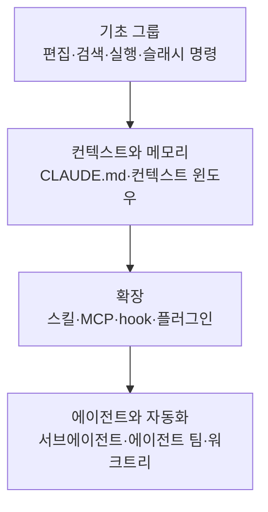

# 기능 한눈에 보기

처음 Claude Code를 켜면 모델이 파일을 읽고 고치고, 명령을 실행하고, 코드베이스를 뒤지는 일을 스스로 처리하는 걸 보게 됩니다. 이 페이지는 그 기능들이 각각 어떤 문제를 풀고, 어떤 순서로 익히면 좋은지 한 장으로 펼쳐 드립니다.


**한 줄 요약**: Claude Code는 코드를 추론하는 모델에 파일 편집·검색·실행 같은 내장 도구가 붙어 있고, 그 위에 컨텍스트·확장·자동화 레이어가 층층이 얹히는 구조입니다.


## 이 페이지의 역할

Claude Code의 기능은 크게 두 갈래입니다. 하나는 모델이 코드를 다룰 때 늘 쓰는 **내장 도구** (built-in tools)이고, 다른 하나는 필요에 따라 덧붙이는 **확장 레이어** (extension layer)입니다. 이 페이지는 두 갈래를 모두 펼쳐 놓고, 기능마다 한 줄 설명과 함께 더 깊은 문서로 가는 길을 알려 줍니다.

MoAI-ADK는 바로 이 Claude Code 위에서 동작하는 에이전틱 개발 키트입니다. 여기 나열된 기능은 MoAI-ADK 세 가지 핵심의 원재료이기도 합니다. 컨텍스트 윈도우와 캐싱은 **토크노믹스** (tokenomics)의, 서브에이전트·팀·워크트리는 **에이전틱 루프 엔지니어링**의, 스킬·hook·MCP·플러그인은 **에이전틱 하네스** (agentic harness)의 재료입니다. 여기서 개념을 잡아 두면 MoAI-ADK가 이것들을 어떻게 오케스트레이션하는지 훨씬 빠르게 이해할 수 있습니다.

## 기능 카탈로그

아래 표는 주요 기능을 한 줄 설명과 함께 정리한 것입니다. 마지막 열의 링크를 따라가면 각 기능의 상세 문서로 이동합니다.

| 기능 | 한 줄 설명 | 자세히 보기 |
| --- | --- | --- |
| 코드 편집 | 모델이 파일을 직접 읽고 수정하는 핵심 내장 기능입니다. | [기초 그룹](/ko/claude-code/foundations) |
| 검색 | 코드베이스에서 패턴·파일·심볼을 찾는 내장 도구입니다. | [기초 그룹](/ko/claude-code/foundations) |
| 명령 실행 | 셸 명령을 실행해 빌드·테스트·git 작업을 수행합니다. | [기초 그룹](/ko/claude-code/foundations) |
| 슬래시 명령 | `/`로 시작하는 명령으로 스킬이나 내장 동작을 즉시 호출합니다. | [기초 그룹](/ko/claude-code/foundations) |
| 대화형 모드 | 권한 처리 방식이나 작업 스타일을 바꾸는 세션 모드입니다. | [기초 그룹](/ko/claude-code/foundations) |
| CLAUDE.md / 메모리 | 매 세션 자동으로 로드되는 영속 컨텍스트를 보관합니다. | [컨텍스트와 메모리](/ko/claude-code/context-memory) |
| 컨텍스트 윈도우 | 한 세션이 담을 수 있는 토큰 한계와 그 관리 전략입니다. | [컨텍스트와 메모리](/ko/claude-code/context-memory) |
| 스킬 | 재사용 가능한 지식·워크플로를 담은 마크다운 단위입니다. | [확장](/ko/claude-code/extensibility) |
| MCP | 외부 서비스·도구를 모델에 연결하는 프로토콜입니다. | [확장](/ko/claude-code/extensibility) |
| hook | 라이프사이클 이벤트에 맞춰 스크립트·요청·프롬프트를 자동 실행합니다. | [확장](/ko/claude-code/extensibility) |
| 결과물 저장소 | Claude가 생성한 HTML·마크다운·스니펫을 구조화하고 공유합니다. | [확장](/ko/claude-code/extensibility) |
| 플러그인 | 스킬·hook·서브에이전트·MCP를 묶어 배포하는 패키징 단위입니다. | [확장](/ko/claude-code/extensibility) |
| 서브에이전트 | 격리된 컨텍스트에서 독립 실행 후 요약만 반환하는 작업자입니다. | [에이전트와 자동화](/ko/claude-code/agentic) |
| 에이전트 팀 | 여러 독립 세션이 작업과 메시지를 공유하며 협업합니다. | [에이전트와 자동화](/ko/claude-code/agentic) |
| 워크트리 | 동일 저장소를 분리된 작업 디렉터리로 병렬 개발합니다. | [에이전트와 자동화](/ko/claude-code/agentic) |
| 체크포인트 | 작업 도중 상태를 저장해 되돌아갈 수 있게 합니다. | [에이전트와 자동화](/ko/claude-code/agentic) |

### 내장 도구 계열

내장 도구는 별도 설정 없이 항상 동작하며, 대부분의 코딩 작업은 이 도구만으로 처리됩니다.

- **코드 편집**: 모델이 파일을 열어 직접 읽고 고치는 가장 기본적인 기능입니다.
- **검색**: 코드베이스 전체에서 텍스트 패턴이나 파일을 찾아냅니다. 타입 언어나 규모가 큰 코드베이스에서는 언어 서버 기반 코드 인텔리전스가 심볼 단위 탐색을 훨씬 정확하게 해 줍니다.
- **명령 실행**: 빌드·테스트·린트·git 같은 셸 명령을 실행합니다.
- **슬래시 명령**: `/code-review`, `/debug`처럼 기본 제공되는 명령이나 직접 만든 스킬을 즉시 호출합니다.
- **대화형 모드**: 편집 자동 수락이나 권한 우회 같은 세션 동작 방식을 전환합니다.

### 컨텍스트와 메모리 계열

- **CLAUDE.md / 메모리**: 매 세션 시작 시 전체 내용이 자동 로드되는 영속 컨텍스트입니다. 코딩 규칙이나 "항상 X 하라" 같은 지침을 둡니다. 공식 문서는 `CLAUDE.md`를 200줄 이내로 유지하고, 늘어나는 참조 자료는 스킬이나 `.claude/rules/`로 분리하기를 권장합니다.
- **컨텍스트 윈도우** (context window): 한 세션이 담을 수 있는 입력·출력 토큰의 한계입니다. 각 기능이 컨텍스트를 얼마나 차지하는지 이해하는 것이 효율적인 설정의 핵심입니다.

### 확장 레이어

확장 레이어는 모델이 아는 것을 늘리거나, 외부 서비스에 연결하거나, 워크플로를 자동화합니다.

- **스킬** (skill): 지식·워크플로·지침을 담은 마크다운 파일입니다. `/<name>`으로 직접 부르거나, 관련성이 높다고 판단되면 모델이 알아서 읽어 들입니다. 확장 수단 가운데 가장 유연합니다.
- **MCP**: 데이터베이스 조회, Slack 게시, 브라우저 제어처럼 외부 서비스와 데이터를 모델에 연결하는 프로토콜입니다.
- **hook**: `PostToolUse`, `SessionStart` 같은 라이프사이클 이벤트에 맞춰 스크립트·HTTP 요청·프롬프트·서브에이전트를 실행합니다. 편집 후 린트처럼 매번 똑같이 일어나야 하는 자동화에 알맞습니다.
- **플러그인** (plugin): 스킬·hook·서브에이전트·MCP 서버를 하나의 설치 단위로 묶습니다. 같은 설정을 여러 저장소에 재사용하거나 다른 사람에게 배포할 때 씁니다.

### 에이전트와 자동화 계열

- **서브에이전트** (subagent): 자기만의 컨텍스트 윈도우에서 작업을 끝낸 뒤 요약만 메인 대화로 돌려줍니다. 파일 수십 개를 읽는 조사 작업처럼 중간 산출물로 메인 컨텍스트를 어지럽히면 안 될 때 요긴합니다.
  - v2.1.198부터 서브에이전트는 **기본적으로 백그라운드**에서 실행됩니다. 결과가 당장 필요할 때만 포그라운드로 올리고, 그사이 메인 세션은 독립적인 읽기 작업을 이어갑니다. 백그라운드라도 권한 프롬프트는 메인 세션에 그대로 표시되므로(v2.1.186+부터는 어느 서브에이전트가 묻는지 이름까지 보여 줍니다) 제어권이 흩어지지 않습니다.
  - v2.1.219부터는 서브에이전트가 **또 다른 서브에이전트를 부를 수 있습니다** (기본 최대 깊이 3). 복잡한 조사를 여러 단계로 나눠 맡길 때 유용하며, 평면 구조를 그대로 유지하고 싶다면 환경변수 `CLAUDE_CODE_MAX_SUBAGENT_SPAWN_DEPTH=1`으로 끌 수 있습니다.
  - 서브에이전트를 부를 때 함께 넘기던 권한 모드 인자는 v2.1.213부터 **더 이상 쓰지 않습니다**. 자식은 부모 세션의 권한 모드를 그대로 이어받고, `acceptEdits`나 `bypassPermissions`에 들어간 부모가 자식보다 우선합니다. 그래서 읽기 전용 스코프는 권한 모드가 아니라 **도구 제한** (`tools:`에서 쓰기 도구를 빼는 방식)으로 걸어야 확실합니다.
- **에이전트 팀** (agent team): 서로 독립된 여러 Claude Code 세션이 공유 작업 목록과 메시지로 협업합니다. 경쟁 가설을 검증하는 조사나 병렬 코드 리뷰에 적합하며 실험적 기능으로 기본 비활성화 상태입니다.
- **워크트리** (worktree): 같은 저장소를 분리된 작업 디렉터리로 두어 여러 브랜치 작업을 충돌 없이 병렬 진행합니다.
- **체크포인트** (checkpoint): 작업 진행 중 상태를 기록해 두어, 변경을 되돌리거나 안전한 지점으로 복귀할 수 있게 합니다.

### 모델과 추론 깊이

카탈로그의 기능들을 실제로 쓸 때 빼놓을 수 없는 주제가 하나 더 있습니다. 어떤 모델로, 얼마나 깊이 생각할지를 정하는 일입니다. 두 가지를 엮어 쓰면 같은 작업이라도 비용과 정확도 균형을 조정할 수 있습니다.

- **모델 라인업** (2026-08 기준): **Fable 5** (Mythos 등급의 최상위 모델), **Opus 5**, **Sonnet 5**, **Haiku 4.5** 네 종류로 구성됩니다. 대부분의 코딩은 Sonnet 5로 무난히 처리하고, 복잡한 아키텍처 결정이나 깊은 추론이 필요할 때 Opus 5나 Fable 5로 올립니다. 세션 중에는 `/model`, 시작할 때는 `claude --model <name>`으로 바꿉니다.
- **추론 깊이** (effort): `ultrathink` 같은 키워드나 `/effort` 명령으로 추론 깊이를 `low` → `medium` → `high` → `xhigh` → `max`까지 올립니다. 깊이를 올리면 모델이 추론 토큰을 더 써서 어려운 문제에 더 오래 파고듭니다(Adaptive Thinking). 이 깊이는 고정 토큰 예산이 아니라 작업 난이도에 따라 스스로 조절하는 값이므로, 예산을 하드코딩하는 대신 깊이 단계로 다루는 것을 권장합니다.
- **서브에이전트별 모델 지정**: 서브에이전트를 부를 때 어떤 모델을 쓸지 명시하면, 부모 세션의 모델을 무심코 물려받는 일을 막을 수 있습니다. 작업 성격에 맞춰 무거운 모델과 가벼운 모델을 각각 배정하는 것이죠.

모델 구조와 권한·체크포인팅 이야기는 [작동 원리](/ko/claude-code/foundations/how-claude-code-works) 페이지에 이어집니다.

## 스킬과 서브에이전트의 차이

확장 기능 중 가장 자주 헷갈리는 둘을 짚고 갑니다. 핵심은 **컨텍스트** (context) 처리 방식입니다.

| 구분 | 스킬 | 서브에이전트 |
| --- | --- | --- |
| 정체 | 재사용 가능한 지침·지식·워크플로 | 자기 컨텍스트를 가진 격리된 작업자 |
| 강점 | 어떤 컨텍스트에서도 공유 | 작업이 분리되고 요약만 반환 |
| 컨텍스트 영향 | 메인 윈도우에 더해짐 | 별도 윈도우를 사용 |
| 적합한 일 | 참조 자료, 호출형 워크플로 | 많은 파일 읽기, 병렬·전문 작업 |

스킬은 호출해서 쓰는 동작(`/deploy`)일 수도 있고, 그냥 참고하는 지식(API 스타일 가이드)일 수도 있습니다. 컨텍스트 윈도우가 차오르거나 중간 과정을 굳이 보여 줄 필요가 없을 때는 서브에이전트가 낫습니다. 둘을 엮어서 서브에이전트가 특정 스킬을 미리 읽고 시작하게 하거나, 스킬을 격리된 컨텍스트에서 돌릴 수도 있습니다.

## 어디서부터 읽을까

이 섹션의 문서는 학습 순서를 고려해 네 그룹으로 묶여 있습니다. 아래 흐름을 따라가면 무리 없이 전체 그림을 잡을 수 있습니다.

```mermaid
flowchart TD
    A[기초 그룹<br>편집·검색·실행·슬래시 명령] --> B[컨텍스트와 메모리<br>CLAUDE.md·컨텍스트 윈도우]
    B --> C[확장<br>스킬·MCP·hook·플러그인]
    C --> D[에이전트와 자동화<br>서브에이전트·에이전트 팀·워크트리]
```

| 순서 | 그룹 | 무엇을 얻나 |
| --- | --- | --- |
| 1 | [기초 그룹](/ko/claude-code/foundations) | 편집·검색·실행 등 매일 쓰는 핵심 동작 |
| 2 | [컨텍스트와 메모리](/ko/claude-code/context-memory) | CLAUDE.md로 규칙을 고정하고 컨텍스트를 아끼는 법 |
| 3 | [확장](/ko/claude-code/extensibility) | 스킬·MCP·hook·플러그인으로 능력을 늘리는 법 |
| 4 | [에이전트와 자동화](/ko/claude-code/agentic) | 서브에이전트·에이전트 팀으로 작업을 병렬화하는 법 |

공식 문서가 권하는 **모범 사례** (best practice)는 처음부터 모든 기능을 켜 두지 않는 것입니다. 같은 실수를 두 번 하면 CLAUDE.md에 규칙을 더하고, 같은 프롬프트를 또 치고 있으면 스킬로 저장하고, 매번 자동으로 일어나야 할 동작이 보이면 그때 hook을 짭니다. 필요가 드러날 때마다 하나씩 쌓아 가는 것입니다. 이 "필요할 때 하나씩"은 토큰 관점에서도 맞습니다. 쓰지 않는 확장도 컨텍스트는 그대로 차지하고, 컨텍스트는 곧 비용이니까요.

## 관련 문서

- [기초 그룹](/ko/claude-code/foundations)
- [컨텍스트와 메모리](/ko/claude-code/context-memory)
- [확장](/ko/claude-code/extensibility)
- [에이전트와 자동화](/ko/claude-code/agentic)
- [빠른 시작](/ko/getting-started/quickstart)

## 참고 자료

- [Extend Claude Code — Features overview](https://code.claude.com/docs/en/features-overview)


Claude Code가 처음이라면 기능을 한꺼번에 켜지 말고 기초 그룹부터 익히세요. 그러고 나서 실제 작업 중에 "또 이걸 반복하네" 싶은 순간마다 CLAUDE.md → 스킬 → hook 순으로 하나씩 붙여 보면 됩니다.

