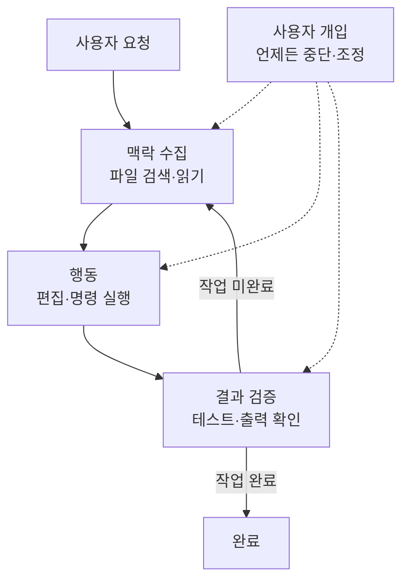

Claude Code가 코드를 이해하고 직접 도구를 실행하면서 작업을 완성하는 에이전틱 루프의 작동 원리를 설명합니다.


**한 줄 요약**: Claude Code는 추론하는 모델과 행동하는 도구를 묶어 "맥락 수집 → 행동 → 결과 검증"을 스스로 반복하는 터미널 네이티브 코딩 에이전트입니다.


## Claude Code란 무엇인가

Claude Code는 **터미널** (terminal)에서 동작하는 에이전틱 어시스턴트입니다. 코딩에 특히 강하지만, 명령줄에서 할 수 있는 일이라면 문서 작성, 빌드 실행, 파일 검색, 주제 조사까지 폭넓게 도와줍니다.

핵심 개념은 **에이전틱 하네스** (agentic harness)입니다. Claude Code는 모델인 Claude를 감싸서 도구, 컨텍스트 관리, 실행 환경을 제공합니다. 즉, 텍스트만 생성하던 언어 모델을 실제로 코드베이스를 다루는 유능한 코딩 에이전트로 바꾸어 주는 껍데기입니다.

## 에이전틱 루프

작업을 맡기면 Claude는 세 단계를 거칩니다. 이 단계들은 명확히 분리되기보다 서로 섞여 흐릅니다.

```text
요청 → 맥락 수집(gather context) → 행동(take action) → 결과 검증(verify results) → 반복
```

| 단계 | 하는 일 |
|------|---------|
| **맥락 수집** (gather context) | 파일을 검색하고 읽어 코드 구조를 파악 |
| **행동** (take action) | 파일을 수정하거나 명령을 실행해 변경을 가함 |
| **결과 검증** (verify results) | 테스트를 돌리거나 출력을 확인해 작업이 옳은지 점검 |

루프는 요청 성격에 맞게 적응합니다. 코드베이스에 대한 질문은 맥락 수집만으로 끝날 수 있고, 버그 수정은 세 단계를 여러 번 순환하며, 리팩터링은 검증에 많은 비중을 둘 수 있습니다. Claude는 직전 단계에서 배운 것을 토대로 다음 행동을 결정하고, 수십 개의 동작을 이어 붙이면서 스스로 방향을 교정합니다.



사용자도 이 루프의 일부입니다. 언제든 작업을 중단(`Esc`)하거나, 멈추지 않고 교정 메시지를 보내(`Enter`) 방향을 바꿀 수 있습니다. Claude는 자율적으로 일하면서도 입력에 계속 반응합니다.

## 핵심 구성 요소

에이전틱 루프는 **추론하는 모델** (model)과 **행동하는 도구** (tools)라는 두 축으로 굴러갑니다. 여기에 대화와 파일이 담기는 컨텍스트, 그리고 행동을 통제하는 권한이 더해집니다.

### 모델

Claude Code는 Claude 모델로 코드를 이해하고 작업을 추론합니다. 어떤 언어의 코드든 읽고 구성 요소가 어떻게 연결되는지 파악하며, 복잡한 작업은 단계로 쪼개 실행합니다.

| 모델 | 특징 |
|------|------|
| Sonnet | 대부분의 코딩 작업을 무난히 처리 |
| Opus | 복잡한 아키텍처 결정에 강한 추론 제공 |

세션 중에는 `/model` 명령으로, 시작할 때는 `claude --model <name>`으로 모델을 전환합니다.

### 도구

도구가 있어야 Claude는 텍스트 응답을 넘어 실제로 행동할 수 있습니다. 기본 도구는 크게 다섯 범주로 나뉩니다.

| 범주 | Claude가 할 수 있는 일 |
|------|------------------------|
| **파일 작업** (file operations) | 파일 읽기, 코드 편집, 새 파일 생성, 이름 변경·재구성 |
| **검색** (search) | 패턴으로 파일 찾기, 정규식으로 내용 검색, 코드베이스 탐색 |
| **실행** (execution) | 셸 명령 실행, 서버 기동, 테스트 실행, git 사용 |
| **웹** (web) | 웹 검색, 문서 가져오기, 오류 메시지 조회 |
| **코드 인텔리전스** (code intelligence) | 편집 후 타입 오류·경고 확인, 정의로 이동, 참조 찾기 |

이 외에도 서브에이전트 생성, 사용자에게 질문하기 같은 오케스트레이션 도구가 있습니다. 각 도구 사용은 새로운 정보를 돌려주고, 그 정보가 다음 결정으로 이어지는 것이 바로 에이전틱 루프입니다.

### 컨텍스트

Claude는 디렉터리에서 `claude`를 실행하는 순간 다음에 접근합니다.

- **프로젝트**: 현재 디렉터리와 하위 디렉터리의 파일 (권한이 있으면 그 밖의 파일도)
- **터미널**: 빌드 도구, git, 패키지 매니저 등 명령줄에서 할 수 있는 모든 작업
- **git 상태**: 현재 브랜치, 커밋되지 않은 변경, 최근 커밋 이력
- **`CLAUDE.md`**: 매 세션 알아야 할 프로젝트별 규칙과 컨벤션을 담는 마크다운 파일
- **자동 메모리** (auto memory): 작업하며 학습한 패턴과 선호를 자동 저장 (`MEMORY.md`의 앞부분이 세션 시작 시 로드)
- **확장 기능**: 설정한 MCP 서버, 스킬, 서브에이전트 등

### 권한

행동을 통제하는 권한 모델은 아래 [권한 모델](#권한-모델) 절에서 다룹니다.

## 실행 위치와 인터페이스

에이전틱 루프와 도구, 기능은 어디서 쓰든 동일합니다. 달라지는 것은 **코드가 실행되는 위치**와 **상호작용하는 방식**입니다.

### 실행 환경

| 환경 | 코드 실행 위치 | 용도 |
|------|----------------|------|
| **로컬** (local) | 내 컴퓨터 | 기본값. 파일·도구·환경에 완전 접근 |
| **클라우드** (cloud) | Anthropic 관리 VM | 작업 위임, 로컬에 없는 저장소 작업 |
| **원격 제어** (remote control) | 내 컴퓨터, 브라우저에서 제어 | 웹 UI를 쓰되 모든 것을 로컬에 유지 |

### 인터페이스

터미널, 데스크톱 앱, IDE 확장 (VS Code·JetBrains), `claude.ai/code` 웹, 원격 제어, Slack, CI/CD 파이프라인을 통해 접근할 수 있습니다. 인터페이스는 보고 다루는 방식만 바꿀 뿐, 그 아래 에이전틱 루프는 똑같습니다.

## 세션과 컨텍스트 윈도우

Claude Code는 작업하는 동안 대화를 `~/.claude/projects/` 아래 JSONL 파일로 로컬 저장합니다. 덕분에 세션을 되감거나(rewind) 이어가거나(resume) 분기할(fork) 수 있습니다.

- **세션은 독립적**: 새 세션은 빈 컨텍스트 윈도우로 시작하며, 이전 대화 이력을 가져오지 않습니다. 세션을 넘어 유지하려면 자동 메모리와 `CLAUDE.md`를 씁니다.
- **이어가기·분기**: `claude --continue`나 `claude --resume`은 같은 세션 ID로 이어 붙이고, `--fork-session`이나 `/branch`는 이력을 새 세션 ID로 복사합니다.

**컨텍스트 윈도우** (context window)에는 대화 이력, 파일 내용, 명령 출력, `CLAUDE.md`, 자동 메모리, 로드된 스킬, 시스템 지시가 담깁니다. 작업이 진행되며 컨텍스트가 차오르면 Claude가 자동으로 압축(compaction)하는데, 이때 초반 지시가 사라질 수 있습니다. 항상 지켜야 할 규칙은 대화 이력이 아니라 `CLAUDE.md`에 두고, `/context`로 무엇이 자리를 차지하는지 확인합니다.

## 체크포인팅과 권한

Claude에는 두 가지 안전장치가 있습니다. 파일 변경을 되돌리는 체크포인팅과, 묻지 않고 할 수 있는 행동의 범위를 정하는 권한입니다.

### 체크포인팅으로 되돌리기

**모든 파일 편집은 되돌릴 수 있습니다.** Claude는 파일을 편집하기 전에 현재 내용을 스냅샷으로 저장합니다. 문제가 생기면 `Esc`를 두 번 눌러 이전 상태로 되감거나 되돌려 달라고 요청하면 됩니다.

체크포인팅은 세션에 한정되며 git과는 별개이고, 오직 파일 변경만 다룹니다. 데이터베이스·API·배포처럼 원격에 영향을 주는 행동은 되돌릴 수 없기 때문에, Claude는 외부 부작용이 있는 명령을 실행하기 전에 묻습니다.

### 권한 모델

`Shift+Tab`을 눌러 권한 모드를 순환합니다.

| 모드 | 동작 |
|------|------|
| **기본** (default) | 파일 편집과 셸 명령 전에 매번 확인 |
| **자동 수락 편집** (auto-accept edits) | `mkdir`·`mv` 같은 흔한 파일 명령과 편집은 묻지 않고 실행, 나머지 명령은 확인 |
| **계획** (plan mode) | 읽기 전용 도구만 사용하며, 실행 전 승인할 계획을 작성 |
| **자동** (auto mode) | 백그라운드 안전 점검과 함께 모든 행동을 평가 (리서치 프리뷰) |

`.claude/settings.json`에서 특정 명령을 미리 허용하면 매번 묻지 않습니다. `npm test`나 `git status`처럼 신뢰하는 명령에 유용하며, 설정은 조직 전체 정책부터 개인 선호까지 범위를 정할 수 있습니다.

## 다른 도구와의 차별점

Claude Code가 인라인 코드 어시스턴트와 다른 지점은 두 가지입니다.

- **터미널 네이티브** (terminal-native): 명령줄에서 할 수 있는 모든 작업, 즉 빌드·테스트·git·패키지 매니저를 직접 다룹니다.
- **대규모 코드베이스 전체 인지**: 현재 파일만 보는 것이 아니라 프로젝트 전체를 봅니다. "인증 버그를 고쳐줘"라고 하면 관련 파일을 검색하고, 여러 파일을 읽어 맥락을 파악하고, 파일에 걸친 일관된 편집을 한 뒤, 테스트로 검증하고, 요청하면 커밋까지 합니다.

## 관련 문서

- [기능 한눈에 보기](/claude-code/foundations/features-overview)
- [MoAI-ADK란?](/core-concepts/what-is-moai-adk)

## 참고 자료

- [How Claude Code works](https://code.claude.com/docs/en/how-claude-code-works)
- [Extend Claude Code (Features overview)](https://code.claude.com/docs/en/features-overview)


복잡한 작업은 곧장 코드로 들어가기보다 `Shift+Tab`을 두 번 눌러 계획 모드로 코드베이스를 먼저 분석하게 하세요. 계획을 검토하고 다듬은 뒤 구현시키면 첫 시도부터 더 정확한 결과를 얻습니다.

