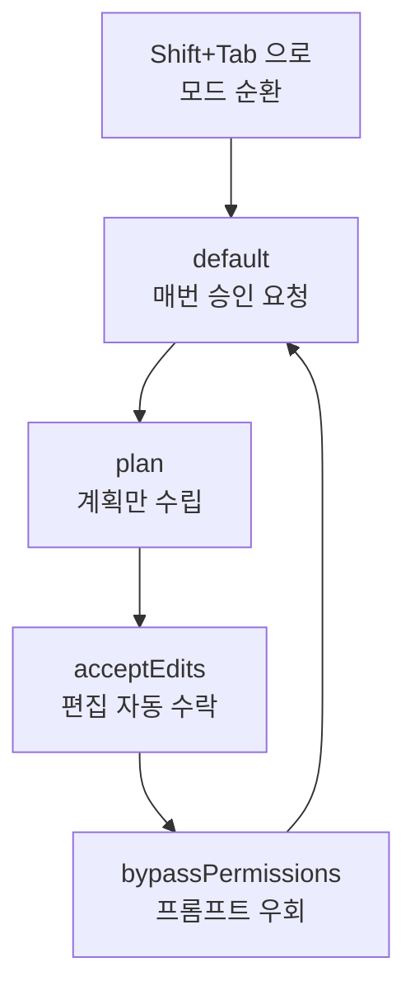

Claude Code를 터미널에서 실행하면 만나는 대화형 세션(REPL)의 입력 방식과 단축키, 권한 모드를 정리합니다.


**한 줄 요약**: 대화형 모드는 Claude Code의 **조종석**으로, 프롬프트 한 줄부터 `/` 명령, `!` bash 실행, `@` 파일 참조, 이미지 붙여넣기까지 모든 입력이 모이는 곳입니다.


## 대화형 세션(REPL)의 기본 흐름

`claude` 명령을 실행하면 대화형 REPL(Read-Eval-Print Loop)이 열립니다. 여기서는 자연어로 요청을 보내고, Claude가 코드를 읽고 수정하고 명령을 실행하며 응답합니다. 한 번의 요청과 응답을 **턴 (turn)**이라고 부르며, 세션이 살아 있는 동안 대화 맥락이 누적됩니다.

기본 흐름은 단순합니다.

```text
1. claude 실행 → 대화형 세션 시작
2. 프롬프트 입력 → Enter 로 제출
3. Claude가 응답 (도구 호출 + 결과)
4. 후속 요청 반복 → 맥락 누적
5. /clear 로 새 세션, Ctrl+D 로 종료
```

세션이 진행되는 동안 작업 디렉터리별로 입력 히스토리가 저장되고, 복잡한 다단계 작업에서는 Claude가 작업 목록을 만들어 진행 상황을 추적합니다.

## 다섯 가지 입력 방식

대화형 세션의 입력 칸은 단순한 텍스트 입력기가 아닙니다. 첫 글자에 따라 동작이 달라집니다.

| 입력 방식 | 트리거 | 설명 |
|-----------|--------|------|
| **일반 프롬프트** | 그냥 입력 | 자연어 요청. Claude가 해석하고 작업합니다. |
| **슬래시 명령** | `/` 로 시작 | 내장 명령, 스킬, 플러그인/MCP 명령을 호출합니다. |
| **bash 실행** | `!` 로 시작 | Claude를 거치지 않고 셸 명령을 직접 실행합니다. |
| **파일 참조** | `@` 입력 | 파일 경로 자동완성을 띄워 특정 파일을 맥락에 추가합니다. |
| **이미지 붙여넣기** | `Ctrl+V` (붙여넣기) | 클립보드 이미지를 `[Image #N]` 칩으로 삽입합니다. |

### 슬래시 명령 (/)

입력 칸 맨 앞에 `/`를 치면 사용 가능한 모든 명령 메뉴가 뜹니다. 내장 명령뿐 아니라 번들 스킬, 사용자 작성 스킬, 플러그인과 MCP 서버가 기여한 명령까지 한 메뉴에 모입니다. `/` 뒤에 글자를 이어 입력하면 실시간으로 후보가 좁혀집니다. 자세한 목록은 [슬래시 명령어](/claude-code/foundations/commands) 문서를 참고하세요.

### bash 실행 (!)

`!`로 시작하면 셸 모드로 전환되어 명령이 Claude의 해석 없이 곧바로 실행됩니다.

```bash
! npm test
! git status
! ls -la
```

셸 모드는 명령과 그 출력을 대화 맥락에 추가하므로, 빠른 셸 작업을 하면서도 Claude가 결과를 알 수 있게 해줍니다. 긴 명령은 `Ctrl+B`로 백그라운드로 보낼 수 있고, 빈 입력에서 `Escape`나 `Backspace`로 셸 모드를 빠져나옵니다.

### 파일 참조 (@)

`@`를 입력하면 파일 경로 자동완성이 뜹니다. 원하는 파일을 선택하면 해당 파일을 Claude의 맥락으로 끌어와, "이 파일을 고쳐줘" 같은 요청을 정확하게 보낼 수 있습니다.

### 이미지 붙여넣기

스크린샷이나 디자인 시안을 `Ctrl+V`로 붙여넣으면 커서 위치에 `[Image #N]` 칩이 삽입됩니다. 칩을 프롬프트 안에서 위치 기준으로 참조할 수 있어, 텍스트와 이미지를 섞어 설명할 수 있습니다.

| 환경 | 이미지 붙여넣기 키 |
|------|---------------------|
| 기본 | `Ctrl+V` |
| iTerm2 (macOS) | `Cmd+V` |
| Windows / WSL | `Alt+V` |

## 키보드 단축키

대화형 세션의 핵심 단축키입니다. 플랫폼과 터미널에 따라 일부 동작이 다를 수 있습니다.

| 단축키 | 동작 |
|--------|------|
| `Esc` | Claude 응답 중단(중간에 멈추고 방향 전환, 작업물은 유지) |
| `Esc` `Esc` | 입력이 있으면 초안 비우기, 비어 있으면 되감기 메뉴 열기 |
| `Ctrl+C` | 실행 중단 또는 입력 비우기(두 번 누르면 종료) |
| `Ctrl+D` | 세션 종료(EOF) |
| `Shift+Tab` 또는 `Alt+M` | 권한 모드 순환 전환 |
| `Ctrl+R` | 명령 히스토리 역방향 검색 |
| `Ctrl+B` | 실행 중인 작업을 백그라운드로 전환 |
| `Ctrl+T` | 작업 목록 토글 |
| `Ctrl+O` | 트랜스크립트 뷰어 토글(도구 사용 상세 보기) |
| `Ctrl+X` `Ctrl+K` | 모든 백그라운드 서브에이전트 중단 |
| `Ctrl+L` | 화면 다시 그리기(깨진 출력 복구) |
| `Opt+P` | 모델 전환 |
| `Opt+T` | 확장 사고(extended thinking) 모드 토글 |
| `Opt+O` | 빠른 모드 전환 |
| `Up` / `Down` | 커서 이동, 끝에 닿으면 히스토리 탐색 |

### 되감기 (Esc Esc)

입력 칸이 비어 있을 때 `Esc`를 두 번 누르면 **되감기 메뉴 (rewind menu)**가 열립니다. 이전 시점으로 코드와 대화를 복원하거나 요약할 수 있는 기능으로, 자세한 내용은 [체크포인팅](/claude-code/context-memory/checkpointing) 문서에서 다룹니다.

### 히스토리 검색 (Ctrl+R)

`Ctrl+R`로 이전 명령을 대화식으로 검색합니다. 검색어를 입력하면 일치 부분이 강조되고, `Ctrl+R`을 다시 누르면 더 오래된 일치 항목으로 이동합니다. `Ctrl+S`로 검색 범위(이 세션 / 이 프로젝트 / 모든 프로젝트)를 바꾸고, `Tab`이나 `Esc`로 수락 후 편집, `Enter`로 즉시 실행합니다.

### macOS의 Option 키 주의

`Alt+B`, `Alt+F`, `Alt+P` 같은 Option 키 조합은 macOS에서 터미널의 Option을 Meta로 설정해야 동작합니다. iTerm2는 Keys 설정에서 Option을 "Esc+"로, Apple Terminal은 "Use Option as Meta Key"를 켜야 합니다.

## 권한 모드

Claude Code는 파일 수정과 명령 실행을 어디까지 자동으로 허용할지 **권한 모드 (permission mode)**로 조절합니다. `Shift+Tab`으로 모드를 순환 전환할 수 있습니다.

| 모드 | 동작 | 적합한 상황 |
|------|------|-------------|
| **default** | 작업마다 사용자에게 승인을 요청 | 신중한 일상 작업 |
| **plan** | 코드를 수정하지 않고 계획만 수립 | 변경 전 접근 방식 검토 |
| **acceptEdits** | 파일 편집을 자동 수락 | 신뢰하는 반복 편집 |
| **bypassPermissions** | 권한 프롬프트를 우회 | 격리된 샌드박스 환경 등 한정적 사용 |



bypass 모드는 권한 확인을 건너뛰므로 신뢰할 수 있는 격리 환경에서만 쓰는 것이 안전합니다. MoAI-ADK도 워크플로 단계에 맞춰 이 모드들을 활용하며, 특히 plan 모드는 계획 검토 게이트와 잘 맞습니다.

## 멀티라인 입력, vim 모드, 출력 스타일

### 멀티라인 입력

한 프롬프트에 여러 줄을 입력하는 방법은 터미널마다 다릅니다.

| 방법 | 단축키 | 비고 |
|------|--------|------|
| 빠른 줄바꿈 | `\` + `Enter` | 모든 터미널에서 동작 |
| Shift+Enter | `Shift+Enter` | iTerm2, WezTerm, Ghostty, Kitty, Warp 등에서 기본 지원 |
| 컨트롤 시퀀스 | `Ctrl+J` | 설정 없이 어디서나 동작 |
| 붙여넣기 모드 | 직접 붙여넣기 | 코드 블록, 로그에 적합 |

VS Code, Cursor, Windsurf, Zed 등에서 `Shift+Enter` 바인딩이 필요하면 `/terminal-setup`을 실행하면 됩니다.

### vim 모드

`/config`의 Editor mode에서 vim 스타일 편집을 켤 수 있습니다. NORMAL 모드와 INSERT 모드를 `Esc`와 `i`/`a`로 오가며, `h`/`j`/`k`/`l` 이동, `dd`/`yy`/`p` 편집, `iw`/`a"` 같은 텍스트 객체까지 익숙한 vim 동작을 그대로 사용합니다. 단, `Ctrl+V` 블록 비주얼 모드는 지원하지 않습니다.

### 출력 스타일과 부가 기능

`/config`에서 테마와 표시 옵션, 세션 요약(Session recap) 같은 설정을 조정합니다. 그 밖에 자주 쓰는 부가 기능은 다음과 같습니다.

- **`/btw`**: 대화 히스토리를 오염시키지 않고 현재 작업에 대해 빠르게 질문합니다. 답변은 일시적인 오버레이로만 표시됩니다.
- **`/recap`**: 세션의 요약(session recap)을 생성합니다. 자동으로는 3분 이상 또는 3턴 이상 진행된 세션에서 활성화됩니다.
- **작업 목록**: 다단계 작업에서 Claude가 만든 작업 목록을 `Ctrl+T`로 펼치거나 접습니다. 작업 목록은 컨텍스트 압축 중에도 유지됩니다.
- **확장 사고 토글**: `Option+T`(macOS) 또는 `Alt+T`로 확장 사고 모드를 켜고 끕니다.

## 관련 문서

- [슬래시 명령어](/claude-code/foundations/commands)
- [체크포인팅](/claude-code/context-memory/checkpointing)
- [빠른 시작](/getting-started/quickstart)

## 참고 자료

- [Claude Code Interactive mode (공식 문서)](https://code.claude.com/docs/en/interactive-mode)


처음에는 `Shift+Tab`으로 plan 모드부터 시작해 Claude의 접근 방식을 확인한 뒤, 신뢰가 쌓이면 acceptEdits로 전환하는 흐름이 가장 안전하고 빠릅니다.

