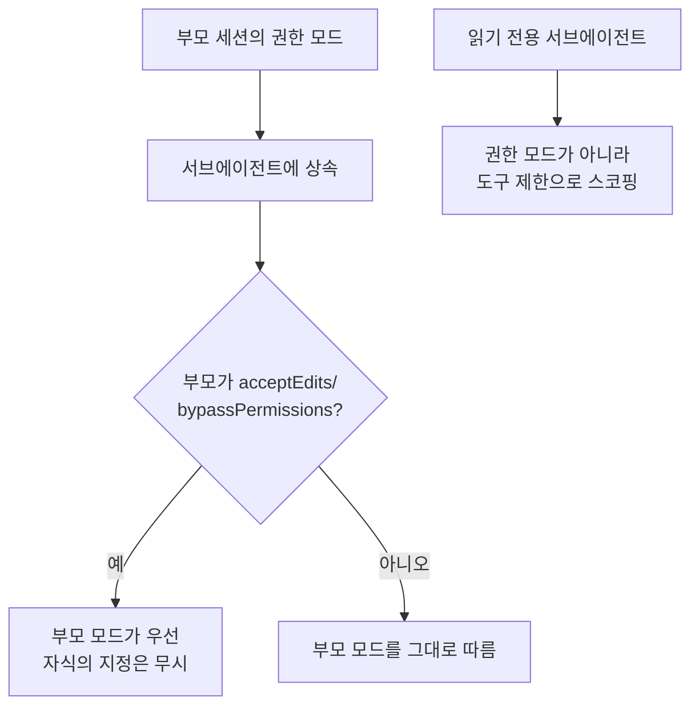
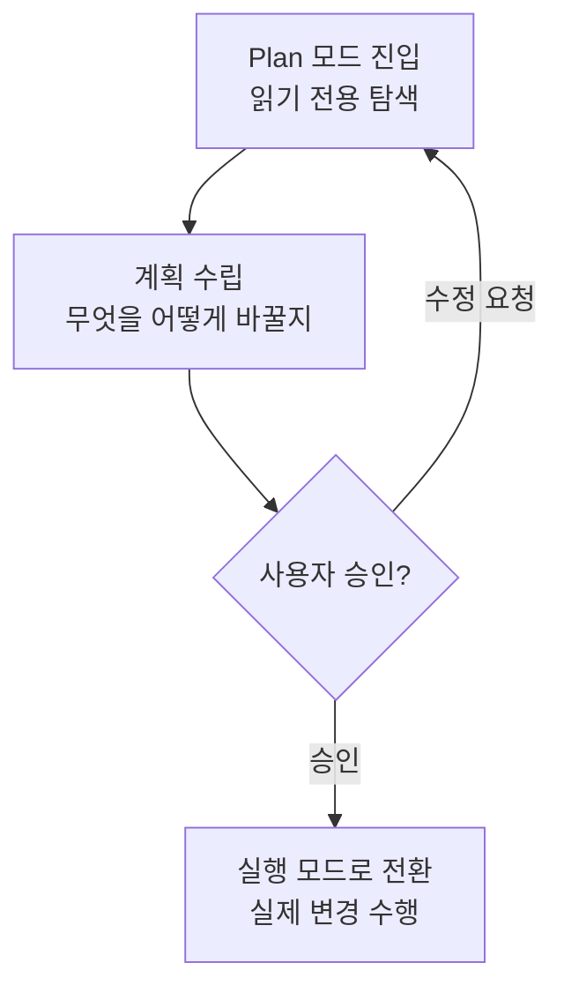

# 권한과 Plan 모드

친구에게 설명하자면, Claude Code는 파일을 고치거나 명령을 실행할 때마다 "이거 진행해도 돼?"라고 한 번 더 묻는 문지기를 세워 둡니다. 이 문지기가 무엇은 자동으로 허락하고 무엇은 막을지 정하는 규칙이 권한 시스템(permission system)이고, 코드를 손대기 전에 계획부터 승인받는 절차가 바로 Plan 모드입니다.


**한 줄 요약**: 권한 시스템은 건물 입구의 **문지기**입니다. 누가(어떤 도구가) 무엇을 하려는지 확인해 통과·질문·차단을 결정합니다. Plan 모드는 공사를 시작하기 전에 **견적서를 먼저 승인받는** 절차로, 읽기만 하며 계획을 세운 뒤 사용자의 승인을 받고서야 실제 변경에 들어갑니다.


## 권한 시스템: 세 가지 규칙

Claude가 파일을 수정하거나 명령을 실행하는 등 부수 효과(side effect)가 있는 도구를 쓰려 할 때마다, 권한 시스템이 그 호출을 가로채 어떻게 처리할지 결정합니다. 결정은 세 가지 규칙(rule)으로 표현됩니다.

| 규칙 | 동작 |
|------|------|
| `allow` | 묻지 않고 허용 |
| `ask` | 사용자에게 프롬프트로 확인 |
| `deny` | 항상 차단 |

이 규칙들은 `settings.json`의 `permissions` 블록에 도구·패턴 단위로 선언합니다.

```json
{
  "permissions": {
    "allow": ["Read", "Grep", "Bash(go test:*)"],
    "ask": ["Bash"],
    "deny": ["Read(./.env)"]
  }
}
```

자주 반복되는 안전한 읽기 전용 명령을 `allow`에 미리 등록해 두면 프롬프트가 눈에 띄게 줄어듭니다.  반대로 비밀 키가 든 파일이나 위험한 명령은 `deny`로 확실히 막아 둡니다. 평가는 `deny`부터 시작해 `ask`, `allow` 순서로 이루어지며, 가장 먼저 매칭된 규칙이 이깁니다 — 그래서 `deny`가 곧 안전망입니다.

## 권한 모드

세션 전체의 기본 태도는 권한 모드(permission mode)로 정합니다. 네 가지 모드가 있으며, 대화형 세션에서는 `Shift+Tab`으로 돌려 가며 바꿉니다.

| 모드 | 동작 |
|------|------|
| `default` | 부수 효과가 있는 도구마다 확인 (가장 안전한 기본값) |
| `acceptEdits` | 파일 편집은 자동 수락, 그 외 위험 동작은 여전히 확인 |
| `plan` | 읽기 전용. 변경 없이 탐색·계획만 수행 |
| `bypassPermissions` | 모든 확인을 건너뜀 |


`bypassPermissions`는 모든 확인을 생략하므로 믿을 수 있는 격리 환경에서만 쓰세요. 검증되지 않은 코드나 프롬프트가 위험한 명령을 무확인으로 실행하게 만들 수 있습니다.


## 서브에이전트와 권한 모드 상속

에이전트가 다른 에이전트를 호출할 때, 불려 온 쪽을 **서브에이전트**(subagent)라고 부릅니다. 서브에이전트는 자기만의 독립된 권한 모드를 새로 만들지 않고 부모 세션의 권한 모드를 **물려받습니다**(inherit). 특히 부모가 `acceptEdits`나 `bypassPermissions` 모드일 때는 이 모드가 자식보다 **우선**해서 적용되며, 자식이 자체적으로 다른 모드를 지정하려 해도 무시됩니다.



이 규칙은 Claude Code 2.1.213 이후로 자리 잡았습니다. 예전에는 에이전트를 호출할 때 `mode` 파라미터로 권한 모드를 지정할 수 있었지만, 지금은 이 **스폰 타임 모드 파라미터**(spawn-time `mode` parameter)가 더 이상 쓰이지 않고(deprecated) 무시됩니다.


**읽기 전용 서브에이전트는 권한 모드가 아니라 도구로 만듭니다.** 부모가 `acceptEdits` 상태라면 서브에이전트에 `plan`을 지정해도 소용이 없습니다 — 부모 모드가 우선해서 쓰기가 허용됩니다. 서브에이전트를 정말 읽기 전용으로 묶어 두려면 `tools` 목록에서 `Write`/`Edit`/`NotebookEdit` 같은 쓰기 도구를 빼거나, 애초에 읽기 전용인 `Explore` 에이전트를 사용하세요.


### 백그라운드 실행과 권한 프롬프트

서브에이전트는 Claude Code 2.1.198부터 **기본적으로 백그라운드**에서 돌아갑니다. 서브에이전트가 권한 확인이 필요한 동작을 하면 그 프롬프트는 메인 세션에 표시되는데, 2.1.186부터는 **어느 서브에이전트가 묻고 있는지 이름까지** 함께 뜹니다. `Esc`로 그 요청 하나만 거부할 수 있으므로, 백그라운드에서 무언가를 바꾸려는 순간을 놓치지 않고 통제할 수 있습니다.

### 중첩 깊이

2.1.219부터 서브에이전트가 다시 서브에이전트를 부르는 **중첩**(nesting)이 기본적으로 허용됩니다. 기본 깊이는 3단계까지이며, 환경변수 `CLAUDE_CODE_MAX_SUBAGENT_SPAWN_DEPTH=1`으로 중첩을 끌 수 있습니다. 이 깊이 제한 덕분에 권한 모드 상속은 부모→자식 한 단계만이 아니라 여러 단계에 걸쳐 연쇄적으로 이어집니다 — 가장 바깥 세션의 모드가 안쪽까지 전달되는 셈입니다.

서브에이전트의 정의 파일이 `permissionMode` 필드로 선언하는 기본값이 있더라도, 실제 런타임에서는 위 상속·우선 규칙이 이긴다는 점을 기억하세요. 필드 수준의 자세한 값은 [서브에이전트](/ko/claude-code/agentic/sub-agents) 문서를 참고하세요.

## Plan 모드

Plan 모드는 권한 모드 표의 `plan`이 만들어 내는 작업 흐름입니다. Claude는 먼저 **읽기 전용으로만** 코드베이스를 탐색해 무엇을 어떻게 바꿀지 계획을 세우고, 그 계획을 사용자에게 제시합니다. 사용자가 승인해야 비로소 실제 변경에 들어갑니다.



공사 견적서를 먼저 승인받고 시공에 들어가는 것과 같습니다. 큰 변경일수록, 코드를 건드리기 전에 계획을 눈으로 확인하는 이 단계가 실수를 크게 줄여 줍니다.

## MoAI-ADK의 구현 착수 승인

MoAI-ADK는 이 "계획을 먼저 승인한다"는 문화를 워크플로에 명시적 게이트로 새겨 넣습니다. Plan 단계 산출물이 감사를 통과했더라도, Run 단계(실제 구현)로 진입하기 직전 오케스트레이터는 자율 흐름을 멈추고 **구현 착수 승인**(Implementation Kickoff Approval)을 사용자에게 받아야 합니다.

이 게이트는 Claude Code의 Plan 모드 승인 문화를 SPEC 라이프사이클 차원으로 옮겨 놓은 것입니다. 계획 감사 점수가 아무리 높아도, 진행할지 말지는 사용자에게 따로 묻습니다. Plan 모드가 "코드를 바꾸기 전에 계획을 승인받는다"를 세션 단위로 지켰다면, MoAI-ADK는 같은 원칙을 plan→run 경계의 필수 인간 게이트로 넓힌 셈입니다.

## 관련 문서

- [대화형 모드](/ko/claude-code/foundations/interactive-mode)
- [도구 레퍼런스](/ko/claude-code/foundations/tools-reference)
- [.claude 디렉터리](/ko/claude-code/foundations/claude-directory)

## 참고 자료

- [Claude Code Docs — Permissions](https://code.claude.com/docs/en/permissions)
- [Claude Code Docs — Permission modes](https://code.claude.com/docs/en/permission-modes)


큰 변경을 맡길 때는 먼저 `Shift+Tab`으로 Plan 모드에 들어가 계획을 받아 보세요. 계획을 읽어 보고 방향이 맞을 때 승인하면, 코드를 건드린 뒤에야 문제를 발견하는 값비싼 되돌리기를 피할 수 있습니다.

