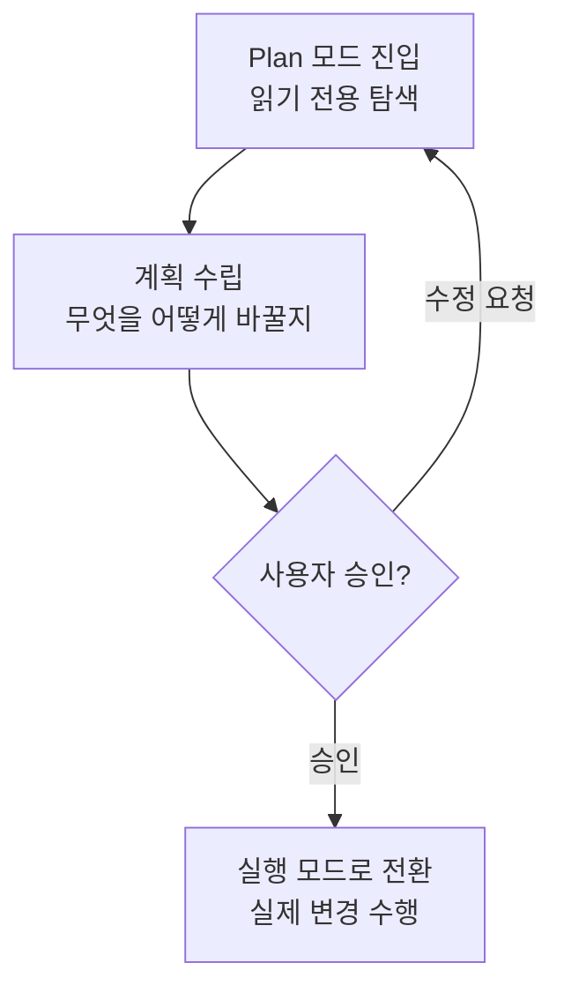

# 권한과 Plan 모드

Claude Code는 도구를 호출할 때마다 그것을 허용할지 물어보는 문지기를 둡니다. 이 페이지는 그 권한 시스템과, 실행 전에 계획을 먼저 승인받는 Plan 모드를 정리합니다.


**한 줄 요약**: 권한 시스템은 건물 입구의 **문지기**입니다. 누가(어떤 도구가) 무엇을 하려는지 확인해 통과·질문·차단을 결정합니다. Plan 모드는 공사를 시작하기 전에 **견적서를 먼저 승인받는** 절차로, 읽기만 하며 계획을 세운 뒤 사용자의 승인을 받고서야 실제 변경에 들어갑니다.


## 권한 시스템

Claude가 파일을 수정하거나 명령을 실행하는 등 부수 효과가 있는 도구를 쓰려 할 때마다, 권한 시스템이 그 호출을 가로채 어떻게 처리할지 결정합니다. 결정은 세 가지 규칙 유형으로 표현됩니다.

| 규칙 | 동작 |
|------|------|
| allow | 묻지 않고 허용 |
| ask | 사용자에게 프롬프트로 확인 |
| deny | 항상 차단 |

이 규칙들은 `settings.json` 의 `permissions` 블록에 도구·패턴 단위로 선언합니다.

```json
{
  "permissions": {
    "allow": ["Read", "Grep", "Bash(go test:*)"],
    "ask": ["Bash"],
    "deny": ["Read(./.env)"]
  }
}
```

자주 반복되는 안전한 읽기 전용 명령을 `allow` 에 미리 등록해 두면 프롬프트 빈도를 크게 줄일 수 있습니다.  반대로 민감한 파일이나 위험한 명령은 `deny` 로 확실히 막아 둡니다.

## 권한 모드

세션 전체의 기본 태도는 권한 모드로 정합니다. 네 가지 모드가 있으며, 대화형 세션에서는 `Shift+Tab` 으로 순환할 수 있습니다.

| 모드 | 동작 |
|------|------|
| `default` | 부수 효과가 있는 도구마다 확인 (가장 안전한 기본값) |
| `acceptEdits` | 파일 편집은 자동 수락, 그 외 위험 동작은 여전히 확인 |
| `plan` | 읽기 전용. 변경 없이 탐색·계획만 수행 |
| `bypassPermissions` | 모든 확인을 건너뜀 |


`bypassPermissions` 는 모든 확인을 생략하므로, 신뢰할 수 있는 격리 환경에서만 쓰세요. 검증되지 않은 코드나 프롬프트가 위험한 명령을 무확인으로 실행하게 만들 수 있습니다.


서브에이전트도 `permissionMode` 필드로 자신의 기본 권한 태도를 선언할 수 있습니다(자세한 값은 [서브에이전트](/ko/claude-code/agentic/sub-agents) 참고).

## Plan 모드

Plan 모드는 위 표의 `plan` 권한 모드가 만들어 내는 작업 흐름입니다. Claude는 먼저 **읽기 전용으로만** 코드베이스를 탐색해 무엇을 어떻게 바꿀지 계획을 세우고, 그 계획을 사용자에게 제시합니다. 사용자가 승인해야 비로소 실제 변경에 들어갑니다.



공사 견적서를 먼저 승인받고 시공에 들어가는 것과 같습니다. 큰 변경일수록, 코드를 건드리기 전에 계획을 눈으로 확인하는 이 단계가 실수를 크게 줄여 줍니다.

## MoAI-ADK의 구현 착수 승인

MoAI-ADK는 이 "계획을 먼저 승인한다"는 문화를 워크플로에 명시적 게이트로 새겨 넣습니다. Plan 단계 산출물이 감사를 통과했더라도, Run 단계(실제 구현)로 진입하기 직전 오케스트레이터는 자율 흐름을 멈추고 **구현 착수 승인** (Implementation Kickoff Approval)을 사용자에게 받아야 합니다.

이 게이트는 Claude Code의 Plan 모드 승인 문화를 SPEC 라이프사이클 차원에서 구현한 것으로, 계획 감사 점수와 무관하게 사용자의 진행 의지를 별도로 확인하는 절차입니다. 즉 Plan 모드가 "코드를 바꾸기 전에 계획을 승인받는다"는 원칙을 세션 단위로 제공한다면, MoAI-ADK는 같은 원칙을 plan→run 경계의 필수 인간 게이트로 확장합니다.

## 관련 문서

- [대화형 모드](/ko/claude-code/foundations/interactive-mode)
- [도구 레퍼런스](/ko/claude-code/foundations/tools-reference)
- [.claude 디렉터리](/ko/claude-code/foundations/claude-directory)

## 참고 자료

- [Claude Code Docs — Permissions](https://code.claude.com/docs/en/permissions)
- [Claude Code Docs — Permission modes](https://code.claude.com/docs/en/permission-modes)


큰 변경을 맡길 때는 먼저 `Shift+Tab` 으로 Plan 모드에 들어가 계획을 받아 보세요. 계획을 읽어 보고 방향이 맞을 때 승인하면, 코드를 건드린 뒤에야 문제를 발견하는 값비싼 되돌리기를 피할 수 있습니다.

