Claude Code가 코드베이스를 이해하고 수정할 때 사용하는 내장 도구들과, 각 도구에 권한이 어떻게 연결되는지를 정리합니다.


**한 줄 요약**: 도구 이름은 권한 규칙, 서브에이전트 도구 목록, hook 매처에서 그대로 쓰이는 식별자이므로, 도구의 읽기/쓰기 성격과 권한 동작을 알면 Claude Code의 안전 경계를 직접 설계할 수 있습니다.


## 내장 도구와 권한의 관계

Claude Code는 코드를 읽고 수정하기 위한 **내장 도구** (built-in tools) 묶음을 기본으로 갖고 있습니다. 여기서 핵심은 도구 이름 자체가 곧 식별자라는 점입니다. `Read`, `Bash`, `Edit` 같은 정확한 문자열이 다음 세 곳에서 동일하게 쓰입니다.

- 권한 규칙 (`permissions.allow` / `permissions.deny` in `settings.json`)
- 서브에이전트 정의의 `tools` / `disallowedTools` 항목
- hook 매처 (matcher)

도구는 크게 **권한이 필요 없는 것** 과 **권한이 필요한 것** 으로 나뉩니다. 대체로 읽기 전용 (read-only) 도구는 권한 없이 동작하고, 파일을 만들거나 고치거나 명령을 실행하는 도구는 권한 확인을 거칩니다. 도구를 완전히 비활성화하려면 그 이름을 `deny` 배열에 추가하면 됩니다.

## 주요 내장 도구 표

다음은 일상적인 코딩 작업에서 가장 자주 쓰이는 도구들입니다. 읽기/쓰기 구분과 권한 요구 여부를 함께 정리했습니다.

| 도구 | 용도 | 성격 | 권한 필요 |
| :--- | :--- | :--- | :--- |
| `Read` | 파일 내용을 줄 번호와 함께 읽기 (이미지·PDF·노트북 포함) | 읽기 | - |
| `Write` | 새 파일 생성 또는 전체 덮어쓰기 | 쓰기 | 필요 |
| `Edit` | 기존 파일의 정확한 문자열 치환 | 쓰기 | 필요 |
| `Bash` | 셸 명령 실행 | 실행 | 필요 |
| `Glob` | 이름 패턴으로 파일 찾기 | 읽기 | - |
| `Grep` | 파일 내용에서 패턴 검색 (ripgrep 기반) | 읽기 | - |
| `WebFetch` | URL을 가져와 Markdown으로 변환 후 추출 | 읽기(외부) | 필요 |
| `WebSearch` | 웹 검색 후 제목·URL 반환 | 읽기(외부) | 필요 |
| `Agent` | 별도 컨텍스트 윈도우를 가진 서브에이전트 생성 | 위임 | - |
| `TaskCreate` / `TaskUpdate` / `TaskList` / `TaskGet` | 세션 작업 목록 관리 | 관리 | - |
| `LSP` | 언어 서버 기반 코드 인텔리전스 (정의 이동, 참조 찾기, 타입 오류 보고) | 읽기 | - |
| `Skill` | 메인 대화 안에서 스킬 실행 | 실행 | 필요 |

`TodoWrite`는 v2.1.142 이후 기본 비활성화되었고, 그 자리를 `TaskCreate` 계열 도구가 대신합니다. 다시 켜려면 `CLAUDE_CODE_ENABLE_TASKS=1`을 설정합니다.

### 읽기 도구의 작은 차이

같은 읽기 도구라도 동작에 미묘한 차이가 있습니다.

- `Glob`은 기본적으로 `.gitignore`를 무시하지 않아 추적되지 않는 파일도 함께 찾습니다. 결과는 수정 시각순으로 정렬되며 100개에서 잘립니다.
- `Grep`은 반대로 `.gitignore`를 존중해 무시된 파일은 건너뜁니다. 출력 모드는 `files_with_matches` (기본), `content`, `count` 세 가지입니다.
- `Read`는 항상 절대 경로를 받도록 안내되며, 토큰 한도를 넘는 큰 파일은 `offset`·`limit`으로 페이지를 나눠 읽습니다.

## 권한 설정: allow / deny / ask

도구 권한은 `settings.json`의 `permissions` 항목과 `/permissions` 인터페이스, CLI 플래그 (`--allowedTools`, `--disallowedTools`) 에서 동일한 규칙 형식으로 다룹니다. 규칙 형식은 `ToolName(specifier)` 입니다.

```json
{
  "permissions": {
    "allow": [
      "Read(~/project/**)",
      "Bash(npm run *)",
      "WebFetch(domain:docs.example.com)"
    ],
    "deny": [
      "Read(~/.ssh/**)",
      "Bash(rm -rf *)"
    ]
  }
}
```

지정자 (specifier) 는 도구 종류에 따라 다르며, 여러 도구가 형식을 공유합니다.

| 규칙 형식 | 적용 도구 | 설명 |
| :--- | :--- | :--- |
| `Bash(npm run *)` | Bash, Monitor | 명령 패턴 매칭 |
| `Read(~/secrets/**)` | Read, Grep, Glob, LSP | 경로 패턴 매칭 |
| `Edit(/src/**)` | Edit, Write, NotebookEdit | 경로 패턴 매칭 |
| `WebFetch(domain:example.com)` | WebFetch | 도메인 매칭 |
| `WebSearch` | WebSearch | 지정자 없음, 도구 전체 허용/거부 |
| `Agent(Explore)` | Agent | 서브에이전트 유형 매칭 |

규칙에서 유용한 동작 두 가지를 기억하면 좋습니다.

- `Edit(...)` 허용 규칙은 같은 경로에 대한 읽기 권한도 함께 부여하므로, 짝이 되는 `Read(...)` 규칙을 따로 둘 필요가 없습니다.
- `WebFetch`는 기본·`acceptEdits` 모드에서 새 도메인에 처음 접근할 때 한 번 묻습니다. 미리 `WebFetch(domain:...)` 규칙을 두면 묻지 않고 허용됩니다.

`ask` 동작은 별도 키가 아니라 허용/거부 규칙에 해당하지 않는 경우 사용자에게 묻는 기본 흐름으로 나타납니다. 즉 `allow`도 `deny`도 아니면 그 도구 호출은 사용자에게 확인을 요청합니다.

## 도구 선택 모범 사례

Claude는 대체로 스스로 적절한 도구를 고르지만, 같은 목적을 달성하는 더 정확하고 효율적인 길이 존재합니다. 다음 흐름은 검색 작업에서 권장되는 우선순위입니다.

```mermaid
flowchart TD
    A[작업 시작] --> B{무엇을<br>찾는가?}
    B -->|이름 패턴으로<br>파일| C[Glob 사용]
    B -->|내용 패턴으로<br>줄| D[Grep 사용]
    C --> E[후보 좁히기]
    D --> E
    E --> F{전체 내용이<br>필요한가?}
    F -->|예| G[Read 로 정독]
    F -->|아니오| H[검색 결과로 충분]
    A -.지양.-> I[Bash 로 grep/find/cat<br>대체 호출]
```



핵심 원칙은 다음과 같습니다.

- **이름으로 파일 찾기** 에는 `Glob`을, **내용으로 줄 찾기** 에는 `Grep`을 씁니다. 두 도구는 전용 인덱싱과 안전한 출력 형식을 갖고 있습니다.
- **`Bash`로 `grep`·`find`·`cat`을 대체 호출하는 것을 지양** 합니다. Bash는 권한 확인을 거치고 출력이 길어질수록 컨텍스트를 압박하며, 전용 도구가 제공하는 정렬·잘림·줄 번호 같은 구조를 잃습니다.
- 파일을 고칠 때는 전체를 덮어쓰는 `Write`보다, 변경 부분만 보내는 `Edit`을 우선합니다. `Edit`은 읽기 후 수정 규칙으로 의도치 않은 덮어쓰기를 막아줍니다.
- 코드베이스 구조 파악처럼 범위가 넓은 탐색은 `Agent`로 서브에이전트에 위임해 메인 컨텍스트를 보존합니다.

## 내장 도구 vs MCP 도구

두 종류의 도구는 출처와 등록 방식이 다릅니다.

| 구분 | 내장 도구 | MCP 도구 |
| :--- | :--- | :--- |
| 출처 | Claude Code가 기본 제공 | 외부 MCP 서버 연결로 추가 |
| 이름 형식 | `Read`, `Bash` 등 고정 이름 | 서버가 노출하는 도구 이름 |
| 추가 방법 | 별도 설치 불필요 | MCP 서버 연결 |
| 확인 방법 | "어떤 도구를 쓸 수 있어?" 질문 | `/mcp` 명령으로 정확한 이름 확인 |

새로운 도구가 필요하면 MCP 서버를 연결합니다. 반대로 재사용 가능한 프롬프트 기반 워크플로우가 필요하면 스킬을 작성하는데, 스킬은 새 도구 항목을 추가하는 대신 기존 `Skill` 도구를 통해 실행됩니다.

세션에 실제로 로드된 도구 집합은 사용 중인 프로바이더·플랫폼·설정에 따라 달라집니다. 현재 세션의 도구가 궁금하면 Claude에게 직접 물어보고, MCP 도구의 정확한 이름은 `/mcp`로 확인합니다.

## 관련 문서

- [훅 (Hooks)](/claude-code/extensibility/hooks)
- [.claude 디렉터리](/claude-code/foundations/claude-directory)

## 참고 자료

- [Claude Code Tools reference](https://code.claude.com/docs/en/tools-reference)


검색 권한 프롬프트가 잦다면, 자주 쓰는 읽기 전용 명령을 `settings.json`의 `permissions.allow`에 먼저 등록해 두면 흐름이 끊기지 않습니다. 다만 `Bash(rm -rf *)` 같은 파괴적 패턴은 반드시 `deny`에 두어 안전 경계를 명시하세요.

