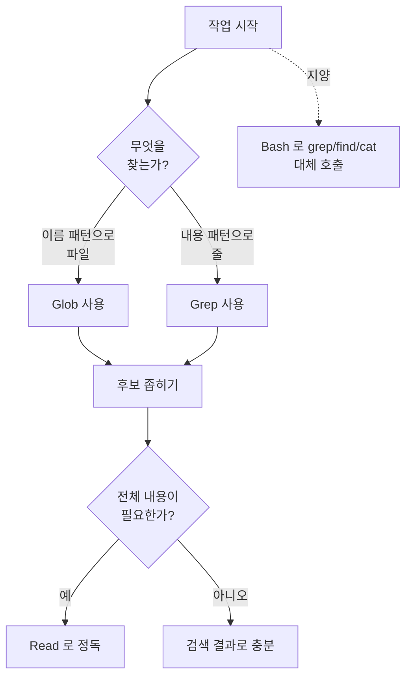
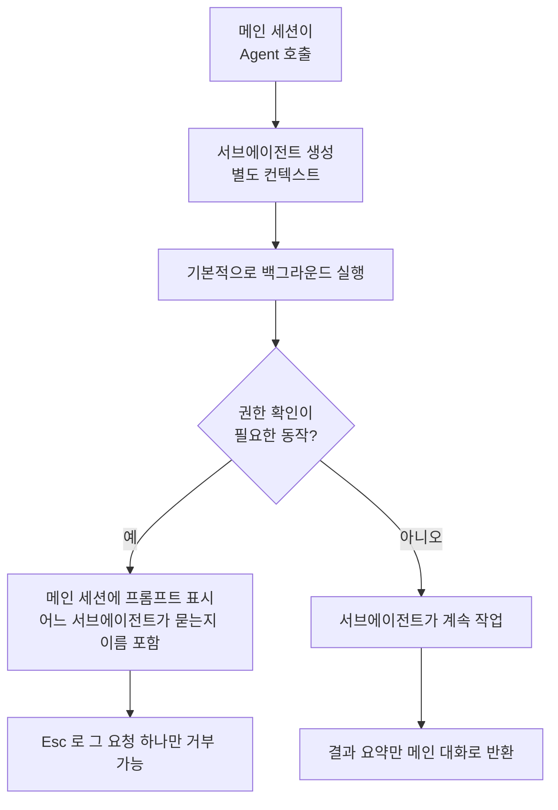

# 도구 레퍼런스

친구에게 설명하자면, Claude Code는 말로만 답하는 채팅봇이 아니라 진짜로 파일을 읽고, 고치고, 명령을 실행하는 일꾼입니다. 이 일꾼이 손과 눈처럼 쓰는 도구들이 바로 이 페이지에서 정리하는 **내장 도구** (built-in tools)들이고, 각 도구에 어떤 권한이 붙는지를 알면 Claude가 어디까지 손대고 어디서 멈추는지를 직접 설계할 수 있습니다.


이 문서는 MoAI-ADK가 올라타 있는 플랫폼인 **Claude Code 자체**를 다루는 배경 자료입니다. MoAI-ADK 자체 기능은 사이드바 위쪽 섹션에서 다룹니다.



**한 줄 요약**: 도구 이름은 곧 식별자입니다. `Read`, `Bash`, `Edit` 같은 정확한 문자열이 권한 규칙·서브에이전트 도구 목록·hook 매처에서 그대로 쓰이므로, 도구의 읽기/쓰기 성격과 권한 동작을 알면 Claude Code의 안전 경계를 직접 그릴 수 있습니다.


## 도구는 왜 중요한가

에이전트가 한 턴 동안 하는 일은 결국 "도구를 몇 번 부른 뒤 그 결과로 답을 만드는" 연속입니다. 이 흐름을 **에이전틱 루프** (agentic loop)라고 부르며, Claude Code는 이 루프를 돌리기 위해 파일 읽기·쓰기·명령 실행·웹 조회·위임 같은 일들을 각각 전담하는 내장 도구 묶음을 기본으로 깔아 둡니다.

여기서 핵심은 도구 이름 자체가 곧 **식별자** (identifier)라는 점입니다. `Read`, `Bash`, `Edit` 같은 정확한 문자열이 다음 세 곳에서 동일하게 쓰입니다.

- 권한 규칙 — `settings.json`의 `permissions.allow` / `permissions.deny`
- 서브에이전트 정의의 `tools` / `disallowedTools` 항목
- hook 매처(matcher)

즉 "이 도구는 허락한다/막는다"는 설정이 곧 "Claude가 무엇을 할 수 있고 무엇은 못 하는지"를 결정합니다. 그래서 도구 목록과 권한 규칙은 별개의 설정이 아니라 같은 언어로 표현된 한 장의 설계도입니다. 권한 시스템 전체의 구조와 권한 모드의 동작은 [권한과 Plan 모드](/ko/claude-code/foundations/permissions) 문서에서 더 자세히 다룹니다.

도구는 크게 **권한이 필요 없는 것**과 **권한이 필요한 것**으로 나뉩니다. 대체로 읽기 전용(read-only) 도구는 권한 없이 동작하고, 파일을 만들거나 고치거나 명령을 실행하는 도구는 사용자 확인을 거칩니다. 도구를 완전히 비활성화하려면 그 이름을 `deny` 배열에 추가하면 됩니다.

## 주요 내장 도구

일상적인 코딩 작업에서 가장 자주 쓰이는 도구들입니다. 읽기/쓰기 구분과 권한 요구 여부를 함께 정리했습니다.

| 도구 | 용도 | 성격 | 권한 필요 |
| :--- | :--- | :--- | :--- |
| `Read` | 파일 내용을 줄 번호와 함께 읽기 (이미지·PDF·노트북 포함) | 읽기 | - |
| `Write` | 새 파일 생성 또는 전체 덮어쓰기 | 쓰기 | 필요 |
| `Edit` | 기존 파일의 정확한 문자열 치환 | 쓰기 | 필요 |
| `Bash` | 셸 명령 실행 | 실행 | 필요 |
| `Glob` | 이름 패턴으로 파일 찾기 | 읽기 | - |
| `Grep` | 파일 내용에서 패턴 검색 (ripgrep 기반) | 읽기 | - |
| `WebFetch` | URL을 가져와 Markdown으로 변환 후 추출 | 읽기(외부) | 필요 |
| `WebSearch` | 웹 검색 후 제목·URL 반환 | 읽기(외부) | 필요 |
| `Agent` | 별도 컨텍스트 윈도우를 가진 서브에이전트 생성 | 위임 | - |
| `TaskCreate` / `TaskUpdate` / `TaskList` / `TaskGet` | 세션 작업 목록 관리 | 관리 | - |
| `LSP` | 언어 서버 기반 코드 인텔리전스 (정의 이동, 참조 찾기, 타입 오류 보고) | 읽기 | - |
| `Skill` | 메인 대화 안에서 스킬 실행 | 실행 | 필요 |

과거의 `TodoWrite`는 v2.1.142 이후 기본 비활성화되었고, 그 자리를 `TaskCreate` / `TaskUpdate` / `TaskList` / `TaskGet` 계열 도구가 대신합니다. 작업 목록은 이 도구들이 메인 대화 안에서 직접 만들고 갱신합니다.

### 읽기 도구의 작은 차이

같은 읽기 도구라도 어디를 뒤지는지에서 미묘한 차이가 있습니다. 이 차이가 "왜 전용 도구를 써야 하는가"의 출발점입니다.

- `Glob`은 `.gitignore`를 **무시**합니다. 그래서 추적 대상이 아닌 파일이나 무시된 파일까지 함께 찾습니다. 결과는 수정 시각순으로 정렬되며 기본적으로 100개에서 잘립니다.
- `Grep`은 반대로 `.gitignore`를 **존중**해 무시된 파일은 건너뜁니다. 출력 모드는 `files_with_matches`(기본), `content`, `count` 세 가지입니다.
- `Read`는 절대 경로를 받고, 토큰 한도를 넘는 큰 파일은 `offset`·`limit`으로 나눠 읽습니다. 이미지·PDF·Jupyter 노트북도 같은 도구로 읽습니다.

한마디로 `Glob`은 "파일 이름으로 넓게 훑고", `Grep`은 "파일 내용으로 깊이 파고", `Read`는 "고른 파일을 정독한다"는 식으로 역할이 나뉩니다.

## 권한 규칙의 형식

도구 권한은 `settings.json`의 `permissions` 항목과 `/permissions` 인터페이스, CLI 플래그(`--allowedTools`, `--disallowedTools`)에서 **같은 규칙 형식**으로 다룹니다. 형식은 `ToolName(specifier)` 하나로 통일되어 있습니다.

```json
{
  "permissions": {
    "allow": [
      "Read(~/project/**)",
      "Bash(npm run *)",
      "WebFetch(domain:docs.example.com)"
    ],
    "deny": [
      "Read(~/.ssh/**)",
      "Bash(rm -rf *)"
    ]
  }
}
```

괄호 안의 지정자(specifier)는 도구 종류에 따라 의미가 다르며, 여러 도구가 같은 형식을 공유합니다.

| 규칙 형식 | 적용 도구 | 설명 |
| :--- | :--- | :--- |
| `Bash(npm run *)` | Bash, Monitor | 명령 패턴 매칭 |
| `Read(~/secrets/**)` | Read, Grep, Glob, LSP | 경로 패턴 매칭 |
| `Edit(/src/**)` | Edit, Write, NotebookEdit | 경로 패턴 매칭 |
| `WebFetch(domain:example.com)` | WebFetch | 도메인 매칭 |
| `WebSearch` | WebSearch | 지정자 없음, 도구 전체 허용/거부 |
| `Agent(Explore)` | Agent | 서브에이전트 유형 매칭 |

규칙을 다룰 때 알아 두면 좋은 동작이 두 가지 있습니다.

- `Edit(...)` 허용 규칙은 같은 경로에 대한 읽기 권한도 함께 부여합니다. 그래서 짝이 되는 `Read(...)` 규칙을 따로 둘 필요가 없습니다.
- `WebFetch`는 기본·`acceptEdits` 모드에서 새 도메인에 처음 접근할 때 한 번 묻습니다. 미리 `WebFetch(domain:...)` 규칙을 두면 묻지 않고 허용됩니다.

`ask`는 별도의 키가 아니라, 어떤 `allow`·`deny` 규칙에도 해당하지 않는 호출이 사용자에게 확인을 요청하는 **기본 흐름**입니다. 즉 `allow`도 `deny`도 아니면 그 도구 호출은 사용자에게 묻는 것으로 처리됩니다. 규칙 평가 순서와 권한 모드의 전체 구조는 [권한과 Plan 모드](/ko/claude-code/foundations/permissions) 문서에서 이어집니다.

## 도구 선택 모범 사례

Claude는 대체로 알아서 알맞은 도구를 고릅니다. 하지만 같은 목적에 더 정확하고 토큰을 아끼는 길이 따로 있습니다. 검색 작업에서 권장되는 우선순위는 다음 흐름과 같습니다.


```mermaid
flowchart TD
    A[작업 시작] --> B{무엇을<br/>찾는가?}
    B -->|이름 패턴으로<br/>파일| C[Glob 사용]
    B -->|내용 패턴으로<br/>줄| D[Grep 사용]
    C --> E[후보 좁히기]
    D --> E
    E --> F{전체 내용이<br/>필요한가?}
    F -->|예| G[Read 로 정독]
    F -->|아니오| H[검색 결과로 충분]
    A -.지양.-> I[Bash 로 grep/find/cat<br/>대체 호출]
```

핵심 원칙을 한 줄씩 짚어 보면 다음과 같습니다.

- **이름으로 파일 찾기**에는 `Glob`을, **내용으로 줄 찾기**에는 `Grep`을 씁니다.  두 도구는 전용 인덱싱과 안전한 출력 형식을 갖췄습니다.
- `Bash`로 `grep`·`find`·`cat`을 대신 부르지 마세요.  Bash는 권한 확인을 거치는 데다, 출력이 길어질수록 컨텍스트를 압박하고, 전용 도구가 붙여 주는 정렬·잘림·줄 번호 같은 구조도 사라집니다.
- 파일을 고칠 때는 전체를 덮어쓰는 `Write`보다, 변경 부분만 보내는 `Edit`을 우선합니다. `Edit`은 읽기 후 수정 규칙으로 의도치 않은 덮어쓰기를 막아 줍니다.
- 코드베이스 구조 파악처럼 범위가 넓은 탐색은 `Agent`로 서브에이전트에 위임해 메인 컨텍스트를 보존합니다.

## Agent 도구와 서브에이전트 spawn

`Agent` 도구는 메인 대화와 **별도의 컨텍스트 윈도우**를 가진 서브에이전트(subagent)를 새로 만듭니다. 서브에이전트의 개념과 정의 방법은 [서브에이전트](/ko/claude-code/agentic/sub-agents) 문서에서 깊이 다루고, 여기서는 `Agent` 도구를 **불렀을 때 벌어지는 일**, 곧 spawn 시맨틱스에 집중합니다.


```mermaid
flowchart TD
    A[메인 세션이<br/>Agent 호출] --> B[서브에이전트 생성<br/>별도 컨텍스트]
    B --> C[기본적으로 백그라운드 실행]
    C --> D{권한 확인이<br/>필요한 동작?}
    D -->|예| E[메인 세션에 프롬프트 표시<br/>어느 서브에이전트가 묻는지 이름 포함]
    D -->|아니오| F[서브에이전트가 계속 작업]
    E --> G[Esc 로 그 요청 하나만 거부 가능]
    F --> H[결과 요약만 메인 대화로 반환]
```

서브에이전트는 메인 대화를 깨끗하게 유지하면서 곁가지 작업을 맡기는 핵심 수단입니다. 최근 Claude Code 버전을 거치며 이 도구의 동작이 몇 가지 중요하게 바뀌었습니다.

### 백그라운드 실행이 기본

Claude Code 2.1.198부터 서브에이전트는 **기본적으로 백그라운드**에서 돌아갑니다. 런타임은 결과를 바로 이어 써야 할 때만 서브에이전트를 포어그라운드로 올리고, 그렇지 않으면 뒤에서 돌려 놓습니다. 중요한 것은 "백그라운드에서 돈다"고 해서 권한 통제가 느슨해지는 것은 아니라는 점입니다 — 서브에이전트가 권한 확인이 필요한 동작을 하면 그 프롬프트는 **메인 세션에 표시**됩니다. 2.1.186부터는 **어느 서브에이전트가 묻고 있는지 이름까지** 함께 뜹니다. `Esc`로 그 요청 하나만 거부할 수 있어, 뒤에서 무언가를 바꾸려는 순간을 놓치지 않고 통제할 수 있습니다.

### 중첩 spawn이 기본 허용 (깊이 3)

과거에는 "서브에이전트는 다른 서브에이전트를 부를 수 없다"는 평평한 계층이 구조적 제약이었습니다. 하지만 2.1.219부터 중첩(nesting)이 **기본 활성화**되었습니다 — 체인지로그에 따르면 서브에이전트는 기본적으로 깊이 3까지 중첩 spawn할 수 있습니다. 중첩을 끄려면 환경변수 `CLAUDE_CODE_MAX_SUBAGENT_SPAWN_DEPTH=1`을 설정하세요.

| 설정 | 동작 | 의미 |
|------|------|------|
| 기본값 (2.1.219+) | 깊이 3까지 중첩 허용 | 한 서브에이전트가 또 다른 서브에이전트를 부를 수 있음 |
| `CLAUDE_CODE_MAX_SUBAGENT_SPAWN_DEPTH=1` | 중첩 비활성 | 위임은 메인 → 서브에이전트 한 단계까지만 |


**평평한 계층이 필요하면 도구 목록으로 만드세요.** 중첩이 기본이 된 지금, "서브에이전트가 또 서브에이전트를 부르지 못하게" 막는 가장 확실한 방법은 그 서브에이전트 정의의 `tools` 목록에서 `Agent` 자체를 빼는 것입니다. 도구가 없으면 부를 수 없으니까요.


### spawn-time mode 파라미터는 무시됩니다

예전에는 `Agent`를 부를 때 `mode` 파라미터로 자식의 권한 모드를 따로 지정할 수 있었습니다. 하지만 2.1.213부터 이 **스폰 타임 모드 파라미터** (spawn-time `mode` parameter)는 **더 이상 쓰이지 않고 무시**됩니다. 서브에이전트는 자기만의 권한 모드를 새로 만들지 않고 부모 세션의 모드를 **물려받습니다** (inherit).

여기에는 한 가지 강한 규칙이 붙습니다. 부모가 `acceptEdits`나 `bypassPermissions` 모드일 때, 이 모드가 자식보다 **우선**합니다 — 자식이 다른 모드를 지정하려 해도 소용이 없습니다.


**읽기 전용 서브에이전트는 권한 모드가 아니라 도구로 만듭니다.** 부모가 `acceptEdits` 상태라면 서브에이전트에 `plan`을 지정해도 무시됩니다 — 부모 모드가 우선해서 쓰기가 허용됩니다. 서브에이전트를 정말 읽기 전용으로 묶어 두려면 `tools` 목록에서 `Write`/`Edit`/`NotebookEdit` 같은 쓰기 도구를 빼거나, 애초에 읽기 전용인 `Explore` 에이전트를 사용하세요. 권한 모드 상속의 전체 구조는 [권한과 Plan 모드](/ko/claude-code/foundations/permissions) 문서에서 다룹니다.


### 호출마다 모델을 명시하기

`Agent`로 서브에이전트를 부를 때는 그때그때 **어떤 모델**로 돌릴지 `model` 인자로 명시하는 것이 권장됩니다(per-spawn model injection). 대부분의 에이전트 정의가 `model: inherit`을 기본으로 갖기 때문에, `model`을 생략하면 서브에이전트가 부모 세션의 모델을 그대로 이어받아 돌아갑니다 — 프로필이 정해 둔 모델이 조용히 무시될 수 있습니다. 2026년 8월 현재 Claude Code 라인업은 Fable 5, Opus 5, Sonnet 5, Haiku 4.5 등이며, 서브에이전트의 역할에 맞춰(탐색엔 가볍고 빠른 모델, 복잡한 추론엔 더 강한 모델) 골라 넘겨주면 비용과 품질의 균형을 잡을 수 있습니다.

## 내장 도구 vs MCP 도구

두 종류의 도구는 출처와 등록 방식이 다릅니다.

| 구분 | 내장 도구 | MCP 도구 |
| :--- | :--- | :--- |
| 출처 | Claude Code가 기본 제공 | 외부 MCP 서버 연결로 추가 |
| 이름 형식 | `Read`, `Bash` 등 고정 이름 | 서버가 노출하는 도구 이름 |
| 추가 방법 | 별도 설치 불필요 | MCP 서버 연결 |
| 확인 방법 | "어떤 도구를 쓸 수 있어?" 질문 | `/mcp` 명령으로 정확한 이름 확인 |

새로운 도구가 필요하면 MCP 서버를 연결합니다. 반대로 재사용 가능한 프롬프트 기반 워크플로우가 필요하면 스킬을 작성하는데, 스킬은 새 도구 항목을 늘리지 않고 기존 `Skill` 도구로 실행됩니다.

세션에 실제로 로드된 도구 집합은 사용 중인 프로바이더·플랫폼·설정에 따라 달라집니다. 현재 세션의 도구가 궁금하면 Claude에게 직접 물어보고, MCP 도구의 정확한 이름은 `/mcp`로 확인합니다.

## MoAI-ADK와 도구 경계

도구 이름이 곧 권한 규칙·서브에이전트 도구 목록·hook 매처의 식별자라는 사실은 MoAI-ADK 하네스 설계의 출발점입니다. MoAI-ADK는 이 메커니즘으로 안전 경계를 그립니다.

- 읽기 전용 탐색 에이전트에는 `Read`/`Grep`/`Glob`만 허용합니다.
- 쓰기 가능한 구현 에이전트는 동시에 둘 이상 돌리지 않습니다.
- 파괴적인 Bash 패턴은 `deny` 규칙으로 차단합니다.
- 서브에이전트의 읽기 전용 스코핑은 권한 모드가 아니라 도구 제한으로 만듭니다.

"전용 도구 우선" 원칙(Bash `grep` 대신 `Grep`, `cat` 대신 `Read`)은 안전만이 아니라 **토크노믹스** (tokenomics) 문제이기도 합니다. 전용 도구의 구조화된 출력(정렬·잘림·줄 번호)이 셸 명령의 원시 출력보다 컨텍스트를 훨씬 적게 차지하기 때문입니다. 도구 하나를 고르는 일이 곧 컨텍스트 윈도우를 아끼는 일이 됩니다.

## 관련 문서

- [권한과 Plan 모드](/ko/claude-code/foundations/permissions)
- [서브에이전트](/ko/claude-code/agentic/sub-agents)
- [훅 (Hooks)](/ko/claude-code/extensibility/hooks)
- [.claude 디렉터리](/ko/claude-code/foundations/claude-directory)

## 참고 자료

- [Claude Code Tools reference](https://code.claude.com/docs/en/tools-reference)
- [Claude Code Docs — Permissions](https://code.claude.com/docs/en/permissions)


검색 권한 프롬프트가 잦다면, 자주 쓰는 읽기 전용 명령을 `settings.json`의 `permissions.allow`에 먼저 등록해 두면 흐름이 끊기지 않습니다. 다만 `Bash(rm -rf *)` 같은 파괴적 패턴은 반드시 `deny`에 두어 안전 경계를 명시하세요.

