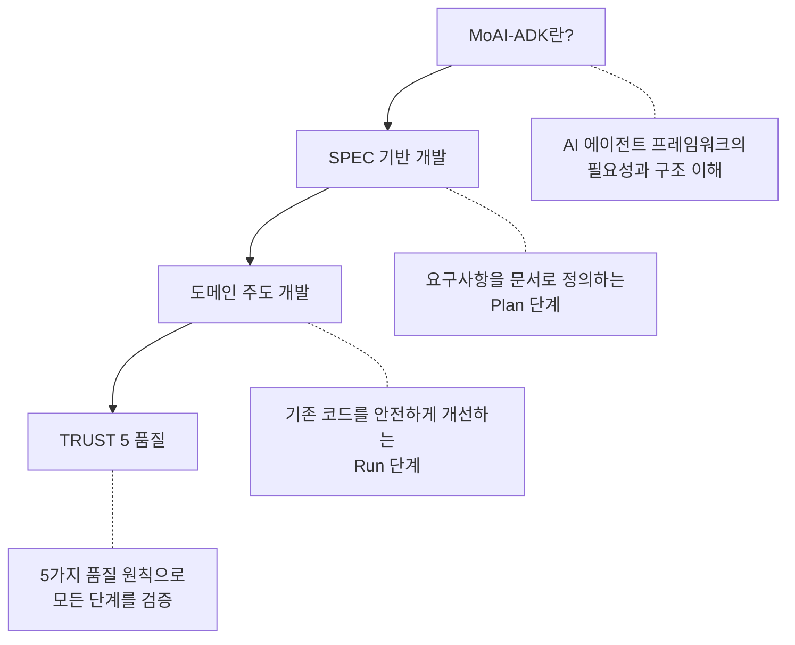

MoAI-ADK를 이해하기 위한 4가지 핵심 개념을 소개합니다.


처음이신가요? 위에서 아래로 순서대로 읽으시면 MoAI-ADK의 전체 그림을 자연스럽게 이해할 수 있습니다.


## 학습 순서

| 순서 | 문서 | 핵심 질문 |
|------|------|----------|
| 1 | [MoAI-ADK란?](/core-concepts/what-is-moai-adk) | AI 개발 도구가 왜 필요하고, 어떻게 구성되어 있는가? |
| 2 | [SPEC 기반 개발](/core-concepts/spec-based-dev) | 요구사항을 어떻게 명확하게 정의하고 관리하는가? |
| 3 | [도메인 주도 개발](/core-concepts/ddd) | 기존 코드를 망가뜨리지 않고 어떻게 개선하는가? |
| 4 | [TRUST 5 품질](/core-concepts/trust-5) | 코드 품질을 어떤 기준으로 보장하는가? |


각 문서는 독립적으로 읽을 수 있지만, 순서대로 읽으면 MoAI-ADK의 개발 철학이 자연스럽게 연결됩니다. **SPEC** 으로 무엇을 만들지 정하고, **DDD** 로 안전하게 만들고, **TRUST 5** 로 품질을 검증하는 흐름입니다.

