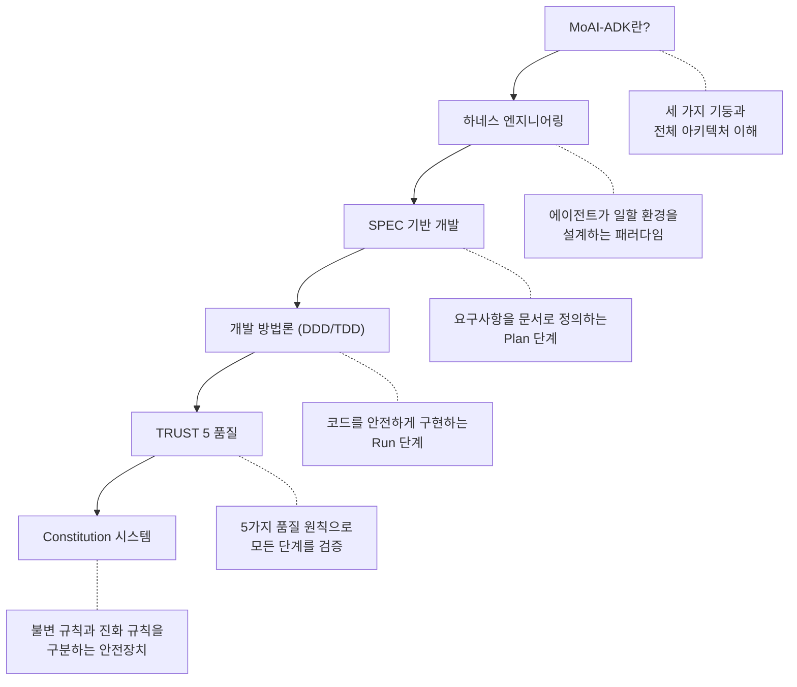

MoAI-ADK v3.0을 이해하는 데 필요한 핵심 개념을 소개합니다. v3.0의 가치는 세 가지 기둥으로 요약됩니다 — **토크노믹스** (Token Economics), **에이전틱 루프 엔지니어링** (Agentic Loop Engineering), 그리고 **에이전틱 하네스** (Agentic Harness). 이 섹션의 문서들은 그 세 기둥이 실제 개발 흐름에서 어떻게 작동하는지 하나씩 풀어냅니다.


처음이신가요? 위에서 아래로 순서대로 읽으면 MoAI-ADK의 전체 그림이 자연스럽게 그려집니다. 각 문서는 독립적으로 읽어도 무방합니다.


## 세 가지 기둥

| 기둥 | 핵심 질문 | 대표 문서 |
|------|----------|----------|
| **토크노믹스** | 같은 품질을 더 적은 토큰으로 얻으려면? | [MoAI-ADK란?](/core-concepts/what-is-moai-adk) |
| **에이전틱 루프 엔지니어링** | 루프가 어떻게 스스로 일하고 학습하는가? | [하네스 엔지니어링](/ko/core-concepts/harness-engineering) |
| **에이전틱 하네스** | 에이전트가 잘 일할 환경을 어떻게 설계하는가? | [SPEC 기반 개발](/core-concepts/spec-based-dev) · [TRUST 5](/core-concepts/trust-5) |

```mermaid
flowchart TD
    A["MoAI-ADK란?"] --> B["하네스 엔지니어링"]
    B --> C["SPEC 기반 개발"]
    C --> D["개발 방법론 (DDD/TDD)"]
    D --> E["TRUST 5 품질"]
    E --> F["Constitution 시스템"]

    A -.- A1["세 가지 기둥과\n전체 아키텍처 이해"]
    B -.- B1["에이전트가 일할 환경을\n설계하는 패러다임"]
    C -.- C1["요구사항을 문서로 정의하는\nPlan 단계"]
    D -.- D1["코드를 안전하게 구현하는\nRun 단계"]
    E -.- E1["5가지 품질 원칙으로\n모든 단계를 검증"]
    F -.- F1["불변 규칙과 진화 규칙을\n구분하는 안전장치"]
```

## 학습 순서

| 순서 | 문서 | 핵심 질문 |
|------|------|----------|
| 1 | [MoAI-ADK란?](/core-concepts/what-is-moai-adk) | MoAI-ADK는 무엇이고, 왜 토크노믹스를 목표로 하는가? |
| 2 | [하네스 엔지니어링](/ko/core-concepts/harness-engineering) | 코드를 직접 쓰는 대신 환경을 설계한다는 것은 무슨 뜻인가? |
| 3 | [SPEC 기반 개발](/core-concepts/spec-based-dev) | 요구사항을 어떻게 명확하게 정의하고 관리하는가? |
| 4 | [개발 방법론 (DDD/TDD)](/core-concepts/ddd) | 기존 코드를 망가뜨리지 않고 어떻게 개선하는가? |
| 5 | [TRUST 5 품질](/core-concepts/trust-5) | 코드 품질을 어떤 기준으로 보장하는가? |
| 6 | [Constitution 시스템](/ko/core-concepts/constitution) | 하네스가 스스로 진화할 때 무엇이 그 진화를 통제하는가? |


흐름으로 요약하면 이렇습니다. **SPEC** 으로 무엇을 만들지 정하고, **DDD/TDD** 로 안전하게 만들고, **TRUST 5** 로 품질을 검증합니다. 이 전체 루프를 감싸는 것이 **하네스**이고, 루프가 돌수록 하네스가 학습해 지침이 진화합니다 — 그 진화의 안전장치가 **Constitution**입니다.

