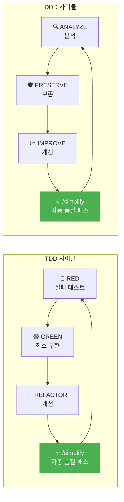
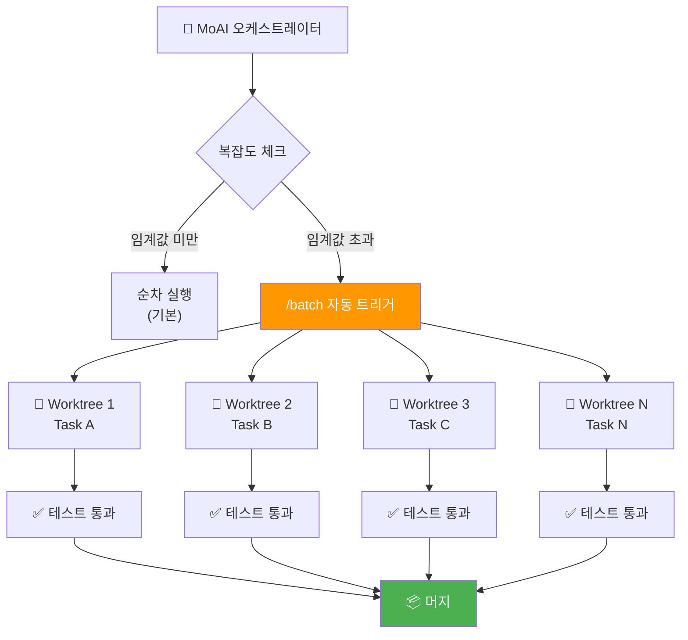
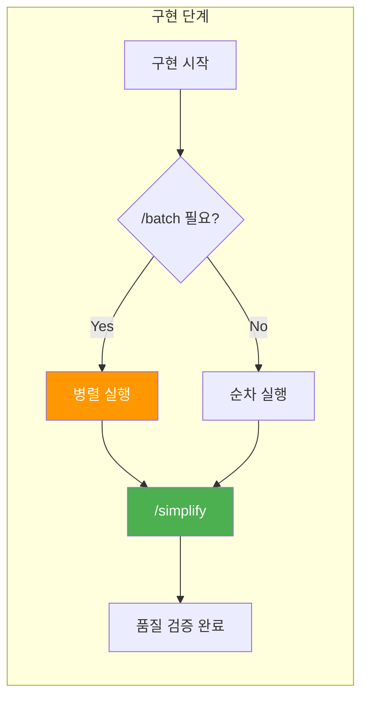

MoAI-ADK v2.6.0부터 Claude Code의 네이티브 스킬 2개를 **자동으로** 호출합니다. 별도의 플래그나 수동 명령이 필요 없습니다.

| 스킬 | 역할 | 트리거 |
|------|------|--------|
| `/simplify` | 품질 집행 | 매 TDD REFACTOR, DDD IMPROVE 단계 후 **항상** 실행 |
| `/batch` | 스케일아웃 실행 | 작업 복잡도가 임계값을 초과할 때 자동 트리거 |

## /simplify — 자동 품질 패스

`/simplify`는 변경된 코드를 병렬 에이전트로 리뷰하여 다음을 검사하고 자동 수정합니다:

- **재사용 기회**: 중복 코드, 공통 패턴 추출 가능성
- **품질 문제**: 네이밍, 복잡도, 에러 처리
- **효율성**: 불필요한 연산, 최적화 가능한 로직
- **CLAUDE.md 준수**: 프로젝트 규칙 위반 여부

### 동작 시점

- **TDD 모드**: 매 REFACTOR 단계 완료 후 자동 실행
- **DDD 모드**: 매 IMPROVE 단계 완료 후 자동 실행
- **설정 불필요**: MoAI가 직접 호출하므로 사용자 개입 없음

## /batch — 병렬 스케일아웃

`/batch`는 대규모 작업을 격리된 Git worktree에서 수십 개의 에이전트로 병렬 실행합니다. 각 에이전트는 테스트를 실행하고 결과를 보고하며, MoAI가 이를 머지합니다.

### 자동 트리거 조건

| 워크플로우 | 트리거 조건 | 설명 |
|-----------|-----------|------|
| `run` | 태스크 >= 5, **또는** 예상 파일 변경 >= 10, **또는** 독립 태스크 >= 3 | SPEC 구현 시 대규모 변경 감지 |
| `mx` | 소스 파일 >= 50 | 대규모 코드베이스 MX 태그 스캔 |
| `coverage` | P1+P2 커버리지 갭 >= 10 | 다수의 테스트 파일 동시 생성 |
| `clean` | 확인된 데드 코드 >= 20 | 다수의 파일 동시 정리 |

### 작동 방식

각 Worktree는:
- 독립된 Git 브랜치에서 작업
- 자체 테스트를 실행하여 결과 검증
- 완료 후 메인 브랜치에 머지

## 두 스킬의 협업

1. **복잡도 평가**: 작업 규모가 임계값을 초과하면 `/batch`가 자동 활성화
2. **병렬 구현**: 독립적인 태스크를 여러 worktree에서 동시 실행
3. **품질 검증**: 각 구현 사이클 후 `/simplify`가 자동으로 코드 품질 검사
4. **결과 머지**: 모든 작업이 완료되면 결과를 통합

## 핵심 원칙

이 두 스킬은 **수동 명령이 아닌 자율적 행동**입니다:

- `/simplify`는 매 개발 사이클 후 **항상** 실행됩니다
- `/batch`는 복잡도가 **충분히 높을 때만** 자동으로 활성화됩니다
- 사용자가 별도로 호출하거나 설정할 필요가 없습니다
- MoAI 오케스트레이터가 적절한 시점에 자동으로 판단합니다

## 다음 단계

- [MoAI-ADK 개발 방법론](/ko/core-concepts/ddd) — TDD와 DDD 사이클의 상세 설명
- [하네스 엔지니어링](/ko/core-concepts/harness-engineering) — 자동 품질의 상위 패러다임
- [`/moai loop`](/ko/utility-commands/moai-loop) — Self-Verify Loop 상세 가이드
