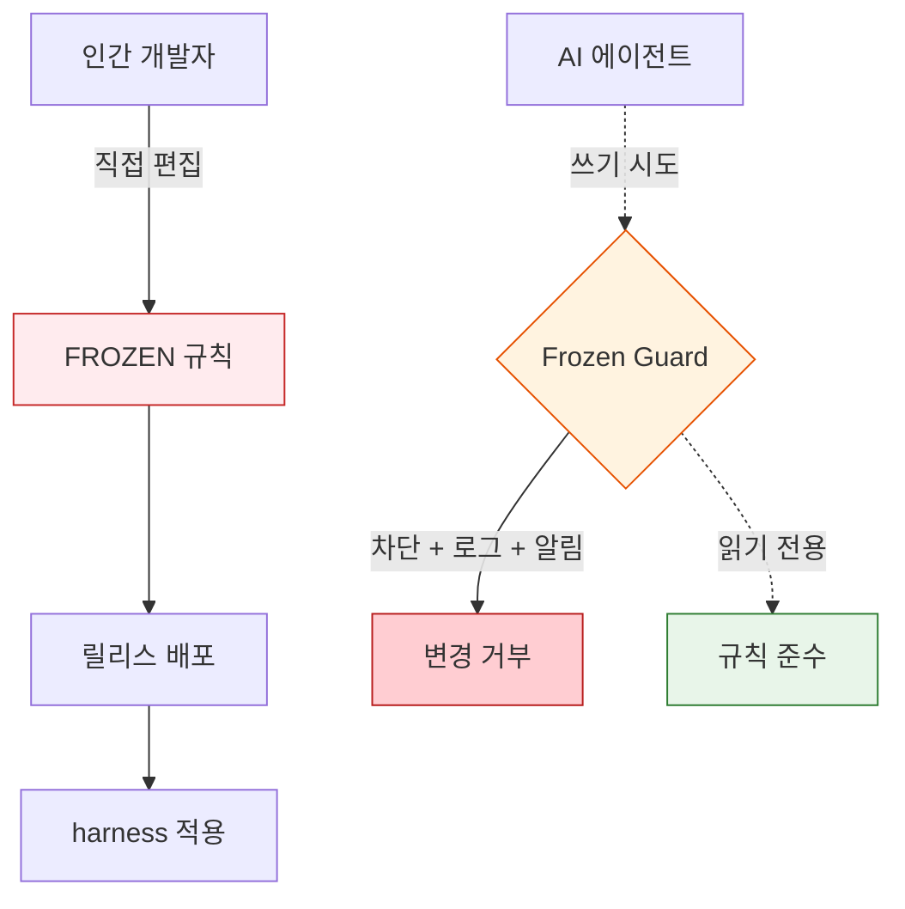
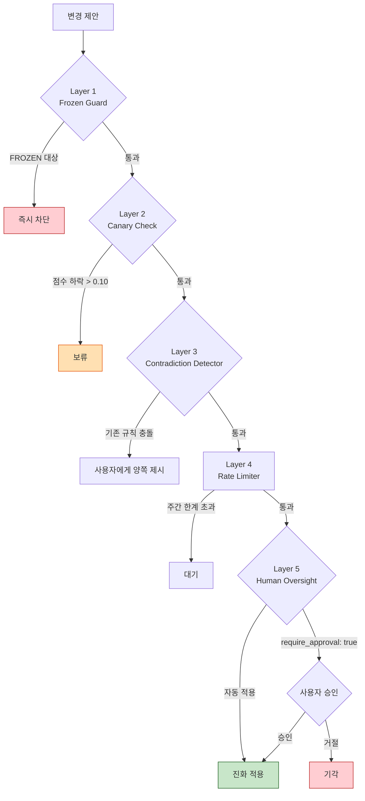

코드베이스가 진화하면 규칙도 함께 진화해야 하지만, 잘못된 진화는 시스템을 한 번에 무너뜨립니다. MoAI-ADK의 **Constitution 시스템**은 이 딜레마를 '무엇을 바꿀 수 있고 무엇을 바꿀 수 없는가'로 가르는 헌법적 제약 층입니다 — 불변 규칙 (FROZEN Zone) 과 진화 가능 규칙 (Evolvable Zone) 을 나누어 담습니다. **왜냐하면** 자가 진화 하네스가 스스로 고칠 수 있는 영역과 인간만 손댈 수 있는 영역이 명확히 구분되어 있어야 폭주 없이 안전하게 학습할 수 있기 **때문입니다**. 평가 기준과 안전 규칙은 진화 루프의 **밖**에 둡니다. 그래야 자가 진화 **harness** 가 학습을 쌓아도 **TRUST 5** 의 통과 임계값을 스스로 낮추는 식으로 자기 점수를 부풀리는 일이 일어나지 않습니다.

## 개요

[하네스 엔지니어링](/ko/core-concepts/harness-engineering)에서 보았듯, MoAI-ADK의 하네스는 루프가 축적한 관찰로 스스로 지침을 진화시킵니다. 그렇다면 무엇이 그 진화를 통제할까요? 답이 **Constitution (헌법)** 시스템입니다.

Constitution은 AI 에이전트가 임의로 바꿀 수 없는 불변 제약 (FROZEN Zone) 과 학습으로 개선할 수 있는 진화 가능 제약 (Evolvable Zone) 을 갈라 놓습니다. 평가 기준과 안전 규칙은 진화 루프의 **밖**에 둡니다. 그래야 자가 진화 하네스가 폭주하지 않습니다. 하네스 엔지니어링의 핵심 안전장치가 바로 이 구분입니다.

## FROZEN vs Evolvable

### FROZEN Zone (불변)

AI 에이전트가 절대 수정할 수 없는 규칙입니다. 인간 개발자만 변경할 수 있습니다.



**대표 항목**:

| 항목 | 설명 | 소스 |
|------|------|------|
| TRUST 5 | 5가지 품질 기준 | moai-constitution.md |
| SPEC + GEARS | 명세서 형식 | spec-workflow.md |
| AskUserQuestion 독점 | 사용자 질문 채널 | agent-common-protocol.md |
| 평가 차원 4개 | Functionality/Security/Craft/Consistency | harness/scorer.go |
| 루브릭 앵커 4단계 | 0.25/0.50/0.75/1.00 | harness/rubric.go |
| 통과 임계값 하한 | 최소 0.60 (낮출 수 없음) | design-constitution.md |
| 디자인 파이프라인 순서 | manager-spec 먼저, sync-auditor 마지막 | design-constitution.md |

### Evolvable Zone (진화 가능)

학습(lessons)과 연구(research)를 근거로 개선을 제안할 수 있는 규칙입니다.

**대표 항목**:

| 항목 | 설명 |
|------|------|
| 스킬 본문 내용 | moai-domain-* 스킬의 세부 내용 |
| 파이프라인 가중치 | design.yaml의 phase_weights |
| 반복 한계 | design.yaml의 iteration_limits |
| 에이전트 행동 규칙 | Surface Assumptions, Enforce Simplicity 등 |

## Zone Registry

모든 HARD 조항을 열거하는 **단일 진실 공급원**(Single Source of Truth)입니다.

### ID 할당 규칙

```
CONST-V3R2-NNN (3자리 이상 zero-padding)

001-050: 기존 HARD 조항
051-099: design constitution 미러 엔트리
100-149: design overflow (자동 확장)
150+: 신규 추가
```

> **ID 접두사는 시대(era)마다 다릅니다**: `CONST-V3R2-NNN`은 예시일 뿐이며,
> 접두사에는 조항이 도입된 시대가 그대로 드러납니다 (`CONST-V3R2-NNN`,
> `CONST-V3R5-NNN`, `CONST-V3R6-NNN` 등). V3R2로 고정된 값이 아니며, 이후
> 시대에 추가된 조항은 그 시대의 접두사를 씁니다.

### Canary Gate

FROZEN 조항에는 `canary_gate: true`가 붙습니다. 바꾸기 전에 canary 검증을 반드시 거쳐야 합니다.

```yaml
# Zone Registry 엔트리 예시
- id: CONST-V3R2-154
  zone: Frozen
  file: internal/harness/scorer.go
  anchor: "#dimension-enum"
  clause: "Dimension enum FROZEN at 4 values"
  canary_gate: true
```

## 안전 아키텍처 (5계층)

Constitution 시스템은 5계층 안전 아키텍처가 지킵니다. 하네스가 아무리 학습을 쌓아도 변경은 아래 다섯 관문을 차례로 통과해야 합니다:



### Layer 1: Frozen Guard

쓰기 작업에 들어가기 전에 대상 파일이 FROZEN zone인지 확인합니다. 위반하면 쓰기를
막고, 로그를 남기고, 사용자에게 알립니다.

### Layer 2: Canary Check

제안된 변경을 메모리에만 적용해 보고 최근 프로젝트 3개를 다시 평가합니다. 점수가
0.10 넘게 떨어지면 그 변경을 물립니다.

### Layer 3: Contradiction Detector

새 학습이 기존 규칙과 부딪히면 양쪽을 모두 사용자에게 보여 줍니다. 한쪽을 자동으로
덮어쓰는 일은 절대 없습니다.

### Layer 4: Rate Limiter

진화 속도를 제한합니다:

| 파라미터 | 기본값 | 설명 |
|-----------|--------|------|
| `learning.rate_limit.max_per_week` | 3 | 7일 슬라이딩 윈도우 내 최대 업데이트 횟수 |
| `learning.rate_limit.cooldown_hours` | 24 | 업데이트 간 최소 대기 시간 (시간) |

> 위 두 키는 `harness.yaml`의 `learning.rate_limit` 아래에 정의됩니다. (별도
> 개념인 Lessons Protocol의 "프로젝트당 활성 lesson 50개 상한"과 혼동하지
> 마세요 — 그 50은 진화 속도 제한이 아니라 lesson 메모리 항목 수 상한입니다.)

### Layer 5: Human Oversight

`require_approval: true`이면 모든 진화 제안에 사용자 승인이 필요합니다.

## CLI에서 활용

```bash
# 전체 registry 조회
moai constitution list

# Frozen zone 필터
moai constitution list --zone frozen

# 특정 파일 조항만 조회
moai constitution list --file internal/harness/scorer.go

# JSON 형식 출력
moai constitution list --format json
```

## 관련 문서

- [TRUST 5 품질](/ko/core-concepts/trust-5) — 5가지 품질 기준
- [하네스 엔지니어링](/ko/core-concepts/harness-engineering) — 하네스 개념 개요
- [SPEC 기반 개발](/ko/core-concepts/spec-based-dev) — SPEC 워크플로우
