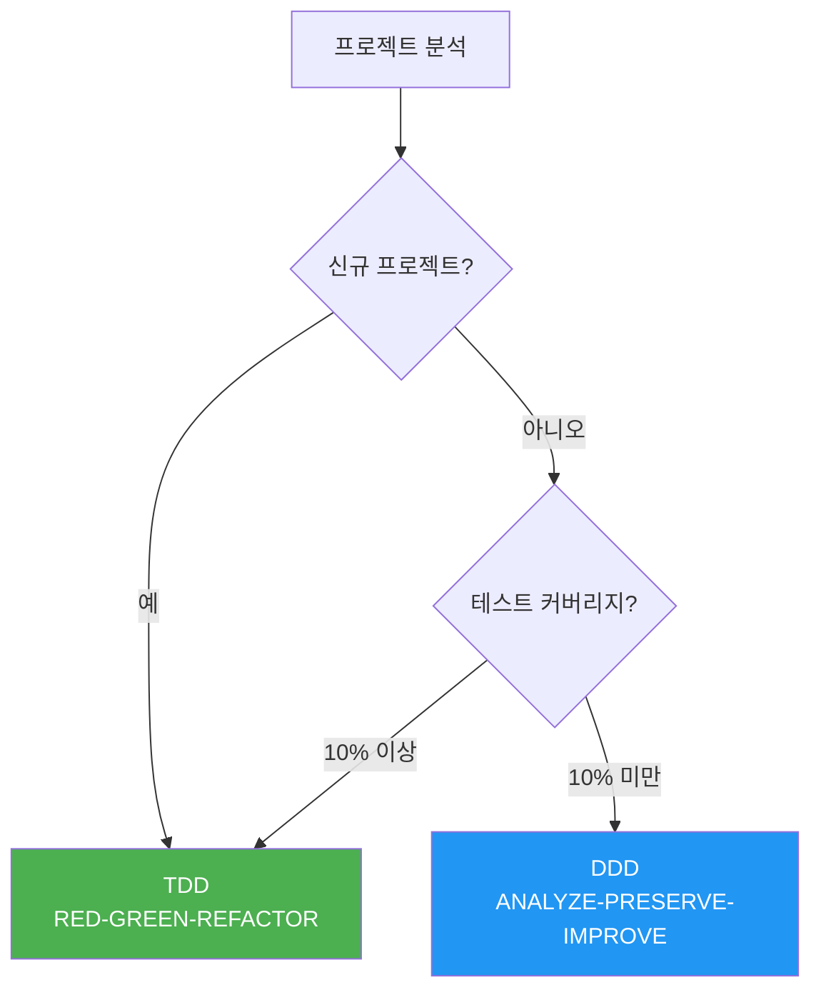
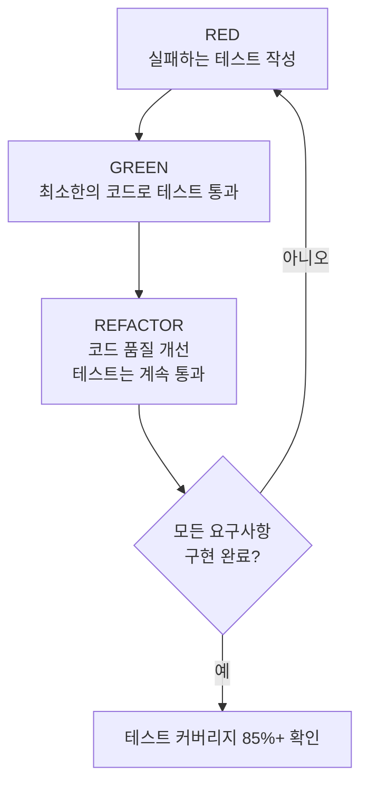
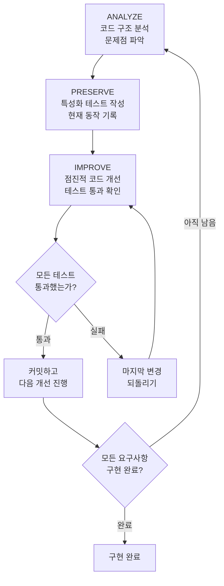
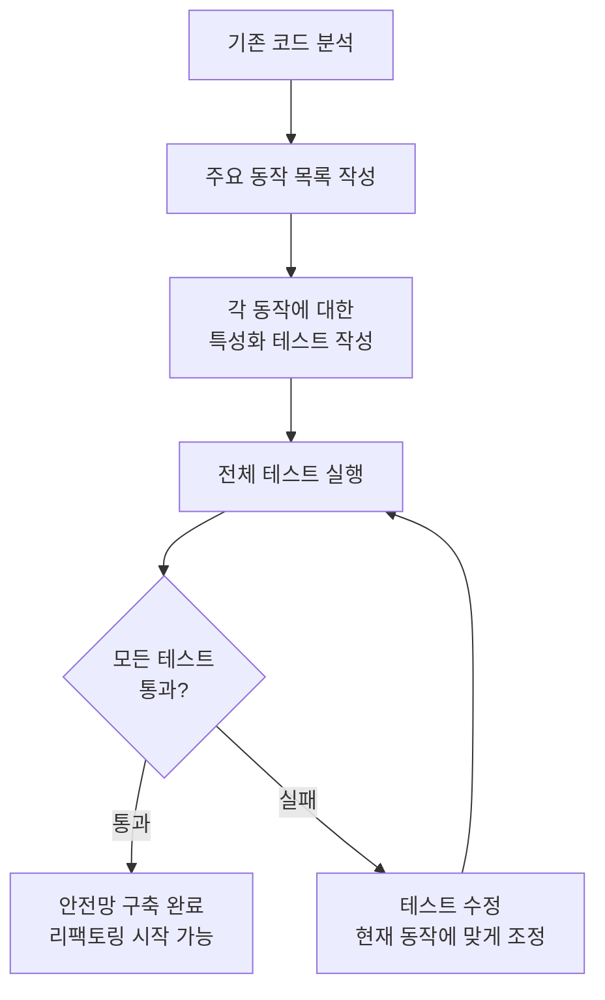
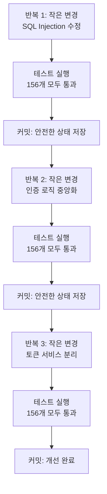
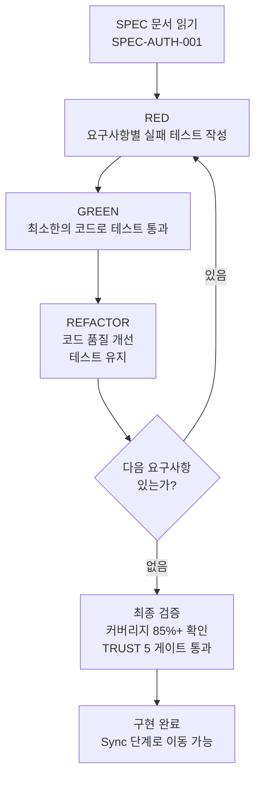
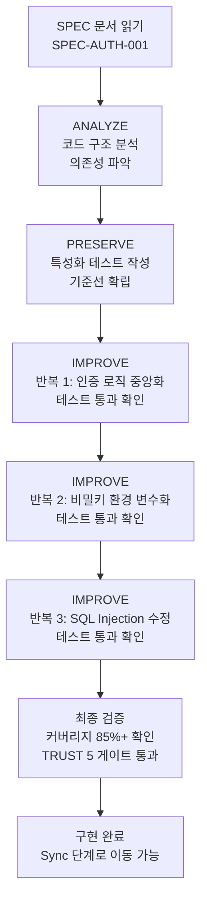

# 개발 방법론 (DDD/TDD)

MoAI-ADK의 개발 방법론을 상세히 안내합니다. 프로젝트 상태에 따라 TDD 또는 DDD를
선택하여 사용합니다.


  **한 줄 요약:** 신규 프로젝트는 **TDD** (RED-GREEN-REFACTOR), 테스트가 거의 없는
  기존 프로젝트는 **DDD** (ANALYZE-PRESERVE-IMPROVE) 를 사용합니다.
  `quality.yaml`에서 직접 선택할 수도 있습니다.


## 방법론 개요

MoAI-ADK는 프로젝트 상태에 따라 최적의 개발 방법론을 자동으로 선택합니다.



| 프로젝트 유형                      | 방법론  | 사이클                    | 설명                                     |
| ---------------------------------- | ------- | ------------------------- | ---------------------------------------- |
| **신규 프로젝트**                  | **TDD** | RED-GREEN-REFACTOR        | 테스트를 먼저 작성하고 구현              |
| **기존 프로젝트** (커버리지 ≥ 10%) | **TDD** | RED-GREEN-REFACTOR        | 부분적 테스트 기반으로 TDD 확장          |
| **기존 프로젝트** (커버리지 < 10%) | **DDD** | ANALYZE-PRESERVE-IMPROVE  | 특성화 테스트로 안전한 점진적 개선       |


  **방법론은 직접 선택할 수 있습니다:** `.moai/config/sections/quality.yaml`에서
  `development_mode`를 `tdd` 또는 `ddd`로 설정하면 자동 선택을 무시하고 원하는
  방법론을 사용할 수 있습니다.


## TDD란?

**TDD** (Test-Driven Development) 는 **테스트를 먼저 작성하고, 그 테스트를
통과하는 최소한의 코드를 구현하는** 개발 방법론입니다. MoAI-ADK의 기본 방법론으로,
대부분의 프로젝트에서 사용됩니다.

### RED-GREEN-REFACTOR 사이클

TDD는 세 단계를 반복하는 사이클로 진행됩니다.



### 1단계: RED (실패하는 테스트 작성)

구현할 기능의 **테스트를 먼저** 작성합니다. 아직 코드가 없으므로 테스트는 반드시
실패합니다.

**핵심 원칙:**

- 한 번에 하나의 테스트만 작성
- 구현하려는 동작을 Given-When-Then으로 명확하게 기술
- 테스트가 실패하는 것을 확인 (실패하지 않으면 테스트가 의미 없음)

### 2단계: GREEN (최소한의 코드로 테스트 통과)

테스트를 통과하는 **가장 간단한 코드**를 작성합니다.

**핵심 원칙:**

- 미리 최적화하거나 추상화하지 않음
- 정확성에 집중, 우아함은 나중에
- 테스트가 통과하면 멈춤

### 3단계: REFACTOR (코드 품질 개선)

테스트가 통과하는 상태를 유지하면서 코드를 정리합니다.

**핵심 원칙:**

- 중복 코드 제거
- 변수명, 함수명 개선
- SOLID 원칙 적용
- 테스트는 계속 통과해야 함

### TDD 실전 예시

```python
# RED: 실패하는 테스트 먼저 작성
def test_user_registration():
    """
    GIVEN: 유효한 사용자 정보가 있고
    WHEN: 회원가입을 하면
    THEN: 사용자가 생성되고 환영 이메일이 발송되어야 함
    """
    user_service = UserService()
    result = user_service.register(
        email="newuser@example.com",
        password="SecurePass123!"
    )

    assert result.success is True
    assert result.user.id is not None
    assert email_service.welcome_email_sent("newuser@example.com") is True

# 테스트 실행 (실패 예상 - 구현 안 됨)
# > pytest test_user_service.py - test_user_registration FAILED

# ====================================

# GREEN: 최소한의 코드로 테스트 통과
class UserService:
    def register(self, email: str, password: str) -> RegistrationResult:
        user = User.create(email, password)
        user_repository.save(user)
        email_service.send_welcome(email)
        return RegistrationResult.success(user)

# 테스트 실행 (통과)
# > pytest test_user_service.py - test_user_registration PASSED

# ====================================

# REFACTOR: 코드 품질 개선 (테스트는 계속 통과)
class UserService:
    def __init__(
        self,
        user_repo: UserRepository,
        email_service: EmailService,
        password_validator: PasswordValidator
    ):
        self.user_repo = user_repo
        self.email_service = email_service
        self.password_validator = password_validator

    def register(self, email: str, password: str) -> RegistrationResult:
        if not self.password_validator.validate(password):
            return RegistrationResult.failure("비밀번호가 유효하지 않습니다")

        user = User.create(email, password)
        self.user_repo.save(user)
        self.email_service.send_welcome(email)
        return RegistrationResult.success(user)

# 테스트 실행 (여전히 통과)
# > pytest test_user_service.py - test_user_registration PASSED
```

### 기존 프로젝트에서의 TDD (Brownfield Enhancement)

TDD를 기존 코드가 있는 프로젝트에서 사용할 때는 **Pre-RED 단계**가 추가됩니다:

1. **(Pre-RED)** 대상 영역의 기존 코드를 읽고 현재 동작을 이해합니다
2. **RED:** 기존 코드 이해를 바탕으로 실패하는 테스트를 작성합니다
3. **GREEN:** 최소한의 코드로 테스트를 통과시킵니다
4. **REFACTOR:** 테스트를 유지하면서 코드를 개선합니다


  기존 코드가 있더라도 테스트 커버리지가 10% 이상이면 TDD를 사용할 수 있습니다.
  Pre-RED 단계에서 기존 동작을 파악한 뒤 테스트를 작성하기 때문에, 기존 기능을
  안전하게 보존하면서 새로운 기능을 추가할 수 있습니다.


## DDD란?

**DDD** (Domain-Driven Development) 는 **안전한 코드 개선 방법**입니다. 기존
코드를 존중하면서 점진적으로 개선하는 접근 방식입니다. 테스트가 거의 없는 (10%
미만) 기존 프로젝트에서 사용됩니다.

### 집 리모델링 비유

DDD를 처음 접하는 분들을 위해 **집 리모델링**에 비유해 설명합니다. 10년 된 집을
리모델링한다고 상상해보세요.

| 집 리모델링 단계      | DDD 단계              | 하는 일                            | 왜 중요한가                                                 |
| --------------------- | --------------------- | ---------------------------------- | ----------------------------------------------------------- |
| 집 점검하기           | **ANALYZE** (분석)    | 벽에 금이 간 곳, 배관 상태 확인    | 어디가 문제인지 모르면 고칠 수 없습니다                      |
| 현재 상태 사진 찍기   | **PRESERVE** (보존)   | 모든 방의 사진을 찍어서 기록       | 나중에 "원래 여기 벽이 있었나?"라고 헷갈릴 때 확인합니다     |
| 방 하나씩 리모델링    | **IMPROVE** (개선)    | 한 번에 한 방씩만 공사하고 매번 확인 | 한꺼번에 다 부수면 어디서 문제가 생겼는지 알 수 없습니다     |

**잘못된 방법 vs 올바른 방법:**

```
잘못된 방법: "전체 코드를 한 번에 다 바꿀게요!"
  --> 기존 기능이 망가질 위험이 높습니다
  --> 문제가 생기면 어디서 잘못됐는지 찾기 어렵습니다

올바른 방법: "테스트로 현재 동작을 기록하고, 조금씩 바꿀게요!"
  --> 기존 기능이 망가지면 테스트가 바로 알려줍니다
  --> 문제가 생기면 마지막 변경만 되돌리면 됩니다
```

### ANALYZE-PRESERVE-IMPROVE 사이클

MoAI-ADK의 DDD는 세 단계를 반복하는 사이클로 진행됩니다.



### 1단계: ANALYZE (분석)

기존 코드의 구조를 철저히 분석합니다. 의사가 환자를 진찰하는 것과 같습니다.

**분석 항목:**

| 분석 대상  | 확인 내용                          | 비유               |
| ---------- | ---------------------------------- | ------------------ |
| 파일 구조  | 어떤 파일이 있고, 어떻게 연결되어 있는지 | 집의 도면 확인     |
| 의존성     | 어떤 모듈이 어떤 모듈에 의존하는지 | 배관과 전기 배선 확인 |
| 테스트 현황 | 기존 테스트가 얼마나 있는지        | 기존 보험 확인     |
| 문제점     | 중복 코드, 보안 취약점, 성능 병목  | 금이 간 벽, 누수 확인 |

**manager-ddd가 생성하는 분석 보고서 예시:**

```markdown
## 코드 분석 보고서

- 대상: src/auth/ (인증 모듈)
- 파일: 8개 Python 파일
- 코드 줄 수: 1,850줄
- 테스트 커버리지: 5%

## 발견된 문제
1. 중복된 인증 로직 (3곳에서 동일한 코드 반복)
2. 하드코딩된 비밀키 (config.py에 직접 작성)
3. SQL Injection 취약점 (user_repository.py)
4. 불충분한 테스트 (5%, 목표 85%)
```

### 2단계: PRESERVE (보존)

기존 동작을 보존하기 위한 **안전망**을 구축합니다. 이 단계의 핵심은 **특성화
테스트** (Characterization Tests) 작성입니다.


  **특성화 테스트가 뭔가요?**

  집 리모델링 전에 현재 상태를 **사진으로 찍어두는 것**과 같습니다.

  일반적인 테스트는 "이것이 올바르게 동작하는가?"를 확인합니다. 하지만 특성화
  테스트는 "현재 이것이 어떻게 동작하는가?"를 기록합니다.

  즉, 맞다/틀리다를 판단하는 것이 아니라, **"원래 이렇게 동작했다"는 사실을
  기록**하는 것입니다. 나중에 코드를 변경한 뒤 테스트가 실패하면, 기존 동작이
  바뀌었다는 것을 즉시 알 수 있습니다.


**특성화 테스트 예시:**

```python
class TestExistingLoginBehavior:
    """기존 로그인 함수의 현재 동작을 기록하는 특성화 테스트"""

    def test_valid_login_returns_token(self):
        """
        GIVEN: 등록된 사용자가 있고
        WHEN: 올바른 비밀번호로 로그인하면
        THEN: 현재 구현이 반환하는 응답을 그대로 기록
        """
        user = create_test_user(
            email="test@example.com",
            password="password123"
        )

        result = login_service.login("test@example.com", "password123")

        # 현재 동작을 그대로 기록 (옳고 그름을 판단하지 않음)
        assert result["status"] == "success"
        assert result["token"] is not None
        assert result["expires_in"] == 3600  # 현재 만료 시간

    def test_wrong_password_returns_error(self):
        """잘못된 비밀번호로 로그인 시 현재 동작 기록"""
        create_test_user(email="test@example.com", password="password123")

        result = login_service.login("test@example.com", "wrongpassword")

        assert result["status"] == "error"
        assert result["code"] == 401
```

**테스트 작성 전략:**



### 3단계: IMPROVE (개선)

특성화 테스트가 구축되면, 이제 안전하게 코드를 개선할 수 있습니다. 핵심 원칙은
**작은 단계로 나누어 변경하기**입니다.

**개선 과정:**

```python
# BEFORE: 개선 전 코드
def login(email, password):
    # SQL Injection 취약점
    user = db.query("SELECT * FROM users WHERE email = '" + email + "'")
    if user and check_password(user.password, password):
        token = generate_token(user.id)
        return {"status": "success", "token": token}
    return {"status": "error", "code": 401}

# ====================================

# AFTER: 개선 후 코드 (3번의 반복을 거쳐 완성)
def login(email: str, password: str) -> LoginResult:
    """사용자 로그인을 처리합니다."""
    # 반복 1: 파라미터화된 쿼리로 SQL Injection 방지
    user = user_repository.find_by_email(email)

    if not user:
        return LoginResult.failure("자격증명이 유효하지 않습니다")

    # 반복 2: 인증 로직 중앙화
    if not auth_service.verify_password(user, password):
        return LoginResult.failure("자격증명이 유효하지 않습니다")

    # 반복 3: 토큰 서비스 분리
    token = token_service.generate(user.id)
    return LoginResult.success(token)
```

**점진적 개선 단계:**




  **핵심 원칙:** 매번 변경한 뒤 반드시 테스트를 실행합니다. 테스트가 실패하면
  마지막 변경만 되돌리면 됩니다. 이것이 "작은 단계"의 힘입니다. 한 번에 많은 것을
  바꾸면 어디서 문제가 생겼는지 찾기 어렵습니다.


## 방법론 비교

| 측면              | TDD                         | DDD                          |
| ----------------- | --------------------------- | ---------------------------- |
| **테스트 타이밍** | 코드 작성 전 (RED)          | 분석 후 (PRESERVE)           |
| **커버리지 접근** | 커밋별 엄격 기준            | 점진적 개선                  |
| **최적 상황**     | 신규 프로젝트, 10%+ 커버리지 | 커버리지 10% 미만 레거시     |
| **위험 수준**     | 중간 (규율 필요)            | 낮음 (동작 보존)             |
| **커버리지 예외** | 허용 안 됨                  | 허용                         |
| **Run Phase 사이클** | RED-GREEN-REFACTOR       | ANALYZE-PRESERVE-IMPROVE     |


  **방법론 선택 가이드:**

  - **신규 프로젝트** (그린필드): TDD (기본값)
  - **기존 프로젝트** (커버리지 50% 이상): TDD
  - **기존 프로젝트** (커버리지 10-49%): TDD (Pre-RED 단계 활용)
  - **기존 프로젝트** (커버리지 10% 미만): DDD (점진적 특성화 테스트)


## 특성화 테스트란?

특성화 테스트는 DDD의 핵심 도구입니다. 좀 더 자세히 알아봅시다.

### 일반 테스트와의 차이

| 구분          | 일반 테스트                     | 특성화 테스트                  |
| ------------- | ------------------------------- | ------------------------------ |
| **목적**      | "이것이 올바르게 동작하는가?"   | "이것이 현재 어떻게 동작하는가?" |
| **작성 시점** | 새 코드 작성 전/후              | 기존 코드 리팩토링 전          |
| **기준**      | 요구사항 (설계서)               | 현재 실제 동작                 |
| **비유**      | 설계도대로 지었는지 확인        | 현재 집 상태를 사진으로 기록   |

### 작성 원칙

1. **판단하지 않고 기록만**: 현재 코드에 버그가 있더라도, 그 동작을 그대로
   기록합니다
2. **에지 케이스 포함**: 정상 케이스뿐 아니라 예외 케이스도 모두 기록합니다
3. **재현 가능하게**: 테스트를 몇 번이든 실행해도 같은 결과가 나와야 합니다
4. **빠르게**: 특성화 테스트는 빠르게 실행되어야 매 변경 후 바로 검증할 수
   있습니다

## 실행 방법

### TDD 실행

SPEC 문서가 준비되면, 아래 명령어로 TDD 사이클을 실행합니다.

```bash
# TDD 실행 (development_mode: tdd 일 때)
> /moai run SPEC-AUTH-001
```

이 명령어를 실행하면 **manager-tdd 에이전트**가 자동으로 RED-GREEN-REFACTOR
사이클을 수행합니다:



### DDD 실행

```bash
# DDD 실행 (development_mode: ddd 일 때)
> /moai run SPEC-AUTH-001
```

이 명령어를 실행하면 **manager-ddd 에이전트**가 자동으로
ANALYZE-PRESERVE-IMPROVE 사이클을 수행합니다:



## 방법론 설정

`.moai/config/sections/quality.yaml` 파일에서 개발 방법론을 설정합니다.

### TDD 설정 (기본값)

```yaml
constitution:
  development_mode: tdd  # TDD 방법론 사용

  tdd_settings:
    test_first_required: true         # 구현 전 테스트 작성 필수
    red_green_refactor: true          # RED-GREEN-REFACTOR 사이클 준수
    min_coverage_per_commit: 80       # 커밋당 최소 커버리지
    mutation_testing_enabled: false   # 뮤테이션 테스트 (선택)

  test_coverage_target: 85            # 전체 커버리지 목표
```

### DDD 설정

```yaml
constitution:
  development_mode: ddd  # DDD 방법론 사용

  ddd_settings:
    require_existing_tests: true      # 리팩토링 전 기존 테스트 필요
    characterization_tests: true      # 특성화 테스트 자동 생성
    behavior_snapshots: true          # 스냅샷 테스트 사용
    max_transformation_size: small    # 변경 크기 제한
    preserve_before_improve: true     # 보존 후 개선 필수

  test_coverage_target: 85            # 전체 커버리지 목표
```

**DDD max_transformation_size 옵션:**

| 값       | 변경 범위                | 권장 상황                        |
| -------- | ------------------------ | -------------------------------- |
| `small`  | 1-2개 파일, 단순 리팩토링 | 일반적인 코드 개선 (권장)        |
| `medium` | 3-5개 파일, 중간 복잡도  | 모듈 구조 변경                   |
| `large`  | 10개 이상 파일           | 아키텍처 변경 (주의 필요)        |


  `max_transformation_size`를 `large`로 설정하면 한 번에 많은 파일을 변경하므로,
  문제 발생 시 원인 파악이 어려워집니다. 가능하면 `small`을 유지하는 것을
  권장합니다.


## 실전 예시: 레거시 코드 리팩토링

3년 전에 작성된 인증 모듈을 리팩토링하는 시나리오입니다. 테스트 커버리지가 5%로
매우 낮아 DDD 방법론을 사용합니다.

### 상황

```
문제점:
- SQL Injection 취약점 2곳
- 하드코딩된 비밀키
- 중복된 인증 로직 3곳
- 테스트 커버리지 5%
- 코드 복잡도 높음
```

### 실행 과정

```bash
# 1단계: SPEC 생성 (Plan)
> /moai plan "레거시 인증 시스템 리팩토링. SQL Injection 수정, 비밀키 환경 변수화, 인증 로직 중앙화"

# manager-spec이 SPEC-AUTH-REFACTOR-001 생성
```

```bash
# 2단계: DDD 실행 (Run)
> /moai run SPEC-AUTH-REFACTOR-001

# manager-ddd가 ANALYZE-PRESERVE-IMPROVE 사이클 실행
# ANALYZE: 코드 분석, 문제점 목록 생성
# PRESERVE: 특성화 테스트 156개 작성
# IMPROVE: 3번의 반복으로 점진적 개선
```

```bash
# 3단계: 문서 동기화 (Sync)
> /moai sync SPEC-AUTH-REFACTOR-001

# manager-docs가 API 문서 업데이트, 리팩토링 보고서 생성
```

### 결과

| 지표               | Before | After    | 변화           |
| ------------------ | ------ | -------- | -------------- |
| 테스트 커버리지    | 5%     | 87%      | +82%           |
| SQL Injection 취약점 | 2곳  | 0곳      | 제거 완료      |
| 하드코딩된 비밀키  | 있음   | 없음     | 환경 변수화    |
| 중복 코드          | 3곳    | 0곳      | 중앙화 완료    |
| 코드 복잡도        | 높음   | 35% 감소 | 구조 개선      |


  **핵심 포인트:** 리팩토링 과정에서 기존 동작은 단 하나도 변경되지 않았습니다.
  특성화 테스트 156개가 매 반복마다 모두 통과했기 때문에, 기존 사용자에게 영향을
  주지 않으면서 코드 품질을 크게 향상시켰습니다.


## 관련 문서

- [SPEC 기반 개발](/core-concepts/spec-based-dev) -- 개발 방법론 실행 전에 SPEC
  문서가 필요합니다
- [TRUST 5 품질](/core-concepts/trust-5) -- 구현 완료 후 품질 검증 기준을
  확인합니다
