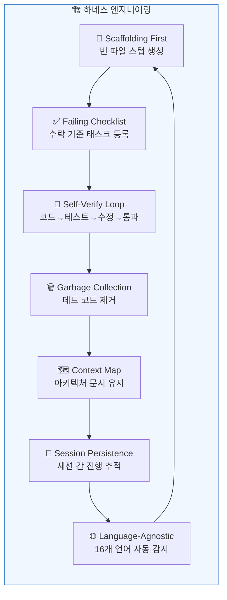
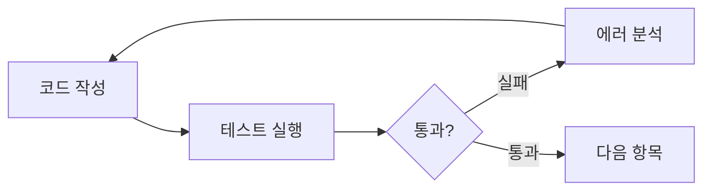

# 하네스 엔지니어링

## 하네스 엔지니어링이란?

MoAI-ADK는 **하네스 엔지니어링(Harness Engineering)** 패러다임을 구현합니다. 이는 개발자가 직접 코드를 작성하는 대신, **AI 에이전트가 최적의 코드를 생산할 수 있는 환경(하네스)을 설계**하는 접근 방식입니다.

> "Human steers, agents execute."
> — 엔지니어의 역할은 코드 작성에서 하네스 설계로 전환됩니다: SPEC, 품질 게이트, 피드백 루프.

기존 바이브코딩은 AI에게 자유롭게 코드를 생성하게 한 뒤 결과를 수동으로 검토합니다. 하네스 엔지니어링은 반대입니다 — **규격(SPEC), 자동 검증, 지속적 피드백 루프**로 AI 에이전트를 가이드하여 일관된 품질의 코드를 생산합니다.

## 7가지 핵심 컴포넌트



각 컴포넌트는 MoAI의 특정 명령어에 매핑됩니다:

| 컴포넌트 | 설명 | 명령어 |
|----------|------|--------|
| **Self-Verify Loop** | 에이전트가 코드 작성 → 테스트 → 실패 → 수정 → 통과 사이클을 자율적으로 반복 | [`/moai loop`](/ko/utility-commands/moai-loop) |
| **Context Map** | 코드베이스 아키텍처 맵과 문서를 항상 에이전트에게 제공 | [`/moai codemaps`](/ko/quality-commands/moai-codemaps) |
| **Session Persistence** | `progress.md`가 세션 간 완료된 단계를 추적하여 중단된 작업을 자동 재개 | [`/moai run SPEC-XXX`](/ko/workflow-commands/moai-run) |
| **Failing Checklist** | 실행 시작 시 모든 수락 기준을 대기 태스크로 등록하고 구현 완료 시 체크 | [`/moai run SPEC-XXX`](/ko/workflow-commands/moai-run) |
| **Language-Agnostic** | 16개 언어 지원: 언어를 자동 감지하고 올바른 LSP/린터/테스트/커버리지 도구 선택 | 모든 워크플로우 |
| **Garbage Collection** | 데드 코드, AI 슬롭(slop), 사용하지 않는 import를 주기적으로 스캔하고 제거 | [`/moai clean`](/ko/utility-commands/moai-clean) |
| **Scaffolding First** | 구현 전에 빈 파일 스텁을 먼저 생성하여 코드 엔트로피 방지 | [`/moai run SPEC-XXX`](/ko/workflow-commands/moai-run) |

## 작동 원리

### 1. Scaffolding First (스캐폴딩 우선)

`/moai run`이 시작되면, 에이전트는 코드를 작성하기 전에 먼저 필요한 파일 구조를 생성합니다:

```
src/
├── auth/
│   ├── handler.go      ← 빈 스텁
│   ├── handler_test.go  ← 빈 테스트
│   ├── service.go       ← 빈 스텁
│   └── service_test.go  ← 빈 테스트
└── middleware/
    └── jwt.go           ← 빈 스텁
```

이 방식은 에이전트가 무질서하게 파일을 생성하는 것을 방지하고, 일관된 프로젝트 구조를 유지합니다.

### 2. Failing Checklist (실패 체크리스트)

SPEC의 수락 기준이 자동으로 태스크 목록에 등록됩니다:

```
- [ ] JWT 토큰 생성 엔드포인트
- [ ] 토큰 검증 미들웨어
- [ ] 리프레시 토큰 로직
- [ ] 만료된 토큰 처리
- [ ] 85%+ 테스트 커버리지
```

각 항목이 구현되고 테스트를 통과하면 체크됩니다. 모든 항목이 체크되어야 작업이 완료됩니다.

### 3. Self-Verify Loop (자기검증 루프)

에이전트가 자율적으로 실행하는 핵심 사이클:



이 루프는 `/moai loop`에서 최대 100회까지 반복되며, 수렴 감지(같은 에러 반복 시 대안 전략 적용)를 포함합니다.

### 4. Context Map (컨텍스트 맵)

`/moai codemaps`가 생성하는 아키텍처 문서는 에이전트에게 코드베이스의 전체 구조를 제공합니다. 이를 통해 에이전트는:

- 기존 코드와 충돌하지 않는 구현 방법을 선택
- 적절한 패턴과 규칙을 따름
- 의존성 관계를 이해하고 영향 범위를 파악

### 5. Session Persistence (세션 지속성)

Claude Code 세션이 중단되더라도 `progress.md`가 완료된 단계를 기록합니다:

```markdown
## Progress
- [x] Phase 1: 분석 완료
- [x] Phase 2: 핸들러 구현
- [ ] Phase 3: 테스트 작성 ← 여기서 재개
- [ ] Phase 4: 리팩토링
```

`/moai run --resume SPEC-XXX`로 중단된 지점부터 자동으로 재개됩니다.

## 전통적 개발 vs 하네스 엔지니어링

| 관점 | 전통적 개발 | 하네스 엔지니어링 |
|------|-----------|-----------------|
| **개발자 역할** | 코드 작성자 | 환경 설계자 |
| **코드 생산** | 수동 작성 | AI 에이전트 자동 생산 |
| **품질 보증** | 사후 리뷰 | 내장된 자동 검증 루프 |
| **세션 연속성** | 수동 메모 | 자동 진행 추적 |
| **코드 정리** | 기술 부채 누적 | 자동 가비지 컬렉션 |
| **문서화** | 별도 작업 | 자동 아키텍처 맵 생성 |

## 다음 단계

- [자동 품질 레이어](/ko/core-concepts/auto-quality) — /simplify와 /batch로 품질을 자동화하는 방법
- [SPEC 기반 개발](/ko/core-concepts/spec-based-dev) — 하네스의 입력이 되는 SPEC 문서 작성법
- [TRUST 5 품질](/ko/core-concepts/trust-5) — 하네스가 검증하는 5가지 품질 기준
