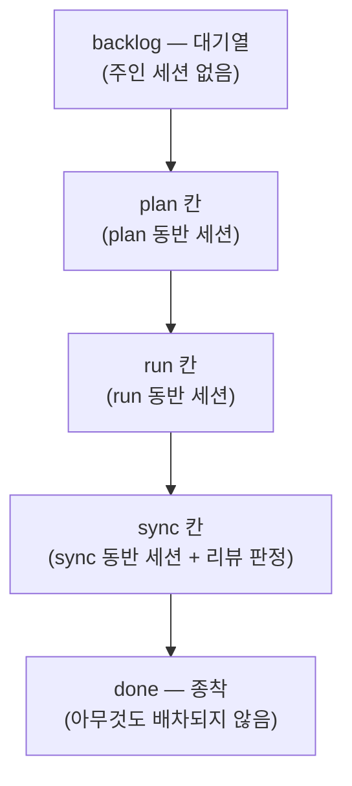
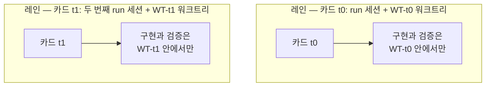

# 칸반 보드 용어

칸반 모드를 다루는 문서와 운영 안내는 아홉 낱말을 공유해서 씁니다 — 보드, 체인, 세션 런처 안내 어디를 펴도 같은 낱말이 나온다는 뜻입니다. 이 페이지는 그 낱말을 한 곳에 모아 정의합니다. 각 항목은 정의 한 줄과 예시 하나로 이루어져 있고, 나머지 문서들은 이 뜻을 전제로 쓰여 있습니다.

가장 자주 걸리는 지점부터: **레인** (lane) 과 **칸** (column) 은 다른 말입니다. 둘의 구별은 아래에서 따로 다룹니다.

## 보드의 생김새

보드는 다섯 칸으로 고정되어 있습니다:

`backlog`와 `done`에는 주인 세션이 일부러 없습니다. 가운데 세 칸이 각각 동반 세션 역할 하나에 대응하기 때문에, 배차는 결정이 아니라 조회가 됩니다 — 카드가 어느 칸에 있는지만 보면 누구에게 보낼지 정해집니다. review 칸은 존재하지 않습니다: 검토 판정은 sync 게이트가 흡수하며, sync 단계가 리뷰 렌즈를 직접 돌립니다.

## 아홉 낱말

| 낱말 | 뜻 | 예시 |
|---|---|---|
| **레인** (lane) | 카드 한 장을 끝까지 나르는 병렬 작업 흐름 하나. 세션 하나와 워크트리 하나의 짝이다. 물리 칸반 보드의 스윔레인처럼, 서로 다른 흐름이 섞이지 않도록 각자의 차선을 달린다. "레인 로컬 검증" (lane-local verification) 은 그 레인의 변경이 건드릴 수 있는 테스트만 그 레인이 돌린다는 뜻. | `run` 세션이 워크트리 `WT-t0`에서 일하는 것이 레인 하나 |
| **카드** (card) | 보드 위의 작업 단위 하나. 운영자가 `/moai todo "<설명>"`으로 넣고 짧은 아이디로 부른다. 카드는 워크트리 하나, 진행 기록 하나, 그리고 완료 증거를 소유한다. | `t0` — 한 줄 수정 카드 |
| **칸** (column) | 보드의 단계 하나. 순서는 고정: `backlog → plan → run → sync → done`. 가운데 세 칸은 각각 동반 세션 역할 하나에 대응한다. | `/moai run <SPEC-ID>`는 `run` 칸에서 일어난다 |
| **백로그** (backlog) | 보드의 입구 대기열. 주인 세션이 일부러 없다 — 일감은 운영자가 넣을 때만 보드에 들어온다. | `/moai todo "rename 힌트가 낡았다"`가 카드 한 장을 백로그에 추가 |
| **리드** (lead) | 유일한 조율 세션 (`moai cc -k`). 직접 읽은 증거로만 카드를 다음 칸으로 넘기고, 단계 사이마다 운영자에게 해당 세션의 `/clear`를 청하며, 코드는 직접 쓰지 않는다. | 카드를 워크트리 지시와 함께 배차한 그 세션 |
| **동반 세션** (companion) | 사람이 직접, 터미널 하나씩 띄우는 작업 세션 (`moai cc -k --name <role>`). 이름은 역할만으로 붙고, 같은 역할 이름이 이미 살아 있으면 다음 번호가 붙는다. 한 번에 한 칸의 일을 맡는다. | `plan`, `run`, `sync` |
| **런 아이디** (run-id) | 리드가 시작할 때 알려주는 짧은 식별자. 리드 세션의 이름이며 동반 세션은 물지 않는다 — 동반 세션은 역할 이름으로 부른다. | 리드 세션의 이름인 `a1b2c3` |
| **워크트리** (worktree) | 카드의 작업이 일어나는 격리된 체크아웃. 런처로 진입한다 (`moai cc -w <name>` / `EnterWorktree`) — raw `git worktree add`로 만들지 않는다. 브랜치 이름은 `WT-<card-id>`. 워크트리는 단계보다 오래 산다: 하나가 run부터 sync까지를 관통한다. | 브랜치 `WT-t0`인 `.claude/worktrees/t0` |
| **배차** (dispatch) | 리드가 동반 세션 하나에 보내는 지시. 일감의 복사물이 아니라 포인터다 — 카드 아이디, SPEC 아이디, 단계 명령, 완료 신호. 운영자의 대화 언어로 쓴다. | "card: t0 — wt: EnterWorktree(t0) … evidence: .moai/reports/t0/" |

## 레인과 칸 — 가장 헷갈리는 쌍

**칸** (column) 은 일의 단계를 가리키고, **레인** (lane) 은 그 단계들을 통과하며 카드 한 장을 나르는 주체를 가리킨다. 하나는 보드 위의 정류장이고, 다른 하나는 정류장들을 지나는 노선이다.

두 레인이 같은 보드에서 동시에 흐를 수 있고, 서로의 워크트리는 끝까지 침범하지 않습니다. 그래서 병렬이 안전합니다 — 어느 레인의 커밋도 다른 레인의 작업 트리로 새어 들어가지 않습니다.

## 카드 한 장의 여정

낱말 전부가 한 번씩 등장하는 실제 흐름입니다:

1. 운영자가 `/moai todo "rename 힌트가 낡았다"`로 **카드** `t0`을 **백로그**에 넣는다.
2. **리드**가 큐에서 `t0`을 골라 plan 동반 세션에 **배차**한다.
3. `plan` **동반 세션**이 SPEC을 쓰면, 리드는 증거를 직접 읽고 카드를 다음 **칸**으로 넘긴다.
4. `run`이 **워크트리** `WT-t0`에서 구현한다 — 이 세션과 워크트리의 짝이 곧 **레인**이고, 검증도 레인 안에서 (변경이 건드릴 수 있는 테스트만) 돌아간다. 리드 세션의 이름인 `a1b2c3`이 **런 아이디**다.
5. sync 칸을 같은 방식으로 지나 — sync 게이트가 리뷰 판정을 흡수해 내린다 — sync가 PR을 올리면 카드는 done에 닿는다.

이 내내 카드의 작업은 `WT-t0` 하나에서 일어납니다. 병렬로 돌던 다른 레인의 워크트리와는 끝까지 섞이지 않습니다.

## 관련 문서

- [칸반 모드](/ko/advanced/kanban-mode) — 진입 조건, Origin-Trail Chain 설계, 체인 단계
- [`/moai todo`](/ko/utility-commands/moai-todo) — 보드에 카드를 들이는 백로그 대기열
- [하네스 엔지니어링](/ko/core-concepts/harness-engineering) — 페이즈 체이닝과 관찰이 하네스 설계 위에서 어떻게 자리잡았는가
