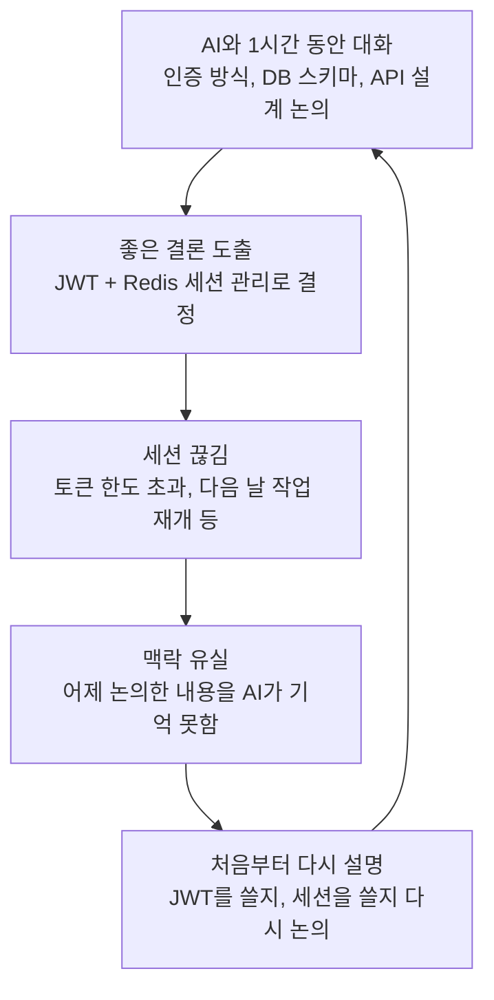
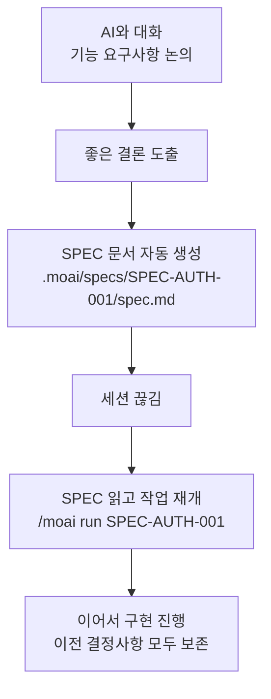
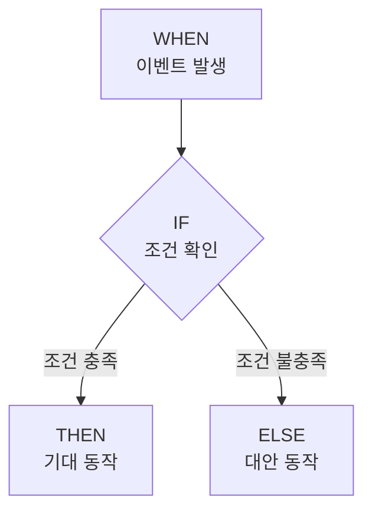
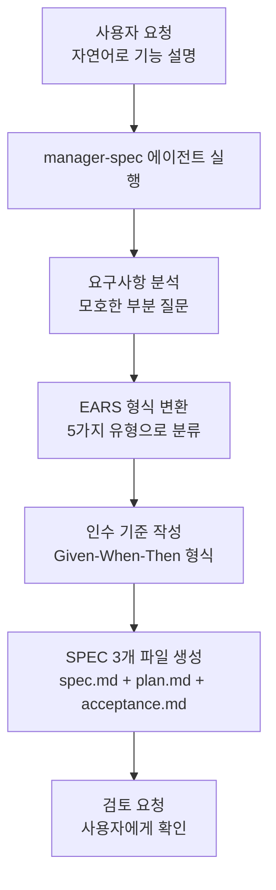
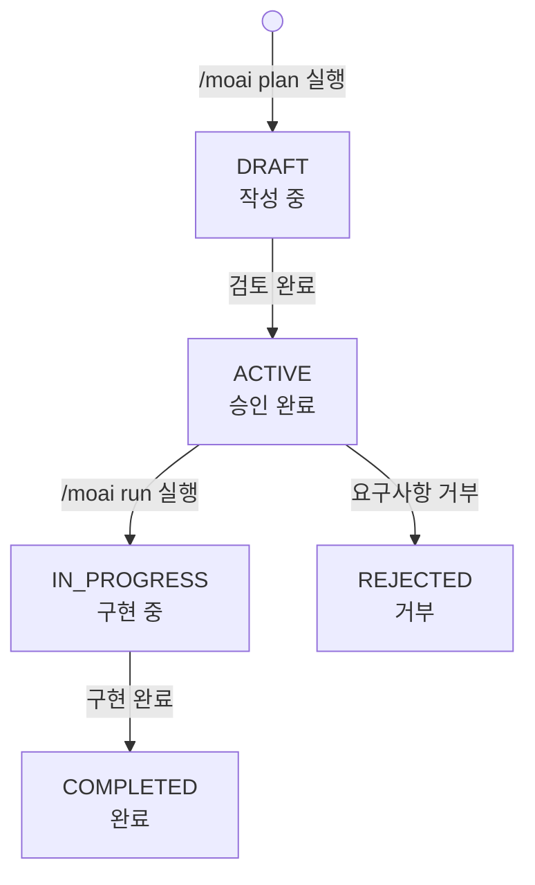

# SPEC 기반 개발

MoAI-ADK의 SPEC 기반 개발 방법론을 상세히 안내합니다.


  **한 줄 요약:** SPEC은 "AI와 나눈 대화를 문서로 남기는 것"입니다. 세션이
  끊겨도 SPEC만 있으면 언제든 이어서 작업할 수 있습니다.



  **SPEC은 Agent를 위한 것입니다:** SPEC은 개발자가 외우거나 학습하기 위한 것이
  아닙니다. Agent가 작업을 수행할 때 참조하는 문서입니다. SPEC의 원리와 사용
  방식을 개념적으로 이해하고 있으면 충분합니다.



  **SPEC은 3개 파일로 구성됩니다:** `/moai plan` 실행 시 `spec.md` (EARS 요구사항), `plan.md` (구현 계획), `acceptance.md` (인수 기준) 3개 파일이 동시에 생성됩니다.


## SPEC이란?

**SPEC** (Specification) 은 프로젝트의 요구사항을 구조화된 형식으로 정의한
문서입니다.

일상적인 비유로 설명하면, SPEC은 **요리 레시피**와 같습니다. 요리할 때
머릿속으로만 기억하면 재료를 빠뜨리거나 순서를 잊기 쉽습니다. 하지만 레시피를
적어두면 누구든 같은 요리를 정확하게 만들 수 있습니다.

| 요리 레시피                       | SPEC 문서              | 공통점                           |
| --------------------------------- | ---------------------- | -------------------------------- |
| 필요한 재료 목록                  | 요구사항 목록          | 무엇이 필요한지 정의             |
| 조리 순서                         | 구현 순서              | 어떤 순서로 진행할지 정의        |
| 완성 사진                         | 인수 기준              | 완성된 결과가 어떤 모습인지 정의 |
| "소금 약간" 같은 모호한 표현 없음 | EARS 형식으로 명확하게 | 모호함 제거                      |

## 왜 SPEC이 필요한가?

### 바이브코딩의 맥락 유실 문제

AI와 대화하며 코드를 작성할 때, 가장 큰 문제는 **맥락 유실**입니다.



**맥락 유실이 발생하는 구체적인 상황:**

| 상황              | 무슨 일이 일어나는가                 | 결과                   |
| ----------------- | ------------------------------------ | ---------------------- |
| 세션 타임아웃     | 일정 시간 후 이전 대화 내용이 사라짐 | 논의했던 결정사항 소실 |
| `/clear` 실행     | 토큰을 절약하기 위해 컨텍스트 초기화 | 이전 맥락 전체 초기화  |
| 토큰 한도 초과    | 대화가 길어지면 오래된 내용부터 잘림 | 초반 결정사항 유실     |
| 다음 날 작업 재개 | 새 세션에서는 어제 대화를 모름       | 모든 내용 재설명 필요  |

### SPEC으로 문제 해결하기

SPEC은 대화 내용을 **파일로 저장**하여 이 문제를 근본적으로 해결합니다.



**SPEC 유무에 따른 차이:**


**SPEC 없이 작업하는 경우:**

어제 "사용자 인증 기능"에 대해 1시간 동안 AI와 논의했다고 가정합시다. JWT를 쓸지
세션을 쓸지, 토큰 만료 시간은 얼마로 할지, 리프레시 토큰은 어디에 저장할지... 이
모든 것을 다시 논의해야 합니다.

**SPEC이 있는 경우:**

아래 한 줄이면 어제 결정한 내용 그대로 구현을 시작합니다.

```bash
> /moai run SPEC-AUTH-001
```



## EARS 형식

**EARS** (Easy Approach to Requirements Syntax) 는 요구사항을 명확하게 작성하는
방법입니다. 자연어의 모호함을 제거하고, 테스트로 검증할 수 있는 형식으로
요구사항을 변환합니다.

EARS는 5가지 유형의 요구사항 패턴을 제공합니다.

### 1. Ubiquitous (항상 참)

시스템이 **항상** 준수해야 하는 요구사항입니다. 조건 없이 항상 적용됩니다.

**형식:** "시스템은 ~해야 한다"

**예시:**

```yaml
- id: REQ-001
  type: ubiquitous
  priority: HIGH
  text: "시스템은 모든 사용자 입력을 검증해야 한다"
  acceptance_criteria:
    - "모든 입력값에 대해 타입 검증 수행"
    - "SQL Injection 방지를 위한 파라미터화된 쿼리 사용"
    - "XSS 방지를 위한 출력 이스케이프"
```

**일상 비유:** "운전할 때는 항상 안전벨트를 착용해야 한다"와 같습니다. 특별한
조건 없이 항상 지켜야 합니다.

### 2. Event-driven (이벤트 기반)

특정 이벤트가 발생했을 때 시스템이 어떻게 반응해야 하는지 정의합니다.

**형식:** "WHEN ~하면, IF ~라면, THEN ~해야 한다"



**예시:**

```yaml
- id: REQ-002
  type: event-driven
  priority: HIGH
  text: |
    WHEN 사용자가 로그인 버튼을 클릭하면,
    IF 이메일과 비밀번호가 유효하면,
    THEN JWT 토큰을 발급하고 대시보드로 리다이렉트해야 한다
  acceptance_criteria:
    - given: "등록된 사용자 계정이 있고"
      when: "올바른 이메일과 비밀번호로 로그인하면"
      then: "200 응답과 함께 JWT 토큰 발급"
      and: "토큰 만료 시간은 1시간"
```

**일상 비유:** "초인종이 울리면 (WHEN), 모니터로 확인해서 아는 사람이면 (IF),
문을 열어준다 (THEN)"와 같습니다.

### 3. State-driven (상태 기반)

특정 상태가 유지되는 동안 시스템이 어떻게 동작해야 하는지 정의합니다.

**형식:** "WHILE ~인 동안, ~해야 한다"

**예시:**

```yaml
- id: REQ-003
  type: state-driven
  priority: MEDIUM
  text: |
    WHILE 사용자가 로그인된 상태인 동안,
    시스템은 세션을 5분마다 갱신해야 한다
  acceptance_criteria:
    - "마지막 활동으로부터 5분 경과 시 자동 갱신"
    - "세션 만료 5분 전 알림 표시"
    - "30분 무활동 시 자동 로그아웃"
```

**일상 비유:** "에어컨이 켜져 있는 동안 (WHILE), 실내 온도를 25도로 유지해야
한다"와 같습니다.

### 4. Unwanted (금지 사항)

시스템이 **절대 해서는 안 되는** 것을 정의합니다. 주로 보안 관련 요구사항에
사용합니다.

**형식:** "시스템은 ~하면 안 된다"

**예시:**

```yaml
- id: REQ-004
  type: unwanted
  priority: CRITICAL
  text: "시스템은 비밀번호를 평문으로 저장하면 안 된다"
  acceptance_criteria:
    - "비밀번호는 bcrypt로 해싱 (cost factor 12)"
    - "해싱되지 않은 비밀번호가 로그에 포함되지 않음"
    - "데이터베이스에 평문 비밀번호 저장 불가"

- id: REQ-005
  type: unwanted
  priority: CRITICAL
  text: "시스템은 하드코딩된 비밀키를 사용하면 안 된다"
  acceptance_criteria:
    - "모든 비밀키는 환경 변수 또는 비밀 관리자 사용"
    - "코드에 비밀키 포함되지 않음"
    - "Git 커밋에 비밀키 포함 방지"
```

**일상 비유:** "열쇠를 현관 매트 아래에 두면 안 된다"와 같습니다. 하지 말아야 할
것을 명시합니다.

### 5. Optional (선택적 기능)

구현이 권장되지만 필수는 아닌 기능입니다.

**형식:** "가능하다면, ~해야 한다"

**예시:**

```yaml
- id: REQ-006
  type: optional
  priority: LOW
  text: "가능하다면, 시스템은 로그인 시 이메일 알림을 발송해야 한다"
  acceptance_criteria:
    - "이메일 서버가 구성된 경우에만 동작"
    - "알림 비활성화 옵션 제공"
```

**일상 비유:** "시간이 되면 디저트도 만들면 좋겠다"와 같습니다. 있으면 좋지만
없어도 괜찮습니다.

### EARS 한눈에 보기

| 유형             | 형식                          | 용도               | 우선순위         |
| ---------------- | ----------------------------- | ------------------ | ---------------- |
| **Ubiquitous**   | "시스템은 ~해야 한다"         | 항상 적용되는 규칙 | 보통 HIGH        |
| **Event-driven** | "WHEN ~하면, THEN ~해야 한다" | 이벤트 반응 정의   | 기능에 따라 다름 |
| **State-driven** | "WHILE ~인 동안, ~해야 한다"  | 상태 유지 동작     | 보통 MEDIUM      |
| **Unwanted**     | "시스템은 ~하면 안 된다"      | 금지 사항 (보안)   | 보통 CRITICAL    |
| **Optional**     | "가능하다면, ~해야 한다"      | 선택적 기능        | 보통 LOW         |

## SPEC 문서 구조

SPEC 문서는 **manager-spec 에이전트**가 자동으로 생성합니다. 개발자가 직접 EARS
형식을 외울 필요 없이, 자연어로 요청하면 에이전트가 변환합니다.

`/moai plan` 실행 시 하나의 SPEC 디렉토리 안에 **3개 파일**이 동시에 생성됩니다:

| 파일 | 역할 | 내용 |
| --- | --- | --- |
| `spec.md` | EARS 요구사항 정의 | YAML 프론트매터, 요구사항 (5가지 EARS 유형), 제약 조건, 의존성 |
| `plan.md` | 구현 계획 | 작업 분해, 기술 스택 명세, 위험 분석 및 완화 전략 |
| `acceptance.md` | 인수 기준 | Given/When/Then 시나리오, 엣지 케이스, 성능 및 품질 게이트 |

### spec.md -- EARS 요구사항

```yaml
---
id: SPEC-AUTH-001               # 고유 식별자
title: 사용자 인증 시스템         # 명확하고 간결한 제목
priority: HIGH                  # HIGH, MEDIUM, LOW
status: ACTIVE                  # DRAFT, ACTIVE, IN_PROGRESS, COMPLETED
created: 2025-01-12             # 생성일
updated: 2025-01-12             # 최종 수정일
author: 개발팀                   # 작성자
version: 1.0.0                  # 문서 버전
---

# 사용자 인증 시스템

## 개요
JWT 기반 사용자 인증 시스템 구현

## 요구사항
### Ubiquitous
- 시스템은 모든 API 요청에 인증을 요구해야 한다

### Event-driven
- WHEN 사용자가 로그인하면, THEN JWT를 발급해야 한다

### Unwanted
- 시스템은 비밀번호를 평문으로 저장하면 안 된다

## 제약 조건
- API 응답 시간 500ms 이내
- 비밀번호 bcrypt 해싱 (cost factor 12)

## 의존성
- Redis (세션 관리)
- PostgreSQL (사용자 데이터)
```

### plan.md -- 구현 계획

```markdown
# 구현 계획

## 작업 분해
1. 사용자 모델 및 마이그레이션 생성
2. JWT 토큰 발급/검증 유틸리티 구현
3. 로그인/회원가입 API 엔드포인트 구현
4. 인증 미들웨어 구현
5. Refresh Token 갱신 로직 구현

## 기술 스택
- Go 1.23 + Fiber v2
- PostgreSQL 16 + GORM
- Redis 7 (세션/토큰 저장)

## 위험 분석
| 위험 | 영향 | 완화 전략 |
| --- | --- | --- |
| 토큰 탈취 | HIGH | Refresh Token 회전, HttpOnly 쿠키 |
| 무차별 대입 | MEDIUM | Rate Limiting, 계정 잠금 |
```

### acceptance.md -- 인수 기준

```markdown
# 인수 기준

## 시나리오

### AC-01: 정상 로그인
- **Given** 등록된 사용자 계정이 있고
- **When** 올바른 이메일과 비밀번호로 로그인하면
- **Then** 200 응답과 JWT 토큰 세트 반환

### AC-02: 잘못된 자격증명
- **Given** 등록된 사용자 계정이 있고
- **When** 잘못된 비밀번호로 로그인하면
- **Then** 401 응답과 일반적인 오류 메시지 반환

## 엣지 케이스
- 만료된 Refresh Token으로 갱신 시 401 응답
- 동시 로그인 제한 초과 시 가장 오래된 세션 만료

## 품질 게이트
- API 응답 시간: 500ms 이내 (P95)
- 테스트 커버리지: 85% 이상
```

## SPEC 워크플로우

SPEC 생성은 `/moai plan` 명령어 하나로 시작됩니다.



**실행 방법:**

```bash
# SPEC 생성 명령어
> /moai plan "사용자 인증 기능 구현"
```

이 명령어를 실행하면 다음이 자동으로 진행됩니다:

1. **요구사항 분석:** manager-spec이 "사용자 인증 기능"이 무엇을 의미하는지
   분석합니다
2. **명확화 질문:** 모호한 부분이 있으면 사용자에게 질문합니다 (예: "JWT와 세션
   중 어떤 방식을 선호하시나요?")
3. **EARS 변환:** 자연어를 5가지 EARS 유형으로 자동 분류합니다
4. **3개 파일 생성:** `.moai/specs/SPEC-AUTH-001/` 디렉토리에 `spec.md`, `plan.md`,
   `acceptance.md` 3개 파일을 동시에 생성합니다
5. **검토 요청:** 생성된 SPEC을 사용자에게 보여주고 확인을 요청합니다


  **중요:** 에이전트가 생성한 SPEC 문서는 반드시 한 번 검토하세요. AI가
  요구사항을 잘못 해석하거나 누락할 수 있습니다. 특히 인수 기준이 테스트
  가능한지, 우선순위가 적절한지 확인하는 것이 좋습니다.


## SPEC 파일 위치와 관리

### 파일 구조

```
.moai/
└── specs/
    ├── SPEC-AUTH-001/
    │   ├── spec.md          # EARS 요구사항
    │   ├── plan.md          # 구현 계획
    │   └── acceptance.md    # 인수 기준
    ├── SPEC-PAYMENT-001/
    │   ├── spec.md
    │   ├── plan.md
    │   └── acceptance.md
    └── SPEC-SEARCH-001/
        ├── spec.md
        ├── plan.md
        └── acceptance.md
```

### SPEC 상태 관리

각 SPEC은 라이프사이클에 따라 상태가 변경됩니다.



| 상태          | 의미                       | 다음 가능한 상태      |
| ------------- | -------------------------- | --------------------- |
| `DRAFT`       | 작성 중, 검토 필요         | ACTIVE, REJECTED      |
| `ACTIVE`      | 승인 완료, 구현 준비됨     | IN_PROGRESS, REJECTED |
| `IN_PROGRESS` | 구현 진행 중               | COMPLETED, REJECTED   |
| `COMPLETED`   | 모든 인수 기준 충족, 완료  | (최종 상태)           |
| `REJECTED`    | 요구사항 거부, 재작성 필요 | (최종 상태)           |

## 실전 예시: JWT 인증 SPEC

실제로 `/moai plan`을 실행하여 생성된 SPEC의 예시입니다.

```bash
# SPEC 생성
> /moai plan "JWT 기반 사용자 인증 시스템. 로그인, 회원가입, 토큰 갱신 기능 포함"
```

아래와 같이 `.moai/specs/SPEC-AUTH-001/` 디렉토리에 3개 파일이 생성됩니다.

**spec.md -- EARS 요구사항:**

```yaml
---
id: SPEC-AUTH-001
title: JWT 기반 사용자 인증 시스템
priority: HIGH
status: ACTIVE
created: 2025-01-15
version: 1.0.0
---

# JWT 기반 사용자 인증 시스템

## 개요
JWT 토큰을 사용한 사용자 인증 시스템.
로그인, 회원가입, 토큰 갱신 기능을 구현한다.

## 요구사항

### Ubiquitous
- REQ-U01: 시스템은 모든 인증 토큰을 HTTPS로만 전송해야 한다
- REQ-U02: 시스템은 모든 사용자 입력을 검증해야 한다

### Event-driven
- REQ-E01: WHEN 사용자가 회원가입 폼을 제출하면,
  IF 이메일이 중복되지 않으면,
  THEN 계정을 생성하고 환영 이메일을 발송해야 한다
- REQ-E02: WHEN 사용자가 로그인하면,
  IF 자격증명이 유효하면,
  THEN Access Token (1시간)과 Refresh Token (7일)을 발급해야 한다

### Unwanted
- REQ-N01: 시스템은 비밀번호를 평문으로 저장하면 안 된다
- REQ-N02: 시스템은 만료된 Refresh Token으로 새 토큰을 발급하면 안 된다

### Optional
- REQ-O01: 가능하다면, 소셜 로그인 (Google, GitHub)을 지원해야 한다

## 제약 조건
- 비밀번호: bcrypt (cost factor 12)
- Access Token 만료: 1시간
- Refresh Token 만료: 7일
- API 응답 시간: 500ms 이내 (P95)
```

**plan.md -- 구현 계획:**

```markdown
# 구현 계획

## 작업 분해
1. 사용자 모델 및 DB 마이그레이션 생성
2. 비밀번호 해싱 유틸리티 구현
3. JWT 토큰 발급/검증 유틸리티 구현
4. 회원가입 API 엔드포인트 구현
5. 로그인 API 엔드포인트 구현
6. 인증 미들웨어 구현
7. Refresh Token 갱신 로직 구현

## 기술 스택
- Go 1.23 + Fiber v2
- PostgreSQL 16 + GORM
- Redis 7 (Refresh Token 저장)

## 위험 분석
| 위험 | 영향 | 완화 전략 |
| --- | --- | --- |
| 토큰 탈취 | HIGH | Refresh Token 회전, HttpOnly 쿠키 |
| 무차별 대입 | MEDIUM | Rate Limiting, 계정 잠금 |
```

**acceptance.md -- 인수 기준:**

```markdown
# 인수 기준

## 시나리오

### AC-01: 정상 로그인
- **Given** 등록된 사용자 계정이 있고
- **When** 올바른 이메일과 비밀번호로 로그인하면
- **Then** 200 응답과 JWT 토큰 세트 (Access + Refresh) 반환

### AC-02: 잘못된 비밀번호
- **Given** 등록된 사용자 계정이 있고
- **When** 잘못된 비밀번호로 로그인하면
- **Then** 401 응답

### AC-03: 중복 회원가입
- **Given** 이미 등록된 이메일이 있고
- **When** 같은 이메일로 회원가입하면
- **Then** 409 응답

### AC-04: 토큰 갱신
- **Given** 유효한 Refresh Token이 있고
- **When** 토큰 갱신을 요청하면
- **Then** 새로운 Access Token 반환

## 품질 게이트
- API 응답 시간: 500ms 이내 (P95)
- 테스트 커버리지: 85% 이상
```

**이 SPEC으로 구현 시작하기:**

```bash
# SPEC 확인 후 구현 시작
> /moai run SPEC-AUTH-001
```

이 명령어 하나로 설정된 개발 방법론 (DDD 또는 TDD) 에 따라 SPEC의 모든 요구사항을
자동으로 구현합니다. 신규 프로젝트는 **TDD** (RED-GREEN-REFACTOR), 기존 프로젝트는
**DDD** (ANALYZE-PRESERVE-IMPROVE) 사이클을 사용합니다.

## SPEC 작성 팁

### 자연어에서 EARS로 변환하기

일상적인 요청을 EARS 형식으로 어떻게 바꾸는지 비교합니다.

| 자연어 요청            | EARS 형식                                                                |
| ---------------------- | ------------------------------------------------------------------------ |
| "로그인 기능 만들어줘" | WHEN 사용자가 유효한 자격증명을 제시하면, THEN 인증 토큰을 발급해야 한다 |
| "비밀번호는 안전하게"  | 시스템은 비밀번호를 평문으로 저장하면 안 된다 (Unwanted)                 |
| "빨라야 해"            | 로그인 응답 시간은 500ms 이내여야 한다 (Ubiquitous)                      |
| "에러 처리 잘해줘"     | WHEN 에러가 발생하면, THEN 사용자에게 명확한 메시지를 표시해야 한다      |
| "되면 좋겠는데"        | 가능하다면, 시스템은 실시간 알림을 지원해야 한다 (Optional)              |


  EARS 형식을 직접 작성하지 않아도 됩니다. `/moai plan`에 자연어로 요청하면
  **manager-spec 에이전트가 자동으로 EARS 형식으로 변환**합니다. 위 표는 어떻게
  변환되는지 이해하기 위한 참고 자료입니다.


## 관련 문서

- [MoAI-ADK란?](/core-concepts/what-is-moai-adk) -- MoAI-ADK의 전체 구조를
  이해합니다
- [개발 방법론 (DDD/TDD)](/core-concepts/ddd) -- SPEC을 기반으로 안전하게 코드를
  구현하는 DDD/TDD 방법론을 배웁니다
- [TRUST 5 품질](/core-concepts/trust-5) -- 구현된 코드의 품질을 검증하는 기준을
  배웁니다
