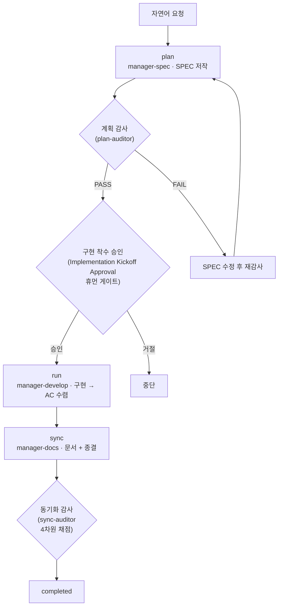



# SPEC 라이프사이클 (SPEC Lifecycle)

모든 MoAI 작업은 **plan → run → sync** 세 단계 라이프사이클을 따릅니다. 이 페이지는 그 라이프사이클이 **어떻게 흐르는지** — 단계마다 무엇이 들어가고 무엇이 나오는지, 단계 사이의 세 게이트가 무엇을 지키는지, 작업의 규모가 티어와 라우트를 어떻게 정하는지 — 를 다룹니다.


 **분업**: [SPEC 기반 개발](/ko/core-concepts/spec-based-dev)은 SPEC 문서가 <strong>무엇인지</strong> (GEARS 요구사항 형식, 3개 파일 구성, Era 분류와 드리프트 검사)를 다룹니다. 이 페이지는 라이프사이클이 <strong>어떻게 흐르는지</strong>를 다룹니다 — 두 페이지는 서로를 반복하지 않고 링크합니다.


## 3단계 페이즈

| 페이즈 | 명령어 | 소속 에이전트 | 토큰 예산 | 하는 일 |
|--------|--------|---------------|-----------|---------|
| **plan** | `/moai plan` | manager-spec | 30K | SPEC 문서 저작 (GEARS 요구사항 + 구현 계획 + 인수 기준) |
| **run** | `/moai run` | manager-develop | 180K | DDD / TDD 방법론으로 구현 — AC 수렴까지 |
| **sync** | `/moai sync` | manager-docs | 40K | 문서 동기화 + 체인지로그 + 종결 (PR) |

각 페이즈는 서로 다른 에이전트가 소유합니다. `manager-spec`이 SPEC을 만들고, `manager-develop`가 그것을 구현하며, `manager-docs`가 결과를 문서로 정리해 종결합니다 — 한 에이전트가 자기 출력을 자기가 심사하지 않도록 단계마다 주인이 갈립니다.

### 페이즈별 산출물

| 페이즈 | 입력 | 출력 |
|--------|------|------|
| **plan** | 자연어 요청 + 코드베이스 조사 | `.moai/specs/SPEC-XXX/` 산출물 세트 (티어별 — 아래 표) — spec.md, plan.md, acceptance.md (+ Tier L은 design.md, research.md) |
| **run** | SPEC 산출물 세트 | 구현 커밋 + 테스트. 수용 기준(AC) 전체가 통과해야 다음 단계 |
| **sync** | run이 남긴 트리 + 진행 기록 | 갱신된 문서(README·CHANGELOG·API 문서) + Pull Request. `completed` 상태 전환과 `sync_commit_sha` 기록 |

SPEC 문서의 파일 구성과 형식이 궁금하면 [SPEC 기반 개발](/ko/core-concepts/spec-based-dev)을, run의 방법론 사이클이 궁금하면 [개발 방법론 (DDD/TDD)](/ko/core-concepts/ddd)을 보세요.

## 세 개의 게이트

단계 사이에는 세 게이트가 있습니다. 각각 지키는 것이 다릅니다.

### 구현 착수 승인 (Implementation Kickoff Approval)

plan → run 경계의 **휴먼 게이트**입니다. 검토되지 않은 계획이 구현으로 넘어가는 것을 막는 마지막 사람의 확인이며, 오케스트레이터가 `AskUserQuestion`으로 승인을 요청합니다.

- **필수이고 점수와 무관합니다.** 계획 감사가 PASS여도, 점수가 높아도 이 게이트를 자동으로 건너뛰지 않습니다.
- 게이트를 통과하면 **자율·반자율 진행 모드**를 같은 자리에서 고를 수 있습니다 — 이 선택은 승인이 난 뒤 무엇이 일어날지를 정할 뿐, 게이트 자체를 늦추거나 대신하지 않습니다.

### 계획 감사 (plan-audit)

모든 `/moai run` 시작 시점 — 구현이 시작되기 전 — 에 **plan-auditor** 하위 에이전트가 SPEC 계획 산출물 전체를 독립적으로 검토합니다. 하네스 수준(`minimal` 포함)으로는 끌 수 없습니다.

| 판정 | 의미 |
|------|------|
| `PASS` | 모든 필수 기준 충족 — 다음 단계로 |
| `FAIL` | 필수 기준 미달 — 차단, 보고서 표시 후 사용자에게 질문 |
| `BYPASSED` | `--skip-audit` 또는 환경변수로 우회 — 우회 사실을 기록하고 진행 |
| `INCONCLUSIVE` | 감사자가 시간 초과·오류·비정형 출력 — 차단 후 재시도/진행/중단 질문 |

PASS 판정 기준은 티어별 통과 점수입니다 — **Tier S 0.75 · Tier M 0.80 · Tier L 0.85** (아래 티어 표). 직전 판정이 PASS이고 점수가 티어 기준을 넘고 산출물 해시가 변하지 않았다면 감사 재실행은 건너뛸 수 있지만, 이 생략이 다루는 것은 **감사 재실행뿐**입니다 — 구현 착수 승인 휴먼 게이트를 결코 대신 넘겨주지 않습니다.

### 동기화 감사 (sync-auditor)

sync 품질의 독립 심사입니다. **sync-auditor**가 방금 쓰인 코드에 대한 애착 없는 새 컨텍스트에서 4차원 — **Functionality / Security / Craft / Consistency** — 으로 채점합니다. 각 차원은 별도로 매겨지고 전체 판정은 차원 점수의 조화 평균을 따르므로, 한 차원이 무너지면 평균을 만회하는 것으로 벗어날 수 없습니다.

## 복잡도 티어 S/M/L

모든 SPEC은 plan 페이즈에서 세 티어 중 하나로 분류됩니다. 티어는 산출물 세트와 계획 감사 통과 점수를 정합니다 — 작은 작업에 큰 의식을 강요하는 과잉 형식화가 이 분류가 존재하는 이유입니다.

| 티어 | 규모 가이드 | 영향 파일 | 산출물 세트 | 감사 통과 점수 |
|------|-------------|-----------|-------------|----------------|
| **S** (Simple) | 300 LOC 미만 | 5개 미만 | **2개**: spec.md + plan.md (AC는 spec.md §3에 인라인) | 0.75 |
| **M** (Medium) | 300 – 1000 LOC | 5 – 15개 | **3개**: spec.md + plan.md + acceptance.md | 0.80 |
| **L** (Large) | 1000 LOC 초과 또는 constitution 관련 | 15개 초과 | **5개**: spec.md + plan.md + acceptance.md + design.md + research.md | 0.85 |

티어는 요구사항과 인수 기준의 예산도 정합니다 — **S는 8개, M은 16개, L은 25개**까지. 두 상한은 요구사항 수와 인수 기준 수에 **각각 독립으로** 적용됩니다 (합계가 아님). 어느 쪽이든 상한을 넘으면 예산을 늘릴 것이 아니라 티어를 올리거나 SPEC을 쪼개라는 신호입니다.

## 라우트 A와 라우트 B

단계 사이의 전환이 무엇으로 촉발되는지는 SPEC이 걸리는 라우트가 정합니다. **라우트 A — 하이브리드 트렁크(main 직행)** 는 기본값(Tier S/M)으로, 페이즈마다 `main`에 직접 커밋·푸시하고 전환은 커밋·푸시 이벤트와 초록 CI로 촉발됩니다. **라우트 B — PR 라우트** 는 Tier L 또는 명시적 `--pr`에서, `manager-git`이 페이즈마다 브랜치를 만들고 PR을 열며 전환은 PR 머지로 촉발됩니다. 어느 라우트도 단계 순서(plan → run → sync)와 산출물 세트를 바꾸지 않습니다 — 달라지는 것은 전환을 이끄는 사건의 어휘뿐입니다.

## /clear 전략

한 페이즈가 끝날 때마다 세션 컨텍스트를 비우는 것이 원칙입니다:

- **`/moai plan` 완료 직후 — 필수.** 계획 저작에 쓴 토큰을 구현에 실어 가지 않습니다. 이 한 번의 `/clear`로 구현에 45–50K 토큰을 더 쓸 수 있습니다.
- 컨텍스트가 150K를 넘으면.
- 주요 페이즈 전환 직전.

세션을 끊어도 SPEC은 파일에 남아 있으므로 — 이것이 SPEC 기반 개발의 출발점입니다 — 다음 세션은 한 줄(`/moai run SPEC-XXX`)로 이어받습니다. 세션을 안전하게 끊고 이어받는 절차 전반은 [토큰 예산 관리와 안전한 중단](/ko/advanced/token-budget)을 참고하세요.

## 관련 문서

- [SPEC 기반 개발](/ko/core-concepts/spec-based-dev) — SPEC 문서가 무엇인지: GEARS 형식, 3개 파일 구성, Era 분류와 드리프트 검사
- [`/moai plan`](/ko/workflow-commands/moai-plan) · [`/moai run`](/ko/workflow-commands/moai-run) · [`/moai sync`](/ko/workflow-commands/moai-sync) — 각 페이즈 명령의 실행 세부
- [개발 방법론 (DDD/TDD)](/ko/core-concepts/ddd) — run 페이즈가 따르는 두 방법론 사이클
- [TRUST 5 품질](/ko/core-concepts/trust-5) — run 산출물이 통과해야 하는 품질 프레임
- [칸반 모드](/ko/advanced/kanban-mode) — 이 라이프사이클을 다중 세션 보드 위에서 굴리는 형태
