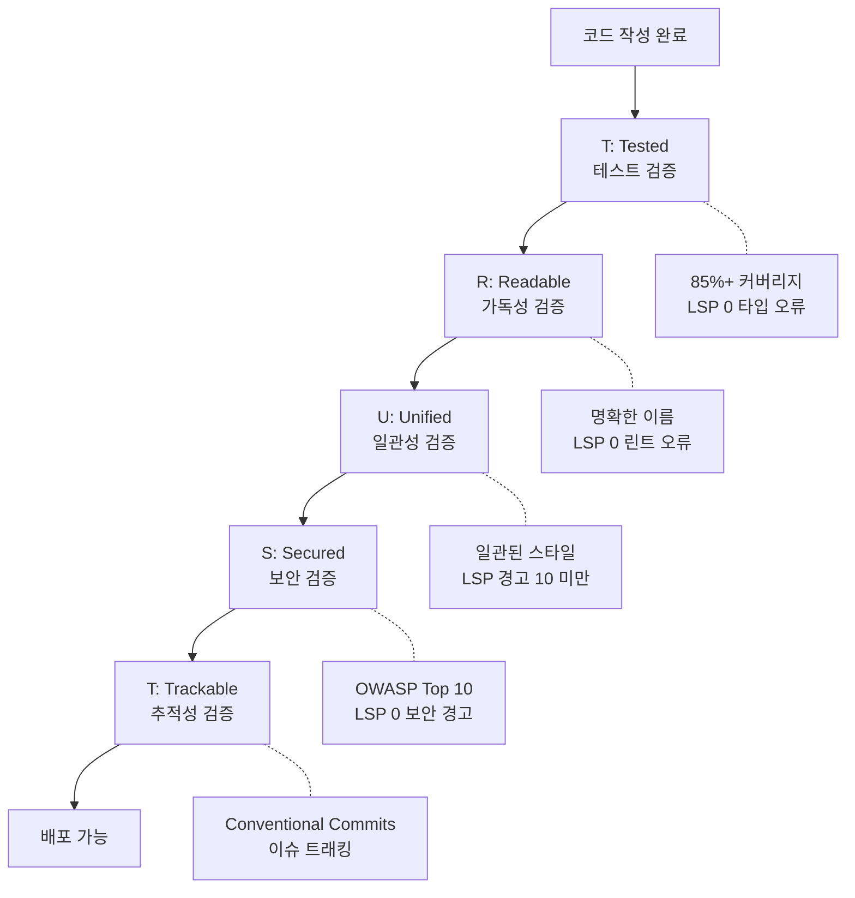
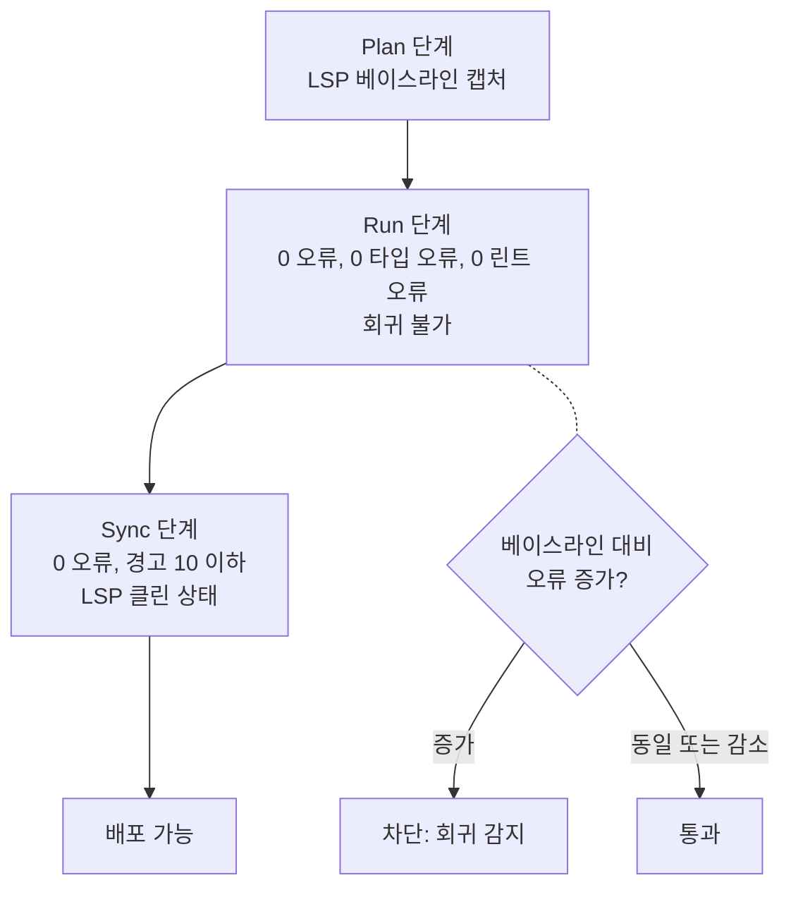
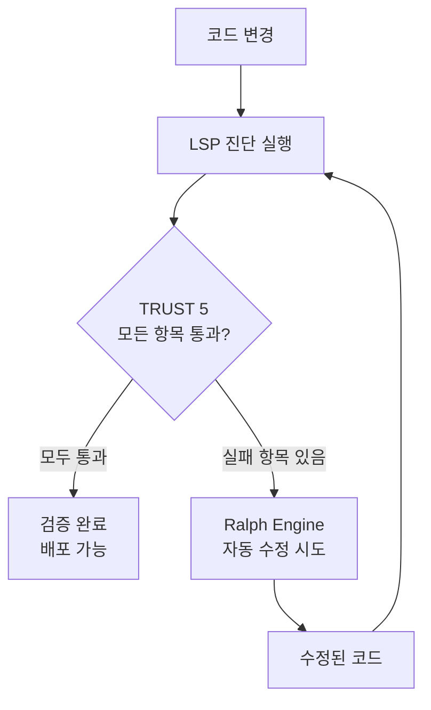

MoAI-ADK의 모든 코드가 통과해야 하는 5가지 품질 원칙을 상세히 안내합니다.


  **한 줄 요약:** TRUST 5는 "코드가 테스트되었는가, 읽기 쉬운가, 일관성 있는가,
  안전한가, 추적 가능한가"를 검증하는 자동화된 품질 게이트입니다.


## TRUST 5란?

TRUST 5는 MoAI-ADK가 모든 코드에 적용하는 **5가지 품질 원칙**입니다. AI가 생성한
코드도, 사람이 작성한 코드도 이 기준을 통과해야 합니다.

일상적인 비유로 설명하면, 건물을 지을 때 완공 검사를 하는 것과 같습니다. 구조
안전성, 전기 배선, 수도 배관, 소방 설비, 건축 허가 서류를 모두 확인해야 입주할
수 있습니다. 코드도 마찬가지입니다.

| 건물 검사        | TRUST 5           | 확인 내용                              |
| ---------------- | ----------------- | -------------------------------------- |
| 구조 안전성      | **T** (Tested)    | 코드가 제대로 작동하는지 테스트로 검증 |
| 전기/수도 설계도 | **R** (Readable)  | 다른 개발자가 코드를 이해할 수 있는지  |
| 건축 규정 준수   | **U** (Unified)   | 프로젝트의 코딩 규칙에 맞는지          |
| 소방/보안 설비   | **S** (Secured)   | 보안 취약점이 없는지                   |
| 인허가 서류      | **T** (Trackable) | 변경 이력이 명확하게 기록되는지        |



## T - Tested (테스트됨)

**핵심:** 모든 코드는 테스트로 검증되어야 합니다.

### 무엇을 확인하는가

| 검증 항목       | 기준           | 설명                                                    |
| --------------- | -------------- | ------------------------------------------------------- |
| 테스트 커버리지 | 85% 이상       | 전체 코드의 85% 이상이 테스트로 검증되어야 합니다       |
| 특성화 테스트   | 기존 코드 보호 | 리팩토링 시 기존 동작을 보존하는 테스트가 있어야 합니다 |
| LSP 타입 오류   | 0개            | 타입 검사에서 오류가 없어야 합니다                      |
| LSP 진단 오류   | 0개            | 언어 서버의 진단 오류가 없어야 합니다                   |

### 왜 85%인가?

100%를 요구하지 않는 이유가 있습니다.

| 커버리지   | 현실적인 의미                                               |
| ---------- | ----------------------------------------------------------- |
| 60% 미만   | 주요 기능도 테스트되지 않을 수 있습니다                     |
| 60-84%     | 기본적인 기능은 테스트되지만 에지 케이스가 빠질 수 있습니다 |
| **85-95%** | **핵심 로직과 대부분의 에지 케이스가 검증됩니다 (권장)**    |
| 95-100%    | 테스트 유지보수 비용 대비 효과가 떨어지기 시작합니다        |

### 모범 사례

```python
def calculate_discount(price: float, discount_rate: float) -> float:
    """할인가를 계산합니다.

    Args:
        price: 원래 가격 (0 이상)
        discount_rate: 할인율 (0.0 ~ 1.0)

    Returns:
        할인된 가격

    Raises:
        ValueError: 유효하지 않은 입력값
    """
    if price < 0:
        raise ValueError("가격은 0보다 작을 수 없습니다")
    if not 0 <= discount_rate <= 1:
        raise ValueError("할인율은 0.0에서 1.0 사이여야 합니다")
    return price * (1 - discount_rate)

# 테스트: 정상 케이스와 예외 케이스 모두 검증
def test_calculate_discount_normal():
    assert calculate_discount(10000, 0.1) == 9000
    assert calculate_discount(5000, 0.5) == 2500
    assert calculate_discount(0, 0.5) == 0

def test_calculate_discount_invalid_price():
    with pytest.raises(ValueError, match="가격은 0보다"):
        calculate_discount(-1000, 0.1)

def test_calculate_discount_invalid_rate():
    with pytest.raises(ValueError, match="할인율은"):
        calculate_discount(10000, 1.5)
```

---

## R - Readable (읽기 쉬움)

**핵심:** 코드는 명확하고 이해하기 쉬워야 합니다.

### 무엇을 확인하는가

| 검증 항목     | 기준                 | 설명                                               |
| ------------- | -------------------- | -------------------------------------------------- |
| 이름 규칙     | 의도를 드러내는 이름 | 변수, 함수, 클래스 이름이 명확해야 합니다          |
| 코드 주석     | 복잡한 로직에 설명   | "왜" 이렇게 했는지를 설명하는 주석이 있어야 합니다 |
| LSP 린트 오류 | 0개                  | 린터 규칙을 모두 통과해야 합니다                   |
| 함수 길이     | 적절한 크기          | 한 함수가 너무 길지 않아야 합니다                  |

### 모범 사례

```python
# 나쁜 예: 이름만으로는 무엇을 하는지 알 수 없습니다
def calc(d, r):
    return d * (1 - r)

# 좋은 예: 이름만 읽어도 역할을 알 수 있습니다
def calculate_discounted_price(original_price: float, discount_rate: float) -> float:
    """원래 가격에서 할인율만큼 할인된 가격을 계산합니다."""
    return original_price * (1 - discount_rate)
```


  **가독성 팁:** "6개월 후의 나 자신"이 이 코드를 읽었을 때 바로 이해할 수
  있는지 자문해보세요. 이해할 수 없다면 이름을 바꾸거나 주석을 추가하세요.


---

## U - Unified (통일됨)

**핵심:** 프로젝트 전체에서 일관된 코드 스타일을 유지합니다.

### 무엇을 확인하는가

| 검증 항목 | 기준               | 설명                                      |
| --------- | ------------------ | ----------------------------------------- |
| 코드 포맷 | 자동 포맷터 적용   | Python은 ruff/black, JS는 prettier로 통일 |
| 명명 규칙 | 프로젝트 표준 준수 | snake_case, camelCase 등 혼용 금지        |
| 오류 처리 | 통일된 패턴        | 모든 곳에서 동일한 에러 처리 방식 사용    |
| LSP 경고  | 10개 미만          | 언어 서버 경고가 임계값 이하              |

### 모범 사례

```python
# 통일된 에러 처리 패턴
class AppError(Exception):
    """애플리케이션 기본 에러"""
    def __init__(self, message: str, code: int = 500):
        self.message = message
        self.code = code

class NotFoundError(AppError):
    """리소스를 찾을 수 없음"""
    def __init__(self, resource: str, id: str):
        super().__init__(f"{resource} '{id}'을(를) 찾을 수 없습니다", code=404)

class ValidationError(AppError):
    """입력값 검증 실패"""
    def __init__(self, field: str, reason: str):
        super().__init__(f"'{field}' 검증 실패: {reason}", code=400)

# 모든 서비스에서 동일한 패턴 사용
def get_user(user_id: str) -> User:
    user = user_repository.find_by_id(user_id)
    if not user:
        raise NotFoundError("사용자", user_id)
    return user
```

---

## S - Secured (보안됨)

**핵심:** 모든 코드는 보안 검증을 통과해야 합니다.

### 무엇을 확인하는가

| 검증 항목     | 기준               | 설명                                      |
| ------------- | ------------------ | ----------------------------------------- |
| OWASP Top 10  | 전체 준수          | 가장 흔한 10가지 웹 보안 취약점 방지      |
| 의존성 스캔   | 취약한 패키지 없음 | 알려진 취약점이 있는 라이브러리 사용 금지 |
| 암호화 정책   | 민감 데이터 보호   | 비밀번호, 토큰 등은 반드시 암호화         |
| LSP 보안 경고 | 0개                | 보안 관련 경고가 없어야 합니다            |

### 주요 보안 검증 항목

| 취약점                | 방지 방법         | 예시                                                     |
| --------------------- | ----------------- | -------------------------------------------------------- |
| **SQL Injection**     | 파라미터화된 쿼리 | `db.execute("SELECT * FROM users WHERE id = %s", (id,))` |
| **XSS**               | 출력 이스케이프   | HTML 출력 시 자동 이스케이프                             |
| **비밀번호 노출**     | bcrypt 해싱       | `bcrypt.hashpw(password, salt)`                          |
| **하드코딩된 비밀키** | 환경 변수 사용    | `os.environ["SECRET_KEY"]`                               |
| **CSRF**              | 토큰 검증         | 모든 상태 변경 요청에 CSRF 토큰 포함                     |

### 모범 사례

```python
# 나쁜 예: SQL Injection 취약점
def get_user(username: str) -> dict:
    query = f"SELECT * FROM users WHERE username = '{username}'"
    return db.execute(query)

# 좋은 예: 파라미터화된 쿼리로 안전하게
def get_user(username: str) -> dict:
    query = "SELECT * FROM users WHERE username = %s"
    return db.execute(query, (username,))
```

---

## T - Trackable (추적 가능)

**핵심:** 모든 변경은 명확하게 추적 가능해야 합니다.

### 무엇을 확인하는가

| 검증 항목     | 기준                 | 설명                                      |
| ------------- | -------------------- | ----------------------------------------- |
| 커밋 메시지   | Conventional Commits | `feat:`, `fix:`, `refactor:` 등 표준 형식 |
| 이슈 연결     | GitHub Issues 참조   | 커밋에 관련 이슈 번호 포함                |
| CHANGELOG     | 변경 로그 유지       | 사용자에게 보여줄 변경 내역 기록          |
| LSP 상태 추적 | 진단 이력 기록       | LSP 상태 변경을 추적하여 회귀 감지        |

### Conventional Commits 형식

```bash
# 구조: <타입>(<범위>): <설명>
# 예시:

# 새 기능 추가
$ git commit -m "feat(auth): JWT 기반 로그인 API 추가"

# 버그 수정
$ git commit -m "fix(auth): 토큰 만료 시간 계산 오류 수정"

# 리팩토링
$ git commit -m "refactor(auth): 인증 로직을 AuthService로 분리"

# 보안 개선
$ git commit -m "security(db): 파라미터화된 쿼리로 SQL Injection 방지"
```

**커밋 타입:**

| 타입       | 설명                       | 예시                                         |
| ---------- | -------------------------- | -------------------------------------------- |
| `feat`     | 새로운 기능                | `feat(api): 사용자 목록 API 추가`            |
| `fix`      | 버그 수정                  | `fix(auth): 로그인 실패 시 에러 메시지 수정` |
| `refactor` | 코드 개선 (동작 변경 없음) | `refactor(db): 쿼리 최적화`                  |
| `security` | 보안 개선                  | `security(auth): 비밀키 환경 변수화`         |
| `docs`     | 문서 변경                  | `docs(readme): 설치 가이드 업데이트`         |
| `test`     | 테스트 추가/수정           | `test(auth): 로그인 테스트 케이스 추가`      |

---

## LSP 품질 게이트

MoAI-ADK는 **LSP** (Language Server Protocol) 를 활용하여 코드 품질을 실시간으로
검증합니다. LSP는 IDE에서 빨간 밑줄로 오류를 표시해주는 바로 그 시스템입니다.

### 단계별 LSP 임계값

Plan, Run, Sync 각 단계마다 다른 LSP 기준이 적용됩니다.

| 단계     | 오류 허용       | 타입 오류 허용  | 린트 오류 허용  | 경고 허용 | 회귀 허용 |
| -------- | --------------- | --------------- | --------------- | --------- | --------- |
| **Plan** | 베이스라인 캡처 | 베이스라인 캡처 | 베이스라인 캡처 | -         | -         |
| **Run**  | 0개             | 0개             | 0개             | -         | 불가      |
| **Sync** | 0개             | -               | -               | 최대 10개 | 불가      |

**각 단계의 의미:**

- **Plan 단계:** 현재 코드의 LSP 상태를 "베이스라인"으로 캡처합니다. 이것이
  기준선이 됩니다.
- **Run 단계:** 구현 완료 시 LSP 오류가 0이어야 합니다. 베이스라인 대비 오류가
  증가하면 안 됩니다 (회귀 불가).
- **Sync 단계:** 문서화 및 PR 생성 전 LSP가 깨끗해야 합니다. 경고는 최대
  10개까지 허용됩니다.



## Ralph Engine과의 통합

**Ralph Engine** 은 MoAI-ADK의 자율 품질 검증 루프입니다. LSP 진단 결과를
기반으로 코드 문제를 자동으로 감지하고 수정을 반복합니다.



**동작 방식:**

1. 코드가 변경되면 LSP가 진단을 실행합니다
2. TRUST 5 기준에 미달하는 항목이 있으면 Ralph Engine이 자동 수정을 시도합니다
3. 수정 후 다시 LSP 진단을 실행하여 통과 여부를 확인합니다
4. 통과할 때까지 반복합니다 (최대 3회 재시도)

**관련 명령어:**

```bash
# 자동 수정 실행
> /moai fix

# 완료될 때까지 자동 반복 수정
> /moai loop
```

## quality.yaml 설정

`.moai/config/sections/quality.yaml` 파일에서 TRUST 5 관련 설정을 관리합니다.

### 주요 설정 항목

```yaml
constitution:
  # TRUST 5 품질 검증 활성화
  enforce_quality: true

  # 목표 테스트 커버리지
  test_coverage_target: 85

  # LSP 품질 게이트 설정
  lsp_quality_gates:
    enabled: true

    plan:
      require_baseline: true # Plan 시작 시 베이스라인 캡처

    run:
      max_errors: 0 # Run 단계 오류 허용: 0개
      max_type_errors: 0 # 타입 오류 허용: 0개
      max_lint_errors: 0 # 린트 오류 허용: 0개
      allow_regression: false # 베이스라인 대비 회귀 불가

    sync:
      max_errors: 0 # Sync 단계 오류 허용: 0개
      max_warnings: 10 # 경고 허용: 최대 10개
      require_clean_lsp: true # LSP 클린 상태 필요

    cache_ttl_seconds: 5 # LSP 진단 캐시 시간
    timeout_seconds: 3 # LSP 진단 타임아웃
```

### 설정 커스터마이즈 팁

| 상황                                   | 조정 방법                                                  |
| -------------------------------------- | ---------------------------------------------------------- |
| 프로젝트 초기, 테스트가 거의 없는 경우 | `test_coverage_target`을 70으로 낮추고 점진적으로 올립니다 |
| 레거시 코드가 많은 경우                | `allow_regression`을 일시적으로 true로 설정합니다          |
| 엄격한 보안이 필요한 경우              | `max_warnings`를 0으로 설정합니다                          |

## 실전 적용: 품질 게이트 통과 시나리오

실제 개발에서 TRUST 5가 어떻게 적용되는지 살펴봅시다.

### 시나리오: 사용자 검색 API 구현

```bash
# 1. Plan: SPEC 생성 (LSP 베이스라인 캡처)
> /moai plan "사용자 검색 API 구현"
```

```bash
# 2. Run: DDD로 구현 (TRUST 5 검증)
> /moai run SPEC-SEARCH-001
```

**Run 단계에서의 TRUST 5 검증:**

| 항목              | 검증 내용                            | 결과 |
| ----------------- | ------------------------------------ | ---- |
| **T** (Tested)    | 테스트 커버리지 85%, 타입 오류 0개   | 통과 |
| **R** (Readable)  | 린트 오류 0개, 명확한 함수명 사용    | 통과 |
| **U** (Unified)   | ruff/black 포맷팅 적용, LSP 경고 3개 | 통과 |
| **S** (Secured)   | SQL Injection 방지, 입력값 검증      | 통과 |
| **T** (Trackable) | Conventional Commit 형식, SPEC 참조  | 통과 |

```bash
# 3. Sync: 문서 생성 및 PR (최종 LSP 클린 확인)
> /moai sync SPEC-SEARCH-001
```

**Sync 단계 최종 확인:**

```
LSP 진단 결과:
- 오류: 0개
- 타입 오류: 0개
- 린트 오류: 0개
- 경고: 3개 (임계값 10 이하)
- 보안 경고: 0개

TRUST 5 전체 통과: 배포 가능
```

## TRUST 5 한눈에 보기

| 원칙              | 핵심 질문                   | 자동 검증 도구         | 기준                       |
| ----------------- | --------------------------- | ---------------------- | -------------------------- |
| **T** (Tested)    | 테스트로 검증되었는가?      | pytest, LSP 타입 검사  | 85%+ 커버리지, 0 타입 오류 |
| **R** (Readable)  | 다른 사람이 읽을 수 있는가? | ruff, eslint, LSP 린트 | 0 린트 오류, 명확한 이름   |
| **U** (Unified)   | 프로젝트 규칙에 맞는가?     | black, prettier, LSP   | 일관된 포맷, 경고 10 미만  |
| **S** (Secured)   | 보안 취약점이 없는가?       | bandit, semgrep, LSP   | OWASP 준수, 0 보안 경고    |
| **T** (Trackable) | 변경 이력이 추적 가능한가?  | commitlint, git        | Conventional Commits       |

## 관련 문서

- [MoAI-ADK란?](/core-concepts/what-is-moai-adk) -- MoAI-ADK의 전체 구조를
  이해합니다
- [SPEC 기반 개발](/core-concepts/spec-based-dev) -- TRUST 5가 적용되는 Plan
  단계를 배웁니다
- [도메인 주도 개발](/core-concepts/ddd) -- TRUST 5가 적용되는 Run 단계를
  배웁니다
