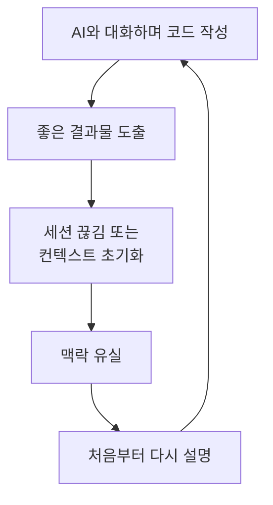
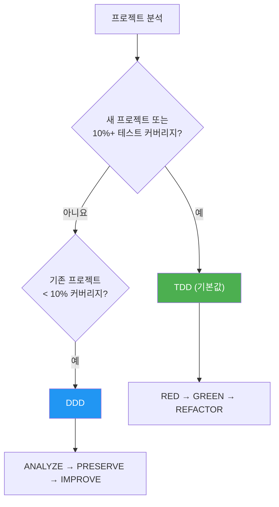
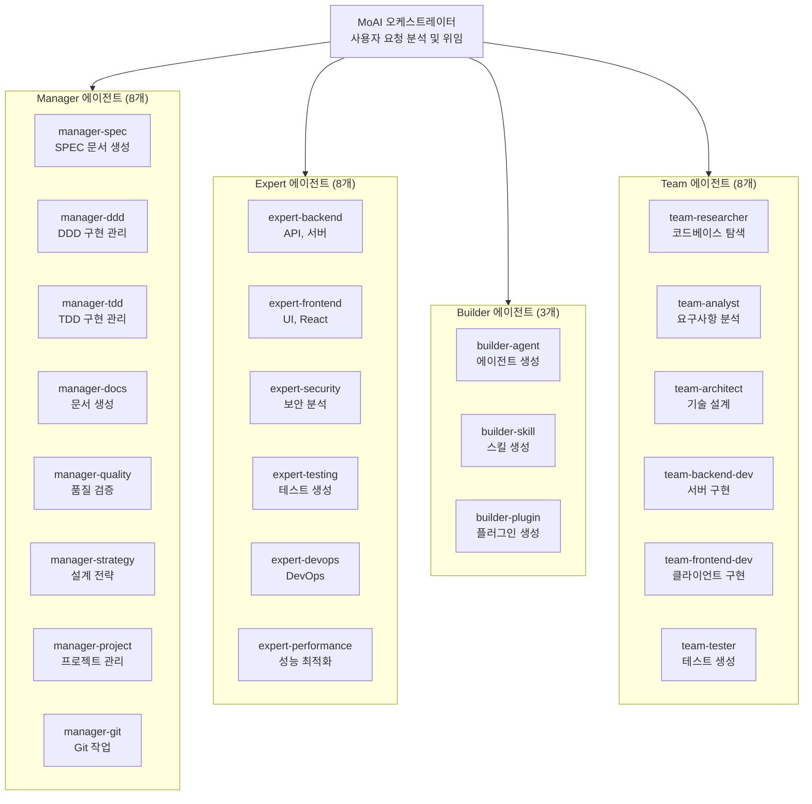
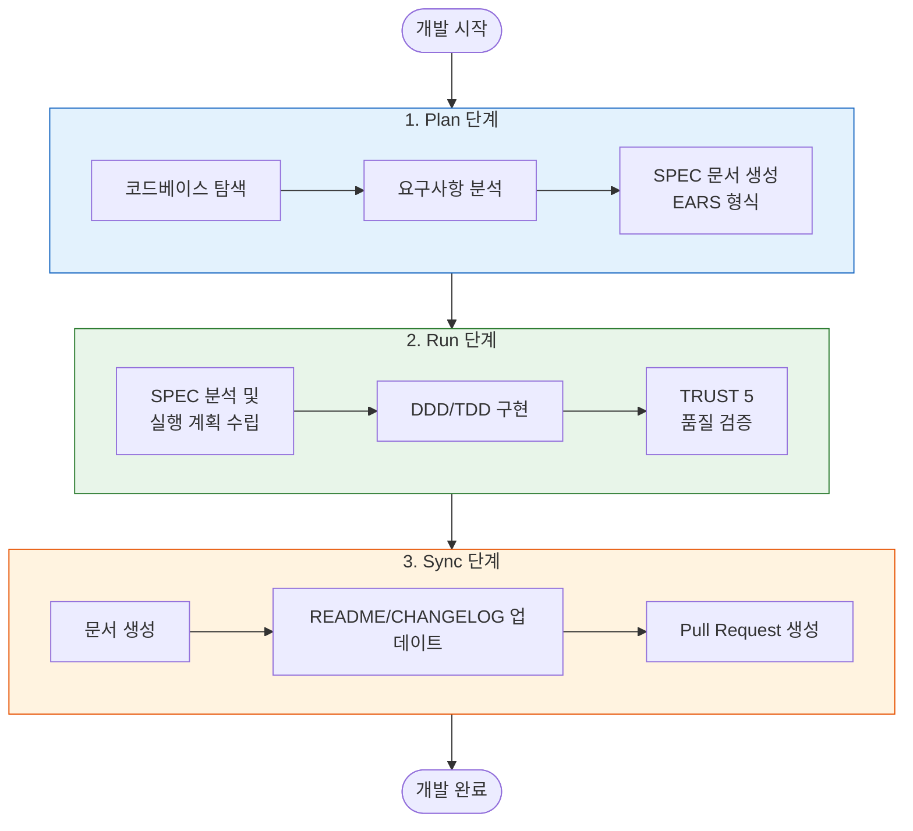
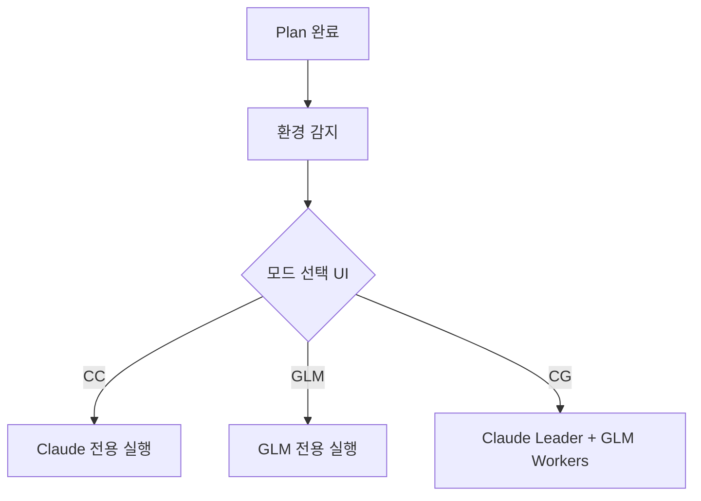
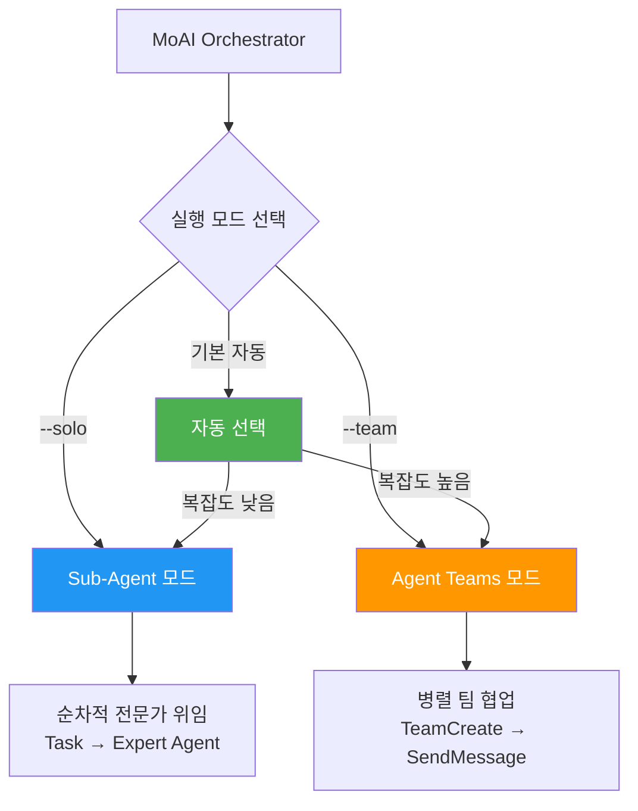

# MoAI-ADK란?

MoAI-ADK는 Claude Code를 위한 **고성능 AI 개발 환경**입니다. 28개의 전문 AI 에이전트와 52개의 스킬이 협력하여 품질 높은 코드를 생산합니다. 새 프로젝트와 기능 개발에는 TDD (기본값), 테스트 커버리지가 낮은 기존 프로젝트에는 DDD를 자동으로 적용하며, Sub-Agent와 Agent Teams 이중 실행 모드를 지원합니다.

Go로 작성된 단일 바이너리 -- 의존성 없이 모든 플랫폼에서 즉시 실행됩니다.


**한 줄 요약:** MoAI-ADK는 "AI와 나눈 대화를 문서 (SPEC) 로 남기고, 안전하게 코드를 개선 (DDD/TDD) 하며, 품질을 자동 검증 (TRUST 5) 하는" AI 개발 프레임워크입니다.


## MoAI-ADK 소개

**MoAI** 는 "모두의 AI" (MoAI - Everybody's AI) 를 의미합니다. **ADK** 는 Agentic Development Kit의 약자로, AI 에이전트가 개발 과정을 주도하는 도구 모음을 뜻합니다.

MoAI-ADK는 **Claude Code 내에서 에이전트들이 상호 작용을 통해 에이전트 코딩을 수행할 수 있도록 하는 Agentic Development Kit**입니다. 마치 AI 개발팀이 협업하여 프로젝트를 완성하듯, MoAI-ADK의 AI 에이전트들이 각자의 전문 분야에서 개발 작업을 수행하며 상호 협력합니다.

| AI 개발팀 | MoAI-ADK | 역할 |
|----------|----------|------|
| 프로덕트 오너 | 사용자 (개발자) | 무엇을 만들지 결정합니다 |
| 팀 리드 / Tech Lead | MoAI 오케스트레이터 | 전체 작업을 조율하고 팀원에게 위임합니다 |
| 기획자 / Spec Writer | manager-spec | 요구사항을 문서로 정리합니다 |
| 개발자 / Engineers | expert-backend, expert-frontend | 실제 코드를 구현합니다 |
| QA / 코드 리뷰어 | manager-quality | 품질 기준을 검증합니다 |

## 왜 MoAI-ADK인가?

### Python에서 Go로의 완전 재작성

Python 기반 MoAI-ADK (~73,000줄)를 Go로 완전히 재작성했습니다.

| 항목 | Python 에디션 | Go 에디션 |
|------|-------------|----------|
| 배포 | pip + venv + 의존성 | **단일 바이너리**, 제로 의존성 |
| 시작 시간 | ~800ms 인터프리터 부팅 | **~5ms** 네이티브 실행 |
| 동시성 | asyncio / threading | **네이티브 고루틴** |
| 타입 안전성 | 런타임 (mypy 선택) | **컴파일 타임 강제** |
| 크로스 플랫폼 | Python 런타임 필요 | **사전 빌드 바이너리** (macOS, Linux, Windows) |
| Hook 실행 | Shell 래퍼 + Python | **컴파일된 바이너리**, JSON 프로토콜 |

### 핵심 수치

- **34,220줄** Go 코드, **32개** 패키지
- **85-100%** 테스트 커버리지
- **28개** 전문 AI 에이전트 + **52개** 스킬
- **18개** 프로그래밍 언어 지원
- **16개** Claude Code Hook 이벤트

### 바이브코딩의 문제점

**바이브코딩** (Vibe Coding) 이란 AI와 자연스럽게 대화하며 코드를 작성하는 방식입니다. "이런 기능 만들어줘"라고 말하면 AI가 코드를 생성합니다. 직관적이고 빠르지만, 실무에서는 심각한 문제가 발생합니다.



**실무에서 겪는 구체적인 문제들:**

| 문제 | 상황 예시 | 결과 |
|------|----------|------|
| **맥락 유실** | 어제 1시간 동안 논의한 인증 방식을 오늘 다시 설명해야 함 | 시간 낭비, 일관성 저하 |
| **품질 불일치** | AI가 때로는 좋은 코드를, 때로는 나쁜 코드를 생성 | 코드 품질 예측 불가 |
| **기존 코드 파괴** | "이 부분 고쳐줘"라고 했더니 다른 기능이 망가짐 | 버그 발생, 롤백 필요 |
| **반복 설명** | 프로젝트 구조, 코딩 규칙을 매번 다시 알려줘야 함 | 생산성 저하 |
| **검증 부재** | AI가 생성한 코드가 안전한지 확인할 방법이 없음 | 보안 취약점, 테스트 미비 |

### MoAI-ADK의 해결책

| 문제 | MoAI-ADK의 해결책 |
|------|------------------|
| 맥락 유실 | **SPEC 문서** 로 요구사항을 파일로 영구 보존 |
| 품질 불일치 | **TRUST 5** 프레임워크로 일관된 품질 기준 적용 |
| 기존 코드 파괴 | **DDD/TDD** 로 테스트를 먼저 작성하여 기존 기능 보호 |
| 반복 설명 | **CLAUDE.md와 스킬 시스템** 으로 프로젝트 컨텍스트 자동 로드 |
| 검증 부재 | **LSP 품질 게이트** 로 코드 품질 자동 검증 |

## 시스템 요구사항

| 플랫폼 | 지원 환경 | 비고 |
|--------|---------|------|
| macOS | Terminal, iTerm2 | 완전 지원 |
| Linux | Bash, Zsh | 완전 지원 |
| Windows | **WSL (권장)**, PowerShell 7.x+ | 네이티브 cmd.exe는 지원하지 않음 |

**필수 조건:**
- 모든 플랫폼에 **Git** 설치 필요
- **Windows 사용자**: [Git for Windows](https://gitforwindows.org/) **필수** (Git Bash 포함)
  - 최상의 경험을 위해 **WSL** (Windows Subsystem for Linux) 사용 권장
  - PowerShell 7.x 이상은 대안으로 지원
  - 레거시 Windows PowerShell 5.x와 cmd.exe는 **지원하지 않음**

## 빠른 시작

### 1. 설치

#### macOS / Linux / WSL

```bash
curl -fsSL https://raw.githubusercontent.com/modu-ai/moai-adk/main/install.sh | bash
```

#### Windows (PowerShell 7.x+)

> **권장**: 위의 Linux 설치 명령어로 WSL을 사용하면 최상의 경험을 제공합니다.

```powershell
irm https://raw.githubusercontent.com/modu-ai/moai-adk/main/install.ps1 | iex
```

> [Git for Windows](https://gitforwindows.org/)가 먼저 설치되어 있어야 합니다.

#### 소스에서 빌드 (Go 1.26+)

```bash
git clone https://github.com/modu-ai/moai-adk.git
cd moai-adk && make build
```

> 사전 빌드된 바이너리는 [Releases](https://github.com/modu-ai/moai-adk/releases) 페이지에서 다운로드할 수 있습니다.

### 2. 프로젝트 초기화

```bash
moai init my-project
```

대화형 마법사가 언어, 프레임워크, 방법론을 자동 감지한 후 Claude Code 통합 파일을 생성합니다.

### 3. Claude Code에서 개발 시작

```bash
# Claude Code 실행 후
/moai project                            # 프로젝트 문서 생성 (product.md, structure.md, tech.md)
/moai plan "사용자 인증 추가"              # SPEC 문서 생성
/moai run SPEC-AUTH-001                   # DDD/TDD 구현
/moai sync SPEC-AUTH-001                  # 문서 동기화 및 PR 생성
```

## 핵심 철학


**"바이브코딩의 목적은 빠른 생산성이 아니라 코드 품질이다."**

MoAI-ADK는 빠르게 코드를 찍어내는 도구가 아닙니다. AI를 활용하되, 사람이 직접 작성한 것보다 **더 높은 품질**의 코드를 만드는 것이 목표입니다. 빠른 속도는 품질을 지키면서 자연스럽게 따라오는 부수적인 효과입니다.


이 철학은 세 가지 원칙으로 구체화됩니다:

1. **명세 우선** (SPEC-First): 코드를 작성하기 전에 무엇을 만들지 문서로 명확히 정의합니다
2. **안전한 개선** (DDD/TDD): 기존 코드의 동작을 보존하면서 점진적으로 개선합니다
3. **자동 품질 검증** (TRUST 5): 5가지 품질 원칙으로 모든 코드를 자동 검증합니다

## MoAI 개발 방법론

MoAI-ADK는 프로젝트 상태에 따라 최적의 개발 방법론을 자동으로 선택합니다.



### TDD 방법론 (기본값)

새 프로젝트와 기능 개발의 기본 방법론입니다. 테스트를 먼저 작성하고, 그 다음 구현합니다.

| 단계 | 설명 |
|------|------|
| **RED** | 기대 동작을 정의하는 실패하는 테스트 작성 |
| **GREEN** | 테스트를 통과하는 최소한의 코드 작성 |
| **REFACTOR** | 테스트를 유지하면서 코드 품질 개선. REFACTOR 완료 후 `/simplify`가 자동 실행됩니다. |

브라운필드 프로젝트 (기존 코드베이스) 의 경우, TDD에 **pre-RED 분석 단계**가 추가됩니다: 테스트 작성 전에 기존 코드를 읽어 현재 동작을 이해합니다.

### DDD 방법론 (기존 프로젝트, 10% 미만 커버리지)

테스트 커버리지가 낮은 기존 프로젝트를 안전하게 리팩토링하기 위한 방법론입니다.

```
ANALYZE   → 기존 코드와 의존성 분석, 도메인 경계 식별
PRESERVE  → 특성화 테스트 작성, 현재 동작 스냅샷 캡처
IMPROVE   → 테스트 보호 하에 점진적 개선. /simplify가 IMPROVE 완료 후 자동 실행됩니다.
```


방법론은 `moai init` 시 자동 선택되며 (`--mode <ddd|tdd>`, 기본값: tdd), `.moai/config/sections/quality.yaml`의 `development_mode`에서 변경할 수 있습니다.

**참고**: MoAI-ADK v2.5.0+에서는 이진 방법론 선택 (TDD 또는 DDD만) 을 사용합니다. 하이브리드 모드는 명확성과 일관성을 위해 제거되었습니다.


## Harness Engineering 아키텍처

MoAI-ADK는 **Harness Engineering** 패러다임을 구현합니다 — 직접 코드를 작성하는 것이 아니라, AI 에이전트가 일할 환경을 설계하는 접근입니다.

| 구성 요소 | 설명 | 명령어 |
|----------|------|--------|
| **Self-Verify Loop** | 에이전트가 코드 작성 → 테스트 → 실패 → 수정 → 통과 사이클을 자율적으로 수행 | `/moai loop` |
| **Context Map** | 코드베이스 아키텍처 맵과 문서가 에이전트에 항상 제공 | `/moai codemaps` |
| **Session Persistence** | `progress.md`가 완료된 단계를 세션 간 추적; 중단된 실행이 자동으로 재개 | `/moai run SPEC-XXX` |
| **Failing Checklist** | 모든 인수 기준이 실행 시작 시 대기 작업으로 등록; 구현 완료 시 완료 표시 | `/moai run SPEC-XXX` |
| **Language-Agnostic** | 18개 언어 지원: 언어 자동 감지, 올바른 LSP/린터/테스트/커버리지 도구 선택 | 모든 워크플로우 |
| **Garbage Collection** | 죽은 코드, AI Slop, 미사용 import의 주기적 스캔 및 제거 | `/moai clean` |
| **Scaffolding First** | 구현 전에 빈 파일 스텁 생성하여 엔트로피 방지 | `/moai run SPEC-XXX` |


"사람이 방향을 잡고, 에이전트가 실행한다." — 엔지니어의 역할이 코드 작성에서 하네스 설계 (SPEC, 품질 게이트, 피드백 루프) 로 전환됩니다.


## 자동 품질 및 스케일아웃 레이어

MoAI-ADK v2.6.0+는 MoAI가 **자율적으로** 호출하는 두 가지 Claude Code 네이티브 스킬을 통합합니다 — 플래그나 수동 명령 없이 작동합니다.

| 스킬 | 역할 | 트리거 |
|------|------|--------|
| `/simplify` | 품질 보장 | TDD REFACTOR 및 DDD IMPROVE 단계 완료 후 **항상** 실행 |
| `/batch` | 스케일아웃 실행 | 작업 복잡도가 임계값을 초과하면 자동 트리거 |

**`/simplify` — 자동 품질 패스**

병렬 에이전트를 사용하여 변경된 코드의 재사용 기회, 품질 이슈, 효율성, CLAUDE.md 준수를 검토한 후 자동 수정합니다. MoAI가 모든 구현 사이클 후 직접 호출합니다.

**`/batch` — 병렬 스케일아웃**

격리된 git worktree에서 수십 개의 에이전트를 생성하여 대규모 병렬 작업을 수행합니다. 각 에이전트가 테스트를 실행하고 결과를 보고하면 MoAI가 병합합니다. 워크플로우별 자동 트리거:

| 워크플로우 | 트리거 조건 |
|-----------|-----------|
| `run` | 작업 >= 5, 또는 예상 파일 변경 >= 10, 또는 독립 작업 >= 3 |
| `mx` | 소스 파일 >= 50 |
| `coverage` | P1+P2 커버리지 갭 >= 10 |
| `clean` | 확인된 죽은 코드 항목 >= 20 |

## AI 에이전트 오케스트레이션

MoAI는 **전략적 오케스트레이터**입니다. 직접 코드를 작성하지 않고, 28개의 전문 에이전트에 작업을 위임합니다.

### 에이전트 카테고리

| 구분 | 수량 | 에이전트 | 역할 |
|------|------|---------|------|
| **Manager** | 8개 | spec, ddd, tdd, docs, quality, project, strategy, git | 워크플로우 조율, SPEC 생성, 품질 관리 |
| **Expert** | 8개 | backend, frontend, security, devops, performance, debug, testing, refactoring | 도메인별 구현, 분석, 최적화 |
| **Builder** | 3개 | agent, skill, plugin | 새로운 MoAI 구성 요소 생성 |
| **Team** | 8개 | researcher, analyst, architect, designer, backend-dev, frontend-dev, tester, quality | 병렬 팀 기반 개발 |



### 52개 스킬 (Progressive Disclosure)

3레벨 Progressive Disclosure 시스템으로 토큰 효율적으로 관리됩니다:

| 카테고리 | 수량 | 예시 |
|----------|------|------|
| **Foundation** | 5 | core, claude, philosopher, quality, context |
| **Workflow** | 11 | spec, project, ddd, tdd, testing, worktree, thinking... |
| **Domain** | 5 | backend, frontend, database, uiux, data-formats |
| **Language** | 18 | Go, Python, TypeScript, Rust, Java, Kotlin, Swift, C++... |
| **Platform** | 9 | Vercel, Supabase, Firebase, Auth0, Clerk, Railway... |
| **Library** | 3 | shadcn, nextra, mermaid |
| **Tool** | 2 | ast-grep, svg |
| **Specialist** | 10 | Figma, Flutter, Pencil... |

## MoAI 워크플로우

### Plan → Run → Sync 파이프라인

MoAI의 핵심 워크플로우는 3단계로 구성됩니다:



**실제 사용 예시:**

```bash
# 1. Plan: 요구사항 정의
> /moai plan "JWT 기반 사용자 인증 기능 구현"

# 2. Run: DDD/TDD 방식으로 구현
> /moai run SPEC-AUTH-001

# 3. Sync: 문서 생성 및 PR
> /moai sync SPEC-AUTH-001
```

#### 실행 모드 선택 게이트

Plan 단계에서 Run 단계로 전환할 때, MoAI는 자동으로 현재 실행 환경 (cc/glm/cg) 을 감지하고 사용자가 확인하거나 변경할 수 있는 선택 UI를 표시합니다.



이 게이트는 환경 상태에 관계없이 올바른 실행 모드가 사용되도록 보장하여 구현 중 모드 불일치를 방지합니다.

### /moai 서브커맨드

모든 서브커맨드는 Claude Code 내에서 `/moai <서브커맨드>`로 실행합니다.

#### 핵심 워크플로우

| 서브커맨드 | 별칭 | 용도 | 주요 플래그 |
|-----------|------|------|-----------|
| `plan` | `spec` | SPEC 문서 생성 (EARS 형식) | `--worktree`, `--branch`, `--resume SPEC-XXX`, `--team` |
| `run` | `impl` | SPEC의 DDD/TDD 구현 | `--resume SPEC-XXX`, `--team` |
| `sync` | `docs`, `pr` | 문서 동기화, 코드맵, PR 생성 | `--merge`, `--skip-mx` |

#### 품질 및 테스트

| 서브커맨드 | 별칭 | 용도 | 주요 플래그 |
|-----------|------|------|-----------|
| `fix` | -- | LSP 오류, 린트, 타입 오류 자동 수정 (단일 패스) | `--dry`, `--seq`, `--level N`, `--resume`, `--team` |
| `loop` | -- | 완료까지 반복 자동 수정 (최대 100회) | `--max N`, `--auto-fix`, `--seq` |
| `review` | `code-review` | 보안 및 @MX 태그 준수 코드 리뷰 | `--staged`, `--branch`, `--security` |
| `coverage` | `test-coverage` | 테스트 커버리지 분석 및 갭 채우기 (16개 언어) | `--target N`, `--file PATH`, `--report` |
| `e2e` | -- | E2E 테스트 (Chrome, Playwright, Agent Browser) | `--record`, `--url URL`, `--journey NAME` |
| `clean` | `refactor-clean` | 죽은 코드 식별 및 안전 제거 | `--dry`, `--safe-only`, `--file PATH` |

#### 문서 및 코드베이스

| 서브커맨드 | 별칭 | 용도 | 주요 플래그 |
|-----------|------|------|-----------|
| `project` | `init` | 프로젝트 문서 생성 (product.md, structure.md, tech.md, codemaps/) | -- |
| `mx` | -- | 코드베이스 스캔 및 @MX 코드 수준 주석 추가 | `--all`, `--dry`, `--priority P1-P4`, `--force`, `--team` |
| `codemaps` | `update-codemaps` | 아키텍처 문서 생성 | `--force`, `--area AREA` |
| `feedback` | `fb`, `bug`, `issue` | 피드백 수집 및 GitHub 이슈 생성 | -- |

#### 기본 워크플로우

| 서브커맨드 | 용도 | 주요 플래그 |
|-----------|------|-----------|
| *(없음)* | 전체 자율 plan → run → sync 파이프라인. 복잡도 점수 >= 5일 때 SPEC 자동 생성. | `--loop`, `--max N`, `--branch`, `--pr`, `--resume SPEC-XXX`, `--team`, `--solo` |

### 실행 모드 플래그

에이전트가 워크플로우 실행 중 어떻게 배치될지 제어합니다:

| 플래그 | 모드 | 설명 |
|-------|------|------|
| `--team` | Agent Teams | 병렬 팀 기반 실행. 여러 에이전트가 동시에 작업. |
| `--solo` | Sub-Agent | 단계별 단일 에이전트 순차 위임. |
| *(기본값)* | 자동 | 복잡도 기반 자동 선택 (도메인 >= 3, 파일 >= 10, 점수 >= 7). |

**`--team`은 3가지 실행 환경을 지원합니다:**

| 환경 | 명령어 | Leader | Workers | 적합한 경우 |
|------|--------|--------|---------|-----------|
| Claude 전용 | `moai cc` | Claude | Claude | 최고 품질 |
| GLM 전용 | `moai glm` | GLM | GLM | 최대 비용 절감 |
| CG (Claude+GLM) | `moai cg` | Claude | GLM | 품질 + 비용 균형 |


**v2.7.1 변경**: CG 모드가 이제 **기본** 팀 모드입니다. `--team` 사용 시 `moai cc` 또는 `moai glm`으로 명시적으로 변경하지 않는 한 CG 모드로 실행됩니다.

`moai cg`는 tmux 세션 수준 환경 변수 격리를 사용하여 Claude Leader와 GLM Workers를 분리합니다. `moai glm`에서 전환하면 `moai cg`가 자동으로 GLM 설정을 초기화합니다.


### 자율 개발 루프 (Ralph Engine)

LSP 진단과 AST-grep을 결합한 자율 오류 수정 엔진입니다:

```bash
/moai fix       # 단일 패스: 스캔 → 분류 → 수정 → 검증
/moai loop      # 반복 수정: 완료 마커 감지까지 반복 (최대 100회)
```

**Ralph Engine 작동 방식:**
1. **병렬 스캔**: LSP 진단 + AST-grep + 린터를 동시에 실행
2. **자동 분류**: 레벨 1 (자동 수정) 부터 레벨 4 (사용자 개입) 까지 오류 분류
3. **수렴 감지**: 동일한 오류가 반복되면 대안 전략 적용
4. **완료 기준**: 0 오류, 0 타입 오류, 85%+ 커버리지

### 추천 워크플로우 체인

**새 기능 개발:**
```
/moai plan → /moai run SPEC-XXX → /moai sync SPEC-XXX
```

**버그 수정:**
```
/moai fix (또는 /moai loop) → /moai review → /moai sync
```

**리팩토링:**
```
/moai plan → /moai clean → /moai run SPEC-XXX → /moai review → /moai coverage → /moai codemaps
```

**문서 업데이트:**
```
/moai codemaps → /moai sync
```

## TRUST 5 품질 프레임워크

모든 코드 변경은 5가지 품질 기준으로 검증됩니다:

| 기준 | 의미 | 검증 내용 |
|------|------|----------|
| **T**ested | 테스트됨 | 85%+ 커버리지, 특성화 테스트, 유닛 테스트 통과 |
| **R**eadable | 읽기 쉬움 | 명확한 네이밍 규칙, 일관된 코드 스타일, 0 린트 오류 |
| **U**nified | 통일됨 | 일관된 포맷팅, import 정렬, 프로젝트 구조 준수 |
| **S**ecured | 안전함 | OWASP 준수, 입력 검증, 0 보안 경고 |
| **T**rackable | 추적 가능 | Conventional Commits, 이슈 참조, 구조화된 로깅 |

## @MX 태그 시스템

MoAI-ADK는 AI 에이전트 간 컨텍스트, 불변량, 위험 영역을 전달하기 위해 **@MX 코드 수준 주석 시스템**을 사용합니다.

| 태그 유형 | 용도 | 추가 시점 |
|----------|------|----------|
| `@MX:ANCHOR` | 중요 계약 | fan_in >= 3인 함수, 변경 시 영향 범위가 넓음 |
| `@MX:WARN` | 위험 영역 | 고루틴, 복잡도 >= 15, 전역 상태 변이 |
| `@MX:NOTE` | 컨텍스트 전달 | 매직 상수, 문서 누락, 비즈니스 규칙 |
| `@MX:TODO` | 미완료 작업 | 테스트 누락, 미구현 기능 |

@MX 태그 시스템은 **가장 위험하고 중요한 코드만 표시**하도록 설계되었습니다. 대부분의 코드에는 태그가 필요하지 않으며, 이는 정상적인 설계입니다.

```bash
# 전체 코드베이스 스캔
/moai mx --all

# 미리보기 (파일 수정 없음)
/moai mx --dry

# 우선순위별 스캔
/moai mx --priority P1
```

## 모델 정책 (토큰 최적화)

MoAI-ADK는 Claude Code 구독 요금제에 맞춰 28개 에이전트에 최적의 AI 모델을 할당합니다. 요금제의 사용량 제한 내에서 품질을 극대화합니다.

| 정책 | 요금제 | 🟣 Opus | 🔵 Sonnet | 🟡 Haiku | 용도 |
|------|--------|------|--------|-------|------|
| **High** | Max $200/월 | 23 | 1 | 4 | 최고 품질, 최대 처리량 |
| **Medium** | Max $100/월 | 4 | 19 | 5 | 품질과 비용의 균형 |
| **Low** | Plus $20/월 | 0 | 12 | 16 | 경제적, Opus 미포함 |

### 설정 방법

```bash
# 프로젝트 초기화 시
moai init my-project          # 대화형 마법사에서 모델 정책 선택

# 기존 프로젝트 재설정
moai update                   # 각 설정 단계에 대한 대화형 프롬프트
```


기본 정책은 `High`입니다. GLM 설정은 `settings.local.json`에 격리됩니다 (Git에 커밋되지 않음).


## 이중 실행 모드

MoAI-ADK는 Claude Code가 지원하는 **Sub-Agent**와 **Agent Teams** 두 가지 실행 모드를 모두 제공합니다.



### Agent Teams 모드 (기본값)

MoAI-ADK는 프로젝트 복잡도를 자동으로 분석하여 최적의 실행 모드를 선택합니다:

| 조건 | 선택 모드 | 이유 |
|------|-----------|------|
| 도메인 3개 이상 | Agent Teams | 멀티 도메인 조율 |
| 영향 파일 10개 이상 | Agent Teams | 대규모 변경 |
| 복잡도 점수 7 이상 | Agent Teams | 높은 복잡도 |
| 그 외 | Sub-Agent | 단순하고 예측 가능한 워크플로우 |

**Agent Teams 모드**는 병렬 팀 기반 개발을 사용합니다:

- 여러 에이전트가 동시에 작업하고 공유 작업 목록으로 협업
- `TeamCreate`, `SendMessage`, `TaskList`를 통한 실시간 조율
- 대규모 기능 개발, 멀티 도메인 작업에 적합

```bash
/moai plan "대규모 기능"          # 자동: researcher + analyst + architect 병렬
/moai run SPEC-XXX                # 자동: backend-dev + frontend-dev + tester 병렬
/moai run SPEC-XXX --team         # Agent Teams 모드 강제
```


**Agent Teams용 품질 훅:**

- **TeammateIdle 훅**: 팀원이 대기 상태로 전환되기 전 LSP 품질 게이트 검증 (에러, 타입 에러, 린트 에러)
- **TaskCompleted 훅**: 작업이 SPEC-XXX 패턴을 참조할 때 SPEC 문서 존재 확인
- 모든 검증은 graceful degradation 사용 - 경고는 로그되지만 작업은 계속됨


### CG 모드 (Claude + GLM 하이브리드)

CG 모드는 Leader가 **Claude API**를, Workers가 **GLM API**를 사용하는 하이브리드 모드입니다. tmux 세션 수준 환경 변수 격리를 통해 구현됩니다.

```
┌─────────────────────────────────────────────────────────────┐
│  LEADER (현재 tmux 패인, Claude API)                         │
│  - /moai --team 실행 시 워크플로우 오케스트레이션             │
│  - plan, quality, sync 단계 처리                             │
│  - GLM 환경 없음 → Claude API 사용                           │
└──────────────────────┬──────────────────────────────────────┘
                       │ Agent Teams (새 tmux 패인)
                       ▼
┌─────────────────────────────────────────────────────────────┐
│  TEAMMATES (새 tmux 패인, GLM API)                           │
│  - tmux 세션 환경 상속 → GLM API 사용                        │
│  - run 단계에서 구현 작업 실행                                │
│  - SendMessage로 리더와 통신                                  │
└─────────────────────────────────────────────────────────────┘
```

```bash
# 1. GLM API 키 저장 (한 번만)
moai glm sk-your-glm-api-key

# 2. CG 모드 활성화
moai cg

# 3. 같은 패인에서 Claude Code 시작 (중요!)
claude

# 4. 팀 워크플로우 실행
/moai --team "작업 설명"
```

| 명령어 | Leader | Workers | tmux 필요 | 비용 절감 | 사용 사례 |
|--------|--------|---------|----------|----------|----------|
| `moai cc` | Claude | Claude | 아니요 | - | 복잡한 작업, 최고 품질 |
| `moai glm` | GLM | GLM | 권장 | ~70% | 비용 최적화 |
| `moai cg` | Claude | GLM | **필수** | **~60%** | 품질 + 비용 균형 |

### Sub-Agent 모드 (`--solo`)

기존 Claude Code의 `Task()` API를 활용한 순차적 에이전트 위임 방식입니다.

- 하나의 전문 에이전트에게 작업을 위임하고 결과를 받음
- 단계별로 Manager → Expert → Quality 순서로 진행
- 단순하고 예측 가능한 워크플로우에 적합

```bash
/moai run SPEC-AUTH-001 --solo    # Sub-Agent 모드 강제
```

## CLI 명령어

| 명령어 | 설명 |
|--------|------|
| `moai init` | 대화형 프로젝트 설정 (언어/프레임워크/방법론 자동 감지) |
| `moai doctor` | 시스템 상태 진단 및 환경 확인 |
| `moai status` | Git 브랜치, 품질 메트릭 등 프로젝트 상태 요약 |
| `moai update` | 최신 버전으로 업데이트 (자동 롤백 지원) |
| `moai update --check` | 설치 없이 업데이트 확인 |
| `moai update --project` | 프로젝트 템플릿만 동기화 |
| `moai worktree new <name>` | 새 Git worktree 생성 (병렬 브랜치 개발) |
| `moai worktree list` | 활성 worktree 목록 |
| `moai worktree switch <name>` | worktree 전환 |
| `moai worktree sync` | 업스트림과 동기화 |
| `moai worktree remove <name>` | worktree 제거 |
| `moai worktree clean` | 오래된 worktree 정리 |
| `moai worktree go <name>` | 현재 셸에서 worktree 디렉토리로 이동 |
| `moai hook <event>` | Claude Code Hook 디스패처 |
| `moai glm` | GLM API로 Claude Code 시작 (비용 효율적 대안) |
| `moai cc` | GLM 설정 없이 Claude Code 시작 (Claude 전용 모드) |
| `moai cg` | CG 모드 활성화 -- Claude Leader + GLM Workers (tmux 패인 수준 격리) |
| `moai version` | 버전, 커밋 해시, 빌드 날짜 표시 |

## Task 메트릭 로깅

MoAI-ADK는 개발 세션 중 Task 도구 메트릭을 자동으로 캡처합니다:

- **위치**: `.moai/logs/task-metrics.jsonl`
- **캡처 메트릭**: 토큰 사용량, 도구 호출, 소요 시간, 에이전트 타입
- **목적**: 세션 분석, 성능 최적화, 비용 추적

Task 도구 완료 시 PostToolUse 훅이 메트릭을 로깅합니다. 이 데이터를 사용하여 에이전트 효율성을 분석하고 토큰 소비를 최적화하세요.

## 프로젝트 구조

MoAI-ADK를 설치하면 프로젝트에 다음과 같은 구조가 생성됩니다.

```
my-project/
├── CLAUDE.md                  # MoAI의 실행 지침서
├── .claude/
│   ├── agents/moai/           # 28개 AI 에이전트 정의
│   ├── skills/moai-*/         # 52개 스킬 모듈
│   ├── hooks/moai/            # 자동화 훅 스크립트
│   └── rules/moai/            # 코딩 규칙 및 표준
└── .moai/
    ├── config/                # MoAI 설정 파일
    │   └── sections/
    │       └── quality.yaml   # TRUST 5 품질 설정
    ├── specs/                 # SPEC 문서 저장소
    │   └── SPEC-XXX/
    │       └── spec.md
    └── memory/                # 세션 간 컨텍스트 유지
```

**주요 파일 설명:**

| 파일/디렉토리 | 역할 |
|--------------|------|
| `CLAUDE.md` | MoAI가 읽는 실행 지침서. 프로젝트 규칙, 에이전트 카탈로그, 워크플로우 정의가 담겨 있습니다 |
| `.claude/agents/` | 각 에이전트의 전문 분야와 도구 권한을 정의합니다 |
| `.claude/skills/` | 프로그래밍 언어, 플랫폼별 모범 사례를 담은 지식 모듈입니다 |
| `.moai/specs/` | SPEC 문서가 저장되는 곳입니다. 각 기능별로 별도 디렉토리를 가집니다 |
| `.moai/config/` | TRUST 5 품질 기준, DDD/TDD 설정 등 프로젝트 설정을 관리합니다 |

## 다국어 지원

MoAI-ADK는 4개 언어를 지원합니다. 사용자가 한국어로 요청하면 한국어로 응답하고, 영어로 요청하면 영어로 응답합니다.

| 언어 | 코드 | 지원 범위 |
|------|------|----------|
| 한국어 | ko | 대화, 문서, 명령어, 오류 메시지 |
| 영어 | en | 대화, 문서, 명령어, 오류 메시지 |
| 일본어 | ja | 대화, 문서, 명령어, 오류 메시지 |
| 중국어 | zh | 대화, 문서, 명령어, 오류 메시지 |


**언어 설정:** `.moai/config/sections/language.yaml`에서 대화 언어, 코드 주석 언어, 커밋 메시지 언어를 각각 설정할 수 있습니다. 예를 들어, 대화는 한국어로 하되 코드 주석과 커밋 메시지는 영어로 작성하도록 설정할 수 있습니다.


## 다음 단계

MoAI-ADK의 전체 그림을 이해했다면, 이제 각 핵심 개념을 자세히 알아볼 차례입니다.

- [SPEC 기반 개발](/core-concepts/spec-based-dev) -- 요구사항을 어떻게 문서로 정의하는지 배웁니다
- [도메인 주도 개발](/core-concepts/ddd) -- 기존 코드를 안전하게 개선하는 방법을 배웁니다
- [TRUST 5 품질](/core-concepts/trust-5) -- 코드 품질을 자동으로 검증하는 방법을 배웁니다
- [MoAI Memory](/core-concepts/moai-memory) -- 세션 간 컨텍스트가 어떻게 보존되는지 배웁니다
