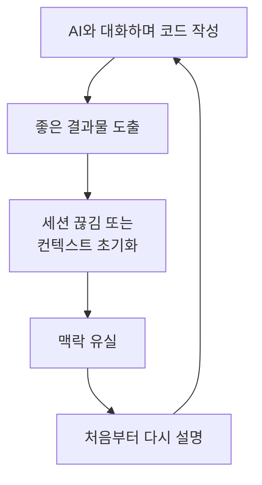
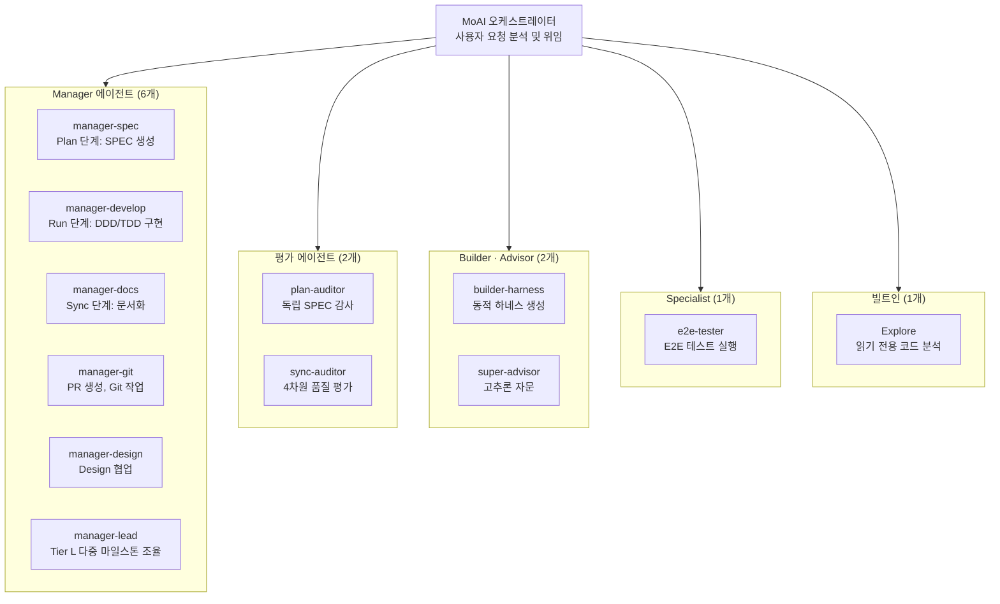
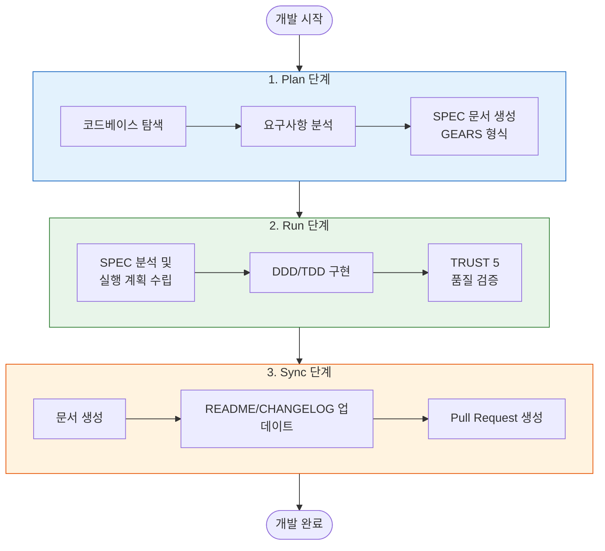
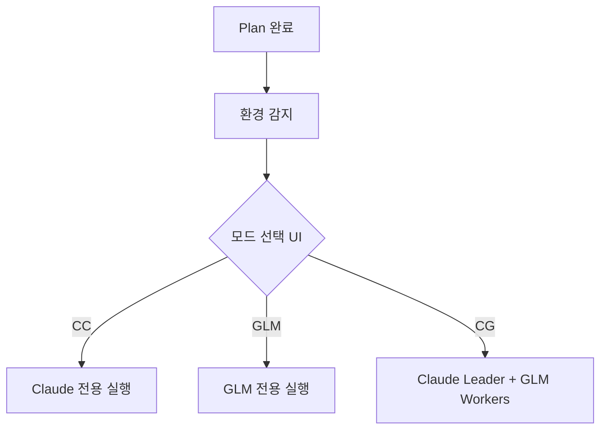

MoAI-ADK는 **비용 · 자기 개선 · 품질 통제** 세 가지로 Claude Code를 감싸는 **Agentic Development Kit**입니다. 같은 품질의 코드를 더 적은 토큰으로 뽑아내고 (비용, 토크노믹스), 세션이 한 번 돌 때마다 관찰을 규칙으로 쌓아 하네스가 점점 나아지게 하며 (자기 개선, 에이전틱 루프 엔지니어링), SPEC 3단계와 TRUST 5 게이트로 재작업을 막아 '끝'을 증거로 판정합니다 (품질 통제, 에이전틱 하네스). 모델 선택과 추론 깊이, 컨텍스트 사용량은 시스템이 바깥에서 강제합니다. 12개의 전문 AI 에이전트와 31개의 스킬이 함께 일하고, 새 프로젝트에는 TDD (기본값) 를, 테스트 커버리지가 낮은 기존 프로젝트에는 DDD를 자동으로 적용합니다.

Go로 작성된 단일 바이너리 — 의존성 없이 모든 플랫폼에서 즉시 실행됩니다.



**한 줄 요약:** MoAI-ADK는 "AI와 나눈 대화를 문서 (SPEC) 로 남기고, 안전하게 코드를 개선 (DDD/TDD) 하며, 품질을 자동 검증 (TRUST 5) 하는" 일을 — **비용·자기 개선·품질 통제 이 세 가지를 시스템이 바깥에서 강제하면서** 수행하는 에이전틱 개발 키트입니다.


## MoAI-ADK 소개

**MoAI** 는 "모두의 AI" (MoAI - Everybody's AI) 를 의미합니다. **ADK** 는 Agentic Development Kit의 약자로, AI 에이전트가 개발 과정을 주도하는 도구 모음을 뜻합니다.

MoAI-ADK는 **Claude Code 안에서 에이전트들이 서로 협력하며 에이전틱 코딩을 진행하는 개발 키트**입니다. AI 개발팀이 협업해 프로젝트를 완성하듯 각 에이전트가 자기 전문 분야의 작업을 맡습니다.

| AI 개발팀 | MoAI-ADK | 역할 |
|----------|----------|------|
| 프로덕트 오너 | 사용자 (개발자) | 무엇을 만들지 결정합니다 |
| 팀 리드 / Tech Lead | MoAI 오케스트레이터 | 전체 작업을 조율하고 12개 에이전트에게 위임합니다 |
| 기획자 / Spec Writer | manager-spec | 요구사항을 SPEC 문서로 정리합니다 |
| 개발자 / Engineers | manager-develop (도메인 컨텍스트 주입) | 실제 코드를 DDD/TDD로 구현합니다 |
| QA / 코드 리뷰어 | plan-auditor · sync-auditor | 계획과 결과물을 독립적으로 감사합니다 |

## 핵심 가치 — 세 가지 핵심

v3.0의 가치는 세 가지 핵심으로 요약됩니다.

### 토크노믹스 (Token Economics)

쓴 비용만큼의 품질을 최대로 뽑아내도록 자원을 똑똑하게 나눠 쓰는 방식입니다. 작업 단계와 SPEC 크기에 따라 모델과 추론 깊이를 선언적으로 배정하는 **3-계층 모델 정책**, Claude 리더와 GLM 워커를 조합해 구현 비용을 60-70% 줄이는 **CG 모드**, 예산 초과 전에 안전하게 멈추는 **Token Circuit Breaker**, 그리고 항시 로드 컨텍스트를 줄이는 **컨텍스트 다이어트**가 이 핵심을 이룹니다.

### 에이전틱 루프 엔지니어링 (Agentic Loop Engineering)

루프가 스스로 일하고, 그 과정에서 관찰이 쌓입니다. 완료 조건을 선언하면 조건이 충족될 때까지 세션이 계속 일하는 **goal 엔진**, 진단 도구가 찾은 이슈를 다 비울 때까지 반복 수정하는 **Ralph Engine** (`/moai loop`), 자연어 요청을 언어와 무관하게 의도 분석해 라우팅하는 **Analyze-First 라우팅**이 여기에 속합니다. 축적된 관찰은 하네스 학습의 원료가 되어, 4-계층 학습 사다리 (관찰 → 휴리스틱 → 규칙 → 자동 업데이트) 를 따라 지침이 진화합니다 — 자동 업데이트는 항상 사용자 승인 게이트 아래에서만 적용됩니다.

### 에이전틱 하네스 (Agentic Harness)

코드를 직접 쓰는 대신 에이전트가 잘 일할 환경을 설계합니다. 12개 에이전트 카탈로그, SPEC 기반 3-phase 워크플로우 (plan → run → sync), TRUST 5 품질 게이트, 자연어 요청으로 프로젝트 전용 하네스를 생성하는 Harness v4 Builder가 이 핵심입니다. 자세한 개념은 [하네스 엔지니어링](/ko/core-concepts/harness-engineering) 문서를 참조하세요.

## 왜 이 세 가지인가

비용만 깎으면 품질이 무너지고, 뒤이어 재작업과 디버깅 루프가 따라옵니다 — 그런데 모든 토큰 지출 가운데 가장 비싼 것이 바로 재작업입니다. 품질 게이트만 세우면 세션마다 같은 실수가 되풀이됩니다. 비용 상한 없이 자율 루프를 돌리면 과제 하나가 튀어 쿼터를 다 갉아먹습니다. 세 가지는 서로 맞물려 돌아갑니다 — **비용**은 **품질**이 재작업을 막아 줄 때 유지되고, **품질**은 **루프**가 잘 통한 패턴을 기억해 둘 때 강제할 수 있으며, **루프**는 **비용** 게이트가 예산을 넘기기 전에 멈춰 줄 때 적정 가격에 머뭅니다.

### 비용 — 토크노믹스

토큰 단가는 계속 내려가지만, 에이전틱 개발의 토큰 사용량은 그보다 빠르게 늘어납니다. 에이전트가 여러 개 돌고, 컨텍스트가 길어지고, 추론이 깊어질수록 비용을 결정하는 것은 모델 가격이 아니라 **토큰 운용 방식**입니다.

비용을 다루는 방법은 세 가지입니다.

1. **작업마다 맞는 모델·추론 깊이를 배정한다** — 계획은 깊게, 구현은 싸게, 검증은 독립적으로.
2. **컨텍스트를 다이어트한다** — 항시 로드되는 지침을 최소화하고, 프롬프트 캐시 적중률을 측정합니다.
3. **예산을 시스템이 지킨다** — 토큰 사용을 추적하고, 임계 초과 전에 안전하게 멈춥니다.

### 자기 개선 — 에이전틱 루프 엔지니어링

완료 조건을 선언하면 조건이 충족될 때까지 세션이 스스로 일하고 (`/moai goal`), 라우팅 결정과 게이트 증거가 관찰로 쌓여 하네스 학습의 원료가 됩니다. 관찰은 4-계층 학습 사다리 (관찰 → 휴리스틱 → 규칙 → 자동 업데이트) 를 따라 지침으로 승격되며, 자동 업데이트는 항상 사용자 승인 게이트 아래에서만 적용됩니다.

### 품질 통제 — 에이전틱 하네스

코드를 직접 쓰는 대신 에이전트가 일할 환경을 설계합니다. 12개 에이전트 카탈로그는 계획과 감사를 설계 단계부터 분리해 작성한 쪽이 자기 작업에 점수를 매기지 않게 하고, SPEC 3단계 (plan → run → sync) 와 TRUST 5 게이트, worktree 격리가 '된 것 같다'가 아니라 증거로 완료를 판정합니다.

## 왜 MoAI-ADK인가?

### Python에서 Go로의 완전 재작성

Python 기반 MoAI-ADK (~73,000줄)를 Go로 완전히 재작성했습니다.

| 항목 | Python 에디션 | Go 에디션 |
|------|-------------|----------|
| 배포 | pip + venv + 의존성 | **단일 바이너리**, 제로 의존성 |
| 시작 시간 | ~800ms 인터프리터 부팅 | **~5ms** 네이티브 실행 |
| 동시성 | asyncio / threading | **네이티브 고루틴** |
| 타입 안전성 | 런타임 (mypy 선택) | **컴파일 타임 강제** |
| 크로스 플랫폼 | Python 런타임 필요 | **사전 빌드 바이너리** (macOS, Linux, Windows) |
| Hook 실행 | Shell 래퍼 + Python | **컴파일된 바이너리**, JSON 프로토콜 |

### 핵심 수치 (v3.0 기준)

- **12개** 에이전트 카탈로그 (11 MoAI 커스텀 + 1 Anthropic 빌트인 `Explore`)
- **31개** 스킬 (template-managed)
- **36개** CLI 명령 · **16종** `/moai` 서브커맨드
- **16개** 프로그래밍 언어 지원
- **3단계 하네스** (minimal / standard / thorough) — SPEC 복잡도에 따른 적응형 품질 게이트
- **SPEC 기반 워크플로우** (plan → run → sync) 로 개발된 코드베이스

### 바이브코딩의 문제점

**바이브코딩** (Vibe Coding) 이란 AI와 자연스럽게 대화하며 코드를 작성하는 방식입니다. "이런 기능 만들어줘"라고 말하면 AI가 코드를 생성합니다. 직관적이고 빠르지만 실무에서는 심각한 문제가 생깁니다.


```mermaid
flowchart TD
    A["AI와 대화하며 코드 작성"] --> B["좋은 결과물 도출"]
    B --> C["세션 끊김 또는\n컨텍스트 초기화"]
    C --> D["맥락 유실"]
    D --> E["처음부터 다시 설명"]
    E --> A
```

**실무에서 겪는 구체적인 문제들:**

| 문제 | 상황 예시 | 결과 |
|------|----------|------|
| **맥락 유실** | 어제 1시간 동안 논의한 인증 방식을 오늘 다시 설명해야 함 | 시간 낭비, 일관성 저하 |
| **품질 불일치** | AI가 때로는 좋은 코드를, 때로는 나쁜 코드를 생성 | 코드 품질 예측 불가 |
| **기존 코드 파괴** | "이 부분 고쳐줘"라고 했더니 다른 기능이 망가짐 | 버그 발생, 롤백 필요 |
| **반복 설명** | 프로젝트 구조, 코딩 규칙을 매번 다시 알려줘야 함 | 생산성 저하 |
| **검증 부재** | AI가 생성한 코드가 안전한지 확인할 방법이 없음 | 보안 취약점, 테스트 미비 |
| **토큰 낭비** | 모든 작업을 같은 모델·같은 추론 깊이로 처리 | 비용 예측 불가, 예산 초과 |

### MoAI-ADK의 해결책

| 문제 | MoAI-ADK의 해결책 |
|------|------------------|
| 맥락 유실 | **SPEC 문서** 로 요구사항을 파일로 영구 보존 |
| 품질 불일치 | **TRUST 5** 프레임워크로 일관된 품질 기준 적용 |
| 기존 코드 파괴 | **DDD/TDD** 로 테스트를 먼저 작성하여 기존 기능 보호 |
| 반복 설명 | **CLAUDE.md와 스킬 시스템** 으로 프로젝트 컨텍스트 자동 로드 |
| 검증 부재 | **LSP 품질 게이트** 로 코드 품질 자동 검증 |
| 토큰 낭비 | **모델 정책 + Token Circuit Breaker** 로 비용을 시스템이 관리 |

## 시스템 요구사항

| 플랫폼 | 지원 환경 | 비고 |
|--------|---------|------|
| macOS | Terminal, iTerm2 | 완전 지원 |
| Linux | Bash, Zsh | 완전 지원 |
| Windows | **WSL (권장)**, PowerShell 7.x+ | 네이티브 cmd.exe는 지원하지 않음 |

**필수 조건:**
- 모든 플랫폼에 **Git** 설치 필요
- **Windows 사용자**: [Git for Windows](https://gitforwindows.org/) **필수** (Git Bash 포함)
  - 최상의 경험을 위해 **WSL** (Windows Subsystem for Linux) 사용 권장
  - PowerShell 7.x 이상은 대안으로 지원
  - 레거시 Windows PowerShell 5.x와 cmd.exe는 **지원하지 않음**

## 빠른 시작

### 1. 설치

#### macOS / Linux / WSL

```bash
curl -fsSL https://adk.mo.ai.kr/install.sh | bash
```

#### Windows (PowerShell 7.x+)

> **권장**: 위의 Linux 설치 명령어로 WSL을 사용하면 최상의 경험을 제공합니다.

```powershell
irm https://adk.mo.ai.kr/install.ps1 | iex
```

> [Git for Windows](https://gitforwindows.org/)가 먼저 설치되어 있어야 합니다.

#### 소스에서 빌드 (Go 1.26+)

```bash
git clone https://github.com/modu-ai/moai-adk.git
cd moai-adk && make build
```

> 사전 빌드된 바이너리는 [Releases](https://github.com/modu-ai/moai-adk/releases) 페이지에서 다운로드할 수 있습니다.

### 2. 프로젝트 초기화

```bash
moai init my-project
```

대화형 마법사가 언어, 프레임워크, 방법론을 자동 감지한 후 Claude Code 통합 파일을 생성합니다.

### 3. Claude Code에서 개발 시작

```bash
# Claude Code 실행 후
/moai project                            # 프로젝트 문서 생성 (product.md, structure.md, tech.md)
/moai plan "사용자 인증 추가"              # SPEC 문서 생성
/moai run SPEC-AUTH-001                   # DDD/TDD 구현
/moai sync SPEC-AUTH-001                  # 문서 동기화 및 PR 생성
```

자연어로 바로 요청해도 됩니다 — `/moai "로그인 버그 고쳐줘"`는 **Analyze-First** 의도 분석을 거쳐 알맞은 워크플로우로 라우팅됩니다.

## 핵심 철학


**"바이브코딩의 목적은 빠른 생산성이 아니라 코드 품질이다."**

MoAI-ADK는 빠르게 코드를 찍어내는 도구가 아닙니다. AI를 활용하되, 사람이 직접 작성한 것보다 **더 높은 품질**의 코드를 만드는 것이 목표입니다. 빠른 속도는 품질을 지키면서 자연스럽게 따라오는 부수적인 효과입니다.


이 철학은 세 가지 원칙으로 구체화됩니다:

1. **명세 우선** (SPEC-First): 코드를 작성하기 전에 무엇을 만들지 문서로 명확히 정의합니다
2. **안전한 개선** (DDD/TDD): 기존 코드의 동작을 보존하면서 점진적으로 개선합니다
3. **자동 품질 검증** (TRUST 5): 5가지 품질 원칙으로 모든 코드를 자동 검증합니다

## MoAI 개발 방법론

MoAI-ADK는 프로젝트 상태에 따라 최적의 개발 방법론을 자동으로 선택합니다.

### TDD 방법론 (기본값)

새 프로젝트와 신규 기능 개발의 기본 방법론입니다. 테스트를 먼저 쓰고 그 테스트를 통과시키는 순서로 진행하기 때문에, 만들려는 동작이 코드보다 먼저 확정됩니다. MoAI-ADK가 이 방식을 기본값으로 두는 이유는 "다 됐다"를 사람의 감이 아니라 테스트 결과로 판정하기 위해서입니다. 사이클의 각 단계와 브라운필드 프로젝트용 pre-RED 분석 단계는 [SPEC 기반 개발](/ko/core-concepts/spec-based-dev)에서 다룹니다.

### DDD 방법론 (기존 프로젝트, 10% 미만 커버리지)

테스트가 거의 없는 기존 코드를 안전하게 손보기 위한 방법론입니다. 개선에 앞서 현재 동작을 특성화 테스트로 붙잡아 두므로, 리팩토링이 기존 기능을 조용히 망가뜨리는 사고를 막을 수 있습니다. MoAI-ADK가 커버리지 10% 미만 프로젝트에 이 방식을 배정하는 이유가 여기에 있습니다. 단계별 절차는 [DDD](/ko/core-concepts/ddd)에서 다룹니다.


방법론은 `moai init` 시 자동 선택되며 (`--mode <ddd|tdd>`, 기본값: tdd), `.moai/config/sections/quality.yaml`의 `development_mode`에서 변경할 수 있습니다.

**참고**: MoAI-ADK v2.5.0+에서는 이진 방법론 선택 (TDD 또는 DDD만) 을 사용합니다. 하이브리드 모드는 명확성과 일관성을 위해 제거되었습니다.


## 하네스 엔지니어링 아키텍처

MoAI-ADK는 **하네스 엔지니어링** (Harness Engineering) 패러다임을 구현합니다 — 직접 코드를 작성하는 것이 아니라, AI 에이전트가 일할 환경을 설계하는 접근입니다.

| 구성 요소 | 설명 | 명령어 |
|----------|------|--------|
| **Self-Verify Loop** | 에이전트가 코드 작성 → 테스트 → 실패 → 수정 → 통과 사이클을 자율적으로 수행 | `/moai loop` |
| **Goal 엔진** | 완료 조건을 선언하면 조건 충족 또는 턴 한도까지 세션이 스스로 계속 일함 | `/moai goal` |
| **Context Map** | 코드베이스 아키텍처 맵과 문서가 에이전트에 항상 제공 | `/moai codemaps` |
| **Session Persistence** | `progress.md`가 완료된 단계를 세션 간 추적; 중단된 실행이 자동으로 재개 | `/moai run SPEC-XXX` |
| **Failing Checklist** | 모든 인수 기준이 실행 시작 시 대기 작업으로 등록; 구현 완료 시 완료 표시 | `/moai run SPEC-XXX` |
| **Language-Agnostic** | 16개 언어 지원: 언어 자동 감지, 올바른 LSP/린터/테스트/커버리지 도구 선택 | 모든 워크플로우 |
| **Garbage Collection** | 죽은 코드, AI Slop, 미사용 import의 주기적 스캔 및 제거 | `/moai clean` |
| **Scaffolding First** | 구현 전에 빈 파일 스텁 생성하여 엔트로피 방지 | `/moai run SPEC-XXX` |


"사람이 방향을 잡고, 에이전트가 실행한다." — 엔지니어의 역할이 코드 작성에서 하네스 설계 (SPEC, 품질 게이트, 피드백 루프) 로 전환됩니다. 개념 전체는 [하네스 엔지니어링](/ko/core-concepts/harness-engineering) 문서에서 다룹니다.


## AI 에이전트 오케스트레이션

MoAI는 **전략적 오케스트레이터**입니다. 직접 코드를 쓰지 않고 12개 에이전트 (11 MoAI 커스텀 + 1 Anthropic 빌트인 `Explore`) 에 작업을 넘깁니다. 핵심 설계 원칙은 **계획과 감사의 분리** — 만든 쪽이 검사하지 않습니다.

### 12개 에이전트 카탈로그

| 분류 | 에이전트 | 비용 | 역할 |
|------|---------|------|------|
| **Manager** | manager-spec | 🔴 | Plan 단계: SPEC 문서 생성 |
| | manager-develop | 🔴 | Run 단계: DDD/TDD/autofix 구현 |
| | manager-docs | 🔵 | Sync 단계: 문서화 및 PR 생성 |
| | manager-git | 🩵 | Git 워크플로우 및 Tier 기반 PR 라우팅 |
| | manager-design | 🟠 | Design 단계: Claude Design 협업 |
| | manager-lead | ⚪ | Tier L 다중 마일스톤 조율 (worktree 격리 leaf-worker 팬아웃 · 카탈로그 유일 Agent-carrier) |
| **Evaluator** | plan-auditor | 🔴 | SPEC 계획의 독립적 감사 (편향 방지) |
| | sync-auditor | 🔴 | 4차원 품질 평가 (기능 40 · 보안 25 · 장인정신 20 · 일관성 15) |
| **Builder** | builder-harness | 🟠 | 프로젝트 전용 하네스 (에이전트/스킬/커맨드) 생성 |
| **Advisor** | super-advisor | 🔵 | 고추론 자문 (E1-E4 에스컬레이션) |
| **Specialist** | e2e-tester | 🟠 | 웹/모바일/데스크탑 E2E 테스트 실행 |
| **빌트인** | Explore | ⚪ | 읽기 전용 코드베이스 탐색 |

비용 색상은 기본 `medium` 프로파일의 model×effort 셀 기준입니다 (`moai model profile`로 확인): 🔴 opus+high · 🟠 opus+medium · 🔵 opus+low · 🩵 sonnet+low · ⚪ 세션 모델 상속 (`manager-lead` `model: inherit`, 사용자 추가 에이전트). 프로파일 (`high`/`low`) 전환 시 배정이 달라집니다.


```mermaid
flowchart TD
    MoAI["MoAI 오케스트레이터\n사용자 요청 분석 및 위임"]

    subgraph Managers["Manager 에이전트 (6개)"]
        M1["manager-spec\nPlan 단계: SPEC 생성"]
        M2["manager-develop\nRun 단계: DDD/TDD 구현"]
        M3["manager-docs\nSync 단계: 문서화"]
        M4["manager-git\nPR 생성, Git 작업"]
        M5["manager-design\nDesign 협업"]
        M6["manager-lead\nTier L 다중 마일스톤 조율"]
    end

    subgraph Evaluators["평가 에이전트 (2개)"]
        E1["plan-auditor\n독립 SPEC 감사"]
        E2["sync-auditor\n4차원 품질 평가"]
    end

    subgraph BuilderAdvisor["Builder · Advisor (2개)"]
        B1["builder-harness\n동적 하네스 생성"]
        B2["super-advisor\n고추론 자문"]
    end

    subgraph Specialist["Specialist (1개)"]
        S1["e2e-tester\nE2E 테스트 실행"]
    end

    subgraph Explore["빌트인 (1개)"]
        X1["Explore\n읽기 전용 코드 분석"]
    end

    MoAI --> Managers
    MoAI --> Evaluators
    MoAI --> BuilderAdvisor
    MoAI --> Specialist
    MoAI --> Explore
```

### 31개 스킬 (Progressive Disclosure)

3레벨 Progressive Disclosure 시스템으로 토큰을 아껴 씁니다. 스킬 설명 (~100 토큰) 만 항상 목록에 떠 있고, 본문 (~5K 토큰) 은 실제로 호출할 때만 읽어 들입니다. 컨텍스트 다이어트의 핵심 수단 가운데 하나입니다.

| 카테고리 | 예시 |
|----------|------|
| **Foundation** | core, cc, thinking, quality |
| **Workflow** | spec, project, ddd, tdd, testing, worktree, loop, ci-loop |
| **Domain** | backend, frontend, database, html-report, humanize |
| **Reference** | api-patterns, owasp-checklist, git-workflow, react-patterns, testing-pyramid, llm-security, secops, supply-chain |
| **Harness** | harness-learner, meta-harness |

## MoAI 워크플로우

### Plan → Run → Sync 파이프라인

MoAI의 핵심 워크플로우는 3단계로 구성됩니다:


```mermaid
flowchart TD
    Start(["개발 시작"]) --> Plan

    subgraph Plan["1. Plan 단계"]
        P1["코드베이스 탐색"] --> P2["요구사항 분석"]
        P2 --> P3["SPEC 문서 생성\nGEARS 형식"]
    end

    Plan --> Run

    subgraph Run["2. Run 단계"]
        R1["SPEC 분석 및\n실행 계획 수립"] --> R2["DDD/TDD 구현"]
        R2 --> R3["TRUST 5\n품질 검증"]
    end

    Run --> Sync

    subgraph Sync["3. Sync 단계"]
        S1["문서 생성"] --> S2["README/CHANGELOG 업데이트"]
        S2 --> S3["Pull Request 생성"]
    end

    Sync --> Done(["개발 완료"])

    style Plan fill:#E3F2FD,stroke:#1565C0
    style Run fill:#E8F5E9,stroke:#2E7D32
    style Sync fill:#FFF3E0,stroke:#E65100
```

Plan 단계 산출물은 **plan-auditor**가 독립 감사하고, Run 단계 진입 직전에는 **구현 착수 승인** (휴먼 게이트) 을 거칩니다. Sync 단계가 끝나면 **sync-auditor**가 4차원 품질 평가를 수행합니다. "된 것 같다"가 아니라 증거로 완료를 판정합니다.

**실제 사용 예시:**

```bash
# 1. Plan: 요구사항 정의
> /moai plan "JWT 기반 사용자 인증 기능 구현"

# 2. Run: DDD/TDD 방식으로 구현
> /moai run SPEC-AUTH-001

# 3. Sync: 문서 생성 및 PR
> /moai sync SPEC-AUTH-001
```

#### 실행 모드 선택 게이트

Plan 단계에서 Run 단계로 전환할 때, MoAI는 자동으로 현재 실행 환경 (cc/glm/cg) 을 감지하고 사용자가 확인하거나 변경할 수 있는 선택 UI를 표시합니다.


```mermaid
flowchart TD
    A["Plan 완료"] --> B["환경 감지"]
    B --> C{"모드 선택 UI"}
    C -->|"CC"| D["Claude 전용 실행"]
    C -->|"GLM"| E["GLM 전용 실행"]
    C -->|"CG"| F["Claude Leader + GLM Workers"]
```

이 게이트 덕분에 환경 상태와 관계없이 언제나 올바른 실행 모드로 시작하게 되고, 구현 도중 모드가 어긋나는 일도 막을 수 있습니다.

### /moai 서브커맨드

모든 서브커맨드는 Claude Code 내에서 `/moai <서브커맨드>`로 실행합니다.

#### 핵심 워크플로우

| 서브커맨드 | 별칭 | 용도 | 주요 플래그 |
|-----------|------|------|-----------|
| `plan` | `spec` | SPEC 문서 생성 (GEARS 형식) | `--branch`, `--resume SPEC-XXX` |
| `run` | `impl` | SPEC의 DDD/TDD 구현 | `--resume SPEC-XXX` |
| `sync` | `docs`, `pr` | 문서 동기화, 코드맵, PR 생성 | `--merge`, `--skip-mx` |

#### 에이전틱 루프

| 서브커맨드 | 용도 | 주요 플래그 |
|-----------|------|-----------|
| `goal` | 완료 조건 선언형 자율 연속 루프 (조건 충족 또는 턴 한도까지) | `status`, `clear` |
| `loop` | 진단 기반 반복 자동 수정 (goal 엔진 위의 프리셋, 기본 최대 10회) | `--max N`, `--auto-fix`, `--seq` |
| `fix` | LSP 오류, 린트, 타입 오류 자동 수정 (단일 패스) | `--dry`, `--seq`, `--level N`, `--resume` |

#### 품질 및 코드베이스

| 서브커맨드 | 별칭 | 용도 | 주요 플래그 |
|-----------|------|------|-----------|
| `review` | `code-review` | 보안 및 @MX 태그 준수 코드 리뷰 | `--staged`, `--branch`, `--security` |
| `gate` | -- | 커밋 전 품질 게이트 (lint/format/type/test 병렬) | -- |
| `clean` | `refactor-clean` | 죽은 코드 식별 및 안전 제거 | `--dry`, `--safe-only`, `--file PATH` |
| `mx` | -- | 코드베이스 스캔 및 @MX 코드 수준 주석 추가 | `--all`, `--dry`, `--priority P1-P4`, `--force` |
| `codemaps` | `update-codemaps` | 아키텍처 문서 생성 | `--force`, `--area AREA` |
| `e2e` | -- | 웹/모바일/데스크탑 E2E 테스트 실행 및 아티팩트 관리 | -- |

#### 프로젝트 및 하네스

| 서브커맨드 | 별칭 | 용도 |
|-----------|------|------|
| `project` | `init` | 프로젝트 문서 생성 (product.md, structure.md, tech.md, codemaps/) + 하네스 자동 구성 |
| `harness` | -- | 하네스 학습 라이프사이클 관리 · 자연어로 하네스 생성 |
| `feedback` | `fb`, `bug`, `issue` | 피드백 수집 및 GitHub 이슈 생성 |

#### 기본 워크플로우 (자연어)

| 서브커맨드 | 용도 | 주요 플래그 |
|-----------|------|-----------|
| *(없음)* | Analyze-First 의도 분석 → 전체 자율 plan → run → sync 파이프라인. 복잡도 점수 >= 5일 때 SPEC 자동 생성. | `--loop`, `--max N`, `--branch`, `--pr`, `--resume SPEC-XXX` |

### 오케스트레이션 모드

MoAI 오케스트레이터는 작업 복잡도를 분석해 실행 형태를 선택합니다.

| 모드 | 형태 | 적합한 작업 |
|------|------|-----------|
| **순차 서브에이전트** (기본) | 단계별 단일 에이전트 위임 | 코딩 중심 작업, 예측 가능한 워크플로우 |
| **병렬 서브에이전트** | 3-5개 읽기 전용 에이전트 동시 팬아웃 | 조사·리뷰·감사 등 병렬 분석 |
| **동적 워크플로우** | 스크립트가 다수 에이전트를 오케스트레이션 | 대규모 스윕, 교차 검증 리서치 |


**v3.0 변경**: 과거의 Agent Teams 정적 오케스트레이션 계층은 폐지됐습니다. `--team`을 강제해도 서브에이전트 모드로 폴백합니다. 다만 Claude Code의 네이티브 teammate 런타임(`moai cg`의 tmux 분할 창)은 그대로 유지됩니다. 팀 모드 품질 훅 (TeammateIdle의 LSP 게이트 검증, TaskCompleted의 SPEC 참조 확인) 도 native teammate 런타임과 함께 보존됩니다.


### CG 모드 (Claude + GLM 하이브리드)

토크노믹스(비용) 핵심의 실전 도구입니다. Leader가 **Claude API**를, Workers가 **GLM API**를 사용하는 하이브리드 모드로, tmux 세션 수준 환경 변수 격리로 구현됩니다. 전략·계획·감사는 Claude가, 대량 구현은 GLM이 맡아 구현 중심 작업에서 60-70% 비용을 절감합니다.

```
┌─────────────────────────────────────────────────────────────┐
│  LEADER (현재 tmux 패인, Claude API)                         │
│  - moai cg 활성화 후 /moai 명령으로 오케스트레이션            │
│  - plan, quality, sync 단계 처리                             │
│  - GLM 환경 없음 → Claude API 사용                           │
└──────────────────────┬──────────────────────────────────────┘
                       │ Agent Teams (새 tmux 패인)
                       ▼
┌─────────────────────────────────────────────────────────────┐
│  TEAMMATES (새 tmux 패인, GLM API)                           │
│  - tmux 세션 환경 상속 → GLM API 사용                        │
│  - run 단계에서 구현 작업 실행                                │
│  - SendMessage로 리더와 통신                                  │
└─────────────────────────────────────────────────────────────┘
```

```bash
# 1. GLM API 키 저장 (한 번만)
moai glm setup sk-your-glm-api-key

# 2. CG 모드 활성화 (tmux 세션 안에서 실행 — Claude Code가 자동 시작)
moai cg

# 3. 워크플로우 실행
/moai "작업 설명"
```

| 명령어 | Leader | Workers | tmux 필요 | 비용 절감 | 사용 사례 |
|--------|--------|---------|----------|----------|----------|
| `moai cc` | Claude | Claude | 아니요 | - | 복잡한 작업, 최고 품질 |
| `moai glm` | GLM | GLM | 권장 | ~70% | 비용 최적화 |
| `moai cg` | Claude | GLM | **필수** | **~60%** | 품질 + 비용 균형 |

### 자율 개발 루프 (Ralph Engine)

LSP 진단과 AST-grep을 결합한 자율 오류 수정 엔진입니다:

```bash
/moai fix       # 단일 패스: 스캔 → 분류 → 수정 → 검증
/moai loop      # 반복 수정: 완료 조건 충족까지 반복 (기본 최대 10회)
```

**Ralph Engine 작동 방식:**
1. **병렬 스캔**: LSP 진단 + AST-grep + 린터를 동시에 실행
2. **자동 분류**: 레벨 1 (자동 수정) 부터 레벨 4 (사용자 개입) 까지 오류 분류
3. **수렴 감지**: 동일한 오류가 반복되면 대안 전략 적용
4. **완료 기준**: 0 오류, 0 타입 오류, 85%+ 커버리지

완료 조건을 직접 선언하고 싶다면 goal 엔진을 사용합니다:

```text
/moai goal "go test ./... exits 0; 모든 AC가 PASS로 기록"
/moai goal status
/moai goal clear
```

`/moai loop`는 goal 엔진 위의 프리셋입니다 — 진단 도구가 찾은 이슈 큐를 다 비울 때까지 반복 수정합니다.

### 추천 워크플로우 체인

**새 기능 개발:**
```
/moai plan → /moai run SPEC-XXX → /moai sync SPEC-XXX
```

**버그 수정:**
```
/moai fix (또는 /moai loop) → /moai review → /moai sync
```

**리팩토링:**
```
/moai plan → /moai clean → /moai run SPEC-XXX → /moai review → /moai codemaps
```

**문서 업데이트:**
```
/moai codemaps → /moai sync
```

## TRUST 5 품질 프레임워크

모든 코드 변경은 Tested · Readable · Unified · Secured · Trackable 다섯 가지 기준으로 검증됩니다. 리뷰어의 취향이 아니라 매번 같은 잣대를 코드에 대는 것이 목적이며, 각 기준마다 커버리지 · 린트 · 포맷 · 보안 스캔 · 커밋 규약처럼 기계가 판정할 수 있는 검사가 붙습니다. 기준별 세부 검증 항목은 [TRUST 5](/ko/core-concepts/trust-5)에서 다룹니다.

## @MX 태그 시스템

MoAI-ADK는 AI 에이전트 간 컨텍스트, 불변량, 위험 영역을 전달하기 위해 **@MX 코드 수준 주석 시스템**을 사용합니다.

| 태그 유형 | 용도 | 추가 시점 |
|----------|------|----------|
| `@MX:ANCHOR` | 중요 계약 | fan_in >= 3인 함수, 변경 시 영향 범위가 넓음 |
| `@MX:WARN` | 위험 영역 | 고루틴, 복잡도 >= 15, 전역 상태 변이 |
| `@MX:NOTE` | 컨텍스트 전달 | 매직 상수, 문서 누락, 비즈니스 규칙 |
| `@MX:TODO` | 미완료 작업 | 테스트 누락, 미구현 기능 |

@MX 태그 시스템은 **가장 위험하고 중요한 코드만 표시**하도록 설계했습니다. 대부분의 코드에는 태그가 필요 없고, 그게 정상입니다.

```bash
# 전체 코드베이스 스캔
/moai mx --all

# 미리보기 (파일 수정 없음)
/moai mx --dry

# 우선순위별 스캔
/moai mx --priority P1
```

## 모델 정책 (토크노믹스의 핵심)

MoAI-ADK는 에이전트마다 가장 알맞은 모델과 추론 깊이를 배정합니다. 요금제의 사용량 제한 안에서 품질을 최대로 끌어올리는 것이 목표입니다. 그래서 더 약한 모델 클래스로 갈아타는 대신, 각 에이전트를 Opus 추론 깊이 래더 안에서 위아래로 옮깁니다 — 장기 에이전틱 작업에서는 약한 모델이 스텝을 더 많이 소모해 작업당 비용이 오히려 올라가기 때문입니다.

| 정책 | 특징 |
|------|------|
| **high** | 최고 품질 — 호출 빈도가 가장 낮은 두 에이전트에 `max` 추론 깊이 |
| **medium** (기본) | 품질과 비용의 균형 |
| **low** | 작업당 최저 비용 — 에이전틱 에이전트는 Opus `low` effort로 내려가고, Sonnet은 단발 행에만 |

### 설정 방법

```bash
# 프로젝트 초기화 시
moai init my-project          # 대화형 마법사에서 모델 정책 선택

# 기존 프로젝트 재설정
moai update                   # 각 설정 단계에 대한 대화형 프롬프트
```


기본 정책은 `medium`입니다. GLM 설정은 `settings.local.json`에 격리됩니다 (Git에 커밋되지 않음). 설정 키는 `llm.yaml`의 `profile: high | medium | low`(프로필 매트릭스 열)이며, legacy `performance_tier` 필드가 `profile` 부재 시 별칭으로 읽힙니다 (`--high`/`--low`는 각각 `--model-policy high`/`low`의 deprecated 별칭). `--profile high|medium|low` 플래그로 직접 지정할 수 있으며, legacy `max` 값도 입력으로 받아 `high`로 정규화됩니다.


## Task 메트릭 로깅

MoAI-ADK는 개발 세션 중 Task 도구 메트릭을 자동으로 캡처합니다:

- **위치**: `.moai/logs/task-metrics.jsonl`
- **캡처 메트릭**: 토큰 사용량, 도구 호출, 소요 시간, 에이전트 타입
- **목적**: 세션 분석, 성능 최적화, 비용 추적

Task 도구가 끝나면 PostToolUse 훅이 메트릭을 남깁니다. 이 데이터로 에이전트 효율을 분석하고 토큰 소비를 줄여 보세요. 토크노믹스는 측정에서 시작합니다.

## 프로젝트 구조

MoAI-ADK를 설치하면 프로젝트에 다음과 같은 구조가 생성됩니다.

```
my-project/
├── CLAUDE.md                  # MoAI의 실행 지침서
├── .claude/
│   ├── agents/moai/           # 10개 MoAI 커스텀 에이전트 정의 (+ Explore 빌트인)
│   ├── skills/moai-*/         # 31개 스킬 모듈
│   ├── hooks/moai/            # 자동화 훅 스크립트
│   └── rules/moai/            # 코딩 규칙 및 표준
└── .moai/
    ├── config/                # MoAI 설정 파일
    │   └── sections/
    │       └── quality.yaml   # TRUST 5 품질 설정
    ├── specs/                 # SPEC 문서 저장소
    │   └── SPEC-XXX/
    │       └── spec.md
    └── memory/                # 세션 간 컨텍스트 유지
```

**주요 파일 설명:**

| 파일/디렉토리 | 역할 |
|--------------|------|
| `CLAUDE.md` | MoAI가 읽는 실행 지침서. 프로젝트 규칙, 에이전트 카탈로그, 워크플로우 정의가 담겨 있습니다 |
| `.claude/agents/` | 각 에이전트의 전문 분야와 도구 권한을 정의합니다 |
| `.claude/skills/` | 프로그래밍 언어, 플랫폼별 모범 사례를 담은 지식 모듈입니다 |
| `.moai/specs/` | SPEC 문서를 모아 두는 곳입니다. 기능마다 별도 디렉토리가 하나씩 생깁니다 |
| `.moai/config/` | TRUST 5 품질 기준, DDD/TDD 설정 등 프로젝트 설정을 관리합니다 |

## 다국어 지원

MoAI-ADK는 4개 언어를 지원합니다. 사용자가 한국어로 요청하면 한국어로 응답하고, 영어로 요청하면 영어로 응답합니다.

| 언어 | 코드 | 지원 범위 |
|------|------|----------|
| 한국어 | ko | 대화, 문서, 명령어, 오류 메시지 |
| 영어 | en | 대화, 문서, 명령어, 오류 메시지 |
| 일본어 | ja | 대화, 문서, 명령어, 오류 메시지 |
| 중국어 | zh | 대화, 문서, 명령어, 오류 메시지 |


**언어 설정:** `.moai/config/sections/language.yaml`에서 대화 언어, 코드 주석 언어, 커밋 메시지 언어를 각각 설정할 수 있습니다. 예를 들어, 대화는 한국어로 하되 코드 주석과 커밋 메시지는 영어로 작성하도록 설정할 수 있습니다.


## 다음 단계

MoAI-ADK의 전체 그림을 이해했다면, 이제 각 핵심 개념을 자세히 알아볼 차례입니다.

- [하네스 엔지니어링](/ko/core-concepts/harness-engineering) -- 에이전트가 일할 환경을 설계하는 패러다임을 배웁니다
- [SPEC 기반 개발](/ko/core-concepts/spec-based-dev) -- 요구사항을 어떻게 문서로 정의하는지 배웁니다
- [도메인 주도 개발](/ko/core-concepts/ddd) -- 기존 코드를 안전하게 개선하는 방법을 배웁니다
- [TRUST 5 품질](/ko/core-concepts/trust-5) -- 코드 품질을 자동으로 검증하는 방법을 배웁니다
- [MoAI Memory](/ko/claude-code/context-memory/memory) -- 세션 간 컨텍스트가 어떻게 보존되는지 배웁니다
