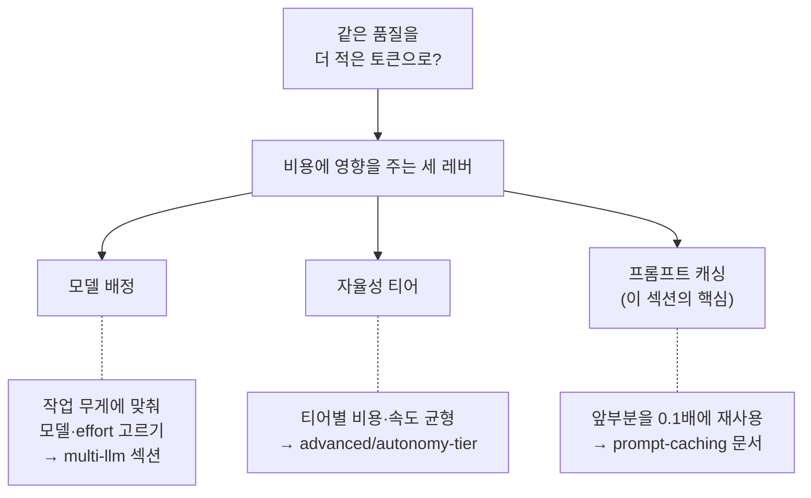

 <strong>소속 가치</strong>: 토크노믹스

<!-- @value: tokenomics -->

비용 최적화 섹션은 "결과 하나를 얻는 데 쓰는 토큰을 어떻게 줄일까"라는 질문에 답하는 문서들을 모아 둔 곳입니다. 모델이 매 턴 대화 전체를 처음부터 다시 읽는 구조이기 때문에, 같은 품질의 코드를 더 싼값에 얻으려면 어디를 아껴야 하는지를 가르는 기준이 필요합니다. 이 섹션은 그 기준 가운데 **프롬프트 캐싱** (prompt caching) — 직전에 처리한 앞부분을 싼값에 다시 쓰기 — 에 집중하고, 비용에 영향을 주는 나머지 레버는 관련 문서로 이어 줍니다.


**한 줄 요약** — 비용에 직접 영향을 주는 레버는 크게 세 가지입니다: (1) 작업에 알맞은 모델·effort 고르기, (2) 자율성 티어로 비용·속도 균형 잡기, (3) 프롬프트 캐싱으로 앞부분 재사용하기. 이 섹션은 세 번째를 깊게 다룹니다.


## 토크노믹스에서 비용 축이란

MoAI-ADK v3.0의 세 가지 핵심 가운데 비용을 맡은 영역이 **토크노믹스** (tokenomics, token economics)입니다. 한마디로 "똑같은 품질을 더 적은 토큰으로"입니다. 모델 단가가 해마다 내려가도, 에이전트가 여럿 돌고 컨텍스트가 길어지면 한 세션이 쓰는 토큰은 가파르게 늘어납니다. 그래서 비용을 가르는 것은 단가표가 아니라 "토큰을 어떻게 굴리느냐"이고, 이 섹션은 그 가운데서도 **재사용** 쪽을 맡습니다.

아래 표는 비용에 직접 영향을 주는 대표적인 세 레버와, 각 레버를 깊게 다루는 문서를 짝지은 것입니다. 토크노믹스 전체 구조(계측·라우팅·다이어트·예산 가드)가 궁금하다면 [토크노믹스 개요](/ko/advanced/tokenomics-overview)에서, 이 섹션이 맡은 캐싱은 아래 문서에서 다룹니다.

| 레버 | 하는 일 | 대표 문서 |
|------|--------|----------|
| **모델 배정** | 작업의 무게에 맞춰 알맞은 모델·effort를 고른다 | [모델 정책](/ko/multi-llm/model-policy) · [CG 모드](/ko/multi-llm/cg-mode) |
| **자율성 티어** | 티어마다 비용·속도 균형점을 다르게 잡는다 (`MOAI_AUTONOMY_TIER`) | [자율성 티어](/ko/advanced/autonomy-tier) |
| **프롬프트 캐싱** | 직전 요청과 같은 앞부분을 캐시에서 싼값에 읽는다 (이 섹션) | [프롬프트 캐싱](/ko/cost-optimization/prompt-caching) |

## 이 섹션이 집중하는 것: 프롬프트 캐싱

세 레버 가운데 이 섹션이 깊게 다루는 것은 **프롬프트 캐싱**입니다. 모델은 턴마다 시스템 프롬프트·프로젝트 규칙·도구 정의·대화 이력을 처음부터 다시 보내는데, 직전 요청과 앞부분이 똑같으면 그 부분을 다시 계산하지 않고 캐시에서 가져다 씁니다. 캐시에서 읽은 토큰은 기본 입력 단가의 **0.1배**로 청구되므로, 반복되는 컨텍스트가 클수록 절감 폭도 커집니다.

핵심은 손익분기가 **요청 2개**라는 점입니다. 첫 요청에서 캐시를 기록할 때 1.25배 (5분 TTL)의 프리미엄을 내지만, TTL 안에 두 번째 요청이 0.1배로 읽히면 그 프리미엄이 바로 회수됩니다. 그래서 비용의 분기점은 "캐싱을 언제 켤까"가 아니라 "캐시를 언제 무효화하는가"에 달려 있습니다 — 모델 전환이나 `/compact` 같은 행동이 앞부분을 바꾸면 캐시가 깨지고, 그 지점부터는 다시 정가로 계산합니다.


**비유로 이해하기** — 모델은 매번 대화 처음부터 다시 읽는 버릇이 있습니다. 캐싱은 "앞부분은 아까 읽은 그대로네요" 하고 건너뛰는 책갈피입니다. 앞부분이 한 글자라도 바뀌면 책갈피가 무효가 되어 그 지점부터 다시 읽습니다.


## 다른 페이지의 프롬프트 캐싱과 다른 점

프롬프트 캐싱을 다루는 문서는 사이트에 두 개입니다. 같은 메커니즘을 다른 관점에서 풀어놓은 것이므로, 궁금한 것이 무엇이냐에 따라 시작 문서를 고르면 됩니다.

| 문서 | 관점 | 언제 읽나 |
|------|------|-----------|
| [이 섹션: 프롬프트 캐싱](/ko/cost-optimization/prompt-caching) | **비용** — 손익분기, 가격 배수, 캐시가 언제 유지되고 언제 무효화되는가 | 절감 효과와 캐시 무효화 행동이 궁금할 때 |
| [Claude Code: 프롬프트 캐싱](/ko/claude-code/context-memory/prompt-caching) | **컨텍스트** — 매 턴 어떻게 앞부분을 재사용하여 지연을 줄이는가 | Claude Code가 턴마다 컨텍스트를 어떻게 처리하는지가 궁금할 때 |

비용이 주 관심사라면 이 섹션의 문서로 시작하세요. Claude Code 런타임이 매 턴 컨텍스트를 어떻게 쌓고 재사용하는지가 먼저 궁금하다면 컨텍스트 관점 문서로 시작해도 좋습니다 — 두 문서는 서로를 가리키고 있으니 어느 쪽에서든 넘어갈 수 있습니다.

## 이 섹션의 문서

- [프롬프트 캐싱 — 비용 절감과 손익분기](/ko/cost-optimization/prompt-caching) — 절감 원리, 2요청 손익분기 규칙, 가격 배수 (쓰기 1.25배 / 읽기 0.1배), 5분 수명, 캐시를 무효화·유지하는 행동, 자율성 티어 비용 트레이드오프, statusline cache_hit 모니터링

## 더 읽어보기: 비용 축의 다른 레버

캐싱 말고 비용을 줄이는 두 레버가 궁금하다면 아래 문서로 이어 보세요.

- [멀티 LLM](/ko/multi-llm) — 작업에 맞는 모델 배정과 CG 모드 (Claude 리더 + GLM 워커로 구현 중심 작업을 약 60–70% 절감)
- [모델 정책](/ko/multi-llm/model-policy) — 에이전트별 모델·effort 배정표
- [자율성 티어](/ko/advanced/autonomy-tier) — `MOAI_AUTONOMY_TIER`별 비용·속도 트레이드오프
- [토크노믹스 개요](/ko/advanced/tokenomics-overview) — 토크노믹스 4층 구조의 전체 그림
