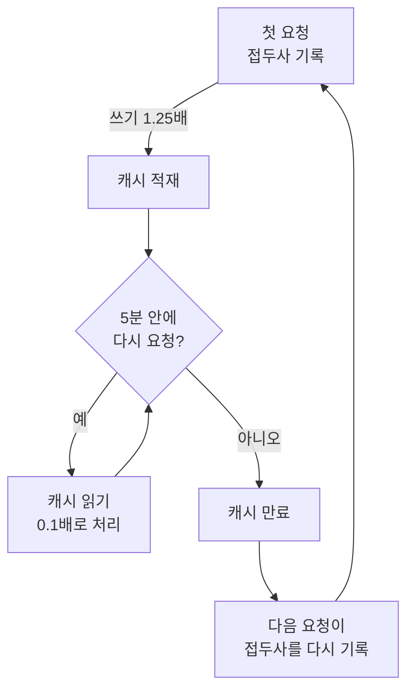

# 프롬프트 캐싱 — 비용 절감과 손익분기

**프롬프트 캐싱** (prompt caching)은 직전에 이미 처리한 요청의 앞부분을 다시
계산하지 않고 재사용합니다. 모델은 턴마다 대화 전체를 처음부터 다시 보내는데,
앞부분이 직전과 같으면 그 부분을 캐시에서 가져다 써서 정가의 약 10%로 처리합니다.
그래서 대화가 길어질수록, 되풀이되는 컨텍스트가 클수록 절감 폭이 커집니다.


이 문서는 **비용** 관점에서 프롬프트 캐싱을 다룹니다 — 절감 원리, 손익분기,
캐시가 식을 때 돈이 새어 나가는 지점, 그리고 자율성 티어와 비용의 관계. 동작
원리와 컨텍스트 관리의 자세한 설명은 [프롬프트 캐싱](/ko/claude-code/context-memory/prompt-caching)을
보세요. 두 문서는 같은 기능을 다른 각도에서 비춥니다 — 저기는 컨텍스트 관리,
여기는 비용 최적화입니다.


## 왜 비용이 줄어드는가

모델은 요청과 요청 사이에 아무것도 기억하지 못합니다. 그래서 Claude Code는 매
턴마다 새 API 요청을 만들어 **전체 컨텍스트** — 시스템 프롬프트, 프로젝트 지침,
도구 정의, 지금까지의 대화와 도구 결과, 그리고 새 메시지 — 를 처음부터 다시
담아 보냅니다.

핵심은 새 내용이 늘 **맨 끝에 덧붙는다**는 점입니다. 각 요청의 대부분은 직전
요청과 똑같고, 진짜 새로운 것은 마지막 한 번의 교환뿐입니다. 프롬프트 캐싱은
바로 이 "변하지 않은 앞부분"을 매번 다시 계산하지 않게 해 줍니다. MoAI-ADK
**토크노믹스** (tokenomics)가 항상 로드되는 컨텍스트 자체를 덜어 내는 쪽이라면,
프롬프트 캐싱은 남은 컨텍스트를 싼값에 다시 쓰는 쪽입니다.

## 접두사와 세 계층

캐시가 적중하려면 요청의 시작 부분 — **접두사** (prefix) — 가 직전과 100% 같아야
합니다. 이 접두사는 정해진 순서로 조립됩니다.

| 순서 | 계층 | 무엇이 들어가나 | 언제 바뀌나 |
|------|------|-----------------|-------------|
| 1 | 도구 정의 (tools) | 내장 도구 + MCP 도구 스키마 | MCP 서버 연결·해제, 업그레이드 |
| 2 | 시스템 프롬프트 (system) | 핵심 지침, 권한 규칙, `CLAUDE.md`, 자동 메모리 | 권한 규칙 변경, 세션 시작 파일 편집, `/clear` |
| 3 | 메시지 (messages) | 사용자 입력 + 응답 + 도구 결과 | 매 턴 (맨 끝에 덧붙음) |

거의 안 바뀌는 내용이 앞에 옵니다. 메시지 계층만 바뀌면 도구 정의와 시스템
프롬프트는 캐시된 채로 남습니다. 반대로 시스템 프롬프트나 도구 정의가 바뀌면
뒤의 모든 내용이 다른 접두사 뒤에 놓이므로 **전체가 무효화**됩니다 — 한 턴이
느려지고 비싸집니다.

여기서 한 가지만 기억하면 됩니다 — **앞부분이 안정적일수록 캐시가 오래 살고
절감이 커진다.** 정확히 일치해야 적중한다는 점, 모델·노력 수준마다 캐시가 따로
쌓인다는 점까지 포함한 깊은 설명은 [컨텍스트 관리 문서](/ko/claude-code/context-memory/prompt-caching)에
있습니다.

## 비용 구조와 손익분기

캐시가 잘 돌고 있는지는 API가 매 응답에 보고하는 두 토큰 수치로 알 수 있습니다.

| 필드 | 의미 | 비용 (기본 입력 단가 대비) |
|------|------|----------------------------|
| `cache_read_input_tokens` | 캐시에서 **읽어온** 토큰 | **0.1배** (≈10%) |
| `cache_creation_input_tokens` | 캐시에 **새로 기록한** 토큰 | **1.25배** (5분 TTL) · **2배** (1시간 TTL) |

읽기가 일반 입력의 10%이므로, 캐시에서 읽어오는 비율이 높을수록 같은 작업을
훨씬 싸게 처리합니다. 쓰기는 일반 입력보다 25% 비싸지만, 이는 "한 번 더 내고
뒤에서 아낀다"는 투자입니다.

### 손익분기: 요청 2개

캐싱이 비용 이득이 되는 시점은 명확합니다 — **요청 2개**입니다.

첫 요청은 접두사를 캐시에 기록하느라 1.25배(5분 TTL)를 냅니다. TTL 안에 들어온
두 번째 요청은 그 접두사를 0.1배로 읽어옵니다. 두 요청을 합치면 이미 첫 기록의
프리미엄을 상쇄하고 남습니다. 같은 접두사로 요청이 셋, 넷 이어질수록 절감은
누적됩니다.


**실용 규칙**: 같은 접두사로 요청이 2개 이상 이어질 때 캐싱은 무조건 이득입니다.
한 번으로 끝날 작업이라면 캐싱 여부가 비용에 큰 영향을 주지 않습니다.


### 캐시 비용의 흐름



### API를 직접 호출하는 경우

아래는 **Anthropic API를 직접 호출하는 개발자**에게만 해당합니다. Claude Code
사용자에게는 해당하지 않습니다 — 런타임이 알아서 관리합니다.

원칙은 하나입니다 — **중단점은 매 요청 바뀌는 데이터(질문, 타임스탬프) 앞의
마지막 안정 블록에** 둡니다.

```python
# 안정적인 시스템 프롬프트에 캐시 중단점 배치
response = client.messages.create(
    model="claude-opus-4-8",
    max_tokens=1024,
    system=[{
        "type": "text",
        "text": "안정적인 시스템 프롬프트...",
        "cache_control": {"type": "ephemeral", "ttl": "1h"}
    }],
    messages=[{"role": "user", "content": user_query}]
)
```

## 5분 수명: 돈이 새는 지점

캐시에 적중하는 요청이 계속 들어오는 동안에는 따뜻하게 유지되지만, **5분
동안 한 번도 요청이 없으면** 만료됩니다. 이 수명은 **유휴 기반** (idle-based)입니다
— 마지막 요청으로부터 5분이 흐르면 캐시가 사라지고, 다음 요청은 접두사를
처음부터 다시 써야 합니다.

사람이 개입해야 하는 긴 대기가 이 5분을 넘기면 캐시가 식습니다. 질문에 답하는
시간, 리뷰를 기다리는 시간이 여기에 해당합니다. 컨텍스트가 클수록 이 만료
비용도 큽니다 — 다시 채워야 할 접두사가 크기 때문입니다. 그래서 정말 필요한
게이트가 아니면 맥락이 큰 상태에서 오래 멈추지 않는 것이 좋습니다.

| 인증 방식 | 기본 TTL | 비고 |
|-----------|----------|------|
| Claude 구독 (Pro/Max/Team/Enterprise) | 1시간 (자동, 추가 비용 없음) | 한도 초과 시 5분으로 자동 전환 |
| API 키·서드파티 | 5분 | `ENABLE_PROMPT_CACHING_1H=1`로 1시간 전환 가능 |

## 캐시를 깨뜨리는 것 (비용 관점)

아래 행동을 하면 그다음 요청이 캐시를 놓쳐 한 턴이 느려지고 비싸집니다. 느리고
비싼 턴을 한 번 치르고 나면 새 접두사가 다시 캐시됩니다.

| 행동 | 영향 |
|------|------|
| 모델 전환 (`/model`) | 전체 재계산 (모델마다 캐시 분리) |
| 노력 수준 변경 (`/effort`) | 전체 재계산 |
| MCP 서버 연결·해제 | 도구 정의 계층 무효화 → 전체 |
| 전체 도구 거부 (`Bash`, `WebFetch` 같은 맨 이름 deny 규칙) | 도구 정의 계층 무효화 → 전체 |
| 대화 압축 (`/compact`, 자동 압축) | 메시지 계층 재작성 |
| Claude Code 업그레이드 | 시스템 프롬프트·도구 정의 변경 → 전체 재구축 |

> `Bash(rm *)` 같은 **범위 지정** deny 규칙과 모든 allow·ask 규칙은 도구 집합을
> 바꾸지 않으므로 접두사가 그대로 유지됩니다.


**세션 시작 파일은 특히 비싸다** — `CLAUDE.md`, `.claude/rules/` 아래 규칙, 출력
스타일, 항시 로드되는 스킬은 세션이 시작될 때 시스템 프롬프트 계층에 들어갑니다.
세션 도중에 이 파일을 고치면 시스템 프롬프트 계층이 바뀌어 전체가 무효화되고,
컨텍스트가 이미 커진 상태라면 접두사 전체를 다시 써야 합니다. 이런 수정은
**작업이 끝날 때나 `/clear` 직전에 몰아서** 하세요.


무효화의 전체 목록과 "캐시를 살려 두는 것"은 [컨텍스트 관리 문서](/ko/claude-code/context-memory/prompt-caching)에
있습니다.

## 자율성 티어(MOAI_AUTONOMY_TIER)와 비용·속도

MoAI-ADK의 자율성 티어는 어디까지나 "사람이 얼마나 자주 개입하는가"를 정하지,
캐시 동작을 직접 바꾸지는 않습니다. 하지만 **사람 개입이 잦을수록 캐시가 식을
틈이 많아져** 비용에 영향을 줍니다.

`MOAI_AUTONOMY_TIER` 환경변수의 값은 세 가지입니다.

| 티어 | 사람 개입 | 캐시에 미치는 영향 |
|------|-----------|-------------------|
| `semi-auto` (기본) | 매 단계마다 확인 · 승인 게이트 | 긴 대기가 5분 수명을 자주 넘김 → 캐시 재기록 잦음 |
| `automatic` | 실행은 자율, 핵심 결정만 확인 | 차단 대기가 줄어 캐시가 더 오래 따뜻 |
| `fully-autonomous` | 사람 개입 최소 (샌드박스 필요) | 대기가 가장 적어 캐시 온기 유지에 유리 |

semi-auto에서는 작업 시작 승인이나 질문에 답하는 동안 5분 이상 멈추기 쉽고,
그 사이 캐시가 식습니다. 사람이 돌아오면 커진 접두사를 다시 기록(1.25배)해야
합니다. 높은 티어로 갈수록 이런 차단 대기가 줄어들어 **같은 작업을 더 싸고
빠르게** 처리할 수 있습니다.


비용·속도 이득은 검토 게이트를 덜 거치는 데서 옵니다. `automatic`과
`fully-autonomous`에서는 커밋 직전의 동기 검증(vet·lint·test) 게이트가
꺼지고, `fully-autonomous`에서는 수명 주기 훅까지 관찰 전용으로 줄어듭니다.
비용을 아끼는 만큼 사람이 직접 확인하는 지점도 줄어드니, 티어 선택은 비용만의
문제가 아니라 **검토 책임**의 문제입니다.


## 모델 선택이 캐시 비용에 미치는 영향

모델은 캐시 키의 일부입니다. 같은 내용이라도 모델을 바꾸면 전체를 다시
계산합니다. 그래서 모델을 일관되게 유지하는 것 자체가 캐시 비용을 아끼는 일입니다.
MoAI-ADK는 두 가지 장치로 이 일관성을 지킵니다.

- **프로파일 매트릭스** (profile matrix): max·medium·low 3-티어 프로필이 각
  에이전트마다 `{모델, 노력 수준}` 셀을 정해 둡니다. `moai model profile --json`으로
  조회합니다. 에이전트마다 모델이 고정되어 있으면 여러 에이전트를 띄워도 캐시가
  흔들리지 않습니다.
- **에이전트별 모델 주입** (model-policy): `Agent()`를 띄울 때마다 모델을
  명시합니다. 에이전트 정의의 기본값이 `model: inherit`이라 모델을 빼면 부모
  세션의 모델로 조용히 빠지는데, 이것이 캐시를 흔드는 흔한 원인입니다. 선언한
  모델과 실제로 풀린 모델이 다르면 드리프트로 잡아냅니다.

모델마다 캐시에 올라가는 **최소 토큰 수**도 다릅니다. 이보다 짧은 접두사는
캐시에 올라가지 않습니다(오류 없이 그냥 처리).

| 모델 | 컨텍스트 | 최소 캐시 토큰 |
|------|----------|----------------|
| Claude Fable 5 | 256K | 512 |
| Claude Opus 5 | 1M | 1,024 |
| Claude Sonnet 5 | 200K | 1,024 |
| Claude Opus 4.7 | 1M | 2,048 |
| Claude Haiku 4.5 | 200K | 4,096 |

> 2026년 라인업의 Opus 4.8(1M 컨텍스트)처럼 새 모델은 최소 캐시 토큰이 패밀리마다
> 다르게 정해지므로, 위 표에 없는 모델의 값은 [공식 프롬프트 캐싱 문서](https://platform.claude.com/docs/en/build-with-claude/prompt-caching)에서
> 확인하세요.

## 비용을 아끼는 습관

캐싱은 자동으로 켜지지만, 캐시를 의식하며 일하면 비용과 지연을 훨씬 더 아낄 수
있습니다. 핵심은 하나입니다 — 변하지 않는 앞부분이 오래 유지될수록 이득이
크니, 그 앞부분을 흔들리지 않게 지키는 것입니다.

1. **세션 시작에 확정하고, 도중에 바꾸지 않기**: 모델, 노력 수준, MCP 서버는
   세션을 시작할 때 정하고 작업이 끝날 때까지 그대로 둡니다. 이 셋은 전체
   재계산을 부르는 가장 흔한 원인입니다.
2. **항시 로드 파일은 작업 끝에 고치기**: `CLAUDE.md`, 규칙, 출력 스타일,
   항시 로드 스킬을 세션 도중에 고치면 전체가 무효화됩니다. 한 작업이 끝난 뒤나
   `/clear` 직전에 몰아서 하세요.
3. **큰 컨텍스트에서 오래 멈추지 않기**: 5분을 넘기는 대기는 캐시를 식힙니다.
   컨텍스트가 클수록 다시 채우는 비용도 큽니다.
4. **`/compact`는 자연스러운 길목에서**: 작업과 작업 사이의 의미 있는 경계에서
   실행합니다. 잘못된 길로 들어섰다면 전체를 다시 요약하는 `/compact`보다
   **캐시된 이전 턴까지 되감아 주는 `/rewind`**가 더 쌉니다.
5. **`/clear`는 진짜 필요할 때만**: `/clear`는 따뜻한 캐시를 통째로 버립니다.
   남은 뒷정리가 짧다면 캐시를 유지한 채 끝내는 것이, 묵은 맥락을 짊어지고 큰
   작업을 시작하는 것보다 쌉니다.

## CG 모드로 더 아끼기

캐싱이 "같은 내용을 싸게 다시 쓰는" 축이라면, **CG 모드** (CG Mode)는 "비싼
모델을 덜 쓰는" 축입니다. 리더는 Claude를, 구현 워커는 저렴한 GLM(z.ai 백엔드)을
쓰도록 tmux 세션을 갈라 놓아, 구현 중심 작업에서 **비용을 약 60-70% 줄입니다**.
두 축은 겹치지 않습니다 — CG 모드에서도 각 백엔드의 캐싱은 그 백엔드가 알아서
합니다(Claude는 프롬프트 캐싱, GLM은 콘텐츠 유사도 기반 암시적 캐싱).

자세한 구조와 전환 명령은 [CG 모드](/ko/multi-llm/cg-mode)를 보세요.

## 비용 모니터링

캐시가 잘 동작하는지 보려면 두 토큰 수치를 관찰합니다.

- **statusline**: 매 턴 실시간으로 캐시 적중(cache hit)을 보여주는 상태줄
  세그먼트를 쓸 수 있습니다.
- **API 응답**: `cache_read_input_tokens`(읽기)와 `cache_creation_input_tokens`(쓰기)
  비율이 핵심 신호입니다.

**읽기 대비 쓰기 비율**이 캐시 건강도의 핵심입니다. 읽기가 쓰기보다 압도적으로
많으면 캐싱이 잘 작동하고 있는 것입니다. 반대로 쓰기 토큰이 턴마다 계속 높다면,
접두사 어딘가가 매번 바뀌고 있다는 뜻입니다 — 위의 "캐시를 깨뜨리는 것" 표에서
원인을 찾아보세요.

지연 측면에서도 이득입니다. 변하지 않은 접두사를 다시 처리하지 않으므로 응답이
빨라집니다. 캐시가 무효화된 턴만 한 번 느려지고 비싸집니다.

## 요약

- **절감 원리**: 변하지 않은 앞부분을 0.1배로 재사용. 앞부분이 클수록, 안정적일수록
  절감이 큽니다.
- **손익분기**: 요청 2개. 첫 요청의 1.25배 쓰기 프리미엄은 TTL 안의 두 번째
  요청 0.1배 읽기로 회수됩니다.
- **5분 수명**: 긴 사람 대기가 캐시를 식힙니다. 큰 컨텍스트에서 특히 비쌉니다.
- **자율성 티어**: `MOAI_AUTONOMY_TIER`가 높을수록 차단 대기가 줄어 캐시 온기가
  유지되어 비용·속도에 유리하지만, 검토 게이트도 줄어듭니다.
- **모니터링**: statusline cache hit + 읽기/쓰기 토큰 비율.

## 관련 문서

- [프롬프트 캐싱](/ko/claude-code/context-memory/prompt-caching) — 동작 원리, 접두사 매칭, 컨텍스트 관리 (컨텍스트 관리 관점)
- [컨텍스트 윈도우](/ko/claude-code/context-memory/context-window) — 컨텍스트 윈도우 크기와 모델별 차이
- [CG 모드](/ko/multi-llm/cg-mode) — Claude + GLM 하이브리드로 비용 60-70% 절감
- [모델 정책](/ko/multi-llm/model-policy) — 에이전트별 모델 주입과 드리프트 방지

## 출처 (공식 문서)

- [How Claude Code uses prompt caching](https://code.claude.com/docs/en/prompt-caching) — 자동 관리, TTL 자동 선택, 무효화 요인
- [Prompt caching (API)](https://platform.claude.com/docs/en/build-with-claude/prompt-caching) — `cache_control`, 가격 배수, 모델별 최소 토큰
- [Manage costs effectively](https://code.claude.com/docs/en/costs) — Claude Code의 자동 비용 최적화
