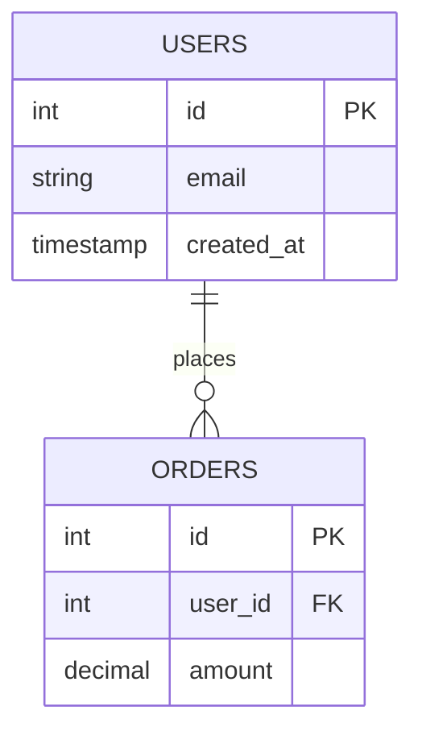

## 7개 파일 템플릿 세트

`/moai db init` 실행 시 `.moai/project/db/` 디렉토리에 다음 7개 파일이 자동으로 생성됩니다:

```
.moai/project/db/
├── README.md              (~ 50 줄) 기본 개요
├── schema.md              (자동 생성) 테이블 레지스트리
├── erd.mmd                (자동 생성) 엔티티 관계 다이어그램
├── migrations.md          (자동 생성) 마이그레이션 타임라인
├── rls-policies.md        (템플릿) Row-level security
├── queries.md             (템플릿) 공통 쿼리 라이브러리
└── seed-data.md           (템플릿) 시드 데이터 패턴
```

## 각 파일의 역할

### README.md

이 섹션의 개요 및 탐색 가이드입니다.

내용:
- DB 워크플로우 소개
- 포함된 7개 파일 설명
- 일반적인 작업 흐름 (마이그레이션 추가, 스키마 업데이트)

이 파일은 사용자 편집용이므로 자동 갱신 시 보호됩니다.

### schema.md

모든 테이블, 컬럼, 관계를 자동으로 문서화합니다.

구조:

```markdown
# 스키마

## 테이블 목록

| 테이블 | 컬럼 수 | 기본 키 | 마지막 마이그레이션 |
|--------|--------|--------|-----------------|
| users | 8 | id | 20240101_create_users.sql |
| orders | 12 | id | 20240115_add_orders.sql |

## users

| 컬럼 | 타입 | 제약조건 | 설명 |
|------|------|--------|------|
| id | bigint | PRIMARY KEY, NOT NULL | 사용자 고유 ID |
| email | varchar(255) | UNIQUE, NOT NULL | 이메일 주소 |
| created_at | timestamp | NOT NULL | 생성 시간 |
```

**[HARD] 자동 생성** — `/moai db refresh` 시 완전히 재생성됩니다.

### erd.mmd

Mermaid 문법으로 테이블 관계를 시각화합니다.

예제:



**[HARD] 자동 생성** — `/moai db refresh` 시 완전히 재생성됩니다.

### migrations.md

적용된 마이그레이션 파일의 타임라인입니다.

구조:

```markdown
# 마이그레이션 히스토리

## 2024년 1월

- `2024-01-01` — 001_create_users.sql — 사용자 테이블 생성
- `2024-01-01` — 002_create_orders.sql — 주문 테이블 생성
- `2024-01-15` — 003_add_email.sql — 이메일 필드 추가

## 2024년 2월

- `2024-02-01` — 004_add_status.sql — 상태 필드 추가
```

**[HARD] 자동 생성** — `/moai db refresh` 시 완전히 재생성됩니다.

### rls-policies.md

Supabase, PostgreSQL 등에서 Row-Level Security(RLS) 정책을 정의합니다.

이 파일은 템플릿이므로 사용자가 수동으로 작성합니다. 예제:

```markdown
# Row-Level Security 정책

## users 테이블

- **auth.uid()와 일치하는 행만 선택** — 자신의 프로필만 조회 가능
- **admin 역할만 모든 행 조회** — 관리자는 모든 사용자 조회

## orders 테이블

- **자신의 주문만 조회** — user_id = auth.uid()
- **관리자는 모든 주문 조회** — admin 역할 확인
```

이 파일은 사용자 편집용이므로 자동 갱신 시 보호됩니다.

### queries.md

AI 에이전트가 참고하는 일반적인 쿼리 패턴들입니다.

내용:

- 사용자 조회 및 인증
- 주문 집계 쿼리
- 보고서 생성 쿼리
- 데이터 마이그레이션 스크립트

예제:

```sql
-- 이메일로 사용자 조회
SELECT * FROM users WHERE email = $1;

-- 월별 매출 집계
SELECT DATE_TRUNC('month', created_at) as month, SUM(amount)
FROM orders
GROUP BY DATE_TRUNC('month', created_at)
ORDER BY month DESC;
```

이 파일은 사용자 편집용이므로 자동 갱신 시 보호됩니다.

### seed-data.md

프로젝트의 초기 데이터 또는 테스트 데이터 패턴입니다.

구조:

```markdown
# 시드 데이터

## 개발 환경

### 기본 사용자

```json
{
  "email": "admin@example.com",
  "role": "admin"
},
{
  "email": "user@example.com",
  "role": "user"
}
```

## 프로덕션

프로덕션 시드 데이터는 별도 저장소에 보관합니다.
```

이 파일은 사용자 편집용이므로 자동 갱신 시 보호됩니다.

## _TBD_ 마커를 통한 커스터마이징

초기 생성 시 템플릿 파일 (rls-policies.md, queries.md, seed-data.md)에는 `_TBD_` 마커가 포함됩니다:

```markdown
# Row-Level Security 정책

_TBD_: 프로젝트의 RLS 정책을 여기에 입력하세요.
```

`_TBD_` 마커를 찾아 다음을 수행합니다:

1. 마커 삭제
2. 실제 프로젝트 내용 작성
3. 저장

예를 들어:

```markdown
# Row-Level Security 정책

## users 테이블

- **인증된 사용자만 자신의 데이터 조회** — auth.uid() = id
- **admin 역할만 모든 행 조회** — role = 'admin'
```

## 사용자 편집 콘텐츠 보호

사용자가 수정한 섹션은 자동 동기화 중에도 보호됩니다.

메커니즘:

1. 각 파일의 사용자 편집 블록에 SHA-256 해시 추가
2. `/moai db refresh` 실행 시 해시 검증
3. 해시가 일치하면 그 부분은 건너뛰고 자동 생성 부분만 갱신

예:

```markdown
---
# 자동 생성 섹션
## 테이블 목록
[자동으로 갱신됨]

---
# 사용자 커스텀 섹션 (SHA-256: abc123...)
## 관계 설명

이 부분은 사용자가 직접 작성한 내용입니다.
자동 갱신 시에도 유지됩니다.
```

## 생성된 스키마.md의 예제

초기화 후 schema.md는 다음과 같은 형태입니다:

```markdown
# 스키마

## 테이블 인덱스

| 테이블명 | 컬럼 수 | 기본 키 | 마지막 마이그레이션 |
|---------|--------|--------|-----------------|
| users | 8 | id | 20240101_create_users.sql |

## users

생성: 20240101_create_users.sql

| 컬럼 | 타입 | NULL 허용 | 기본값 | 설명 |
|------|------|---------|--------|------|
| id | bigint | NO | auto_increment | 사용자 고유 ID |
| email | varchar(255) | NO | - | 이메일 주소 |
| password_hash | varchar(255) | NO | - | 해시된 비밀번호 |
| created_at | timestamp | NO | CURRENT_TIMESTAMP | 계정 생성 시간 |

### 외래 키

없음

### 인덱스

- PRIMARY KEY: id
- UNIQUE: email
```

## 관련 설정 파일

### db.yaml

`.moai/config/sections/db.yaml`에서 전역 설정:

```yaml
db:
  auto_sync: true                        # 자동 동기화 활성화
  debounce_window_seconds: 10            # 디바운스 윈도우
  approval_required: false               # 승인 필수 여부
  migration_patterns:                    # 커스텀 마이그레이션 경로
    - path: "db/migrations"
      language: "go"
```

## 워크플로우

### 일반적인 작업 흐름

1. 새 마이그레이션 파일 추가: `db/migrations/004_add_status.sql`
2. 자동 동기화 훅이 10초 후 트리거
3. `schema.md`, `erd.mmd`, `migrations.md` 자동 갱신
4. `rls-policies.md`, `queries.md`, `seed-data.md`는 그대로 유지
5. 사용자가 필요하면 수동으로 업데이트

### 전체 재구축

수동 재구축이 필요한 경우:

```bash
/moai db refresh
```

프롬프트:

```
스키마를 완전히 재구축하시겠습니까? (y/n)
```

"y"를 입력하면:
- 모든 마이그레이션 파일 다시 스캔
- schema.md 완전 재생성
- erd.mmd 완전 재생성
- migrations.md 완전 재생성
- 사용자 편집 부분은 보호됨
