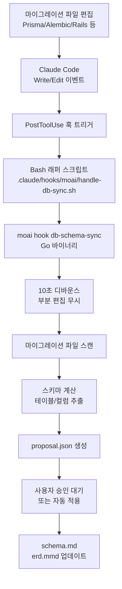

## 아키텍처 개요

MoAI의 데이터베이스 워크플로우는 마이그레이션 파일 변경을 자동으로 감지하고 스키마 문서를 동기화합니다. 이는 PostToolUse 훅을 통해 구현됩니다.

## 이벤트 플로우



## 자동 감지 메커니즘

### 지원하는 이벤트

마이그레이션 파일 변경 시 자동으로 감지됩니다:

| 언어 | 마이그레이션 경로 | 파일 패턴 |
|------|-----------------|---------|
| Go | `db/migrations/` | `*.sql` |
| Python | `alembic/versions/` | `*.py` |
| TypeScript | `prisma/migrations/` | `*.sql` |
| JavaScript | `migrations/` | `*.js` |
| Rust | `migrations/` | `*.sql` |
| Java | `src/main/resources/db/migration/` | `V*.sql` |
| Ruby | `db/migrate/` | `*.rb` |
| PHP | `database/migrations/` | `*.php` |

### 디바운스 윈도우

부분 편집으로 인한 오류를 방지하기 위해 **10초 디바운스 윈도우**가 설정됩니다:

- 마이그레이션 파일 변경 감지
- 10초 동안 대기
- 10초 이내 추가 변경이 없으면 스키마 스캔 실행
- 10초 이내 추가 변경이 있으면 타이머 리셋

## 설정 옵션

### 자동 동기화 활성화

`.moai/config/sections/db.yaml`에서 설정합니다:

```yaml
db:
  auto_sync: true              # 기본값: true
  debounce_window_seconds: 10  # 기본값: 10초
  approval_required: false     # 기본값: false (자동 적용)
```

### 자동 동기화 비활성화

특정 프로젝트에서 자동 동기화를 비활성화하려면:

```yaml
db:
  auto_sync: false
```

이 경우 수동으로 동기화해야 합니다:

```bash
/moai db refresh
```

## 수동 동기화 방식

`/moai db refresh` 명령어를 사용합니다:

```bash
/moai db refresh
```

이 명령어는:

1. 사용자 확인 대기 (REQ-024) — "스키마를 완전히 재구축하시겠습니까?"
2. 모든 마이그레이션 파일 전체 스캔
3. schema.md, erd.mmd, migrations.md 재생성
4. 결과 요약 출력

## /moai sync와의 관계

전체 문서 동기화 워크플로우 (`/moai sync`) 실행 시:

- Phase 0.08: DB 스키마 자동 리프레시 포함
- 자동 동기화 훅과는 독립적으로 작동
- 모든 문서를 통합 갱신

## 사용자 편집 콘텐츠 보호

자동 동기화 중에도 사용자가 수정한 섹션은 보호됩니다:

- SHA-256 해시로 변경 추적
- 사용자 편집 구간 자동 감지
- 자동 생성 콘텐츠만 갱신
- 사용자 편집 부분은 유지

예를 들어 `schema.md`에서:

```markdown
# 스키마 문서

## 자동 생성 섹션
[자동으로 갱신됨]

## 커스텀 주석 (사용자 편집)
[자동 갱신 시에도 유지됨]
```

## 훅 설정 확인

PostToolUse 훅이 올바르게 등록되었는지 확인합니다:

```bash
grep -A10 '"PostToolUse"' .claude/settings.json
```

예상 출력:

```json
"PostToolUse": [{
  "hooks": [{
    "command": "\"$CLAUDE_PROJECT_DIR/.claude/hooks/moai/handle-db-sync.sh\"",
    "timeout": 15
  }]
}]
```

## 문제 해결

### 훅이 동작하지 않음

1. 훅 스크립트 존재 확인:

```bash
ls -la .claude/hooks/moai/handle-db-sync.sh
```

2. 실행 권한 확인:

```bash
chmod +x .claude/hooks/moai/handle-db-sync.sh
```

3. `moai` 바이너리 경로 확인:

```bash
which moai
```

### 스키마 갱신이 잘못됨

자동 동기화를 비활성화하고 수동으로 검증합니다:

```yaml
db:
  auto_sync: false
```

그 후 수동으로 갱신하여 결과를 확인:

```bash
/moai db refresh
```
