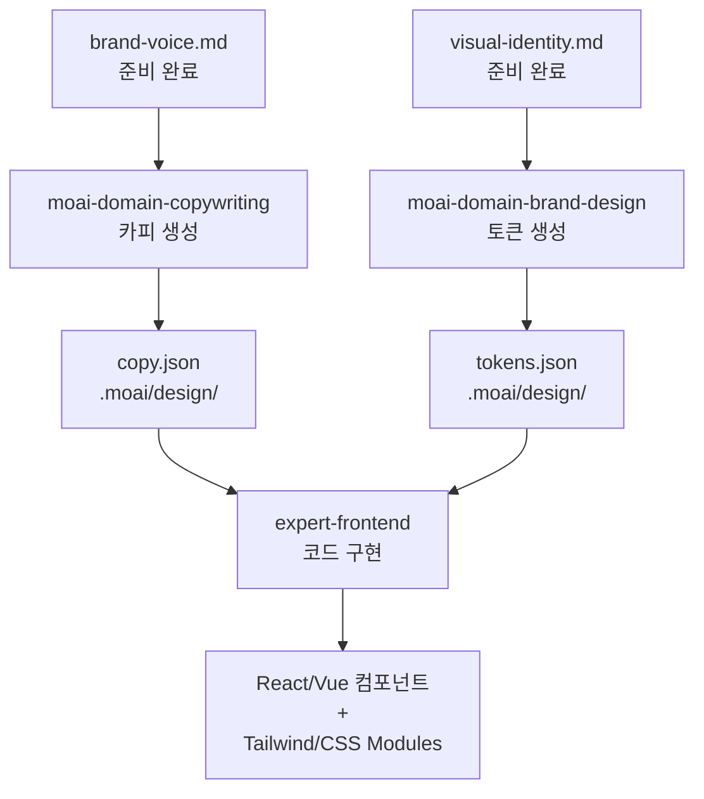

# 코드 기반 경로

경로 B는 **완료된 브랜드 컨텍스트** 를 바탕으로 설계 토큰과 컴포넌트 명세를 **자동으로 생성**합니다.

## 필수 파일

코드 기반 경로는 다음 3개 파일이 완료되어야 시작됩니다:

### 1. brand-voice.md

브랜드 톤, 용어, 메시지 가이드라인

```markdown
# 브랜드 톤

- **기본 톤:** 전문적이면서도 친근한
- **피해야 할 표현:** 과장, 기술 용어 남발
- **추천 표현:** "당신의 문제를 함께 해결합니다"

## 핵심 용어

- AI Agency → 디자인 자동화
- Workflow → 작업 흐름
```

**용도:** `moai-domain-copywriting` 스킬에서 hero, 기능, CTA 등 카피 생성

### 2. visual-identity.md

색상, 타이포그래피, 시각 언어

```markdown
# 색상 팔레트

## Primary Colors
- **Primary Blue:** #3B82F6 (RGB: 59, 130, 246)
- **Dark Blue:** #1E40AF (RGB: 30, 64, 175)

## Secondary Colors
- **Accent:** #8B5CF6 (보라색)
- **Success:** #10B981 (초록색)

# 타이포그래피

- **Heading:** Inter (700, 600, 500)
- **Body:** Inter (400, 500)
- **Line Height:** 1.5 (body), 1.2 (heading)
```

**용도:** `moai-domain-brand-design` 스킬에서 설계 토큰 생성

### 3. target-audience.md

타겟 고객 프로필 및 선호도

```markdown
# 타겟 고객

## 기본 정보
- **역할:** Product Manager, Designer, Engineer
- **회사 규모:** 초기 스타트업 ~ 중견기업 (5-100명)
- **기술 수준:** 중상

## 선호도
- 깔끔한 인터페이스 선호
- 빠른 학습 곡선 필요
- 모바일 우선 사고방식
```

**용도:** 카피와 설계의 모든 단계에서 독자 맞춤 가이드

## 스킬 구성

### moai-domain-copywriting

**목적:** 브랜드 voice를 따르는 마케팅 카피 생성

**입력:**
- `brand-voice.md` 컨텍스트
- 페이지 유형 (landing, about, services, pricing)
- 섹션별 요구사항

**출력:** 구조화된 JSON

```json
{
  "page_type": "landing",
  "sections": {
    "hero": {
      "primary": {
        "headline": "AI로 설계 시간을 90% 단축하세요",
        "subheadline": "복잡한 디자인도 자연어로 생성",
        "cta_primary": "무료로 시작"
      },
      "variant_a": {
        "headline": "설계 자동화의 새로운 기준",
        "subheadline": "프로토타입에서 배포까지, 모두 자동화"
      }
    },
    "features": [
      {
        "title": "자동 토큰 생성",
        "description": "색상, 타이포, 간격을 한 번에",
        "metric": "99% 정확도"
      }
    ]
  }
}
```

**Anti-AI-Slop 규칙:**
- 구체적인 수치 포함 ("90% 단축" O, "많이" X)
- 독자를 주체로 ("당신이 할 수 있다" O, "우리가 도울 수 있다" △)
- 능동태 선호
- 추상적 표현 제거

### moai-domain-brand-design

**목적:** 설계 토큰과 컴포넌트 명세 자동 생성

**입력:**
- `visual-identity.md` 색상, 타이포, 간격
- 페이지 구조 및 컴포넌트 요구사항

**출력:** 설계 토큰 JSON + 컴포넌트 명세

```json
{
  "tokens": {
    "colors": {
      "primary": "#3B82F6",
      "dark": "#1E40AF",
      "accent": "#8B5CF6"
    },
    "typography": {
      "heading": {
        "font": "Inter",
        "weight": 700,
        "lineHeight": 1.2
      },
      "body": {
        "font": "Inter",
        "weight": 400,
        "lineHeight": 1.5
      }
    },
    "spacing": {
      "xs": "4px",
      "sm": "8px",
      "md": "16px",
      "lg": "24px"
    }
  },
  "components": {
    "button": {
      "primary": {
        "bg": "$colors.primary",
        "text": "white",
        "padding": "$spacing.md $spacing.lg"
      }
    }
  }
}
```

**WCAG AA 준수:**
- 색상 대비율 4.5:1 이상 (텍스트)
- 3:1 이상 (그래픽 요소)
- 자동 검증

## 워크플로우



## 경로 B 실행

### 1단계: 브랜드 파일 확인

```bash
ls -la .moai/project/brand/
# brand-voice.md       ✓
# visual-identity.md   ✓
# target-audience.md   ✓
```

### 2단계: /moai design 실행

```
/moai design
```

### 3단계: 경로 B 선택

```
경로를 선택하세요:

1. (권장) Claude Design 활용...
2. 코드 기반 설계 (Copywriting + Design Tokens)
   → 추가 구독 불필요, 브랜드 파일 기반 자동 생성

선택: 2
```

### 4단계: 자동 생성

`moai-domain-copywriting` → `moai-domain-brand-design` 순서로 실행

**생성 파일:**
- `.moai/design/copy.json` — 페이지별 카피 (섹션별)
- `.moai/design/tokens.json` — 설계 토큰 (색상, 타이포, 간격)
- `.moai/design/components.json` — 컴포넌트 명세 (Button, Card, etc.)

### 5단계: GAN Loop 진입

`expert-frontend` 에이전트가:
1. 토큰과 카피를 받아
2. React/Vue 컴포넌트 + 스타일 코드 생성
3. `evaluator-active` 평가 (4차원 스코어링)
4. 불합격 시 수정 반복 (최대 5회)

## 브랜드 파일 수정하기

설계 중 브랜드 파일 조정 필요 시:

```bash
# 기존 파일 수정
vim .moai/project/brand/visual-identity.md

# 다시 실행 (기존 생성 파일 덮어쓰기)
/moai design
```

변경사항:
- `tokens.json` 재생성 (새 색상/타이포 반영)
- `copy.json` 유지 (수동 수정 시 보호됨)

## 다음 단계

- [GAN Loop](./gan-loop.md) — Builder-Evaluator 반복 프로세스
- [Sprint Contract 프로토콜](./gan-loop.md#sprint-contract-프로토콜) — 각 반복 주기의 수용 기준
- [4차원 스코어링](./gan-loop.md#4차원-스코어링) — 평가 기준 상세
