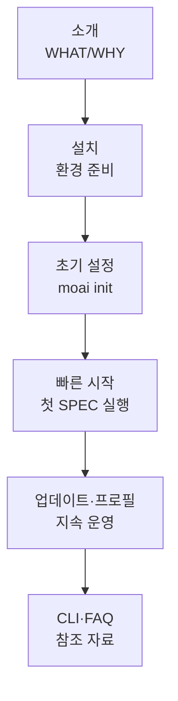

MoAI-ADK를 처음 만나는 분을 위한 온보딩 경로입니다. **소개 → 설치 → 빠른 시작** 순서로 읽으시면 30분 안에 첫 MoAI-ADK 프로젝트를 실행할 수 있습니다.


이미 설치를 마치셨다면 [빠른 시작](./quickstart)으로 바로 이동하세요. CLI 플래그가 궁금하면 [CLI 레퍼런스](./cli)를, 문제가 있다면 [자주 묻는 질문](./faq)을 확인하세요.


## 학습 흐름

## 권장 읽기 순서

| 순서 | 문서 | 핵심 내용 |
|------|------|----------|
| 1 | [소개](./introduction) | MoAI-ADK란 무엇이고 어떤 문제를 해결하는가 |
| 2 | [설치](./installation) | macOS/Linux에서의 설치 및 전제 조건 |
| 3 | [Windows 사용 가이드](./windows-guide) | Windows 환경의 특수 고려사항 |
| 4 | [초기 설정](./init-wizard) | `moai init` 인터랙티브 마법사로 프로젝트 구성 |
| 5 | [빠른 시작](./quickstart) | 첫 SPEC을 만들고 `/moai plan → run → sync` 실행 |
| 6 | [업데이트](./update) | 최신 버전으로 템플릿 유지 |
| 7 | [프로필 관리](./profile) | 사용자 프로필·환경 변수·설정 동기화 |
| 8 | [CLI 레퍼런스](./cli) | `moai` 바이너리 전체 서브커맨드 색인 |
| 9 | [자주 묻는 질문](./faq) | 설치·실행 시 만나는 흔한 이슈와 해결법 |


**다음 단계**: 설치를 마쳤다면 [핵심 개념](/ko/core-concepts/)에서 SPEC·DDD·TRUST 5 등 MoAI-ADK의 설계 철학을 학습할 수 있습니다.

