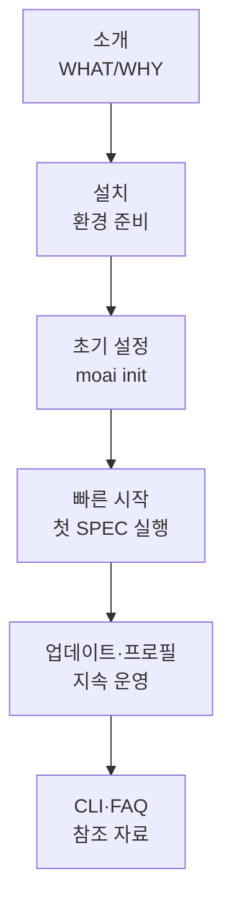

 <strong>소속 가치</strong>: 토크노믹스 · 에이전틱 루프 엔지니어링 · 에이전틱 하네스

<!-- @value: tokenomics, self-learning, agentic-harness -->

이 섹션은 MoAI-ADK 를 처음 만나는 분을 위한 온보딩 경로입니다. 단일 바이너리 하나로 시작해 첫 SPEC 을 끝까지 돌리는 데 필요한 모든 것을 한 흐름에 묶었습니다 — 설치, 초기 설정, 첫 프로젝트, 그리고 자주 쓰는 명령어와 질문까지. 세 가지 핵심(토크노믹스 · 에이전틱 루프 엔지니어링 · 에이전틱 하네스)이 코드와 문서에서 어떻게 구체적으로 작동하는지는 [핵심 개념](/ko/core-concepts/) 섹션에서 깊이 다룹니다.

**소개 → 설치 → 빠른 시작** 순서로 읽으면 30분 안에 첫 MoAI-ADK 프로젝트를 실행할 수 있습니다. 설치는 단일 바이너리 하나만 내려받으면 끝나고, 첫 SPEC을 실행할 때까지 별도 런타임이나 의존성은 필요 없습니다.


이미 설치를 마쳤다면 [빠른 시작](/ko/getting-started/quickstart)으로 바로 이동하세요. CLI 플래그가 궁금하면 [CLI 레퍼런스](/ko/cli-reference)를, 문제가 있다면 [자주 묻는 질문](/ko/getting-started/faq)을 확인하세요.


## 학습 흐름

```mermaid
flowchart TD
    A["소개<br>WHAT/WHY"] --> B["설치<br>환경 준비"]
    B --> C["초기 설정<br>moai init"]
    C --> D["빠른 시작<br>첫 SPEC 실행"]
    D --> E["업데이트·프로필<br>지속 운영"]
    E --> F["CLI·FAQ<br>참조 자료"]
```

## 권장 읽기 순서

| 순서 | 문서 | 핵심 내용 |
|------|------|----------|
| 1 | [소개](/ko/getting-started/introduction) | MoAI-ADK란 무엇이고 어떤 문제를 해결하는가 |
| 2 | [설치](/ko/getting-started/installation) | macOS·Linux 설치 방법과 전제 조건 |
| 3 | [Windows 사용 가이드](/ko/getting-started/windows-guide) | Windows에서 따로 챙겨야 할 점 |
| 4 | [초기 설정](/ko/getting-started/init-wizard) | `moai init` 인터랙티브 마법사로 프로젝트 구성 |
| 5 | [빠른 시작](/ko/getting-started/quickstart) | 첫 SPEC을 만들고 `/moai plan → run → sync` 실행 |
| 6 | [업데이트](/ko/cli-reference/update) | 템플릿을 최신 버전으로 유지하기 |
| 7 | [프로필 관리](/ko/cli-reference/profile) | 사용자 프로필·환경 변수·설정 동기화 |
| 8 | [CLI 레퍼런스](/ko/cli-reference) | `moai` 바이너리 전체 서브커맨드 색인 |
| 9 | [자주 묻는 질문](/ko/getting-started/faq) | 설치·실행 시 만나는 흔한 이슈와 해결법 |


**다음 단계**: 설치를 마쳤다면 [핵심 개념](/ko/core-concepts/)에서 v3.0의 세 가지 핵심(토크노믹스 · 에이전틱 루프 엔지니어링 · 에이전틱 하네스)과 SPEC·DDD·TRUST 5 등 MoAI-ADK의 설계 철학을 익힐 수 있습니다.

